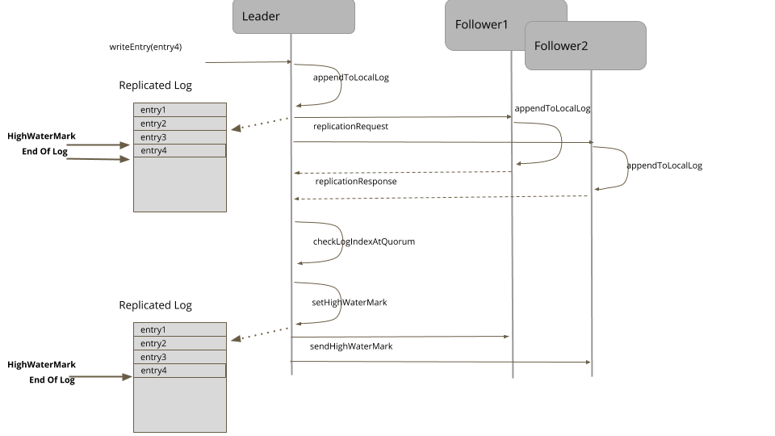

- Metadata
	-   OriginalAuthor : [Unmesh Joshi](https://twitter.com/unmeshjoshi)
	-   OriginalLink : [Patterns of Distributed Systems](https://martinfowler.com/articles/patterns-of-distributed-systems/#PuttingItAllTogether-PatternSequences)
	-   OriginalPublisher : [martinFowler平台](https://martinfowler.com/)
	- Date : 2022-03-25_星期五
	- Tag : #distributed-system 

### 原文
-   [Write-Ahead Log](https://martinfowler.com/articles/patterns-of-distributed-systems/wal.html)
-   [Lamport Clock](https://martinfowler.com/articles/patterns-of-distributed-systems/lamport-clock.html)
-   [High-Water Mark](https://martinfowler.com/articles/patterns-of-distributed-systems/high-watermark.html)
-   [Generation Clock](https://martinfowler.com/articles/patterns-of-distributed-systems/generation.html)
-   [Consistent Core](https://martinfowler.com/articles/patterns-of-distributed-systems/consistent-core.html)
-   [Follower Reads](https://martinfowler.com/articles/patterns-of-distributed-systems/follower-reads.html)
-   [Gossip Dissemination](https://martinfowler.com/articles/patterns-of-distributed-systems/gossip-dissemination.html)
-   [HeartBeat](https://martinfowler.com/articles/patterns-of-distributed-systems/heartbeat.html)
-   [Hybrid Clock](https://martinfowler.com/articles/patterns-of-distributed-systems/hybrid-clock.html)
-   [Idempotent Receiver](https://martinfowler.com/articles/patterns-of-distributed-systems/idempotent-receiver.html)
-   [Leader and Followers](https://martinfowler.com/articles/patterns-of-distributed-systems/leader-follower.html)
-   [Lease](https://martinfowler.com/articles/patterns-of-distributed-systems/time-bound-lease.html)
-   [Low-Water Mark](https://martinfowler.com/articles/patterns-of-distributed-systems/low-watermark.html)
-   [Paxos](https://martinfowler.com/articles/patterns-of-distributed-systems/paxos.html)
-   [Quorum](https://martinfowler.com/articles/patterns-of-distributed-systems/quorum.html)
-   [Replicated Log](https://martinfowler.com/articles/patterns-of-distributed-systems/replicated-log.html)
-   [Request Pipeline](https://martinfowler.com/articles/patterns-of-distributed-systems/request-pipeline.html)
-   [Segmented Log](https://martinfowler.com/articles/patterns-of-distributed-systems/log-segmentation.html)
-   [Single Socket Channel](https://martinfowler.com/articles/patterns-of-distributed-systems/single-socket-channel.html)
-   [Singular Update Queue](https://martinfowler.com/articles/patterns-of-distributed-systems/singular-update-queue.html)
-   [State Watch](https://martinfowler.com/articles/patterns-of-distributed-systems/state-watch.html)
-   [Two Phase Commit](https://martinfowler.com/articles/patterns-of-distributed-systems/two-phase-commit.html)
-   [Version Vector](https://martinfowler.com/articles/patterns-of-distributed-systems/version-vector.html)
-   [Versioned Value](https://martinfowler.com/articles/patterns-of-distributed-systems/versioned-value.html)

### 重点摘要

#### Write-Ahead Log

aka: Commit Log  
Provide durability guarantee without the storage data structures to be flushed to disk, by persisting every state change as a command to the append only log.

##### Problem
Strong durability guarantee is needed even in the case of the server machines storing data failing. Once a server agrees to perform an action, it should do so even if it fails and restarts losing all of its in-memory state.

疑惑: flush disk: batch也会有丢失风险?

##### Examples
-   The log implementation in all Consensus algorithms like [Zookeeper](https://github.com/apache/zookeeper/blob/master/zookeeper-server/src/main/java/org/apache/zookeeper/server/persistence/FileTxnLog.java) and [RAFT](https://github.com/etcd-io/etcd/blob/master/server/wal/wal.go) is similar to write ahead log
-   The storage implementation in [Kafka](https://github.com/axbaretto/kafka/blob/master/core/src/main/scala/kafka/log/Log.scala) follows similar structure as that of commit logs in databases
-   All the databases, including the nosql databases like Cassandra use [write ahead log technique](https://github.com/apache/cassandra/blob/trunk/src/java/org/apache/cassandra/db/commitlog/CommitLog.java) to guarantee durability

#### Lamport Clock
- Use logical timestamps as a version for a value to allow ordering of values across servers
- Problem : [wall clocks are not monotonic](https://martinfowler.com/articles/patterns-of-distributed-systems/time-bound-lease.html#wall-clock-not-monotonic)
- Solution
	- Causality, Time and Happens-Before
		- Causal relationship
		- Lamport Timestamp
	- Partial Order
		- The values stored by Lamport Clock are only [partially ordered](https://en.wikipedia.org/wiki/Partially_ordered_set).
		- If two clients store values in two separate servers, the timestamp values cannot be used to order the values across servers.
	- A single server/leader updating values 
		-  is enough to maintain causality.	
- Examples
 - Databases like [MongoDB](https://www.mongodb.com/) and [CockroachDB](https://www.cockroachlabs.com/docs/stable/) use variants of the Lamport Clock to implement [mvcc](https://en.wikipedia.org/wiki/Multiversion_concurrency_control) storage
- [Generation Clock](https://martinfowler.com/articles/patterns-of-distributed-systems/generation.html) is an example of a Lamport Clock

#### High-Water Mark
aka: CommitIndex  
==An index in the write ahead log showing the last successful replication.==

- Problem
	- To get a more available system, Using [Leader and Followers](https://martinfowler.com/articles/patterns-of-distributed-systems/leader-follower.html) the leader replicates all its log entries to a [Quorum](https://martinfowler.com/articles/patterns-of-distributed-systems/quorum.html) of followers.
	- **So it becomes important for each follower to know what part of the log is safe to be made available to the clients.**
		- But there are still a couple things that can go wrong:
			- The leader can fail before sending its log entries to any followers.
			- The leader can fail after sending log entries to some followers, but could not send it to the majority of followers.
		- In these error scenarios, some followers can be missing entries in their logs, and some followers can have more entries than others.

- Solution
	- The high-water mark is an index into the log file that records the last log entry that is known to have successfully replicated to a [Quorum](https://martinfowler.com/articles/patterns-of-distributed-systems/quorum.html) of followers.
		- The leader also passes on the high-water mark to its followers during its replication.
		- All servers in the cluster should only transmit data to clients that reflects updates that are below the high-water mark.
	-  ==There is a subtle issue in the case where the existing leader fails before propagating the high-water mark to all the followers.==
		- RAFT does this by appending a no-op entry to the leader's log after a successful leader election, and only serves clients once this is confirmed by its followers.
		-  In ZAB, the new leader explicitly tries to push all its entries to all the followers before starting to serve the clients.
	- ==Log Truncation==
		- Whenever a server joins the cluster, it checks with the leader of the cluster to know which entries in the log are potentially conflicting.
		- Any server which restarts or rejoins the cluster after a pause, finds the new leader. It then explicitly asks for the current high-water mark, truncates its log to high-water mark, and then gets all the entries beyond high-water mark from the leader.
		-  Replication algorithms like RAFT have ways to find out conflicting entries by checking log entries in its own log with the log entries in the request. The entries with the same log index, but at lower [Generation Clock](https://martinfowler.com/articles/patterns-of-distributed-systems/generation.html), are removed.

#### Generation Clock
==aka: Term, Epoch, and Generation==

==A monotonically increasing number indicating the generation of the server.==

##### Problem
- In [Leader and Followers](https://martinfowler.com/articles/patterns-of-distributed-systems/leader-follower.html) setup, there is a possibility of the leader being temporarily disconnected from the followers.
	-  It is important for the rest of the cluster to detect any requests from the old leader. 
	- The old leader itself should also be able to detect that it was temporarily disconnected from the cluster and take necessary corrective action to step down from leadership.

##### Solution
- Maintain a monotonically increasing number indicating the generation of the server. 
- With [Leader and Followers](https://martinfowler.com/articles/patterns-of-distributed-systems/leader-follower.html) servers increment the generation every time there's a new leader election.

##### Examples
- Raft
	- [Raft](https://raft.github.io/) uses the concept of a Term for marking the leader generation.
- Zab
	- In [Zookeeper](https://zookeeper.apache.org/doc/r3.4.13/zookeeperInternals.html#sc_atomicBroadcast), an epoch number is maintained as part of every transaction id. So every transaction persisted in Zookeeper has a generation marked by epoch.
- Cassandra
	- In [Cassandra](http://cassandra.apache.org/) each server stores a generation number which is incremented every time a server restarts. The generation information is persisted in the system keyspace and propagated as part of the gossip messages to other servers. The servers receiving the gossip message can then compare the generation value it knows about and the generation value in the gossip message. If the generation in the gossip message is higher, it knows that the server was restarted and then discards all the state it has maintained for that server and asks for the new state.
- Epoch's in Kafka
	- In [Kafka](https://kafka.apache.org/) an epoch number is created and stored in Zookeeper every time a new Controller is elected for a kafka cluster. The epoch is included in every request that is sent from controller to other servers in the cluster. Another epoch called [LeaderEpoch](https://cwiki.apache.org/confluence/display/KAFKA/KIP-101+-+Alter+Replication+Protocol+to+use+Leader+Epoch+rather+than+High+Watermark+for+Truncation) is maintained to know if the followers a partition are lagging behind in their [High-Water Mark](https://martinfowler.com/articles/patterns-of-distributed-systems/high-watermark.html).

### 原文摘要

#### Write-Ahead Log
aka: Commit Log
Provide durability guarantee without the storage data structures to be flushed to disk, by persisting every state change as a command to the append only log.

##### Problem
Strong durability guarantee is needed even in the case of the server machines storing data failing. Once a server agrees to perform an action, it should do so even if it fails and restarts losing all of its in-memory state.

疑惑: flush disk:  batch也会有丢失风险?

##### Examples
-   The log implementation in all Consensus algorithms like [Zookeeper](https://github.com/apache/zookeeper/blob/master/zookeeper-server/src/main/java/org/apache/zookeeper/server/persistence/FileTxnLog.java) and [RAFT](https://github.com/etcd-io/etcd/blob/master/server/wal/wal.go) is similar to write ahead log
-   The storage implementation in [Kafka](https://github.com/axbaretto/kafka/blob/master/core/src/main/scala/kafka/log/Log.scala) follows similar structure as that of commit logs in databases
-   All the databases, including the nosql databases like Cassandra use [write ahead log technique](https://github.com/apache/cassandra/blob/trunk/src/java/org/apache/cassandra/db/commitlog/CommitLog.java) to guarantee durability

#### Lamport Clock
[Lamport Clock](https://martinfowler.com/articles/patterns-of-distributed-systems/lamport-clock.html)
Use logical timestamps as a version for a value to allow ordering of values across servers
##### Problem
[wall clocks are not monotonic](https://martinfowler.com/articles/patterns-of-distributed-systems/time-bound-lease.html#wall-clock-not-monotonic)
- The system timestamp, which represents the time of the day, is measured by a clock machinery generally built with an crystal oscillator. The known problem with this mechanism is that it can drift away from the actual time of the day, based on how fast or slow the crystals oscillate.
-  To fix this, computers typically have a service like [NTP](https://en.wikipedia.org/wiki/Network_Time_Protocol) which synchronizes computer clocks with well known time sources on the internet. Because of this, two consecutive readings of the system time on a given server can have time going backwards.
- As there is no upper bound on clock drift across servers, it is impossible to compare timestamps on two different servers

##### Solution
- Causality, Time and Happens-Before
	- Causal relationship
		- When an event A in a system happens before another event B, it might have a causal relationship.
		- Causal relationship means that A might have some role in causing B.
		- This 'A happens before B' relationship is established by attaching a timestamp to each event.
		- If A happens before B, the timestamp attached to A will be lower than the timestamp attached to B.
	- Lamport Timestamp.
		-  [Leslie Lamport](https://en.wikipedia.org/wiki/Leslie_Lamport) suggested a solution to use logical timestamps to track happens-before relationships, in his seminal paper [Time, Clocks and Ordering Of Events](https://lamport.azurewebsites.net/pubs/time-clocks.pdf).
		-  this technique of using logical timestamps to track causality is named as the Lamport Timestamp.
- Partial Order
	- The values stored by Lamport Clock are only [partially ordered](https://en.wikipedia.org/wiki/Partially_ordered_set).
	- If two clients store values in two separate servers, the timestamp values cannot be used to order the values across servers.
- A single server/leader updating values
	- For a single leader-follower group of servers,
	- where a leader is always responsible for storing values,
	- the basic implementation discussed in [Versioned Value](https://martinfowler.com/articles/patterns-of-distributed-systems/versioned-value.html) is enough to maintain causality.

##### Examples
Databases like [MongoDB](https://www.mongodb.com/) and [CockroachDB](https://www.cockroachlabs.com/docs/stable/) use variants of the Lamport Clock to implement [mvcc](https://en.wikipedia.org/wiki/Multiversion_concurrency_control) storage

[Generation Clock](https://martinfowler.com/articles/patterns-of-distributed-systems/generation.html) is an example of a Lamport Clock

#### High-Water Mark
aka: CommitIndex
An index in the write ahead log showing the last successful replication.

##### Problem
- To get a more available system, Using [Leader and Followers](https://martinfowler.com/articles/patterns-of-distributed-systems/leader-follower.html) the leader replicates all its log entries to a [Quorum](https://martinfowler.com/articles/patterns-of-distributed-systems/quorum.html) of followers.
	- The [Write-Ahead Log](https://martinfowler.com/articles/patterns-of-distributed-systems/wal.html) pattern is used to recover state after the server crashes and restarts.
	- But a write-ahead log is not enough to provide availability in case of server failure.
	- To get a more available system, we can replicate the log on multiple servers.
- Now should the leader fail, a new leader can be elected, and clients can mostly continue to work with the cluster as before.
	- But there are still a couple things that can go wrong:
		- The leader can fail before sending its log entries to any followers.
		- The leader can fail after sending log entries to some followers, but could not send it to the majority of followers.
	- In these error scenarios, some followers can be missing entries in their logs, and some followers can have more entries than others.
- **So it becomes important for each follower to know what part of the log is safe to be made available to the clients.**

##### Solution
-  high-water mark 
	- The high-water mark is an index into the log file that records the last log entry that is known to have successfully replicated to a [Quorum](https://martinfowler.com/articles/patterns-of-distributed-systems/quorum.html) of followers.
	- The leader also passes on the high-water mark to its followers during its replication.
	- All servers in the cluster should only transmit data to clients that reflects updates that are below the high-water mark.
	- Here's the sequence of operations. Figure 1: High-Water Mark 
		- 

- A subtle problem 
	- A subtle problem can come up with leader election. We must ensure all the servers in the cluster have an up-to-date log before any server sends data to clients.
	- There is a subtle issue in the case where the existing leader fails before propagating the high-water mark to all the followers.
	- RAFT does this by appending a no-op entry to the leader's log after a successful leader election, and only serves clients once this is confirmed by its followers.
	- In ZAB, the new leader explicitly tries to push all its entries to all the followers before starting to serve the clients.

- Log Truncation
	- When a server joins the cluster after crash/restart, there is always a possibility of having some conflicting entries in its log.
	- So whenever a server joins the cluster, it checks with the leader of the cluster to know which entries in the log are potentially conflicting.
	- It then truncates the log to the point where entries match with the leader,and then updates the log with the subsequent entries to ensure its log matches the rest of the cluster.
	- Any server which restarts or rejoins the cluster after a pause, finds the new leader. It then explicitly asks for the current high-water mark, truncates its log to high-water mark, and then gets all the entries beyond high-water mark from the leader.
	- Replication algorithms like RAFT have ways to find out conflicting entries by checking log entries in its own log with the log entries in the request. The entries with the same log index, but at lower [Generation Clock](https://martinfowler.com/articles/patterns-of-distributed-systems/generation.html), are removed.
##### Examples
- All the consensus algorithms use the concept of high-water mark to know when to apply the proposed state mutations. e.g. In the [RAFT](https://raft.github.io/) consensus algorithm, high-water mark is called 'CommitIndex'.
-   In [Kafka replication protocol](https://www.confluent.io/blog/hands-free-kafka-replication-a-lesson-in-operational-simplicity/), there is a separate index maintained called 'high-water mark'. Consumers can see entries only until the high-water mark.
-   [Apache BookKeeper](https://bookkeeper.apache.org/) has a concept of '[last add confirmed](https://bookkeeper.apache.org/archives/docs/r4.4.0/bookkeeperProtocol.html)', which is the entry which is successfully replicated on quorum of bookies.

#### Generation Clock
aka: Term, Epoch, and Generation
A monotonically increasing number indicating the generation of the server.

##### Problem
- In [Leader and Followers](https://martinfowler.com/articles/patterns-of-distributed-systems/leader-follower.html) setup, there is a possibility of the leader being temporarily disconnected from the followers.
	- There might be a garbage collection pause in the leader process, or a temporary network disruption which disconnects the leader from the follower.
	- In this case the leader process is still running, and after the pause or the network disruption is over, it will try sending replication requests to the followers.
	- This is dangerous, as meanwhile the rest of the cluster might have selected a new leader and accepted requests from the client.
- So
	-  It is important for the rest of the cluster to detect any requests from the old leader. 
	- The old leader itself should also be able to detect that it was temporarily disconnected from the cluster and take necessary corrective action to step down from leadership.

##### Solution
- Maintain a monotonically increasing number indicating the generation of the server. 
	- Every time a new leader election happens, it should be marked by increasing the generation. 
	- The generation needs to be available beyond a server reboot, so it is stored with every entry in the [Write-Ahead Log](https://martinfowler.com/articles/patterns-of-distributed-systems/wal.html). As discussed in [High-Water Mark](https://martinfowler.com/articles/patterns-of-distributed-systems/high-watermark.html), followers use this information to find conflicting entries in their log.
- With [Leader and Followers](https://martinfowler.com/articles/patterns-of-distributed-systems/leader-follower.html) servers increment the generation every time there's a new leader election.
	- The servers send the generation to other servers as part of the vote requests. This way, after a successful leader election, all the servers have the same generation. Once the leader is elected, followers are told about the new generation
	- Leader persists the generation along with every entry in its [Write-Ahead Log](https://martinfowler.com/articles/patterns-of-distributed-systems/wal.html)
	- This way, it is also persisted in the follower log as part of the replication mechanism of [Leader and Followers](https://martinfowler.com/articles/patterns-of-distributed-systems/leader-follower.html)
	- Thereafter, the leader includes the generation in each request it sends to the followers. It includes it in every [HeartBeat](https://martinfowler.com/articles/patterns-of-distributed-systems/heartbeat.html) message as well as the replication requests sent to followers.
	- If a follower gets a message from a deposed leader, the follower can tell because its generation is too low. The follower then replies with a failure response.
	- When a leader gets such a failure response, it becomes a follower and expects communication from the new leader.

##### Examples
- Raft
	- [Raft](https://raft.github.io/) uses the concept of a Term for marking the leader generation.
- Zab
	- In [Zookeeper](https://zookeeper.apache.org/doc/r3.4.13/zookeeperInternals.html#sc_atomicBroadcast), an epoch number is maintained as part of every transaction id. So every transaction persisted in Zookeeper has a generation marked by epoch.
- Cassandra
	- In [Cassandra](http://cassandra.apache.org/) each server stores a generation number which is incremented every time a server restarts. The generation information is persisted in the system keyspace and propagated as part of the gossip messages to other servers. The servers receiving the gossip message can then compare the generation value it knows about and the generation value in the gossip message. If the generation in the gossip message is higher, it knows that the server was restarted and then discards all the state it has maintained for that server and asks for the new state.
- Epoch's in Kafka
	- In [Kafka](https://kafka.apache.org/) an epoch number is created and stored in Zookeeper every time a new Controller is elected for a kafka cluster. The epoch is included in every request that is sent from controller to other servers in the cluster. Another epoch called [LeaderEpoch](https://cwiki.apache.org/confluence/display/KAFKA/KIP-101+-+Alter+Replication+Protocol+to+use+Leader+Epoch+rather+than+High+Watermark+for+Truncation) is maintained to know if the followers a partition are lagging behind in their [High-Water Mark](https://martinfowler.com/articles/patterns-of-distributed-systems/high-watermark.html).
