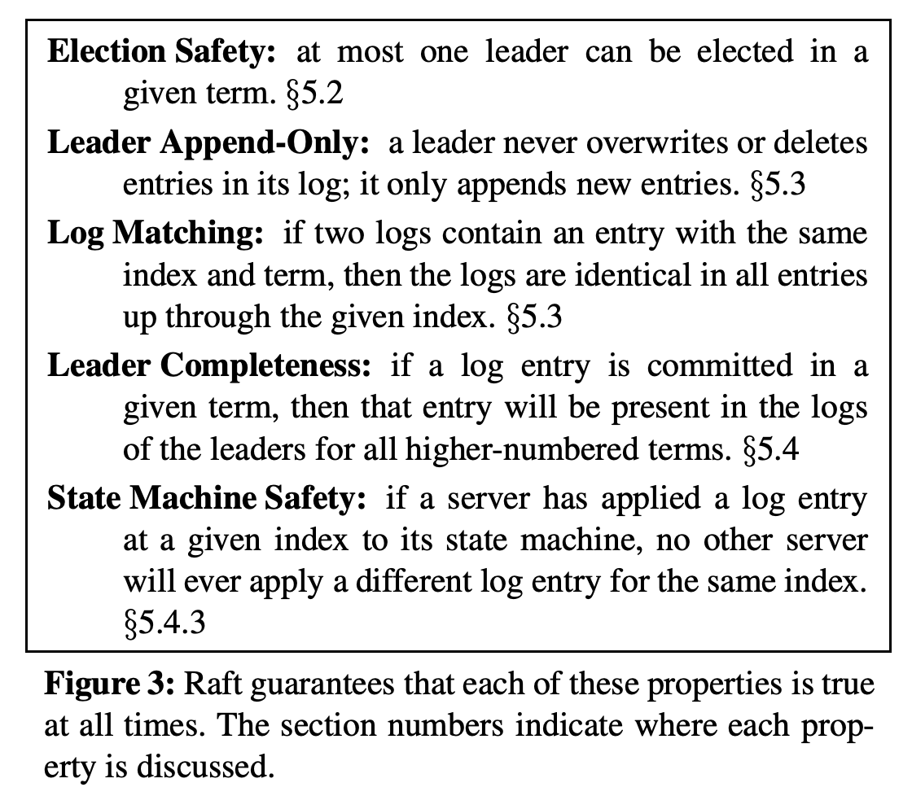
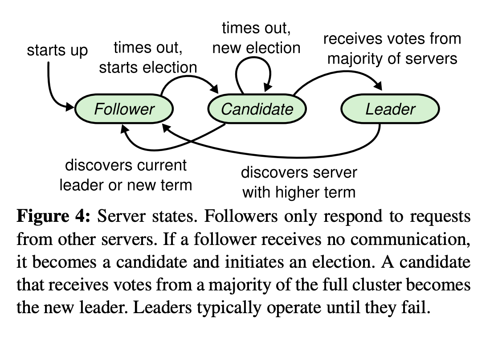
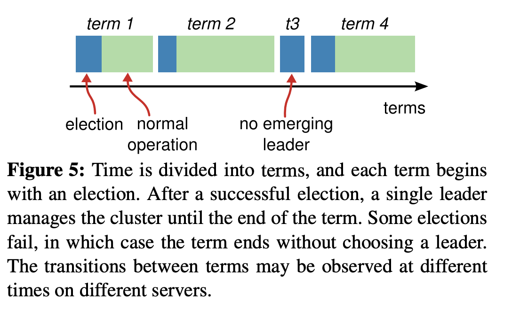
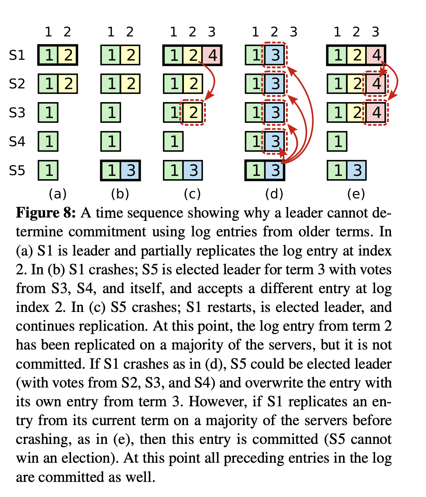

https://raft.github.io/

https://raft.github.io/raft.pdf

https://github.com/hashicorp/raft

kafka 2.7.1 raft

Raft 算法是现在分布式系统开发首选的共识算法
- 绝大多数选用 Paxos 算法的系统（比如 Cubby、Spanner）都是在 Raft 算法发布前开发的
- 而全新的系统大多选择了 Raft 算法（比如 Etcd、Consul、CockroachDB）
- 可以处理绝大部分场景的容错和一致性需求，比如分布式配置系统、分布式 NoSQL 存储等等，突破系统的单机限制
- 从本质上说，Raft 算法是通过一切以领导者为准的方式，实现一系列值的共识和各节点日志的一致
- 领导者选举、日志复制、成员变更

服务器节点状态
- Leader
- Follower
- Candidate

选举领导者的过程
- 节点间是如何通讯的呢？
	- 请求投票（RequestVote）RPC : 候选人在选举期间发起
	- 日志复制（AppendEntries）RPC : 由领导者发起 , 用来复制日志和提供心跳消息
- 什么是任期呢？
	- 节点维护的任期编号
	- 发送消息时使用的任期编号
	- 收到的消息里的任期编号
- 选举有哪些规则？
	- 日志完整性高的跟随者拒绝投票给日志完整性低的候选人
- 随机超时时间又是什么？
	- 处理选举无效的问题: 减少因选票瓜分导致选举失败的情况
	- 跟随者等待领导者心跳信息超时的时间间隔，是随机的；
	- 如果候选人在一个随机时间间隔内，没有赢得过半票数，那么选举无效了，然后候选人发起新一轮的选举，也就是说，等待选举超时的时间间隔，是随机的。

https://raft.github.io/raft.pdf

features
- Strong leader
- Leader election
- Membership changes

CORE: for Election restriction
Volatile state on all servers: 
- **commitIndex** : index of highest log entry known to be committed (initialized to 0, increases monotonically) 
- **lastApplied** : index of highest log entry applied to state machine (initialized to 0, increases monotonically)

Figure 3: Raft guarantees that each of these properties is true at all times.

Figure 4: Server states.

Raft uses `randomized election timeouts` to ensure that split votes are rare and that they are resolved quickly.

Ensure that each state machine executes exactly the same commands in the same order
- Election restriction
	- Raft uses the voting process to prevent a candidate from winning an election unless its log contains all committed entries.
- Present a proof sketch for the Leader Completeness Property and show how it leads to correct behavior of the replicated state machine.

To eliminate problems like the one in Figure 8, Raft never commits log entries from previous terms by counting replicas.

核心问题:  如何避免 c->d  vs c->e 

