# 动态追踪技术

## Overview

|Tool | Desc|
| ---  | ---|
| perf | The official Linux profiler. it is excellent for CPU profiling (sampling of stack traces) and PMC analysis, and can instrument other events, typically recording to an output file for post-processing |
| Ftrace  | The official Linux tracer, it is a multi-tool composed of different tracing utilities. It is suited for kernel code path analysis and resource-constrained systems, as it can be used without dependencies |
| BPF (BCC, bpftrace) | Extended BPF, it powers advanced tracing tools, the main ones being BCC and bpftrace. BCC provides powerful tools, and bpftrace provides a high-level language for custom one-liners and short programs |
| SystemTap | A high-level language and tracer with many tapsets (libraries) for tracing different targets. It has recently been developing a BPF backend, which I recommend (see the stapbpf(8) man page) |
| LTTng | A tracer optimized for black-box recording: optimally recording many events for later analysis |

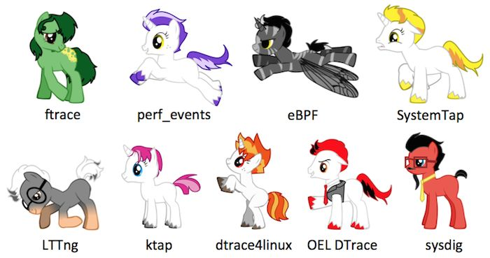

- 动态追踪技术
	- 如果有选择，可以先使用传统工具
	- [动态追踪技术漫谈](https://blog.openresty.com.cn/cn/dynamic-tracing/)
		- [dynamic-tracing-part(1~3)](https://blog.openresty.com/en/dynamic-tracing-part-1/)
		- [Linux Extended BPF (eBPF) Tracing Tools](https://www.brendangregg.com/ebpf.html)
		- [lisa14_slides_gregg.pdf](https://www.usenix.org/sites/default/files/conference/protected-files/lisa14_slides_gregg.pdf)
		- [Linux Online Source](https://elixir.bootlin.com/linux/v3.10.108/source)

## SystemTap

- 动态追踪技术
	- SystemTap
		- SystemTap: 动态追踪框架
			- [SystemTap Beginners Guide](https://sourceware.org/systemtap/SystemTap_Beginners_Guide/index.html)
			- [SystemTap Tutorial](https://sourceware.org/systemtap/tutorial/)
			- [SystemTap Examples](https://sourceware.org/systemtap/examples/index.html)
			- [SystemTap Tapset Reference Manual](https://sourceware.org/systemtap/tapsets/)
			- [SystemTap Language Reference](https://sourceware.org/systemtap/langref/)
			- [readhat systemtap_beginners_guide](https://access.redhat.com/documentation/en-us/red_hat_enterprise_linux/7/html-single/systemtap_beginners_guide/index)
			- [speed-up-systemtap](https://developers.redhat.com/blog/2019/04/03/speed-up-systemtap-script-monitoring-of-system-calls)
		- SystemTap Tools: 很多工具不在维护(有了新的选择:eBPF)
			- [SystemTap brendangregg oneliners](https://github.com/brendangregg/systemtap-lwtools/blob/master/oneliners.txt): SystemTap Lightweight Tools
			- [systemtap examples](https://sourceware.org/systemtap/examples/)
			- [openresty-systemtap-toolkit](https://github.com/openresty/openresty-systemtap-toolkit)
				- [README-CN](https://github.com/openresty/openresty-systemtap-toolkit/blob/master/README-CN.markdown)
			- [openresty stapxx](https://github.com/openresty/stapxx)
		- SystemTap Concepts
			- events
				- Whenever a specified event occurs, the Linux kernel runs the handler as if it were a quick subroutine, then resumes.
				- such as entering or exiting a function, 
				- a timer expiring, 
				- or the entire systemtap session starting or stopping
			- handlers
				- A handler is a series of script language statements that specify the work to be done whenever the event occurs. 
				- This work normally includes extracting data from the event context, storing them into internal variables, or printing results.
			- how to work
				- Systemtap works by translating the script to C, running the system C compiler to create a kernel module from that. 
				- When the module is loaded, it activates all the probed events by hooking into the kernel. 
				- Then, as events occur on any processor, the compiled handlers run. 
				- Eventually, the session stops, the hooks are disconnected, and the module removed. 
				- This entire process is driven from a single command-line program: `stap`.

## eBPF

- 动态追踪技术
	- eBPF: Dynamically program the kernel for efficient networking, observability, tracing, and security
		- [eBPF](https://ebpf.io/): 需要较高内核版本的支持 
			- [what-is-ebpf](https://ebpf.io/what-is-ebpf/)
			- [eBPF get started](https://ebpf.io/get-started/)
			- [eBPF applications](https://ebpf.io/applications/)
			- [eBPF Summit 2022](https://ebpf.io/summit-2022.html)
				- [eBPF Summit 2021](https://ebpf.io/summit-2021.html)
				- [eBPF Summit 2020](https://ebpf.io/summit-2020.html)
		- [Linux Extended BPF (eBPF) Tracing Tools](https://www.brendangregg.com/ebpf.html)
			- [iovisor/bcc](https://github.com/iovisor/bcc)
				- [IO Visor Project](https://github.com/iovisor)
			- [iovisor/bpfstrace](https://github.com/iovisor/bpftrace)
				- [bpfstrace](https://bpftrace.org/)
			- [BPF Performance Tools (book)](https://www.brendangregg.com/bpf-performance-tools-book.html)
				- [Official repository for the BPF Performance Tools book](https://github.com/brendangregg/bpf-perf-tools-book)
		- [cloud native eBPF day](https://events.linuxfoundation.org/cloud-native-ebpf-day-europe/)
		- [Linux Kernel bpf](https://www.kernel.org/doc/html/latest/bpf/index.html)
			- [bpf](https://www.kernel.org/doc/Documentation/networking/filter.txt)
			- [bpf syscall](https://elixir.bootlin.com/linux/v5.4/source/kernel/bpf/syscall.c#L2837)
		- eBPF Libraries
			- [libbpfgo](https://github.com/aquasecurity/libbpfgo) : eBPF library for Go. Powered by libbpf.
				- [tracee](https://github.com/aquasecurity/tracee) : Linux Runtime Security and Forensics using eBPF
			- [libbpf](https://github.com/libbpf/libbpf) : Automated upstream mirror for libbpf stand-alone build.
				- [libbpf repositories](https://github.com/libbpf)
		- Examples
			- [lizrice/ebpf-beginners](https://github.com/lizrice/ebpf-beginners) : The beginner's guide to eBPF
			- [lizrice/libbpfgo-beginners](https://github.com/lizrice/libbpfgo-beginners) : Basic eBPF examples in Golang using libbpfgo
			- [lizrice/lb-from-scratch](https://github.com/lizrice/lb-from-scratch) : A very basic eBPF Load Balancer in a few lines of C

## perf
- 动态追踪技术
	- perf
		- [brendangregg perf tools](https://github.com/brendangregg/perf-tools)
		- [brendangregg perf Examples](https://www.brendangregg.com/perf.html)

## 案例

- 动态追踪技术
	- 动态追踪的案例
		- [openresty](https://github.com/openresty/)
			- [agentzh weibo](https://www.weibo.com/agentzh)
			- [openresty xray](https://openresty.com.cn/cn/xray/)
			- [openresty products](https://openresty.com.cn/cn/products/)
			- [ngx-slowest-pcre-regexes](https://blog.openresty.com/en/ngx-slowest-pcre-regexes/)
			- [ngx-cpu-hottest-reqs](https://blog.openresty.com/en/ngx-cpu-hottest-reqs/)
				- [how-the-tools-are-implemented](https://blog.openresty.com/en/ngx-cpu-hottest-reqs/#how-the-tools-are-implemented)
				- [weibo ngx-cpu-hottest-reqs](https://weibo.com/1834459124/LCwFhAoTU#comment)
			- [OpenResty XRay案例: 定位线上事故](https://mp.weixin.qq.com/s/YWucrzAH5LnVYLel4zpUOw)
		- [deepflowio/deepflow](https://github.com/deepflowio/deepflow) : Application Observability using eBPF
			- [deepflowio/deepflow README-CN](https://github.com/deepflowio/deepflow/blob/main/README-CN.md)
			- [使用 eBPF 零代码修改绘制全景应用拓扑](https://mp.weixin.qq.com/s/7Dmr7liclUuh2JNI7CpmvQ)
			- [使用 eBPF 零代码修改绘制全景应用拓扑: pdf](http://yunshan-guangzhou.oss-cn-beijing.aliyuncs.com/yunshan-ticket/pdf/1a1847b242ae7c16d53f0af31d9c6aa4_20230509140119.pdf)
		- [用 perf 和 SystemTap 跟踪 MongoDB 访问超时](https://zhuanlan.zhihu.com/p/22572231)
		- jvm-profiling
			- [jvm-profiling-tools/async-profiler](https://github.com/jvm-profiling-tools/async-profiler)
				- [async-profiler](https://mp.weixin.qq.com/s/do0aCTvY7Agu5nVaQtwClg)
			- [jvm-profiling-tools/perf-map-agent](https://github.com/jvm-profiling-tools/perf-map-agent)
		

# Tools

|Package|Provides|
|---|---|
|procps|ps(1), vmstat(8), uptime(1), top(1)|
|util-linux|dmesg(1), lsblk(1), lscpu(1)|
|sysstat|iostat(1), mpstat(1), pidstat(1), sar(1)|
|iproute2|ip(8), ss(8), nstat(8), tc(8)|
|numactl|numastat(8)|
|linux-tools-common linux-tools-$(uname -r)|perf(1), turbostat(8)|
|[bcc-tools (aka bpfcc-tools)](https://github.com/iovisor/bcc)|opensnoop(8), execsnoop(8), runqlat(8), runqlen(8), softirqs(8), hardirqs(8), ext4slower(8), ext4dist(8), biotop(8), biosnoop(8), biolatency(8), tcptop(8), tcplife(8), trace(8), argdist(8), funccount(8), stackcount(8), profile(8), and many more|
|[bpftrace](https://github.com/brendangregg/bpf-perf-tools-book)|bpftrace, basic versions of opensnoop(8),execsnoop(8), runqlat(8), runqlen(8), biosnoop(8), biolatency(8), and more|
|[perf-tools-unstable](https://github.com/brendangregg/perf-tools)|Ftrace versions of opensnoop(8), execsnoop(8),iolatency(8), iosnoop(8), bitesize(8), funccount(8), kprobe(8)|
|trace-cmd|trace-cmd(1)|
|nicstat|nicstat(1)|
|ethtool|ethtool(8)|
|tiptop|tiptop(1)|
|msr-tools|rdmsr(8), wrmsr(8)|
|[msr-cloud-tools](https://github.com/brendangregg/msr-cloud-tools)|showboost(8), cpuhot(8), cputemp(8)|
|[pmc-cloud-tools](https://github.com/brendangregg/pmc-cloud-tools)|pmcarch(8), cpucache(8), icache(8), tlbstat(8), resstalls(8)|

## Dynamic Tracing Tools

[Linux tracing tools](https://www.brendangregg.com/linuxperf.html) use the events interfaces (tracepoints, kprobes, uprobes, USDT) for advanced performance analysis.

|Type  | Linux Observability Sources|
| ---  | ---|
| Per-process counters  | /proc |
| System-wide counters  | /proc, /sys  |
| Device configuration and counters  | /sys |
| Cgroup statistics  | /sys/fs/cgroup |
| Per-process tracing  | ptrace |
| Hardware counters (PMCs)  | perf_event |
| Network statistics  | netlink |
| Network packet capture  | libpcap |
| Per-thread latency metrics  | Delay accounting |
| System-wide tracing |  Function profiling (Ftrace), tracepoints, software events,kprobes, uprobes, perf_event|

- trace-soruces
	- 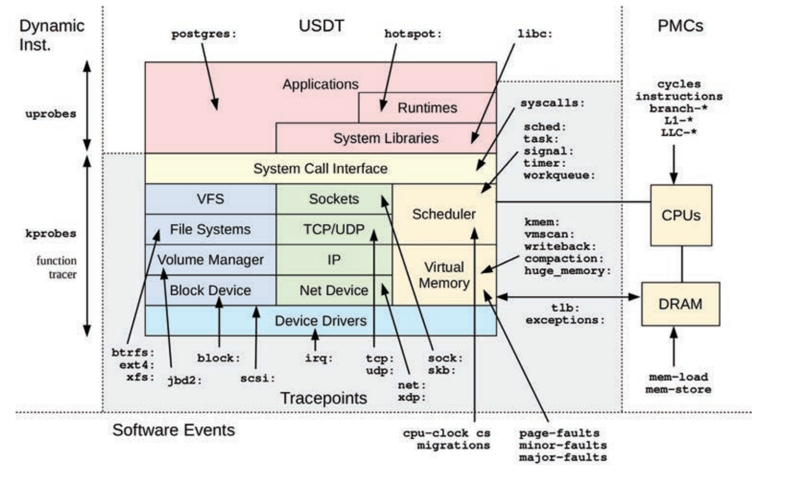
- [perf tools](https://github.com/brendangregg/perf-tools)
	- 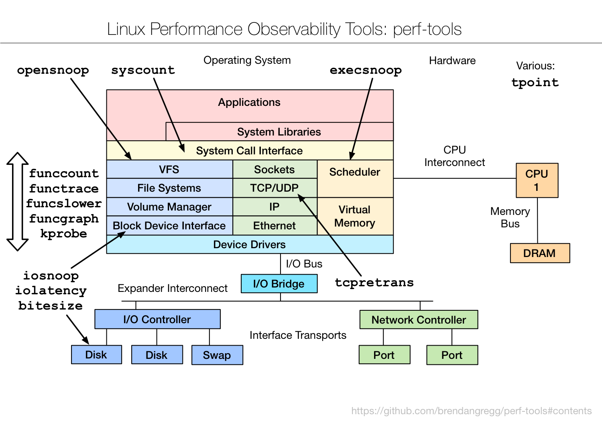
- [bcc/eBPF tools](https://github.com/iovisor/bcc#tools)
	- 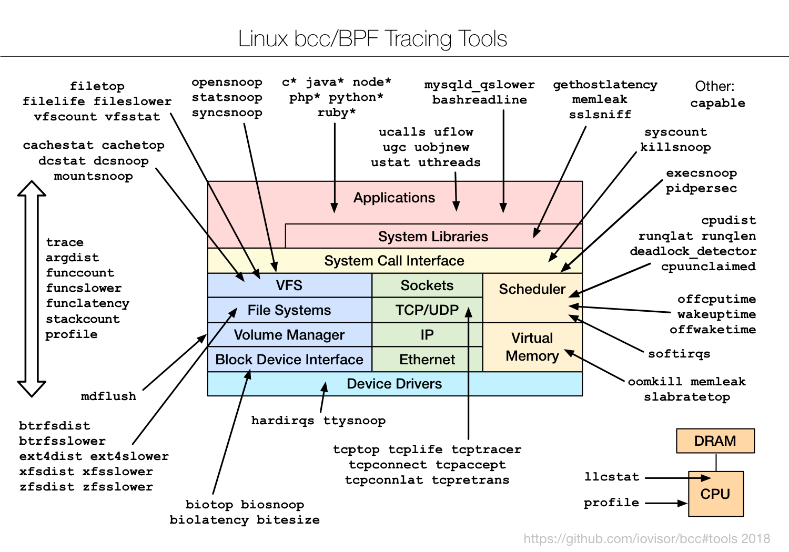
- [bpftrace/eBPF tools](https://github.com/iovisor/bpftrace#tools)
	- 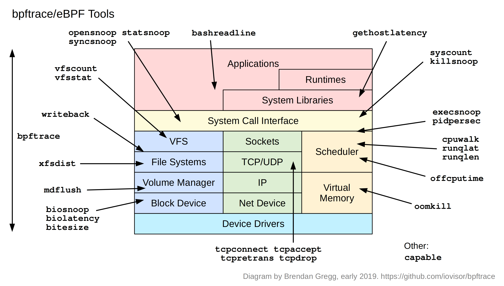
- [BPF Performance Tools](https://github.com/brendangregg/bpf-perf-tools-book) 
	- 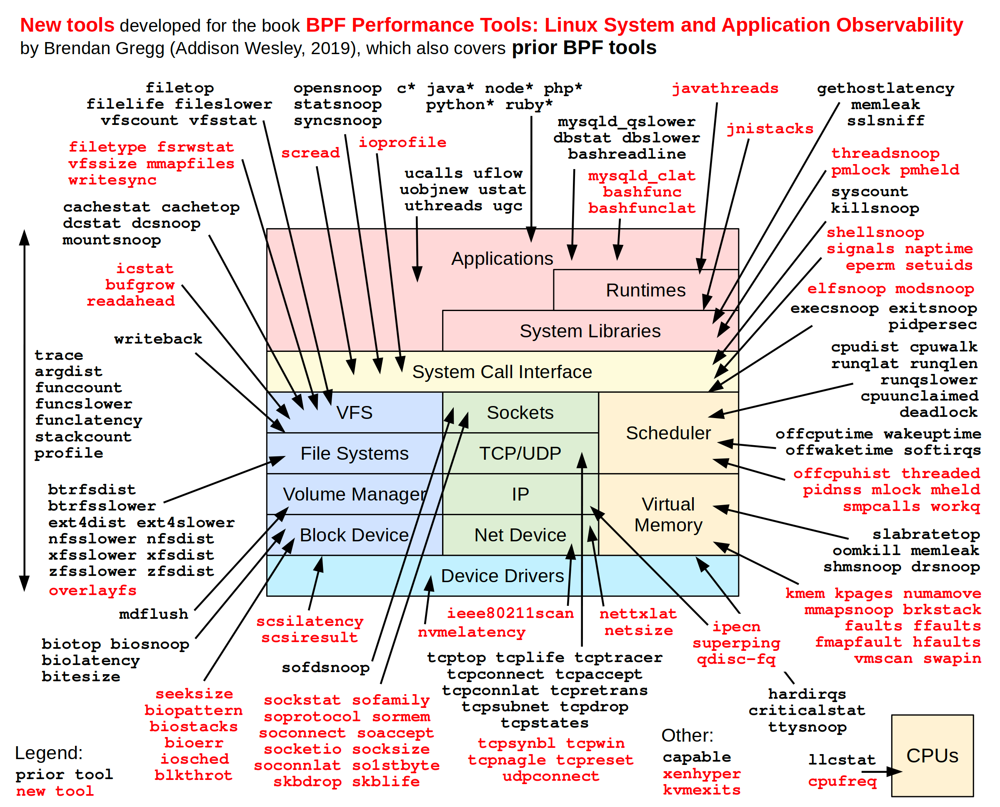

## Other Observability Tools

- Other Observability Tools
	- Static Performance Tools
		- 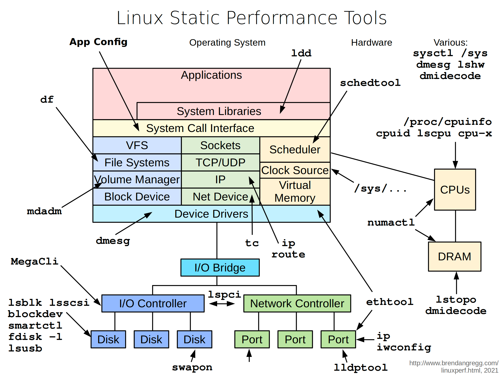
	- sar Tools
		- 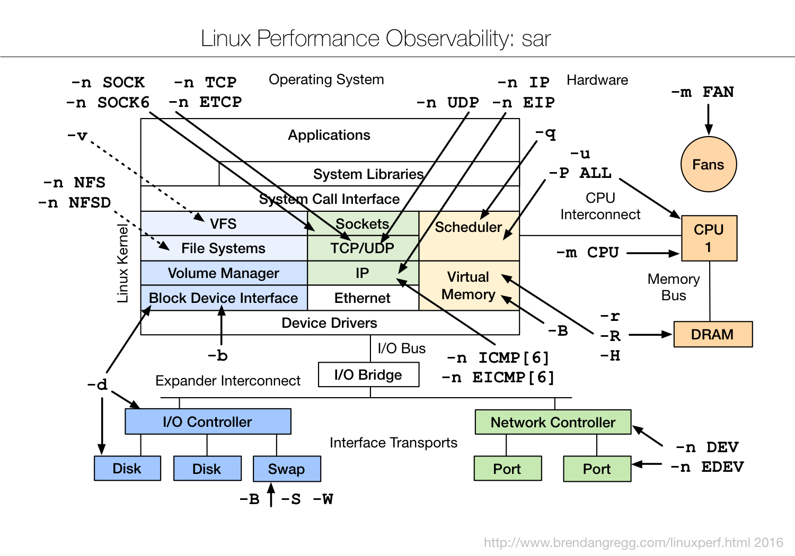
	- performance tools
		- 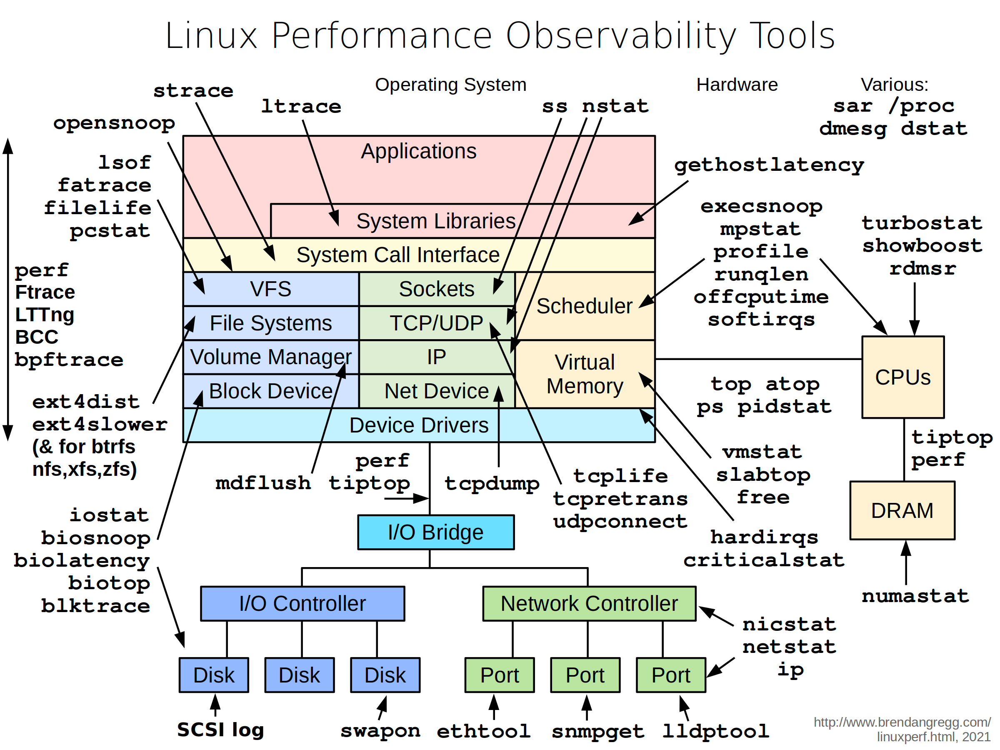
	- benchmark tools
		- 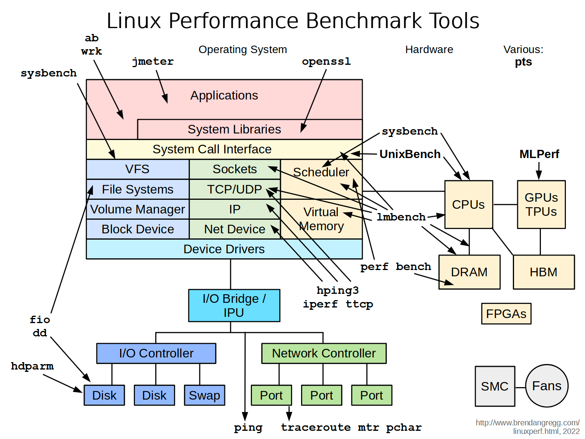
	- tuning tools
		- 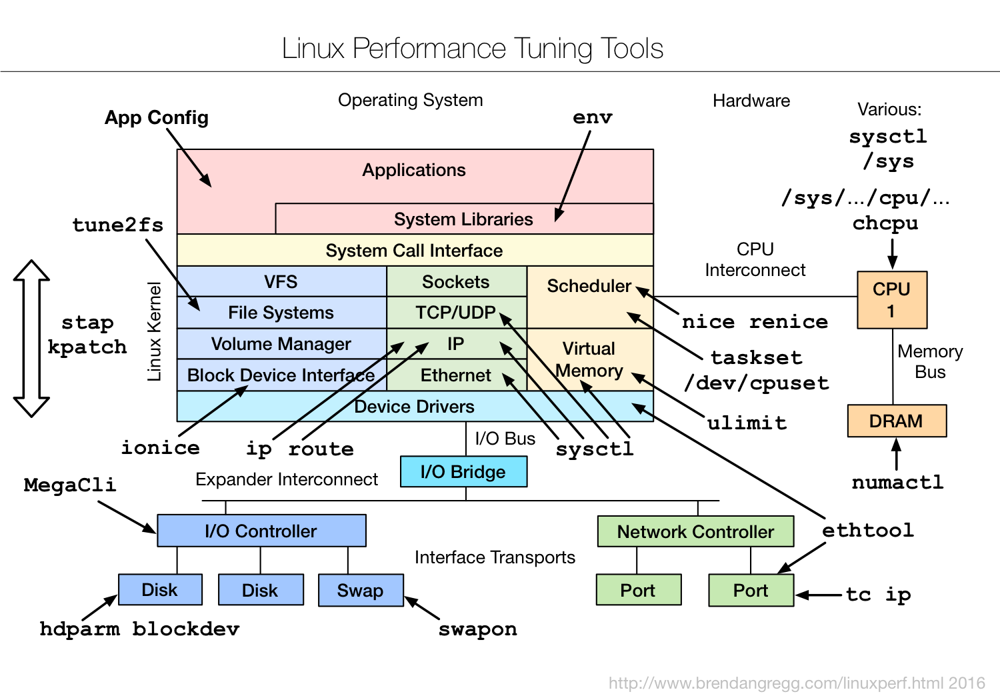
	- Other
		- [Arthas: Alibaba 开源的 Java 诊断工具](https://arthas.aliyun.com/doc/)
		- [SNMP](https://www.kernel.org/doc/html/v5.0/networking/snmp_counter.html)
		- [the proc filesystem](https://www.kernel.org/doc/Documentation/filesystems/proc.txt)
		- [man proc](https://man7.org/linux/man-pages/man5/proc.5.html)
		- [brendangregg homepage](https://www.brendangregg.com/)

## 火焰图

- FlameGraph: Stack trace visualizer
	- [brendangregg/FlameGraph](https://github.com/brendangregg/FlameGraph)
	- [Flame Graphs Examples](https://www.brendangregg.com/flamegraphs.html)

