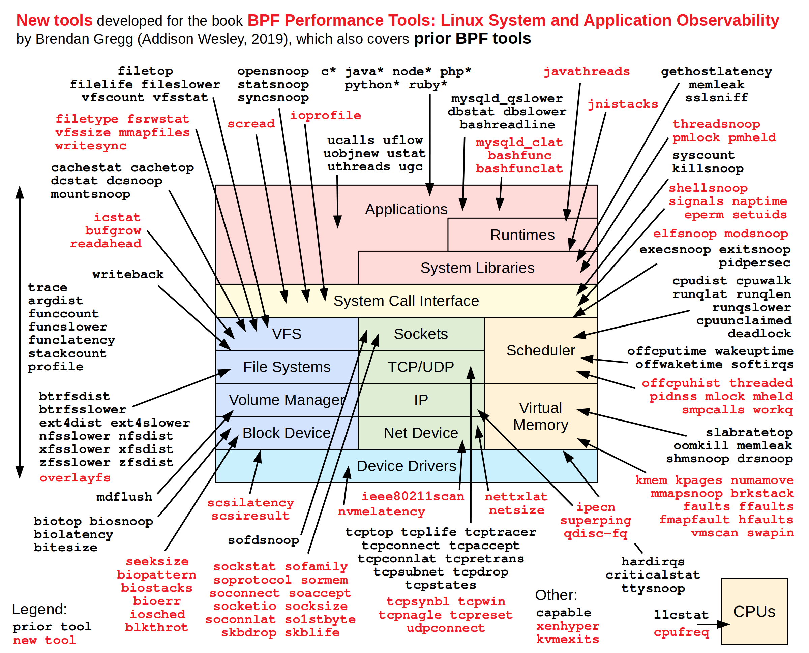

bpftrace is a high-level tracing language and runtime for Linux based on BPF. It supports static and dynamic tracing for both the kernel and user-space.


# 速查表
- [bpftrace Cheat Sheet](https://www.brendangregg.com/BPF/bpftrace-cheat-sheet.html)
	- [brendangregg bpfstrace](https://www.brendangregg.com/ebpf.html#bpftrace)
	- `man bpfstrace`
	- Syntax: `probe[,probe,...] /filter/ { action }`
	- Probe Types
	- Variable Types
	- Builtin Variables
	- Builtin Functions


## Probe Types

|Alias|Type|Description|
|---|---|---|
|t|tracepoint|Kernel static instrumentation points|
|U|usdt|User-level statically defined tracing|
|k|kprobe|Kernel dynamic function instrumentation (standard)|
|kr|kretprobe|Kernel dynamic function return instrumentation (standard)|
|f|kfunc|Kernel dynamic function instrumentation (BPF based)|
|fr|kretfunc|Kernel dynamic function return instrumentation (BPF based)|
|u|uprobe|User-level dynamic function instrumentation|
|ur|uretprobe|User-level dynamic function return instrumentation|
|s|software|Kernel software-based events|
|h|hardware|Hardware counter-based instrumentation|
|w|watchpoint|Memory watchpoint events|
|p|profile|Timed sampling across all CPUs|
|i|interval|Timed reporting (from one CPU)|
||iter|Iterator tracing over kernel objects|
||BEGIN|Start of bpftrace|
||END|End of bpftrace|


## Variable Types

| Variable   | Description  |
| ---------- | ------------ |
| @name      | global       |
| @name[key] | hash         |
| @name[tid] | thread-local |
| $name      | scratch      |


## Builtin Variable

|Builtin Variable|Description|
|---|---|
|pid|Process ID|
|tid|Thread ID|
|uid|User ID|
|username|Username|
|comm|Process or command name|
|curtask|Current task_struct as a u64|
|nsecs|Current time in nanoseconds|
|elapsed|Time in nanoseconds since bpftrace start|
|kstack|Kernel stack trace|
|ustack|User-level stack trace|
|arg0...argN|Function arguments|
|args|Tracepoint arguments|
|retval|Function return value|
|func|Function name|
|probe|Full probe name|
|$1...$N|Positional parameters|
|cgroup|Default cgroup v2 ID|


## Builtin Function

|Builtin Function|Description|
|---|---|
|printf("...")|Print formatted string|
|time("...")|Print formatted time|
|join(char *arr[])|Join array of strings with a space|
|str(char *s [, int length])|Return string from s pointer|
|buf(void *p [, int length])|Return a hexadecimal string from p pointer|
|strncmp(char *s1, char *s2, int length)|Compares two strings up to length|
|sizeof(expression)|Returns the size of the expression|
|kstack([limit])|Kernel stack trace up to limit frames|
|ustack([limit])|User-level stack trace up to limit frames|
|ksym(void *p)|Resolve kernel address to symbol|
|usym(void *p)|Resolve user-space address to symbol|
|kaddr(char *name)|Resolve kernel symbol name to address|
|uaddr(char *name)|Resolve user-space symbol name to address|
|ntop([int af,]int\|char[4:16] addr)|Convert IP address data to text|
|reg(char *name)|Return register value|
|cgroupid(char *path)|Return cgroupid for /sys/fs/cgroup/... path|
|time("...")|Print formatted time|
|system("...")|Run shell command|
|cat(char *filename)|Print file content|
|signal(char[] sig \| int sig)|Send a signal to the current task|
|override(u64 rc)|Override a kernel function return value|
|exit()|Exits bpftrace|
|@ = count()|Count events|
|@ = sum(x)|Sum the value|
|@ = hist(x)|Power-of-2 histogram for x|
|@ = lhist(x, min, max, step)|Linear histogram for x|
|@ = min(x)|Record the minimum value seen|
|@ = max(x)|Record the maximum value seen|
|@ = stats(x)|Return the count, average, and total for this value|
|delete(@x[key])|Delete the map element|
|clear(@x)|Delete all keys from the map|


# 样例

[One Liners样例](https://github.com/iovisor/bpftrace/blob/master/docs/tutorial_one_liners.md)

```bash
# Listing probes
bpftrace -l 'tracepoint:syscalls:sys_enter_*'

# Hello world
bpftrace -e 'BEGIN { printf("hello world\n"); }'

# File opens
bpftrace -e 'tracepoint:syscalls:sys_enter_open { printf("%s %s\n", comm, str(args->filename)); }'

# Syscall counts by process
bpftrace -e 'tracepoint:raw_syscalls:sys_enter { @[comm] = count(); }'

# Distribution of read() bytes
bpftrace -e 'tracepoint:syscalls:sys_exit_read /pid == 18644/ { @bytes = hist(args->retval); }'

# Kernel dynamic tracing of read() bytes
bpftrace -e 'kretprobe:vfs_read { @bytes = lhist(retval, 0, 2000, 200); }'

# Timing read()s
bpftrace -e 'kprobe:vfs_read { @start[tid] = nsecs; }
    kretprobe:vfs_read /@start[tid]/ { @ns[comm] = hist(nsecs - @start[tid]); delete(@start[tid]); }'

# Count process-level events
bpftrace -e 'tracepoint:sched:sched* { @[name] = count(); } interval:s:5 { exit(); }'

# Profile on-CPU kernel stacks
bpftrace -e 'profile:hz:99 { @[stack] = count(); }'

# Scheduler tracing
bpftrace -e 'tracepoint:sched:sched_switch { @[stack] = count(); }'

# Block I/O tracing
bpftrace -e 'tracepoint:block:block_rq_complete { @ = hist(args->nr_sector * 512); }'
```


# 参考手册


- Tutorial
	- [iovisor bpfstrace reference guide](https://github.com/iovisor/bpftrace/blob/master/docs/reference_guide.md)
	- book: 《BPF Performance Tools (Brendan Gregg)》
		- [bpf-performance-tools-book](https://www.brendangregg.com/bpf-performance-tools-book.html)
		- Appendices A: bpftrace One-Liners  
		- Appendices B: bpftrace Cheat Sheet
	- [iovisor bpftrace](https://github.com/iovisor/bpftrace)
		- 


