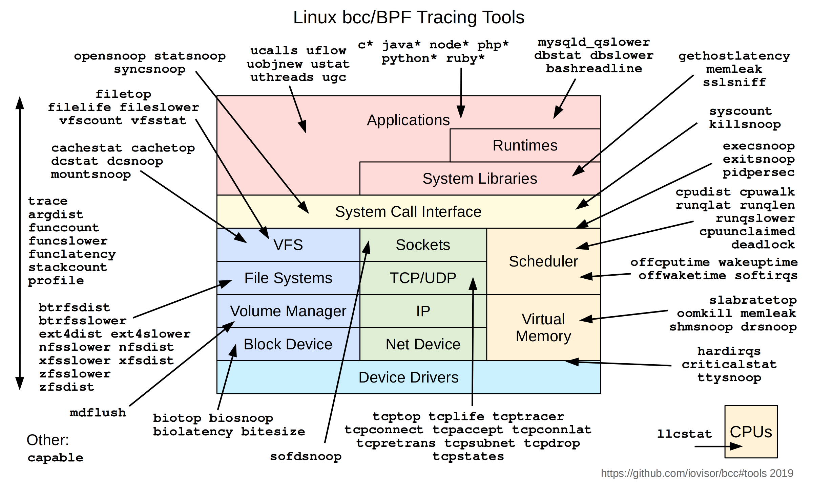
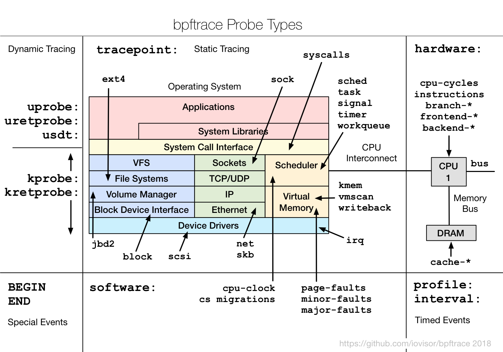

# 安装虚拟机

```bash
# 安装虚拟机(jammy版本,ubuntu 22.04, 内核版本是5.15, Linux 5.15.0-71-generic)
multipass launch --mem 4G --disk 24G --cpus 2 --network en0  --network name=bridge0,mode=manual --network name=bridge0,mode=manual --name ebpfvm

# 进入虚拟机: update
sudo -s
apt update
```


# bcc


- bcc
	- BCC: Tools for BPF-based Linux IO analysis, networking, monitoring, and more
	- [iovisor/bcc](https://github.com/iovisor/bcc)
	- [安装教程](https://github.com/iovisor/bcc/blob/master/INSTALL.md)

## bcc install

```bash
# 安装基本软件
apt install -y zip bison build-essential cmake flex git libedit-dev \
  libllvm14 llvm-14-dev libclang-14-dev python3 zlib1g-dev libelf-dev libfl-dev python3-setuptools \
  liblzma-dev libdebuginfod-dev arping netperf iperf

# 下载软件(基于源码master分支编译会出现兼容问题)
cd /root
wget https://github.com/iovisor/bcc/releases/download/v0.27.0/bcc-src-with-submodule.tar.gz
tar -zxvf bcc-src-with-submodule.tar.gz


# 编译安装 
mkdir bcc/build
cd bcc/build
cmake ..
make
make install
cmake -DPYTHON_CMD=python3 ..
pushd src/python/
make
make install
popd


# 验证
cd /usr/share/bcc/tools
python3 execsnoop
python3 tcpconnect
```


## bcc tools





- tools/[argdist](https://github.com/iovisor/bcc/blob/master/tools/argdist.py): Display function parameter values as a histogram or frequency count. [Examples](https://github.com/iovisor/bcc/blob/master/tools/argdist_example.txt).
- tools/[bashreadline](https://github.com/iovisor/bcc/blob/master/tools/bashreadline.py): Print entered bash commands system wide. [Examples](https://github.com/iovisor/bcc/blob/master/tools/bashreadline_example.txt).
- tools/[bindsnoop](https://github.com/iovisor/bcc/blob/master/tools/bindsnoop.py): Trace IPv4 and IPv6 bind() system calls (bind()). [Examples](https://github.com/iovisor/bcc/blob/master/tools/bindsnoop_example.txt).
- tools/[biolatency](https://github.com/iovisor/bcc/blob/master/tools/biolatency.py): Summarize block device I/O latency as a histogram. [Examples](https://github.com/iovisor/bcc/blob/master/tools/biolatency_example.txt).
- tools/[biotop](https://github.com/iovisor/bcc/blob/master/tools/biotop.py): Top for disks: Summarize block device I/O by process. [Examples](https://github.com/iovisor/bcc/blob/master/tools/biotop_example.txt).
- tools/[biopattern](https://github.com/iovisor/bcc/blob/master/tools/biopattern.py): Identify random/sequential disk access patterns. [Examples](https://github.com/iovisor/bcc/blob/master/tools/biopattern_example.txt).
- tools/[biosnoop](https://github.com/iovisor/bcc/blob/master/tools/biosnoop.py): Trace block device I/O with PID and latency. [Examples](https://github.com/iovisor/bcc/blob/master/tools/biosnoop_example.txt).
- tools/[bitesize](https://github.com/iovisor/bcc/blob/master/tools/bitesize.py): Show per process I/O size histogram. [Examples](https://github.com/iovisor/bcc/blob/master/tools/bitesize_example.txt).
- tools/[bpflist](https://github.com/iovisor/bcc/blob/master/tools/bpflist.py): Display processes with active BPF programs and maps. [Examples](https://github.com/iovisor/bcc/blob/master/tools/bpflist_example.txt).
- tools/[btrfsdist](https://github.com/iovisor/bcc/blob/master/tools/btrfsdist.py): Summarize btrfs operation latency distribution as a histogram. [Examples](https://github.com/iovisor/bcc/blob/master/tools/btrfsdist_example.txt).
- tools/[btrfsslower](https://github.com/iovisor/bcc/blob/master/tools/btrfsslower.py): Trace slow btrfs operations. [Examples](https://github.com/iovisor/bcc/blob/master/tools/btrfsslower_example.txt).
- tools/[capable](https://github.com/iovisor/bcc/blob/master/tools/capable.py): Trace security capability checks. [Examples](https://github.com/iovisor/bcc/blob/master/tools/capable_example.txt).
- tools/[cachestat](https://github.com/iovisor/bcc/blob/master/tools/cachestat.py): Trace page cache hit/miss ratio. [Examples](https://github.com/iovisor/bcc/blob/master/tools/cachestat_example.txt).
- tools/[cachetop](https://github.com/iovisor/bcc/blob/master/tools/cachetop.py): Trace page cache hit/miss ratio by processes. [Examples](https://github.com/iovisor/bcc/blob/master/tools/cachetop_example.txt).
- tools/[compactsnoop](https://github.com/iovisor/bcc/blob/master/tools/compactsnoop.py): Trace compact zone events with PID and latency. [Examples](https://github.com/iovisor/bcc/blob/master/tools/compactsnoop_example.txt).
- tools/[cpudist](https://github.com/iovisor/bcc/blob/master/tools/cpudist.py): Summarize on- and off-CPU time per task as a histogram. [Examples](https://github.com/iovisor/bcc/blob/master/tools/cpudist_example.txt)
- tools/[cpuunclaimed](https://github.com/iovisor/bcc/blob/master/tools/cpuunclaimed.py): Sample CPU run queues and calculate unclaimed idle CPU. [Examples](https://github.com/iovisor/bcc/blob/master/tools/cpuunclaimed_example.txt)
- tools/[criticalstat](https://github.com/iovisor/bcc/blob/master/tools/criticalstat.py): Trace and report long atomic critical sections in the kernel. [Examples](https://github.com/iovisor/bcc/blob/master/tools/criticalstat_example.txt)
- tools/[dbslower](https://github.com/iovisor/bcc/blob/master/tools/dbslower.py): Trace MySQL/PostgreSQL queries slower than a threshold. [Examples](https://github.com/iovisor/bcc/blob/master/tools/dbslower_example.txt).
- tools/[dbstat](https://github.com/iovisor/bcc/blob/master/tools/dbstat.py): Summarize MySQL/PostgreSQL query latency as a histogram. [Examples](https://github.com/iovisor/bcc/blob/master/tools/dbstat_example.txt).
- tools/[dcsnoop](https://github.com/iovisor/bcc/blob/master/tools/dcsnoop.py): Trace directory entry cache (dcache) lookups. [Examples](https://github.com/iovisor/bcc/blob/master/tools/dcsnoop_example.txt).
- tools/[dcstat](https://github.com/iovisor/bcc/blob/master/tools/dcstat.py): Directory entry cache (dcache) stats. [Examples](https://github.com/iovisor/bcc/blob/master/tools/dcstat_example.txt).
- tools/[deadlock](https://github.com/iovisor/bcc/blob/master/tools/deadlock.py): Detect potential deadlocks on a running process. [Examples](https://github.com/iovisor/bcc/blob/master/tools/deadlock_example.txt).
- tools/[dirtop](https://github.com/iovisor/bcc/blob/master/tools/dirtop.py): File reads and writes by directory. Top for directories. [Examples](https://github.com/iovisor/bcc/blob/master/tools/dirtop_example.txt).
- tools/[drsnoop](https://github.com/iovisor/bcc/blob/master/tools/drsnoop.py): Trace direct reclaim events with PID and latency. [Examples](https://github.com/iovisor/bcc/blob/master/tools/drsnoop_example.txt).
- tools/[execsnoop](https://github.com/iovisor/bcc/blob/master/tools/execsnoop.py): Trace new processes via exec() syscalls. [Examples](https://github.com/iovisor/bcc/blob/master/tools/execsnoop_example.txt).
- tools/[exitsnoop](https://github.com/iovisor/bcc/blob/master/tools/exitsnoop.py): Trace process termination (exit and fatal signals). [Examples](https://github.com/iovisor/bcc/blob/master/tools/exitsnoop_example.txt).
- tools/[ext4dist](https://github.com/iovisor/bcc/blob/master/tools/ext4dist.py): Summarize ext4 operation latency distribution as a histogram. [Examples](https://github.com/iovisor/bcc/blob/master/tools/ext4dist_example.txt).
- tools/[ext4slower](https://github.com/iovisor/bcc/blob/master/tools/ext4slower.py): Trace slow ext4 operations. [Examples](https://github.com/iovisor/bcc/blob/master/tools/ext4slower_example.txt).
- tools/[filelife](https://github.com/iovisor/bcc/blob/master/tools/filelife.py): Trace the lifespan of short-lived files. [Examples](https://github.com/iovisor/bcc/blob/master/tools/filelife_example.txt).
- tools/[filegone](https://github.com/iovisor/bcc/blob/master/tools/filegone.py): Trace why file gone (deleted or renamed). [Examples](https://github.com/iovisor/bcc/blob/master/tools/filegone_example.txt).
- tools/[fileslower](https://github.com/iovisor/bcc/blob/master/tools/fileslower.py): Trace slow synchronous file reads and writes. [Examples](https://github.com/iovisor/bcc/blob/master/tools/fileslower_example.txt).
- tools/[filetop](https://github.com/iovisor/bcc/blob/master/tools/filetop.py): File reads and writes by filename and process. Top for files. [Examples](https://github.com/iovisor/bcc/blob/master/tools/filetop_example.txt).
- tools/[funccount](https://github.com/iovisor/bcc/blob/master/tools/funccount.py): Count kernel function calls. [Examples](https://github.com/iovisor/bcc/blob/master/tools/funccount_example.txt).
- tools/[funcinterval](https://github.com/iovisor/bcc/blob/master/tools/funcinterval.py): Time interval between the same function as a histogram. [Examples](https://github.com/iovisor/bcc/blob/master/tools/funcinterval_example.txt).
- tools/[funclatency](https://github.com/iovisor/bcc/blob/master/tools/funclatency.py): Time functions and show their latency distribution. [Examples](https://github.com/iovisor/bcc/blob/master/tools/funclatency_example.txt).
- tools/[funcslower](https://github.com/iovisor/bcc/blob/master/tools/funcslower.py): Trace slow kernel or user function calls. [Examples](https://github.com/iovisor/bcc/blob/master/tools/funcslower_example.txt).
- tools/[gethostlatency](https://github.com/iovisor/bcc/blob/master/tools/gethostlatency.py): Show latency for getaddrinfo/gethostbyname[2] calls. [Examples](https://github.com/iovisor/bcc/blob/master/tools/gethostlatency_example.txt).
- tools/[hardirqs](https://github.com/iovisor/bcc/blob/master/tools/hardirqs.py): Measure hard IRQ (hard interrupt) event time. [Examples](https://github.com/iovisor/bcc/blob/master/tools/hardirqs_example.txt).
- tools/[inject](https://github.com/iovisor/bcc/blob/master/tools/inject.py): Targeted error injection with call chain and predicates [Examples](https://github.com/iovisor/bcc/blob/master/tools/inject_example.txt).
- tools/[killsnoop](https://github.com/iovisor/bcc/blob/master/tools/killsnoop.py): Trace signals issued by the kill() syscall. [Examples](https://github.com/iovisor/bcc/blob/master/tools/killsnoop_example.txt).
- tools/[klockstat](https://github.com/iovisor/bcc/blob/master/tools/klockstat.py): Traces kernel mutex lock events and display locks statistics. [Examples](https://github.com/iovisor/bcc/blob/master/tools/klockstat_example.txt).
- tools/[kvmexit](https://github.com/iovisor/bcc/blob/master/tools/kvmexit.py): Display the exit_reason and its statistics of each vm exit. [Examples](https://github.com/iovisor/bcc/blob/master/tools/kvmexit_example.txt).
- tools/[llcstat](https://github.com/iovisor/bcc/blob/master/tools/llcstat.py): Summarize CPU cache references and misses by process. [Examples](https://github.com/iovisor/bcc/blob/master/tools/llcstat_example.txt).
- tools/[mdflush](https://github.com/iovisor/bcc/blob/master/tools/mdflush.py): Trace md flush events. [Examples](https://github.com/iovisor/bcc/blob/master/tools/mdflush_example.txt).
- tools/[memleak](https://github.com/iovisor/bcc/blob/master/tools/memleak.py): Display outstanding memory allocations to find memory leaks. [Examples](https://github.com/iovisor/bcc/blob/master/tools/memleak_example.txt).
- tools/[mountsnoop](https://github.com/iovisor/bcc/blob/master/tools/mountsnoop.py): Trace mount and umount syscalls system-wide. [Examples](https://github.com/iovisor/bcc/blob/master/tools/mountsnoop_example.txt).
- tools/[mysqld_qslower](https://github.com/iovisor/bcc/blob/master/tools/mysqld_qslower.py): Trace MySQL server queries slower than a threshold. [Examples](https://github.com/iovisor/bcc/blob/master/tools/mysqld_qslower_example.txt).
- tools/[netqtop](https://github.com/iovisor/bcc/blob/master/tools/netqtop.py) tools/[netqtop.c](https://github.com/iovisor/bcc/blob/master/tools/netqtop.c): Trace and display packets distribution on NIC queues. [Examples](https://github.com/iovisor/bcc/blob/master/tools/netqtop_example.txt).
- tools/[nfsslower](https://github.com/iovisor/bcc/blob/master/tools/nfsslower.py): Trace slow NFS operations. [Examples](https://github.com/iovisor/bcc/blob/master/tools/nfsslower_example.txt).
- tools/[nfsdist](https://github.com/iovisor/bcc/blob/master/tools/nfsdist.py): Summarize NFS operation latency distribution as a histogram. [Examples](https://github.com/iovisor/bcc/blob/master/tools/nfsdist_example.txt).
- tools/[offcputime](https://github.com/iovisor/bcc/blob/master/tools/offcputime.py): Summarize off-CPU time by kernel stack trace. [Examples](https://github.com/iovisor/bcc/blob/master/tools/offcputime_example.txt).
- tools/[offwaketime](https://github.com/iovisor/bcc/blob/master/tools/offwaketime.py): Summarize blocked time by kernel off-CPU stack and waker stack. [Examples](https://github.com/iovisor/bcc/blob/master/tools/offwaketime_example.txt).
- tools/[oomkill](https://github.com/iovisor/bcc/blob/master/tools/oomkill.py): Trace the out-of-memory (OOM) killer. [Examples](https://github.com/iovisor/bcc/blob/master/tools/oomkill_example.txt).
- tools/[opensnoop](https://github.com/iovisor/bcc/blob/master/tools/opensnoop.py): Trace open() syscalls. [Examples](https://github.com/iovisor/bcc/blob/master/tools/opensnoop_example.txt).
- tools/[pidpersec](https://github.com/iovisor/bcc/blob/master/tools/pidpersec.py): Count new processes (via fork). [Examples](https://github.com/iovisor/bcc/blob/master/tools/pidpersec_example.txt).
- tools/[ppchcalls](https://github.com/iovisor/bcc/blob/master/tools/ppchcalls.py): Summarize ppc hcall counts and latencies. [Examples](https://github.com/iovisor/bcc/blob/master/tools/ppchcalls_example.txt).
- tools/[profile](https://github.com/iovisor/bcc/blob/master/tools/profile.py): Profile CPU usage by sampling stack traces at a timed interval. [Examples](https://github.com/iovisor/bcc/blob/master/tools/profile_example.txt).
- tools/[readahead](https://github.com/iovisor/bcc/blob/master/tools/readahead.py): Show performance of read-ahead cache [Examples](https://github.com/iovisor/bcc/blob/master/tools/readahead_example.txt).
- tools/[reset-trace](https://github.com/iovisor/bcc/blob/master/tools/reset-trace.sh): Reset the state of tracing. Maintenance tool only. [Examples](https://github.com/iovisor/bcc/blob/master/tools/reset-trace_example.txt).
- tools/[runqlat](https://github.com/iovisor/bcc/blob/master/tools/runqlat.py): Run queue (scheduler) latency as a histogram. [Examples](https://github.com/iovisor/bcc/blob/master/tools/runqlat_example.txt).
- tools/[runqlen](https://github.com/iovisor/bcc/blob/master/tools/runqlen.py): Run queue length as a histogram. [Examples](https://github.com/iovisor/bcc/blob/master/tools/runqlen_example.txt).
- tools/[runqslower](https://github.com/iovisor/bcc/blob/master/tools/runqslower.py): Trace long process scheduling delays. [Examples](https://github.com/iovisor/bcc/blob/master/tools/runqslower_example.txt).
- tools/[shmsnoop](https://github.com/iovisor/bcc/blob/master/tools/shmsnoop.py): Trace System V shared memory syscalls. [Examples](https://github.com/iovisor/bcc/blob/master/tools/shmsnoop_example.txt).
- tools/[sofdsnoop](https://github.com/iovisor/bcc/blob/master/tools/sofdsnoop.py): Trace FDs passed through unix sockets. [Examples](https://github.com/iovisor/bcc/blob/master/tools/sofdsnoop_example.txt).
- tools/[slabratetop](https://github.com/iovisor/bcc/blob/master/tools/slabratetop.py): Kernel SLAB/SLUB memory cache allocation rate top. [Examples](https://github.com/iovisor/bcc/blob/master/tools/slabratetop_example.txt).
- tools/[softirqs](https://github.com/iovisor/bcc/blob/master/tools/softirqs.py): Measure soft IRQ (soft interrupt) event time. [Examples](https://github.com/iovisor/bcc/blob/master/tools/softirqs_example.txt).
- tools/[solisten](https://github.com/iovisor/bcc/blob/master/tools/solisten.py): Trace TCP socket listen. [Examples](https://github.com/iovisor/bcc/blob/master/tools/solisten_example.txt).
- tools/[sslsniff](https://github.com/iovisor/bcc/blob/master/tools/sslsniff.py): Sniff OpenSSL written and readed data. [Examples](https://github.com/iovisor/bcc/blob/master/tools/sslsniff_example.txt).
- tools/[stackcount](https://github.com/iovisor/bcc/blob/master/tools/stackcount.py): Count kernel function calls and their stack traces. [Examples](https://github.com/iovisor/bcc/blob/master/tools/stackcount_example.txt).
- tools/[syncsnoop](https://github.com/iovisor/bcc/blob/master/tools/syncsnoop.py): Trace sync() syscall. [Examples](https://github.com/iovisor/bcc/blob/master/tools/syncsnoop_example.txt).
- tools/[syscount](https://github.com/iovisor/bcc/blob/master/tools/syscount.py): Summarize syscall counts and latencies. [Examples](https://github.com/iovisor/bcc/blob/master/tools/syscount_example.txt).
- tools/[tcpaccept](https://github.com/iovisor/bcc/blob/master/tools/tcpaccept.py): Trace TCP passive connections (accept()). [Examples](https://github.com/iovisor/bcc/blob/master/tools/tcpaccept_example.txt).
- tools/[tcpconnect](https://github.com/iovisor/bcc/blob/master/tools/tcpconnect.py): Trace TCP active connections (connect()). [Examples](https://github.com/iovisor/bcc/blob/master/tools/tcpconnect_example.txt).
- tools/[tcpconnlat](https://github.com/iovisor/bcc/blob/master/tools/tcpconnlat.py): Trace TCP active connection latency (connect()). [Examples](https://github.com/iovisor/bcc/blob/master/tools/tcpconnlat_example.txt).
- tools/[tcpdrop](https://github.com/iovisor/bcc/blob/master/tools/tcpdrop.py): Trace kernel-based TCP packet drops with details. [Examples](https://github.com/iovisor/bcc/blob/master/tools/tcpdrop_example.txt).
- tools/[tcplife](https://github.com/iovisor/bcc/blob/master/tools/tcplife.py): Trace TCP sessions and summarize lifespan. [Examples](https://github.com/iovisor/bcc/blob/master/tools/tcplife_example.txt).
- tools/[tcpretrans](https://github.com/iovisor/bcc/blob/master/tools/tcpretrans.py): Trace TCP retransmits and TLPs. [Examples](https://github.com/iovisor/bcc/blob/master/tools/tcpretrans_example.txt).
- tools/[tcprtt](https://github.com/iovisor/bcc/blob/master/tools/tcprtt.py): Trace TCP round trip time. [Examples](https://github.com/iovisor/bcc/blob/master/tools/tcprtt_example.txt).
- tools/[tcpstates](https://github.com/iovisor/bcc/blob/master/tools/tcpstates.py): Trace TCP session state changes with durations. [Examples](https://github.com/iovisor/bcc/blob/master/tools/tcpstates_example.txt).
- tools/[tcpsubnet](https://github.com/iovisor/bcc/blob/master/tools/tcpsubnet.py): Summarize and aggregate TCP send by subnet. [Examples](https://github.com/iovisor/bcc/blob/master/tools/tcpsubnet_example.txt).
- tools/[tcpsynbl](https://github.com/iovisor/bcc/blob/master/tools/tcpsynbl.py): Show TCP SYN backlog. [Examples](https://github.com/iovisor/bcc/blob/master/tools/tcpsynbl_example.txt).
- tools/[tcptop](https://github.com/iovisor/bcc/blob/master/tools/tcptop.py): Summarize TCP send/recv throughput by host. Top for TCP. [Examples](https://github.com/iovisor/bcc/blob/master/tools/tcptop_example.txt).
- tools/[tcptracer](https://github.com/iovisor/bcc/blob/master/tools/tcptracer.py): Trace TCP established connections (connect(), accept(), close()). [Examples](https://github.com/iovisor/bcc/blob/master/tools/tcptracer_example.txt).
- tools/[tcpcong](https://github.com/iovisor/bcc/blob/master/tools/tcpcong.py): Trace TCP socket congestion control status duration. [Examples](https://github.com/iovisor/bcc/blob/master/tools/tcpcong_example.txt).
- tools/[threadsnoop](https://github.com/iovisor/bcc/blob/master/tools/threadsnoop.py): List new thread creation. [Examples](https://github.com/iovisor/bcc/blob/master/tools/threadsnoop_example.txt).
- tools/[tplist](https://github.com/iovisor/bcc/blob/master/tools/tplist.py): Display kernel tracepoints or USDT probes and their formats. [Examples](https://github.com/iovisor/bcc/blob/master/tools/tplist_example.txt).
- tools/[trace](https://github.com/iovisor/bcc/blob/master/tools/trace.py): Trace arbitrary functions, with filters. [Examples](https://github.com/iovisor/bcc/blob/master/tools/trace_example.txt).
- tools/[ttysnoop](https://github.com/iovisor/bcc/blob/master/tools/ttysnoop.py): Watch live output from a tty or pts device. [Examples](https://github.com/iovisor/bcc/blob/master/tools/ttysnoop_example.txt).
- tools/[ucalls](https://github.com/iovisor/bcc/blob/master/tools/lib/ucalls.py): Summarize method calls or Linux syscalls in high-level languages. [Examples](https://github.com/iovisor/bcc/blob/master/tools/lib/ucalls_example.txt).
- tools/[uflow](https://github.com/iovisor/bcc/blob/master/tools/lib/uflow.py): Print a method flow graph in high-level languages. [Examples](https://github.com/iovisor/bcc/blob/master/tools/lib/uflow_example.txt).
- tools/[ugc](https://github.com/iovisor/bcc/blob/master/tools/lib/ugc.py): Trace garbage collection events in high-level languages. [Examples](https://github.com/iovisor/bcc/blob/master/tools/lib/ugc_example.txt).
- tools/[uobjnew](https://github.com/iovisor/bcc/blob/master/tools/lib/uobjnew.py): Summarize object allocation events by object type and number of bytes allocated. [Examples](https://github.com/iovisor/bcc/blob/master/tools/lib/uobjnew_example.txt).
- tools/[ustat](https://github.com/iovisor/bcc/blob/master/tools/lib/ustat.py): Collect events such as GCs, thread creations, object allocations, exceptions and more in high-level languages. [Examples](https://github.com/iovisor/bcc/blob/master/tools/lib/ustat_example.txt).
- tools/[uthreads](https://github.com/iovisor/bcc/blob/master/tools/lib/uthreads.py): Trace thread creation events in Java and raw pthreads. [Examples](https://github.com/iovisor/bcc/blob/master/tools/lib/uthreads_example.txt).
- tools/[vfscount](https://github.com/iovisor/bcc/blob/master/tools/vfscount.py): Count VFS calls. [Examples](https://github.com/iovisor/bcc/blob/master/tools/vfscount_example.txt).
- tools/[vfsstat](https://github.com/iovisor/bcc/blob/master/tools/vfsstat.py): Count some VFS calls, with column output. [Examples](https://github.com/iovisor/bcc/blob/master/tools/vfsstat_example.txt).
- tools/[virtiostat](https://github.com/iovisor/bcc/blob/master/tools/virtiostat.py): Show VIRTIO device IO statistics. [Examples](https://github.com/iovisor/bcc/blob/master/tools/virtiostat_example.txt).
- tools/[wakeuptime](https://github.com/iovisor/bcc/blob/master/tools/wakeuptime.py): Summarize sleep to wakeup time by waker kernel stack. [Examples](https://github.com/iovisor/bcc/blob/master/tools/wakeuptime_example.txt).
- tools/[xfsdist](https://github.com/iovisor/bcc/blob/master/tools/xfsdist.py): Summarize XFS operation latency distribution as a histogram. [Examples](https://github.com/iovisor/bcc/blob/master/tools/xfsdist_example.txt).
- tools/[xfsslower](https://github.com/iovisor/bcc/blob/master/tools/xfsslower.py): Trace slow XFS operations. [Examples](https://github.com/iovisor/bcc/blob/master/tools/xfsslower_example.txt).
- tools/[zfsdist](https://github.com/iovisor/bcc/blob/master/tools/zfsdist.py): Summarize ZFS operation latency distribution as a histogram. [Examples](https://github.com/iovisor/bcc/blob/master/tools/zfsdist_example.txt).
- tools/[zfsslower](https://github.com/iovisor/bcc/blob/master/tools/zfsslower.py): Trace slow ZFS operations. [Examples](https://github.com/iovisor/bcc/blob/master/tools/zfsslower_example.txt).

## bcc examples

- examples/tracing/[bitehist.py](https://github.com/iovisor/bcc/blob/master/examples/tracing/bitehist.py): Block I/O size histogram. [Examples](https://github.com/iovisor/bcc/blob/master/examples/tracing/bitehist_example.txt).
- examples/tracing/[disksnoop.py](https://github.com/iovisor/bcc/blob/master/examples/tracing/disksnoop.py): Trace block device I/O latency. [Examples](https://github.com/iovisor/bcc/blob/master/examples/tracing/disksnoop_example.txt).
- examples/[hello_world.py](https://github.com/iovisor/bcc/blob/master/examples/hello_world.py): Prints "Hello, World!" for new processes.
- examples/tracing/[mysqld_query.py](https://github.com/iovisor/bcc/blob/master/examples/tracing/mysqld_query.py): Trace MySQL server queries using USDT probes. [Examples](https://github.com/iovisor/bcc/blob/master/examples/tracing/mysqld_query_example.txt).
- examples/tracing/[nodejs_http_server.py](https://github.com/iovisor/bcc/blob/master/examples/tracing/nodejs_http_server.py): Trace Node.js HTTP server requests using USDT probes. [Examples](https://github.com/iovisor/bcc/blob/master/examples/tracing/nodejs_http_server_example.txt).
- examples/tracing/[stacksnoop](https://github.com/iovisor/bcc/blob/master/examples/tracing/stacksnoop.py): Trace a kernel function and print all kernel stack traces. [Examples](https://github.com/iovisor/bcc/blob/master/examples/tracing/stacksnoop_example.txt).
- tools/[statsnoop](https://github.com/iovisor/bcc/blob/master/tools/statsnoop.py): Trace stat() syscalls. [Examples](https://github.com/iovisor/bcc/blob/master/tools/statsnoop_example.txt).
- examples/tracing/[task_switch.py](https://github.com/iovisor/bcc/blob/master/examples/tracing/task_switch.py): Count task switches with from and to PIDs.
- examples/tracing/[tcpv4connect.py](https://github.com/iovisor/bcc/blob/master/examples/tracing/tcpv4connect.py): Trace TCP IPv4 active connections. [Examples](https://github.com/iovisor/bcc/blob/master/examples/tracing/tcpv4connect_example.txt).
- examples/tracing/[trace_fields.py](https://github.com/iovisor/bcc/blob/master/examples/tracing/trace_fields.py): Simple example of printing fields from traced events.
- examples/tracing/[undump.py](https://github.com/iovisor/bcc/blob/master/examples/tracing/undump.py): Dump UNIX socket packets. [Examples](https://github.com/iovisor/bcc/blob/master/examples/tracing/undump_example.txt)
- examples/tracing/[urandomread.py](https://github.com/iovisor/bcc/blob/master/examples/tracing/urandomread.py): A kernel tracepoint example, which traces random:urandom_read. [Examples](https://github.com/iovisor/bcc/blob/master/examples/tracing/urandomread_example.txt).
- examples/tracing/[vfsreadlat.py](https://github.com/iovisor/bcc/blob/master/examples/tracing/vfsreadlat.py) examples/tracing/[vfsreadlat.c](https://github.com/iovisor/bcc/blob/master/examples/tracing/vfsreadlat.c): VFS read latency distribution. [Examples](https://github.com/iovisor/bcc/blob/master/examples/tracing/vfsreadlat_example.txt).
- examples/tracing/[kvm_hypercall.py](https://github.com/iovisor/bcc/blob/master/examples/tracing/kvm_hypercall.py): Conditional static kernel tracepoints for KVM entry, exit and hypercall [Examples](https://github.com/iovisor/bcc/blob/master/examples/tracing/kvm_hypercall.txt).


# bpftrace


- iovisor/bpftrace
	- [如何安装bpftrace-dbgsym](https://wiki.ubuntu.com/Debug%20Symbol%20Packages)
	- [如何安装bpftrace](https://installati.one/install-bpftrace-ubuntu-22-04/)
	- [iovisor/bpftrace](https://github.com/iovisor/bpftrace)
	- [mainline: kernel-devel的兼容问题](https://www.linuxcapable.com/how-to-install-ubuntu-mainline-kernel-installer-on-ubuntu-linux/)


## bpftrace install


```bash
# 教程: https://installati.one/install-bpftrace-ubuntu-22-04/

# 安装
apt-get -y install bpftrace

# 当需要删除bpftrace
# Uninstall bpftrace And Its Dependencies
# apt-get -y autoremove bpftrace
# Remove bpftrace Configurations and Data
# apt-get -y purge bpftrace
# Remove bpftrace configuration, data, and all of its dependencies
# apt-get -y autoremove --purge bpftrace


# 安装bpftrace-dbgsym, 教程 : https://wiki.ubuntu.com/Debug%20Symbol%20Packages
echo "deb http://ddebs.ubuntu.com $(lsb_release -cs) main restricted universe multiverse
deb http://ddebs.ubuntu.com $(lsb_release -cs)-updates main restricted universe multiverse
deb http://ddebs.ubuntu.com $(lsb_release -cs)-proposed main restricted universe multiverse" | tee -a /etc/apt/sources.list.d/ddebs.list

apt-get install ubuntu-dbgsym-keyring
apt-get update
apt-get install bpftrace-dbgsym


# 下载bpftrace(基于0.14.1版本无兼容问题，更高版本的bpftrace会出现兼容问题)
wget https://github.com/iovisor/bpftrace/archive/refs/tags/v0.14.1.tar.gz
tar -zxvf v0.14.1.tar.gz
cd bpftrace-0.14.1/tools/


# 验证
bpftrace -e 'BEGIN { printf("hello\n"); }'
bpftrace -e 'tracepoint:syscalls:sys_exit_read /args->ret/ { @[comm] = sum(args->ret); }'
./opensnoop.bt 
./tcpconnect.bt
```


当依赖的kernel-devel涉及到兼容问题时，可以考虑使用`mainline`解决，本次实验未碰到兼容问题
```bash
# 教程: https://www.linuxcapable.com/how-to-install-ubuntu-mainline-kernel-installer-on-ubuntu-linux/

# 安装命令
add-apt-repository ppa:cappelikan/ppa -y
apt update
apt install mainline -y

# display a list of available mainline kernel versions, release dates, and download sizes
mainline --list

# display a list of all the kernel versions currently installed on your system, along with their release dates and download sizes
mainline --list-installed


```


## bpftrace tools



bpftrace contains various tools, which also serve as examples of programming in the bpftrace language.

- tools/[bashreadline.bt](https://github.com/iovisor/bpftrace/blob/master/tools/bashreadline.bt): Print entered bash commands system wide. [Examples](https://github.com/iovisor/bpftrace/blob/master/tools/bashreadline_example.txt).
- tools/[biolatency.bt](https://github.com/iovisor/bpftrace/blob/master/tools/biolatency.bt): Block I/O latency as a histogram. [Examples](https://github.com/iovisor/bpftrace/blob/master/tools/biolatency_example.txt).
- tools/[biosnoop.bt](https://github.com/iovisor/bpftrace/blob/master/tools/biosnoop.bt): Block I/O tracing tool, showing per I/O latency. [Examples](https://github.com/iovisor/bpftrace/blob/master/tools/biosnoop_example.txt).
- tools/[biostacks.bt](https://github.com/iovisor/bpftrace/blob/master/tools/biostacks.bt): Show disk I/O latency with initialization stacks. [Examples](https://github.com/iovisor/bpftrace/blob/master/tools/biostacks_example.txt).
- tools/[bitesize.bt](https://github.com/iovisor/bpftrace/blob/master/tools/bitesize.bt): Show disk I/O size as a histogram. [Examples](https://github.com/iovisor/bpftrace/blob/master/tools/bitesize_example.txt).
- tools/[capable.bt](https://github.com/iovisor/bpftrace/blob/master/tools/capable.bt): Trace security capability checks. [Examples](https://github.com/iovisor/bpftrace/blob/master/tools/capable_example.txt).
- tools/[cpuwalk.bt](https://github.com/iovisor/bpftrace/blob/master/tools/cpuwalk.bt): Sample which CPUs are executing processes. [Examples](https://github.com/iovisor/bpftrace/blob/master/tools/cpuwalk_example.txt).
- tools/[dcsnoop.bt](https://github.com/iovisor/bpftrace/blob/master/tools/dcsnoop.bt): Trace directory entry cache (dcache) lookups. [Examples](https://github.com/iovisor/bpftrace/blob/master/tools/dcsnoop_example.txt).
- tools/[execsnoop.bt](https://github.com/iovisor/bpftrace/blob/master/tools/execsnoop.bt): Trace new processes via exec() syscalls. [Examples](https://github.com/iovisor/bpftrace/blob/master/tools/execsnoop_example.txt).
- tools/[gethostlatency.bt](https://github.com/iovisor/bpftrace/blob/master/tools/gethostlatency.bt): Show latency for getaddrinfo/gethostbyname[2] calls. [Examples](https://github.com/iovisor/bpftrace/blob/master/tools/gethostlatency_example.txt).
- tools/[killsnoop.bt](https://github.com/iovisor/bpftrace/blob/master/tools/killsnoop.bt): Trace signals issued by the kill() syscall. [Examples](https://github.com/iovisor/bpftrace/blob/master/tools/killsnoop_example.txt).
- tools/[loads.bt](https://github.com/iovisor/bpftrace/blob/master/tools/loads.bt): Print load averages. [Examples](https://github.com/iovisor/bpftrace/blob/master/tools/loads_example.txt).
- tools/[mdflush.bt](https://github.com/iovisor/bpftrace/blob/master/tools/mdflush.bt): Trace md flush events. [Examples](https://github.com/iovisor/bpftrace/blob/master/tools/mdflush_example.txt).
- tools/[naptime.bt](https://github.com/iovisor/bpftrace/blob/master/tools/naptime.bt): Show voluntary sleep calls. [Examples](https://github.com/iovisor/bpftrace/blob/master/tools/naptime_example.txt).
- tools/[opensnoop.bt](https://github.com/iovisor/bpftrace/blob/master/tools/opensnoop.bt): Trace open() syscalls showing filenames. [Examples](https://github.com/iovisor/bpftrace/blob/master/tools/opensnoop_example.txt).
- tools/[oomkill.bt](https://github.com/iovisor/bpftrace/blob/master/tools/oomkill.bt): Trace OOM killer. [Examples](https://github.com/iovisor/bpftrace/blob/master/tools/oomkill_example.txt).
- tools/[pidpersec.bt](https://github.com/iovisor/bpftrace/blob/master/tools/pidpersec.bt): Count new processes (via fork). [Examples](https://github.com/iovisor/bpftrace/blob/master/tools/pidpersec_example.txt).
- tools/[runqlat.bt](https://github.com/iovisor/bpftrace/blob/master/tools/runqlat.bt): CPU scheduler run queue latency as a histogram. [Examples](https://github.com/iovisor/bpftrace/blob/master/tools/runqlat_example.txt).
- tools/[runqlen.bt](https://github.com/iovisor/bpftrace/blob/master/tools/runqlen.bt): CPU scheduler run queue length as a histogram. [Examples](https://github.com/iovisor/bpftrace/blob/master/tools/runqlen_example.txt).
- tools/[setuids.bt](https://github.com/iovisor/bpftrace/blob/master/tools/setuids.bt): Trace the setuid syscalls: privilege escalation. [Examples](https://github.com/iovisor/bpftrace/blob/master/tools/setuids_example.txt).
- tools/[ssllatency.bt](https://github.com/iovisor/bpftrace/blob/master/tools/ssllatency.bt): Summarize SSL/TLS handshake latency as a histogram. [Examples](https://github.com/iovisor/bpftrace/blob/master/tools/ssllatency_example.txt)
- tools/[sslsnoop.bt](https://github.com/iovisor/bpftrace/blob/master/tools/sslsnoop.bt): Trace SSL/TLS handshake, showing latency and return value. [Examples](https://github.com/iovisor/bpftrace/blob/master/tools/sslsnoop_example.txt)
- tools/[statsnoop.bt](https://github.com/iovisor/bpftrace/blob/master/tools/statsnoop.bt): Trace stat() syscalls for general debugging. [Examples](https://github.com/iovisor/bpftrace/blob/master/tools/statsnoop_example.txt).
- tools/[swapin.bt](https://github.com/iovisor/bpftrace/blob/master/tools/swapin.bt): Show swapins by process. [Examples](https://github.com/iovisor/bpftrace/blob/master/tools/swapin_example.txt).
- tools/[syncsnoop.bt](https://github.com/iovisor/bpftrace/blob/master/tools/syncsnoop.bt): Trace sync() variety of syscalls. [Examples](https://github.com/iovisor/bpftrace/blob/master/tools/syncsnoop_example.txt).
- tools/[syscount.bt](https://github.com/iovisor/bpftrace/blob/master/tools/syscount.bt): Count system calls. [Examples](https://github.com/iovisor/bpftrace/blob/master/tools/syscount_example.txt).
- tools/[tcpaccept.bt](https://github.com/iovisor/bpftrace/blob/master/tools/tcpaccept.bt): Trace TCP passive connections (accept()). [Examples](https://github.com/iovisor/bpftrace/blob/master/tools/tcpaccept_example.txt).
- tools/[tcpconnect.bt](https://github.com/iovisor/bpftrace/blob/master/tools/tcpconnect.bt): Trace TCP active connections (connect()). [Examples](https://github.com/iovisor/bpftrace/blob/master/tools/tcpconnect_example.txt).
- tools/[tcpdrop.bt](https://github.com/iovisor/bpftrace/blob/master/tools/tcpdrop.bt): Trace kernel-based TCP packet drops with details. [Examples](https://github.com/iovisor/bpftrace/blob/master/tools/tcpdrop_example.txt).
- tools/[tcplife.bt](https://github.com/iovisor/bpftrace/blob/master/tools/tcplife.bt): Trace TCP session lifespans with connection details. [Examples](https://github.com/iovisor/bpftrace/blob/master/tools/tcplife_example.txt).
- tools/[tcpretrans.bt](https://github.com/iovisor/bpftrace/blob/master/tools/tcpretrans.bt): Trace TCP retransmits. [Examples](https://github.com/iovisor/bpftrace/blob/master/tools/tcpretrans_example.txt).
- tools/[tcpsynbl.bt](https://github.com/iovisor/bpftrace/blob/master/tools/tcpsynbl.bt): Show TCP SYN backlog as a histogram. [Examples](https://github.com/iovisor/bpftrace/blob/master/tools/tcpsynbl_example.txt).
- tools/[threadsnoop.bt](https://github.com/iovisor/bpftrace/blob/master/tools/threadsnoop.bt): List new thread creation. [Examples](https://github.com/iovisor/bpftrace/blob/master/tools/threadsnoop_example.txt).
- tools/[undump.bt](https://github.com/iovisor/bpftrace/blob/master/tools/undump.bt): Capture UNIX domain socket packages. [Examples](https://github.com/iovisor/bpftrace/blob/master/tools/undump_example.txt).
- tools/[vfscount.bt](https://github.com/iovisor/bpftrace/blob/master/tools/vfscount.bt): Count VFS calls. [Examples](https://github.com/iovisor/bpftrace/blob/master/tools/vfscount_example.txt).
- tools/[vfsstat.bt](https://github.com/iovisor/bpftrace/blob/master/tools/vfsstat.bt): Count some VFS calls, with per-second summaries. [Examples](https://github.com/iovisor/bpftrace/blob/master/tools/vfsstat_example.txt).
- tools/[writeback.bt](https://github.com/iovisor/bpftrace/blob/master/tools/writeback.bt): Trace file system writeback events with details. [Examples](https://github.com/iovisor/bpftrace/blob/master/tools/writeback_example.txt).
- tools/[xfsdist.bt](https://github.com/iovisor/bpftrace/blob/master/tools/xfsdist.bt): Summarize XFS operation latency distribution as a histogram. [Examples](https://github.com/iovisor/bpftrace/blob/master/tools/xfsdist_example.txt).

## bpftrace one-liners
```bash
# Files opened by process
bpftrace -e 'tracepoint:syscalls:sys_enter_open { printf("%s %s\n", comm, str(args->filename)); }'

# Syscall count by program
bpftrace -e 'tracepoint:raw_syscalls:sys_enter { @[comm] = count(); }'

# Read bytes by process:
bpftrace -e 'tracepoint:syscalls:sys_exit_read /args->ret/ { @[comm] = sum(args->ret); }'

# Read size distribution by process:
bpftrace -e 'tracepoint:syscalls:sys_exit_read { @[comm] = hist(args->ret); }'

# Show per-second syscall rates:
bpftrace -e 'tracepoint:raw_syscalls:sys_enter { @ = count(); } interval:s:1 { print(@); clear(@); }'

# Trace disk size by process
bpftrace -e 'tracepoint:block:block_rq_issue { printf("%d %s %d\n", pid, comm, args->bytes); }'

# Count page faults by process
bpftrace -e 'software:faults:1 { @[comm] = count(); }'

# Count LLC cache misses by process name and PID (uses PMCs):
bpftrace -e 'hardware:cache-misses:1000000 { @[comm, pid] = count(); }'

# Profile user-level stacks at 99 Hertz, for PID 189:
bpftrace -e 'profile:hz:99 /pid == 189/ { @[ustack] = count(); }'

# Files opened, for processes in the root cgroup-v2
bpftrace -e 'tracepoint:syscalls:sys_enter_openat /cgroup == cgroupid("/sys/fs/cgroup/unified/mycg")/ { printf("%s\n", str(args->filename)); }'
```


# bpftool


[bpftool](https://github.com/libbpf/bpftool): tool for inspection and simple manipulation of eBPF programs and maps

```bash
# 安装bpftool
apt install -y linux-tools-$(uname -r)
```


```bash
bpftool prog help

```