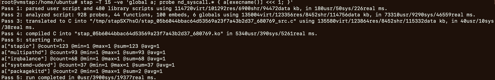
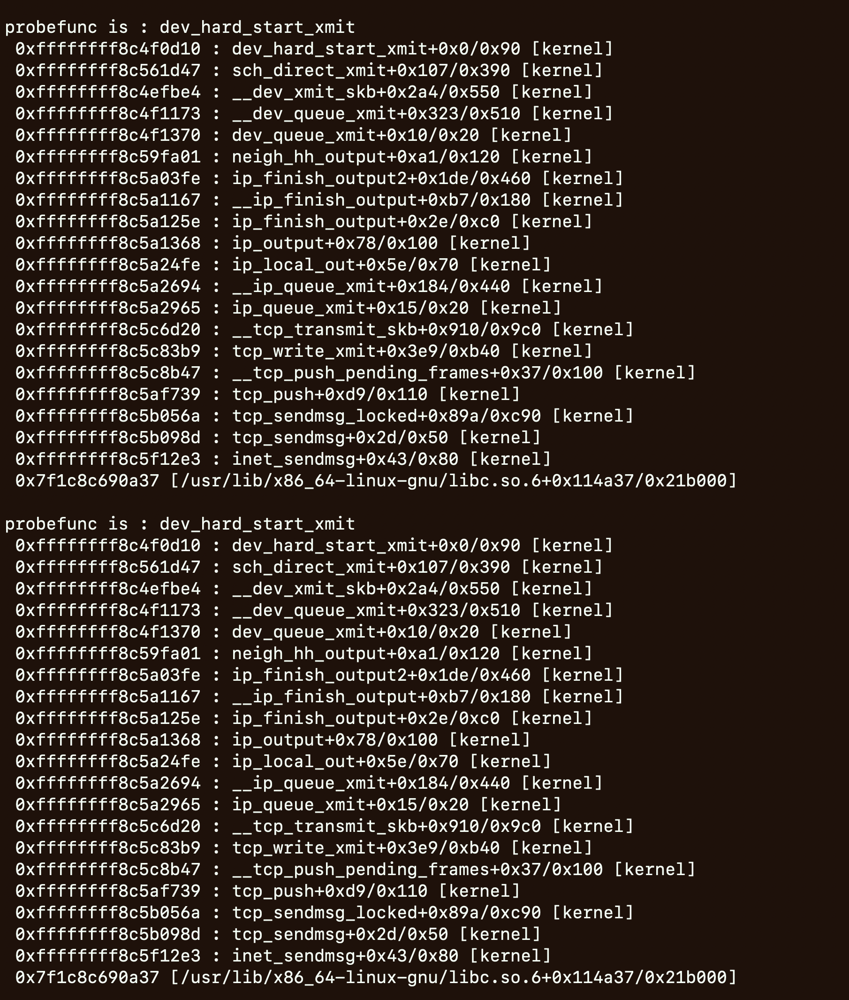

#  概览


- SystemTap: Analysis and diagnoistcs tools for linux system.
	- [SystemTap](https://sourceware.org/systemtap/)
	- [SystemTap tabsets](https://sourceware.org/systemtap/tapsets/)
	- [Systemtap Installation](https://wiki.ubuntu.com/Kernel/Systemtap)
- SystemTap VS eBPF
	- 当linux kernel版本低，eBPF支持有限时，可以选择SystemTap
	- 当linux kernel支持eBPF，尽量选择使用eBPF
	- 不建议在机器上同时安装bcc 和 systemtap
		- 如果虚机上安装了bcc，继续安装systemtap，有可能会破坏bcc的依赖.
		- 如果bcc依赖被破坏可尝试重装bcc
- events
	- Whenever a specified event occurs, the Linux kernel runs the handler as if it were a quick subroutine, then resumes.
	- such as entering or exiting a function, 
	- a timer expiring, 
	- or the entire systemtap session starting or stopping
- handlers
	- A handler is a series of script language statements that specify the work to be done whenever the event occurs. 
	- This work normally includes extracting data from the event context, storing them into internal variables, or printing results.
- how to work
	- Systemtap works by translating the script to C, running the system C compiler to create a kernel module from that. 
	- When the module is loaded, it activates all the probed events by hooking into the kernel. 
	- Then, as events occur on any processor, the compiled handlers run. 
	- Eventually, the session stops, the hooks are disconnected, and the module removed. 
	- This entire process is driven from a single command-line program: `stap`.


# 安装虚拟机


```
# 安装虚拟机(jammy版本,ubuntu 22.04, 内核版本是5.15)
multipass launch --mem 4G --disk 24G --cpus 2 --network en0 --network name=bridge0,mode=manual --network name=bridge0,mode=manual --name vmstap

# 进入虚拟机: update
sudo -s
apt update
```


# 安装SystemTap


```bash
# installation
apt-get install -y systemtap gcc

# Add repository config
cat <<EOF >>/etc/apt/sources.list.d/ddebs.list
deb http://ddebs.ubuntu.com/ $(lsb_release -cs) main restricted universe multiverse
deb http://ddebs.ubuntu.com/ $(lsb_release -cs)-security main restricted universe multiverse
deb http://ddebs.ubuntu.com/ $(lsb_release -cs)-updates  main restricted universe multiverse
deb http://ddebs.ubuntu.com/ $(lsb_release -cs)-proposed main restricted universe multiverse
EOF

# GPG key import
# apt-key adv --keyserver keyserver.ubuntu.com --recv-keys C8CAB6595FDFF622


apt install ubuntu-dbgsym-keyring
apt-get update
apt-get install -y linux-image-$(uname -r)-dbgsym

# 必要时，参考这些
# https://wiki.ubuntu.com/Debug%20Symbol%20Packages
# https://ubuntu.com/server/docs/service-debuginfod
```


# 验证SystemTap


```bash
ls /usr/share/systemtap/
stap -v -e 'probe oneshot { println("hello world") }'

# 列出探针
stap -L 'syscall.*'
stap -L 'tcp.*'
stap -L 'kernel.function("tcp*")'

# Count syscalls by process name
stap -T 15 -ve 'global a; probe nd_syscall.* { a[execname()] <<< 1; }' 

# Histogram of syscall reads by requested size
stap -L  'nd_syscall.read'
stap -T 15 -ve 'global a; probe nd_syscall.read { a <<< int_arg(1); } probe end { print(@hist_log(a)); }'

# 统计read()返回的大小
stap -L 'syscall.read.return'
stap -T 15 -v  -e 'global bytes; probe syscall.read.return { bytes <<< int_arg(1);}   probe end { print(@hist_log(bytes)); } '

# 观测dev_hard_start_xmit
stap -v -T 10 -e '
    probe kernel.function("dev_hard_start_xmit") {
        printf("probefunc is : %s\n", probefunc());
        print_backtrace();
        print_ubacktrace();
        printf("\n");
    }
'

# tapset的参考
cd /usr/share/systemtap/tapset
grep syscall.read.return -r ./
cat ./linux/sysc_read.stp
```


- Count syscalls by process name
	- 
- 观测dev_hard_start_xmit的调用堆栈
	- 


# 使用样例

更多的参考样例: [brendangregg stap oneliners](https://github.com/brendangregg/systemtap-lwtools/blob/master/oneliners.txt)


`stap -L 'kernel.function("*@net/socket.c")'`
`stap -l 'kernel.function("*")'`


查询安装的tapset，查看样例，过滤相应信息
`ls /usr/share/systemtap/tapset/`
`ls /usr/share/systemtap/examples`
`grep -r 'nd_syscall.open' ./`


列出系统调用入口探针
`stap -L 'syscall.*'`


统计read()返回的大小
`stap -L syscall.read.return`
`stap -T 15 -v -e 'global bytes; probe syscall.read.return { bytes <<< int_arg(1);;}'`
`stap -T 15 -v -e 'global bytes; probe syscall.read.return { bytes <<< int_arg(1);;}   probe end { print(@hist_log(bytes)); }'`


根据进程名统计系统调用
`stap -v -e 'global ops; probe syscall.* { ops[execname()] <<<1; }`
`stap -v -e 'global agg; probe syscall.* { agg[execname()] <<<1; } probe end { foreach (k in agg+){ printf("%-36s %8d\n", k, @count(agg[k])); } }'`


对进程id是123的进程，根据系统调用名统计系统调用的次数
`stap -v -e 'global ops; probe syscall.* { if(pid() == 123) { ops[probefunc()]<<<1; } }'`


对进程名，根据系统调用名统计系统调用的次数
`stap -v -e 'global ops; probe syscall.* {if (execname() == "httpd" ) { ops[probefunc()] <<< 1; }}'`


用进程名和路径名跟踪文件的open()
`stap -v -e 'probe syscall.open {printf("%s %s\n", execname(), filename);}'`
`stap -v -e 'probe syscall.open {if (execname()=="java"){ printf("%s %s\n", execname(), filename);}}'`


根据进程名和参数跟踪新进程
`stap -v -e 'probe process.begin { printf("%s\n", cmdline_str()); } '`


以100Hz对内核栈采样
`stap -v -e 'global s; probe timer.profile { s[backtrace()] <<< 1; } probe end { foreach (i in s+) { print_stack(i); printf("\t%d\n", @count(s[i])); } }'`


对mysqld进程统计read()延时

`stap -v -e 'global t, s; probe syscall.read { if (execname() == "mysqld") { t[tid()] = gettimeofday_ns(); } } probe syscall.read.return { if (t[tid()]) { s <<< gettimeofday_ns() - t[tid()]; delete t[tid()]; } }  probe end { printf("ns\n");  print(@hist_log(s));}'`


`stap -v -e 'global s; probe syscall.read.return { if(execname == "mysqld") { s <<< gettimeofdya_ns() - @entry(gettimeofday_ns()); } }  probe end { printf("ns\n"); print(@hist_log(s));}'`


# Centos安装SystemTap

通用的安装方式
```bash
# 安装kernel依赖   (存在某些版本不支持时，单独安装)
yum install -y yum-utils
yum --enablerepo=*-debuginfo install kernel-debuginfo-$(uname -r)
# 查看支持情况
yum info kernel-$(uname -r) kernel-devel-$(uname -r) kernel-debuginfo-$(uname -r) kernel-debuginfo-common-$(uname -m)-$(uname -r)
# 查看已安装的
yum list installed | grep kernel
# 查看可以使用的
yum list available | grep kernel
yum install -y kernel-devel-$(uname -r) kernel-debuginfo-$(uname -r) kernel-debuginfo-common-$(uname -m)-$(uname -r)


# kernel-debuginfo: 版本不支持时, 尝试单独安装
wget https://ftp.sjtu.edu.cn/scientific/7/archive/debuginfo/kernel-debuginfo-common-$(uname -m)-$(uname -r).rpm
wget https://ftp.sjtu.edu.cn/scientific/7/archive/debuginfo/kernel-debuginfo-$(uname -r).rpm
rpm -ivh kernel-debuginfo-common-$(uname -m)-$(uname -r).rpm
rpm -ivh kernel-debuginfo-$(uname -r).rpm


# 安装stap
yum install -y systemtap systemtap-runtime
# 执行校验
stap-prep 
# 验证生效脚本
stap -v -e 'probe oneshot { println("hello world") }'
# 验证校验
stap -v netdev.stp -T 10
# 源码安装stap
https://openresty.org/en/build-systemtap.html
```


单独的安装方式(主要展示操作思路，实际操作时根据具体环境进行安装)
```text
系统支持yum安装版本: 3.10.0-1160.25.1.el7.x86_64
	
版本: 3.10.0-862.el7.x86_64
	yum安装不支持kernel-devel，可单独安装
	wget https://ftp.sjtu.edu.cn/scientific/7.4/x86_64/updates/security/kernel-devel-3.10.0-862.el7.x86_64.rpm
	rpm -ivh kernel-devel-$(uname -r).rpm
	版本问题(ERROR: module version mismatch): https://www.cnblogs.com/wipan/p/9333623.html
	版本时间: uname -v
	修改文件: /usr/src/kernels/3.10.0-862.el7.x86_64/include/generated/compile.h 
	脚本修改: 
		cp /usr/src/kernels/3.10.0-862.el7.x86_64/include/generated/compile.h /usr/src/kernels/3.10.0-862.el7.x86_64/include/generated/compile.h.backup
		sed -i '/^#define UTS_VERSION/d' /usr/src/kernels/3.10.0-862.el7.x86_64/include/generated/compile.h 
		echo '#define UTS_VERSION "'$(uname -v)'"' >> /usr/src/kernels/3.10.0-862.el7.x86_64/include/generated/compile.h 
部分安装文件:
	wget https://ftp.sjtu.edu.cn/scientific/7.3/archive/debuginfo/kernel-debuginfo-3.10.0-862.el7.x86_64.rpm
	wget https://ftp.sjtu.edu.cn/scientific/7.3/archive/debuginfo/kernel-debug-debuginfo-3.10.0-862.el7.x86_64.rpm
	wget https://ftp.sjtu.edu.cn/scientific/7.3/x86_64/updates/security/kernel-devel-3.10.0-862.el7.x86_64.rpm	


版本: 3.10.0-957.12.1.el7.x86_64
yum安装不支持kernel-devel，单独安装
wget 	https://vault.centos.org/7.6.1810/updates/x86_64/Packages/kernel-devel-3.10.0-957.12.1.el7.x86_64.rpm
rpm -ivh kernel-devel-$(uname -r).rpm
部分安装文件:
	https://vault.centos.org/7.6.1810/updates/x86_64/Packages/kernel-3.10.0-957.12.1.el7.x86_64.rpm
	https://vault.centos.org/7.6.1810/updates/x86_64/Packages/kernel-devel-3.10.0-957.12.1.el7.x86_64.rpm
	https://ftp.sjtu.edu.cn/scientific/7/archive/debuginfo/kernel-debuginfo-3.10.0-957.12.1.el7.x86_64.rpm
	https://ftp.sjtu.edu.cn/scientific/7/archive/debuginfo/kernel-debuginfo-common-x86_64-3.10.0-957.12.1.el7.x86_64.rpm


其他版本可查看: https://ftp.sjtu.edu.cn/scientific/7.3/x86_64/updates/security/
```