# 基本环境的准备

- 安装Multipass
	- [如何使用Multipass](https://multipass.run/)
	- mac上如何重启multipass
		- `sudo launchctl stop com.canonical.multipassd`
		- `sudo launchctl start com.canonical.multipassd`
	- 如何安装虚拟机
		- 样例: `multipass launch --name vm2004  --mem 8G --disk 24G --cpus 2 --network en0  --network name=bridge0,mode=manual 20.04`
	- 如何使用ssh登录虚拟机
		- copy ssh id_rsa.pub
			- 拷贝`.ssh/id_rsa.pub` 到 `mulitpass instance`的`.ssh/authorized_keys`文件中
		- ssh 登录
			- 例如: `ssh ubuntu@192.168.56.101`
- 安装VisualBox，并配置网络`vboxnet0`
	- 基于root权限，执行`VirtualBox`命令
	- 添加网络`vboxnet0`
		- 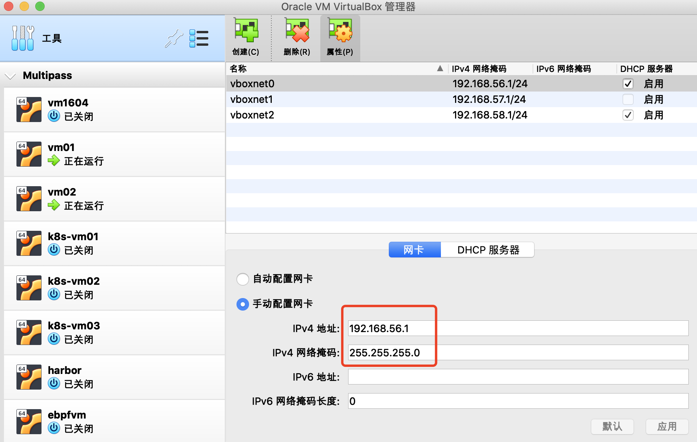
	- 网络`vboxnet0`添加DHCP
		- 
	- 网络`vboxnet0`的基本情况
		- 默认网关是: `192.168.56.1/24`
		- DHCP地址是: `192.168.56.100/24`
		- 地址范围是: `192.168.56.101` ~ `192.168.56.254`


# 如何构建LAN


安装虚拟机(使用multipass的jammy版本, ubuntu 22.04, 对应的内核版本是5.15)
```bash
# 安装vm01
multipass launch --mem 8G --disk 24G --cpus 2 --network en0  --network name=bridge0,mode=manual --network name=bridge0,mode=manual --name vm01
# 登录vm01
multipass shell vm01
sudo -s
apt update


# 安装vm02
multipass launch --mem 8G --disk 24G --cpus 2 --network en0  --network name=bridge0,mode=manual --network name=bridge0,mode=manual --name vm02
# 登录vm02
multipass shell vm02
sudo -s
apt update


# 安装vm03
multipass launch --mem 8G --disk 24G --cpus 2 --network en0  --network name=bridge0,mode=manual --network name=bridge0,mode=manual --name vm03
# 登录vm03
multipass shell vm03
sudo -s
apt update
```


- 设置`vm01`的网络
	- 命令的含义: `multipass launch --mem 8G --disk 24G --cpus 2 --network en0  --network name=bridge0,mode=manual --network name=bridge0,mode=manual --name vm01`
		- 默认网络: 对应于`enp0s3`网卡，本机`multipass shell $name`访问虚拟机
			- 对应于virtualBox的NAT类型
		- `--network en0`: 对应于`enp0s8`网卡，接入到en0网络(wifi),用于访问外网
			- 对应于virtualBox的桥接网卡类型，桥接到en0
		- `--network name=bridge0,mode=manual`: 对应于enp0s9网卡，桥接到bridge0的网卡
			- 对应于virtualBox的桥接网卡类型，桥接到bridge0
		- `--network name=bridge0,mode=manual`: 对应于enp0s10网卡，桥接到bridge0的网卡
			- 对应于virtualBox的桥接网卡类型，桥接到bridge0
	- 使用`visualBox`查看vm01的网卡设置
		- 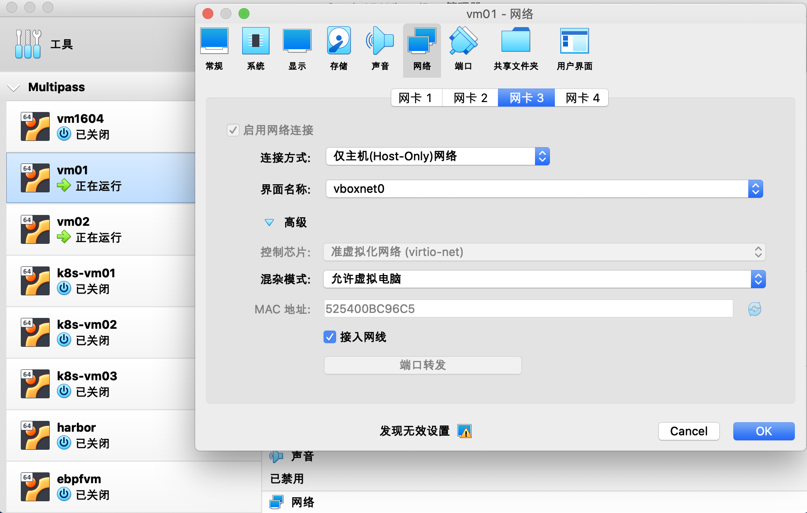
		- 网卡1对应`enp0s3`网卡，连接方式是`NAT`
		- 网卡2对应`enp0s8`网卡，连接方式是`桥接网卡`
		- 网卡3对应`enp0s9`网卡，连接方式是`HOST-ONLY`
		- 网卡4对应`enp0s10`网卡，连接方式是`桥接网卡`，暂不使用
	- 构建LAN: 基于`/etc/netplan`调整`vm01`的网卡配置`enp0s9`
		- `man netplan` : 查看使用文档
		- 备份: `/etc/netplan`目录下的文件先备份
			- `cp 50-cloud-init.yaml 50-cloud-init.yaml.backup`
		- netplan的样例: `https://netplan.io/examples`
		- `vm01`的netplan配置样例
			- 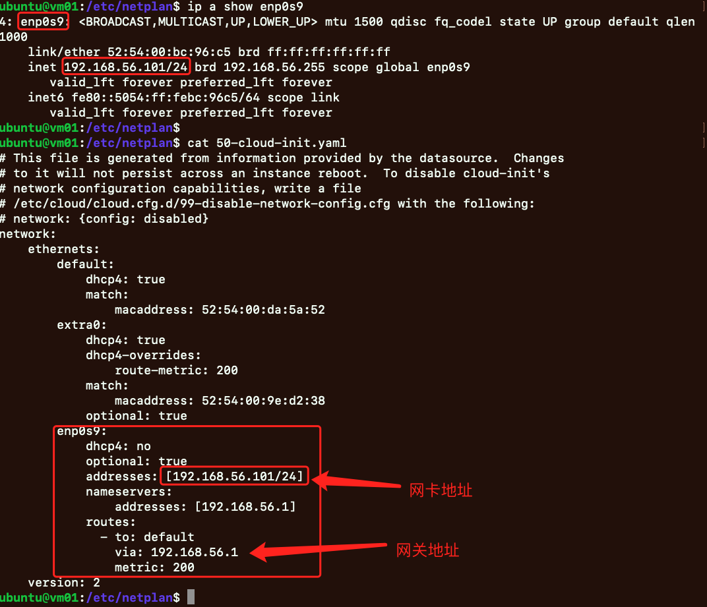
			- 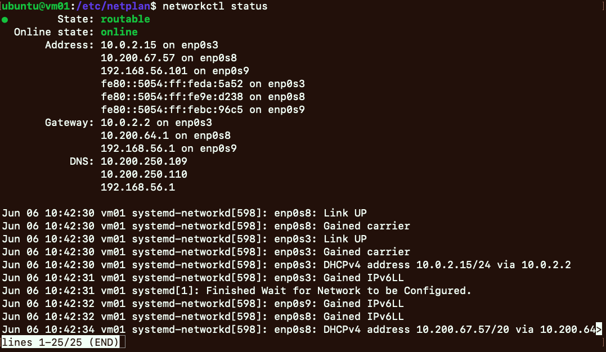
	- 常用命令
		- `netplan try` : 验证配置是否合适
		- `netplan apply` : 应用新的配置
		- `netplan get all` : 查看`netplan`配置 
		- `networkctl status` : 查看网络情况
		- `ip a`
		- `ip route`
- 同理，设置`vm02`的网络
	- 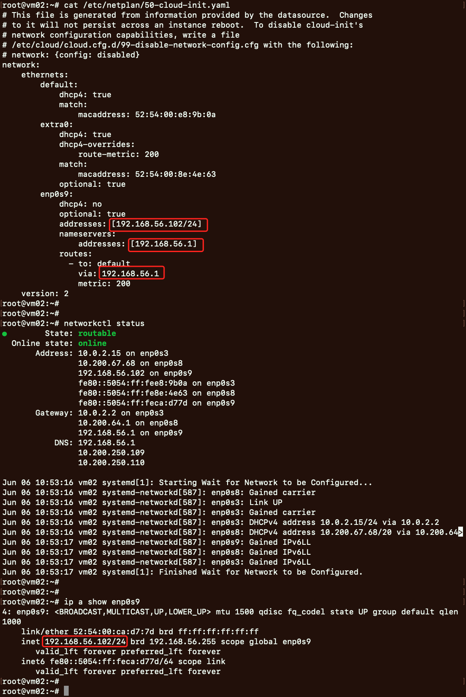
- 同理，设置`vm03`的网络
	- 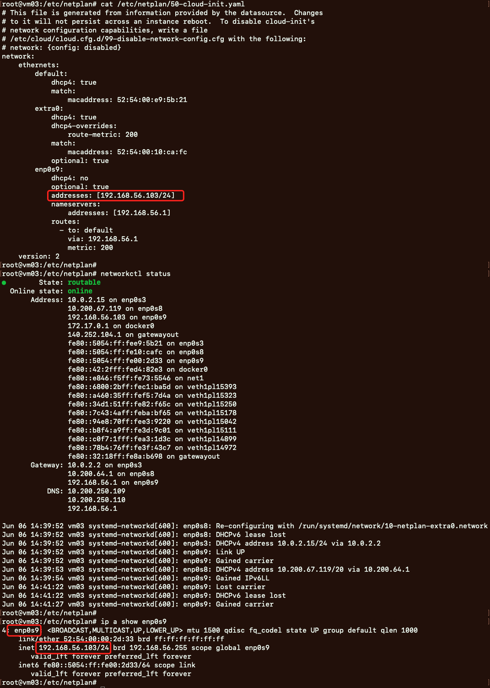


# 安装常用的网络工具


```bash
# 安装openvswitch工具
apt-get -y install openvswitch-common openvswitch-dbg openvswitch-switch openvswitch-ipsec openvswitch-pki openvswitch-vtep
# 安装brctl工具
apt-get -y install bridge-utils
# 安装arp工具
apt-get -y install iputils-arping
# 安装net-tools工具
apt-get -y install net-tools 
# 安装iproute2工具
apt-get install -y iproute2
# 安装traceroute工具
apt-get install -y iputils-tracepath traceroute
# 安装tcpdump工具
apt-get install -y tcpdump
# 安装其他常用工具
apt-get install -y curl telnet 
```


# 开启`openbsd-inetd`服务


```bash
# 安装openbsd-inetd
apt-get -y install openbsd-inetd 

# 修改配置
cat >> /etc/inetd.conf  <<EOF
discard     stream  tcp nowait  root    internal 
discard     dgram   udp wait    root    internal 
daytime     stream  tcp nowait  root    internal 
time        stream  tcp nowait  root    internal 
echo        stream  tcp nowait  root    internal
EOF

# 重启openbsd-inetd使配置生效
/etc/init.d/openbsd-inetd restart
/etc/init.d/openbsd-inetd status

# 查看已开启的服务端口
ss -nltp |grep inetd
```


- `openbsd-inetd`服务
	- 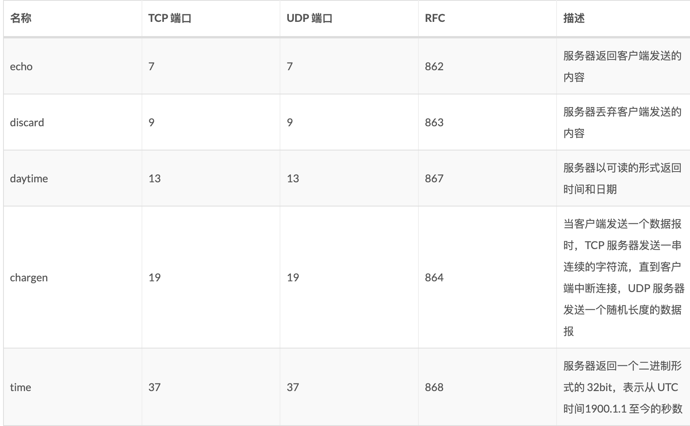
	- `vm01`上`openbsd-inetd`服务
		- 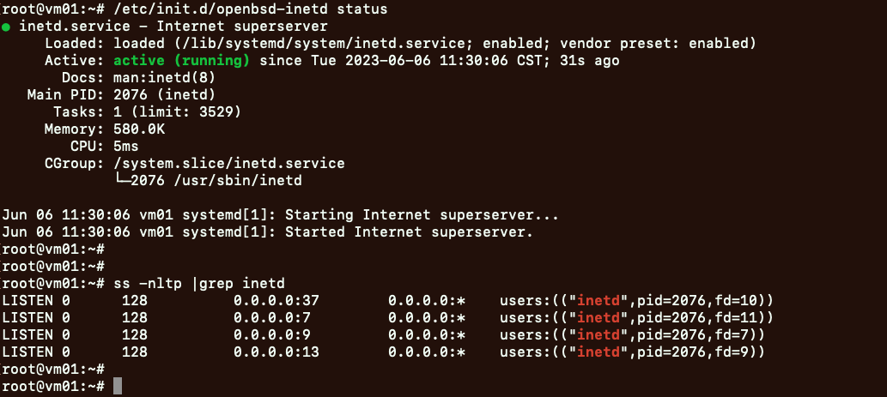
	- `vm02`上`openbsd-inetd`服务
		- 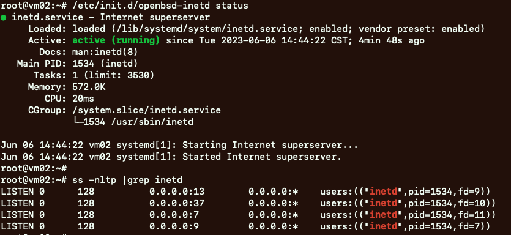
	- `vm03`上`openbsd-inetd`服务
		- 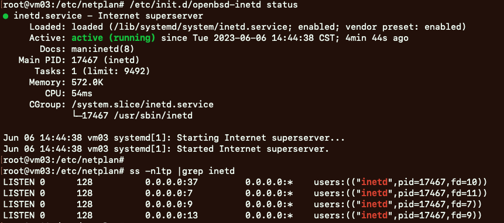


# 实验

- LAN网络联通性验证
	- 验证LAN网络联通情况:`vm01` and `vm02`
		- 在`vm01`机器上执行: `ping -c3 192.168.56.102 -i enp0s9`
			- 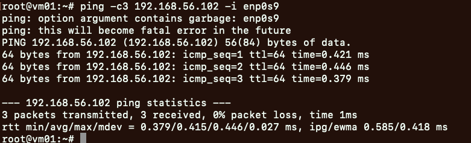
		- 在`vm01`机器上执行: `tcpdump -i enp0s9 src net 192.168.56.0/24 -en`
			- 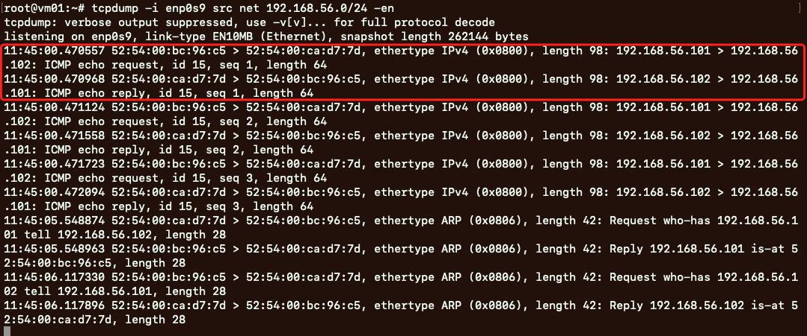
		- 在`vm02`机器上执行: `tcpdump -i enp0s9 src net 192.168.56.0/24 -en`
			- 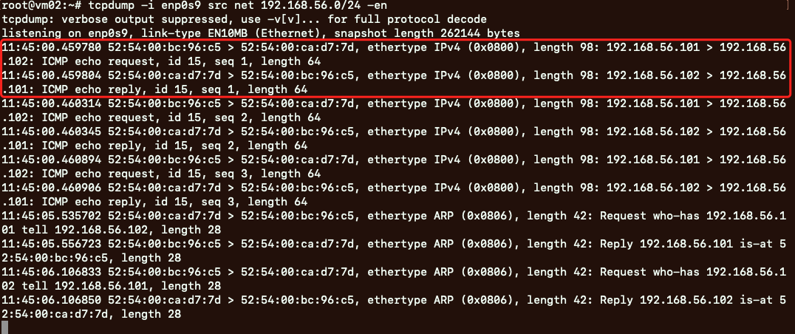
	- 验证LAN网络联通情况:`vm01` and `vm03`
		- 在`vm01`机器上执行: `ping -c3 192.168.56.103 -i enp0s9`
			- 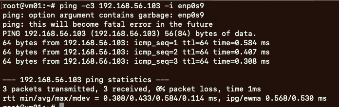
	- 验证LAN网络联通情况:`vm02` and `vm03`
		- 在`vm02`机器上执行: `ping -c3 192.168.56.103 -i enp0s9`
			- 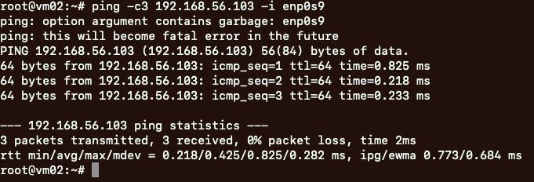


- LAN网络基于`openbsd-inetd`观察TCP消息的交互
	- 在`vm01`中执行: `telnet 192.168.56.102 discard`
		- 
	- 在`vm01`中执行: `tcpdump -i enp0s9 src net 192.168.56.0/24 -n`
		- 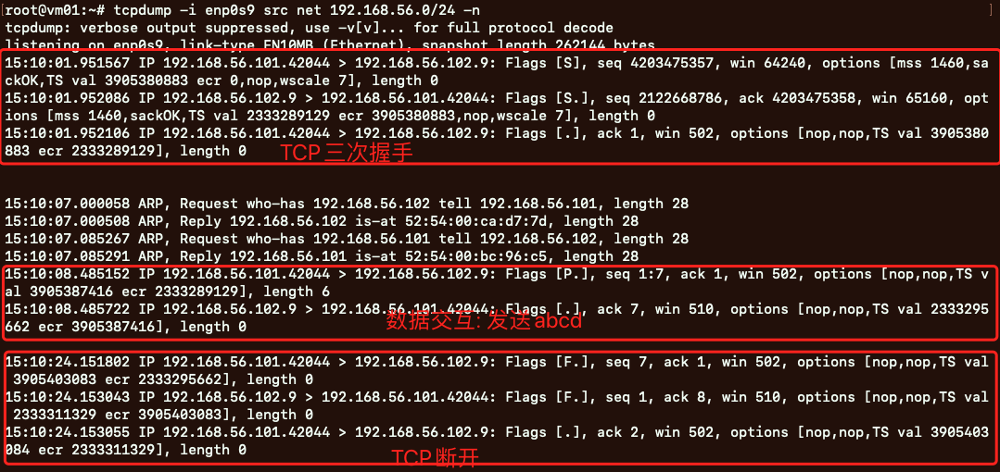
	- 在`vm02`中执行: `tcpdump -i enp0s9 src net 192.168.56.0/24 -n`
		- 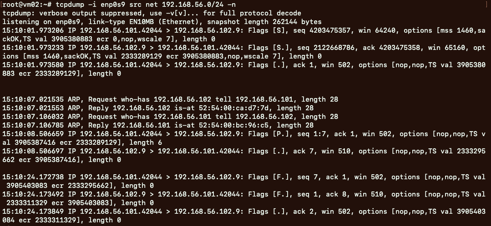


