# Linux veth
- `veth pair`
	- `veth`: Virtual Ethernet Device
	- `man veth`: 更详细的解释
	- `veth pair`是一种成对出现的特殊网络设备，它们像一根虚拟的网线，可用于连接两个`namespace`。
	- 向`veth pair`一端输入数据，在另一端就能读到此数据
	- `veth pair`和`patch port`都可以连接网桥，使用的时候如何选择呢？
		- `patch port`是`ovs bridge`自己特有的port类型，只能在ovs中使用。
		- 1）连接两个`ovs bridge`，优先使用`patch port`。技术上`veth pair`也能实现，但性能不如`patch port`。
		- 2）连接`ovs bridge`和`Linux Bridge`，只能使用`veth pair`。
		- 3）连接两个`Linux Bridge`，只能使用`veth pair`

# Linux Bridge
- Linux Bridge
	- Linux Bridge是Linux上用来做TCP/IP二层协议交换的设备
	- 其功能可以简单地理解为是一个二层交换机或者Hub。
	- 多个网络设备可以连接到同一个Linux Bridge，当某个设备收到数据包时，Linux Bridge会将数据转发给其他设备。
	- man 

# VLAN
- VLAN
	- LAN表示Local Area Network，本地局域网
		- 通常使用Hub(集线器)和Switch(交换机)来连接LAN中的计算机
		- 一般来说，两台计算机连入同一个Hub或者Switch时，它们就在同一个LAN中
		- 一个LAN表示一个广播域，其含义是：LAN中的所有成员都会收到任意一个成员发出的广播包
	- VLAN表示Virtual LAN
		- 一个带有VLAN功能的switch能够将自己的端口划分出多个LAN。
		- 计算机发出的广播包可以被同一个LAN中其他计算机收到，但位于其他LAN的计算机则无法收到。
		- VLAN的隔离是二层上的隔离
			- 指的是二层广播包（比如arp）无法跨越VLAN的边界。
			- 但在三层上（比如IP）是可以通过路由器让A和B互通的。
	- 通常交换机的端口有两种配置模式：Access和Trunk
		- 交换机的Access和Trunk
			- 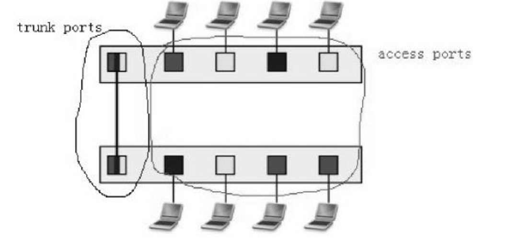
		- Access口
			- 这些端口被打上了VLAN的标签，表明该端口属于哪个VLAN
			- 不同VLAN用VLAN ID来区分，VLAN ID的范围是1～4096
			- Access口都是直接与计算机网卡相连的，这样从该网卡出来的数据包流入Access口后，就会被打上了所在VLAN的标签
			- Access口只能属于一个VLAN
		- Trunk口
			- 不同VLAN ID的数据包在通过Trunk口到达对方交换机的过程中始终带着自己的VLAN标签
		- VLAN设备总是以母子关系出现，母子设备之间是一对多的关系
			- 一个母设备（eth0）可以有多个子设备（eth0.10，eth0.20 ......），
			- 而一个子设备只有一个母设备
		- 常见的VLAN部署结构样例
			- 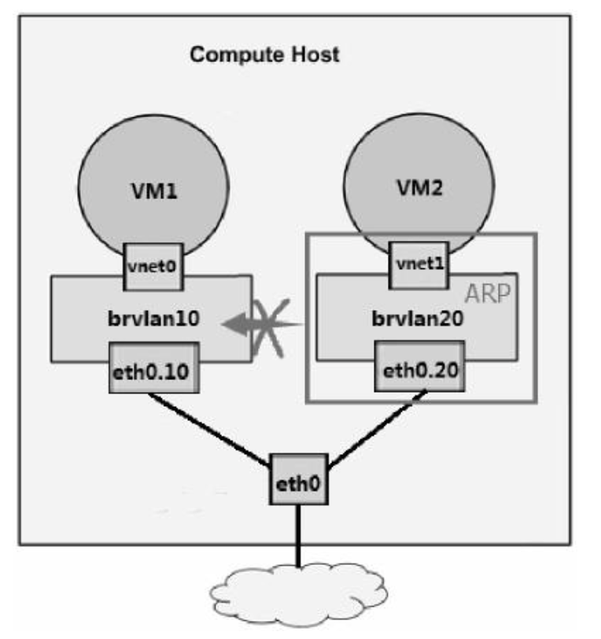

# Linux Network Namespace
- Linux Network Namespace
	- 在二层网络上，VLAN可以将一个物理交换机分割成几个独立的虚拟交换机。
	- 在三层网络上，Linux network namespace可以将一个物理三层网络分割成几个独立的虚拟三层网络。
		- 每个namespace都有自己独立的网络栈，包括route table，firewall rule，network interface device等
		- 通过namespace为每个network提供独立的DHCP和路由服务，从而允许租户创建重叠的网络
	- root namespace
		- 宿主机本身也有一个namespace，叫root namespace，拥有所有物理和虚拟interface device
		- 物理interface只能位于root namespace
	- 新创建的namespace默认只有一个loopback device
		- 可以将虚拟interface，例如bridge、tap等设备添加到某个namespace
		- veth pair是一种成对出现的特殊网络设备，它们像一根虚拟的网线，可用于连接两个namespace。向veth pair一端输入数据，在另一端就能读到此数据。

# Linux Bridge + VLAN = 虚拟交换机
- Linux Bridge + VLAN = 虚拟交换机
	- KVM的网络虚拟化
	- 物理交换机存在多个VLAN，每个VLAN拥有多个端口
		- 同一VLAN端口之间可以交换转发，
		- 不同VLAN端口之间隔离。
		- 所以交换机包含两层功能：交换与隔离
	- Linux的VLAN设备实现的是隔离功能，但没有交换功能
		- 一个VLAN母设备（比如eth0）不能拥有两个相同ID的VLAN子设备，因此也就不可能出现数据交换情况
	- Linux Bridge专门实现交换功能
		- 将同一VLAN的子设备都挂载到一个Bridge上，设备之间就可以交换数据了。
	- 总结起来，Linux Bridge加VLAN在功能层面完整模拟现实世界里的二层交换机。
		- eth0相当于虚拟交换机上的trunk口，允许vlan10和vlan20的数据通过。
		- eth0.10，vnet0和brvlan10都可以看着vlan10的access口。
		- eth0.20，vnet1和brvlan20都可以看着vlan20的access口。

# Linux TUN/TAP Device
- Linux TUN/TAP device
	- TAP等同于一个**以太网设备**，它操作第二层数据包如以太网数据帧。
	- TUN模拟了**网络层设备**，操作第三层数据包比如IP数据封包。
	- 在计算机网络中，TUN与TAP是操作系统内核中的虚拟网络设备。
		- 这些虚拟的网络设备全部用软件实现
			- 并向运行于操作系统上的软件提供与硬件的网络设备完全相同的功能
		- 操作系统通过TUN/TAP设备向绑定该设备的用户空间的程序发送数据，反之，用户空间的程序也可以像操作硬件网络设备那样，通过TUN/TAP设备发送数据。
			- 在后种情况下，TUN/TAP设备向操作系统的网络栈投递（或“注入”）数据包，从而模拟从外部接受数据的过程。
	- Tap/Tun的工作原理
		- Tun虚拟设备和物理网卡的区别是Tun虚拟设备是IP层设备，从/dev/net/tun字符设备上读取的是IP数据包，写入的也只能是IP数据包，因此不能进行二层操作，如发送ARP请求和以太网广播。
		- 与之相对的是，Tap虚拟设备是以太网设备，处理的是二层以太网数据帧，从/dev/net/tun字符设备上读取的是以太网数据帧，写入的也只能是以太网数据帧。从这点来看，Tap虚拟设备和真实的物理网卡的能力更接近。
	- 应用程序如何操作Tun/Tap
		- Linux Tun/Tap驱动程序为应用程序提供了两种交互方式：
			- 虚拟网络接口和字符设备/dev/net/tun
				- 写入字符设备/dev/net/tun的数据会发送到虚拟网络接口中；
				- 发送到虚拟网络接口中的数据也会出现在该字符设备上
			- 应用程序可以通过标准的Socket API向Tun/Tap接口发送IP数据包，就好像对一个真实的网卡进行操作一样
				- 除了应用程序以外，操作系统也会根据TCP/IP协议栈的处理向Tun/Tap接口发送IP数据包或者以太网数据包，例如ARP或者ICMP数据包。
				- Tun/Tap驱动程序会将Tun/Tap接口收到的数据包原样写入到/dev/net/tun字符设备上，处理Tun/Tap数据的应用程序可以从该设备上读取到数据包，以进行相应处理
		- 应用程序也可以通过/dev/net/tun字符设备写入数据包，这种情况下该字符设备上写入的数据包会被发送到Tun/Tap虚拟接口上，进入操作系统的TCP/IP协议栈进行相应处理，就像从物理网卡进入操作系统的数据一样
	- TUN/TAP 使用样例解读
		- 使用Tun/Tap创建点对点隧道
			- 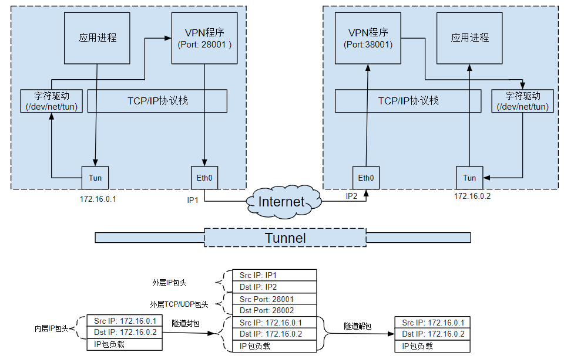
			- 上图中的隧道也可以采用Tap虚拟设备实现。使用Tap的话，隧道的负载将是以太数据帧而不是IP数据包，而且还会传递ARP等广播数据包。
				- 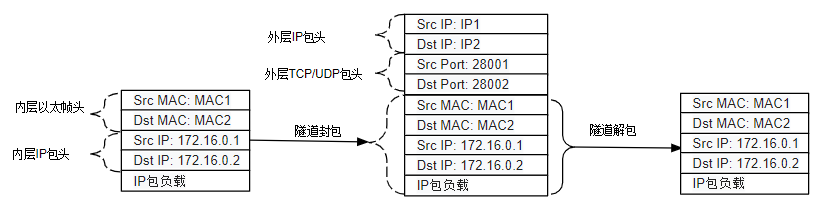
		- 使用Tun/Tap隧道绕过防火墙
			- 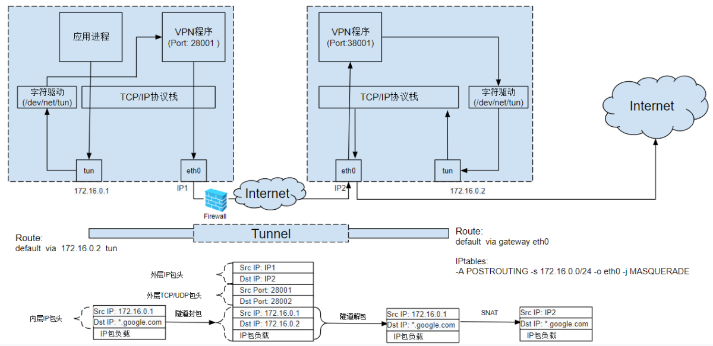
		- 使用Tap隧道桥接两个远程站点
			- 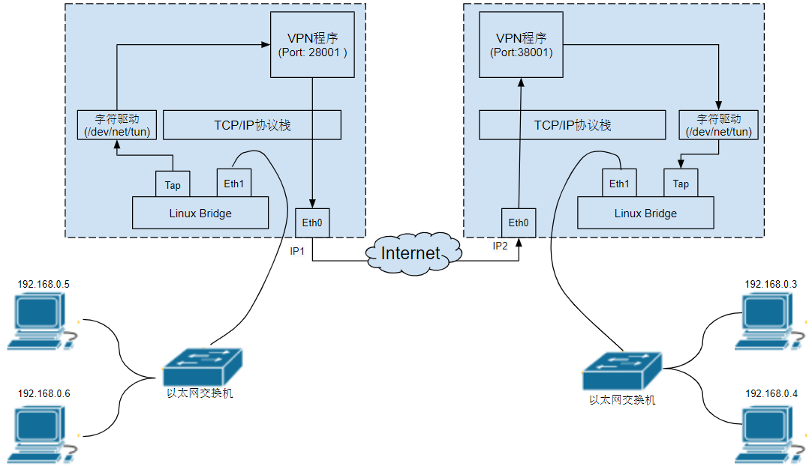
			- 假设192.168.0.5发出了一个对192.168.0.3的ARP请求，该ARP请求在网络中经过的路径如下
				- 1. 192.168.0.5发出ARP请求，询问192.168.0.3的MAC地址。
				- 2. 该ARP请求将被发送到以太网交换机上。
				- 3. 以太网交换机对该请求进行泛洪，发送到其包括Eth1在内的所有端口上。
				- 4. 由于Eth1被加入了VPN主机上的Linux Bridge，因此Linux Bridge收到该ARP请求。
				- 5. Linux Bridge对该ARP请求进行泛洪，发送到连到其上面的Tap虚拟网卡上。
				- 6. VPN程序通过/dev/net/tun字符设备读取到该ARP请求，然后封装到TCP/UDP包中，发送到对端站点的V主机
				- 7. 对端站点的VPN程序通过监听TCP/UDP端口接收到封装的ARP请求，将ARP请求通过/dev/net/tun字符设备写入到Tap设备中
				- 8. Linux Bridge泛洪，将ARP请求发送往Eth1，由于Eth1连接到了以太网交换机上，以太网交换机接收到了该ARP请求
				- 9. 以太网交换机进行泛洪，将ARP请求发送给了包括192.168.0.3的所有主机
				- 10. 192.168.0.3收到了APR请求，判断iP地址和自己相同，对此请求进行响应
				- 11. 同理，ARP响应包也可以按照该路径返回到图左边包括192.168.0.5在内的站点中
		- OpenVPN TAP vs TUN: What’s The Difference
			- In the case of VPNs, TAP is used to carry Ethernet frames and for bridging and TUN is used to carry IP packets (routing). 
			- It is worth noting that TUN/TAP devices are only used by certain VPN protocols (such as OpenVPN and WireGuard) and not others (such as IKEv2)

# Linux Bridge环境中的各种网络设备
- Linux Bridge环境中的各种网络设备
	- 在Linux Bridge环境中，一个数据包从instance发送到物理网卡会经过下面几个类型的设备：
		- Tap interface
		- Linux Bridge
		- vlan interface: 会在vlan网络中使用
		- vxlan interface: 会在vxlan网络中使用
		- 物理interface
	- linux-bridge支持local、flat、vlan和vxlan四种network type，目前不支持gre
		- Linux Bridge如何实现每种network type
		- local network
	- local network
		- local network的示例
			- 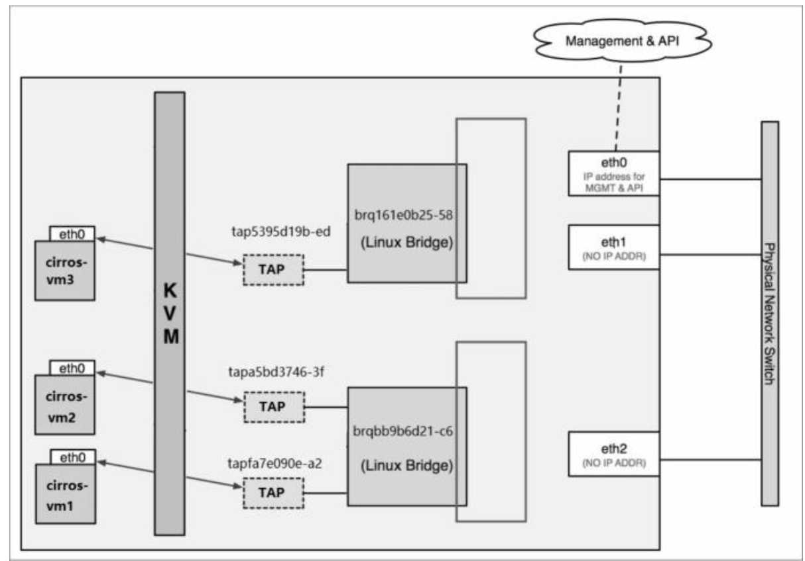
			- 创建了两个local network，分别对应两个网桥brqXXXX和brqYYYY。
			- VM0和VM1通过tap0和tap1连接到brqXXXX。
			- VM2通过tap0和tap2连接到brqYYYY。
			- VM0与VM1在同一个local network中，它们之间可以通信。
			- VM2位于另一个local network，由于brqXXXX和brqYYYY没有联通，所以VM2无法与VM0和VM1通信。
		- Local Network的特点
			- 不会与宿主机的任何物理网卡相连，instance无法与宿主机之外的网络通信
			- 不关联任何的VLAN ID
			- 对于每个local netwrok, 位于同一个local network的instance会连接到相同的bridge，这样instance之间就可以通信
			- 每个local network有自己的bridge，bridge之间是没有连通的，所以两个local network之间也不能通信，即使它们位于同一宿主机上
	- flat network
		- flat_network网络结构示例
			- 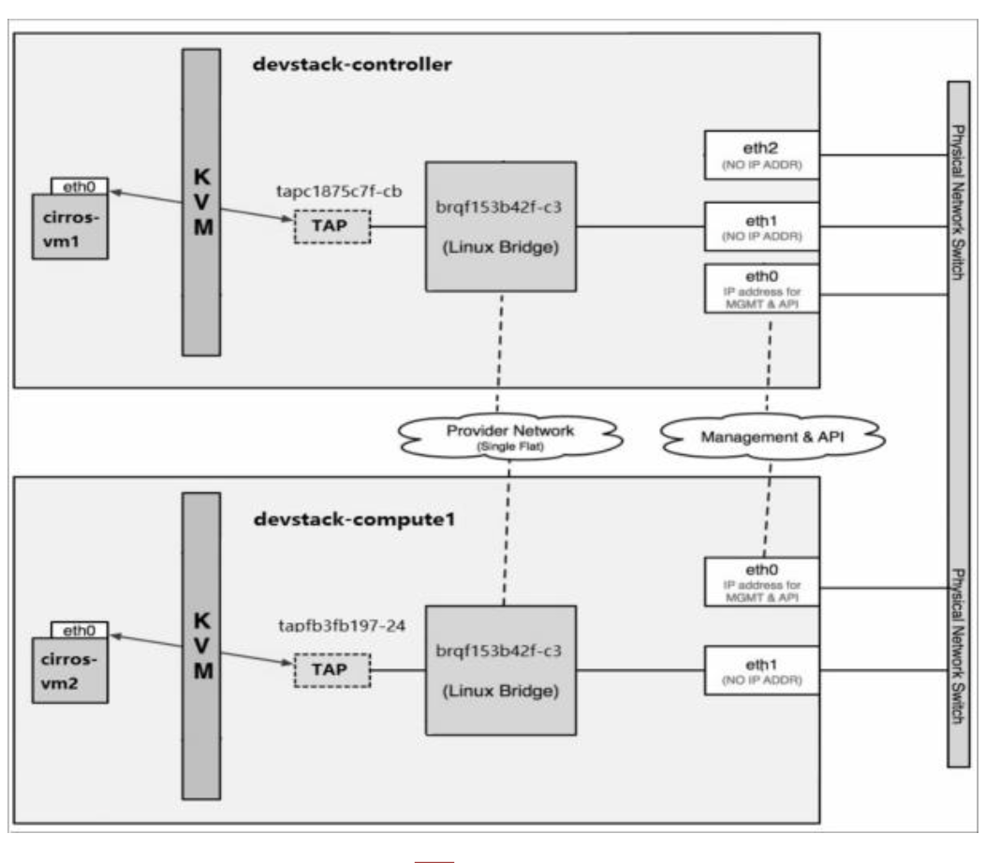
			- 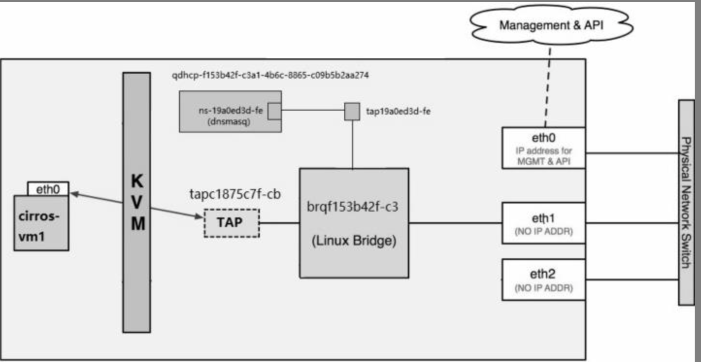
			- 隔离的dnsmasq服务为flat network提供的DHCP服务
				- Linux Network Namespace 隔离了 `qdhcp-f153b42f-c3a1-4b6c-8865-c09b5b2aa274`，上面运行了`dnsmasq服务`
				- flat_net的DHCP设备`tap19a0ed3d-fe`，放到`qdhcp-f153b42f-c3a1-4b6c-8865-c09b5b2aa274`中。
					- `tap19a0ed3d-fe`与`ns-19a0ed3d-fe`就是一对veth pair，它们将`qdhcp-f153b42f-c3a1-4b6c-8865-c09b5b2aa274`连接到`brqf153b42f-c3`
			- instance如何从dnsmasq获取IP
				- 在创建instance时，分配的MAC和IP地址信息会先同步更新到dnsmasq的host文件
				- cirros-vm1开机启动，发出DHCPDISCOVER广播，该广播消息在整个flat_net中都可以被收到。
				- 广播到达veth `tap19a0ed3d-fe`，然后传送给veth pair的另一端`ns-19a0ed3d-fe`
				- 广播到达veth `tap19a0ed3d-fe`，然后传送给veth pair的另一端`ns-19a0ed3d-fe`
				- dnsmasq在`ns-19a0ed3d-fe`上面监听，dnsmasq检查其host文件，发现有对应项，于是dnsmasq以DHCPOFFER消息将IP（172.16.1.103）、子网掩码（255.255.255.0）、地址租用期限等信息发送给cirros-vm1
				- cirros-vm1发送DHCPREQUEST消息确认接受此DHCPOFFER
				- dnsmasq发送确认消息DHCPACK，整个过程结束
			- cirros-vm1（172.16.1.3）与cirros-vm2（172.16.1.4）位于不同节点，通过flat_net相连，在cirros-vm1控制台中执行ping 172.16.1.104
		- flat network是不带tag的网络，要求宿主机的物理网卡直接与Linux Bridge连接
			- 每个flat network都会独占一个物理网卡
			- 因为flat网络与物理网卡一一对应，一般情况下租户网络不会采用flat
		- DHCP服务
			- dnsmasq是一个提供DHCP和DNS服务的开源软件
			- dnsmasq与network是一对一关系，一个dnsmasq进程可以为同一netowrk中所有enable了DHCP的subnet提供服务
			- 用Linux Network Namespace隔离dnsmasq服务
				- 在三层网络上，Linux network namespace可以将一个物理三层网络分割成几个独立的虚拟三层网络。每个namespace都有自己独立的网络栈，包括route table，firewall rule，network interface device等
				- 通过namespace为每个network提供独立的DHCP和路由服务，从而允许租户创建重叠的网络。如果没有namespace，网络就不能重叠，这样就失去了很多灵活性			
	- vlan network
		- vlan_network网络结构示例
			- 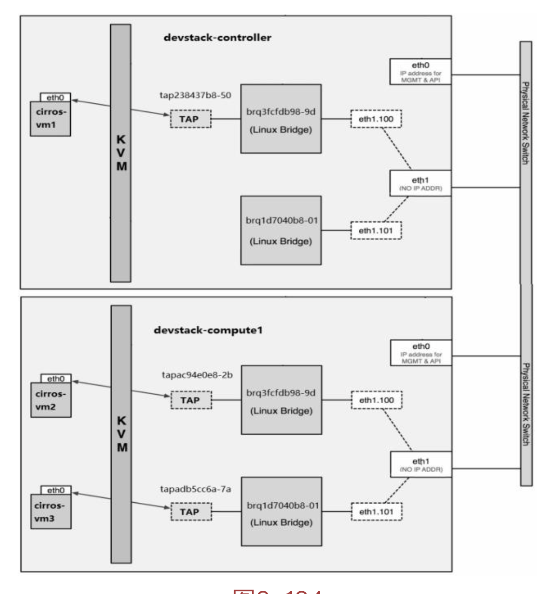
			- cirros-vm1属于vlan100。
			- cirros-vm2属于vlan100。
			- cirros-vm3属于vlan101。
			- cirros-vm1与cirros-vm2都在vlan100，它们之间能通信。
			- cirros-vm3在vlan101，不能与cirros-vm1和cirros-vm2通信。
			- 那怎么样才能让vlan100与vlan101中的instance通信呢？二层vlan是不行的，只能在三层通过路由器转发
		- vlan network是带tag的网络
	- Routing
		- 路由服务提供跨subnet互联互通功能
			- [Linux route、ip route、ip rule简介](https://blog.csdn.net/zhongmushu/article/details/108220232)
			- 路由选择的评估过程
				- 当TCP/IP需要向某个IP地址发起通信时，会对路由表进行评估，以确定如何发送数据包
				- 评估过程:
					- ![[attachments/路由选择的评估过程.png]]
			- Routing Table
				- 255 local: 保存`本地路由`和`广播路由`，有**系统维护**
				- 254 main: 所有没有指明路由表的路由保存在该表
				- 253 default: 是一个空表,为一些后续处理保留
				- 0 unspec : 系统保留表
				- `cat /etc/iproute2/rt_tables`
					- 路由表序号和表名对应关系
			- 路由表项
				- `route -n`: 输出项说明
					- 帮助命令: `man route`
					- **Destination**: The destination network or destination host
						- 目标网络或目标主机
					- **Gateway**: he gateway address or \'\*\' if none set
						- 网关地址或"\*"(如果未设置)
					- **Genmask**: The netmask for the destination net
						- 目标网络的网络掩码
							- '255.255.255.255' for a host destination 
								- '255.255.255.255' 为主机
							- '0.0.0.0' for the **default** route.
								- '0.0.0.0' 为默认路由
					- **Flags**
						- U (route is up)
						- H (target is a host): 主机路由
						- G (use gateway): 网关路由
						- R (reinstate route for dynamic routing)
							- 恢复动态路由产生的表项
						- D (dynamically installed by daemon or redirect)
							- 由路由的后台程序动态创建
						- M (modified from routing daemon or redirect)
							- 由路由的后台程序修改
						- A (installed by addrconf)
						- C (cache entry)
						- !  (reject route)
							- 阻塞路由
					- **Metric**: The 'distance' to the target (usually counted in hops)
						- 路由距离，到达指定网络所需要的跳跃数
					- **Ref**: Number of references to this route. (Not used in the Linux kernel.)
						- 使用此路由的活动进程个数(linux kernel未使用)
					- **Use**: Count of lookups for the route.
					- **Iface**:  Interface to which packets for this route will be sent
						- 该路由项对应的输出接口
					- **MSS**: Default maximum segment size for TCP connections over this route
					- **Window**: Default window size for TCP connections over this route.
					- **irtt**: Initial RTT (Round Trip Time). 
						- The kernel uses this to guess about the best TCP protocol parameters without waiting on (possibly slow) answers.
			- 静态路由的操作
				- `route [add|del [-net|-host] target [netmask Nm] [gw Gw] [metric N] [mss M] [window W] [irtt I] [reject] [mod] [dyn] [reinstate]    [[dev] If]`
				- add: 添加路由
				- del: 删除路由
				- -net: 目标是一个网络
				- -host: 目标是一个主机
				- target: 目标网络或主机，可以是IP地址或网络主机名
				- netmask Nm: 添加网络路由时用到的网络掩码
					- netmask匹配的位数越高，该条路由匹配时的优先级也越高
				- gw GW: 指定通过网关路由，后面接网关地址
				- metric M: 设置路由的metric字段(路由跳数)
					- 用在路由表里存在多个路由选择与转发包中的目标地址最为匹配的路由
					- 所选的路由具有最少得跳跃数，故Metric值越小，优先级越高
				- dev if: 指定网络接口发送数据
			- iproute2
				- 帮助命令: `man ip-route`
				- 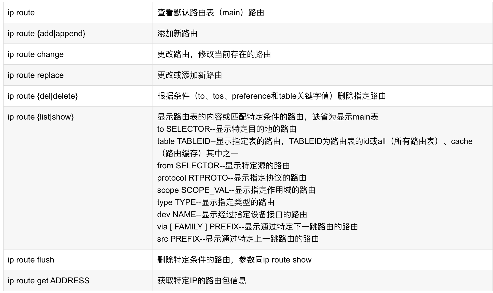
				- 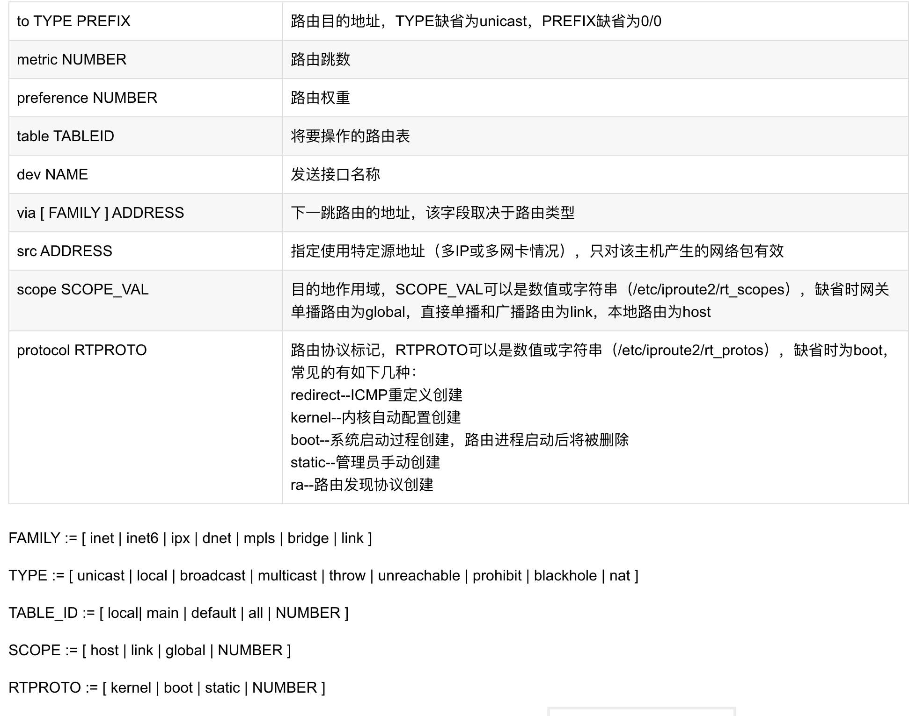
				- 
			- ip rule
				- 策略路由规则，帮助命令: `man ip-rule`
				- Linux系统在启动时，内核会为路由策略数据库配置三条缺省的规则
				- 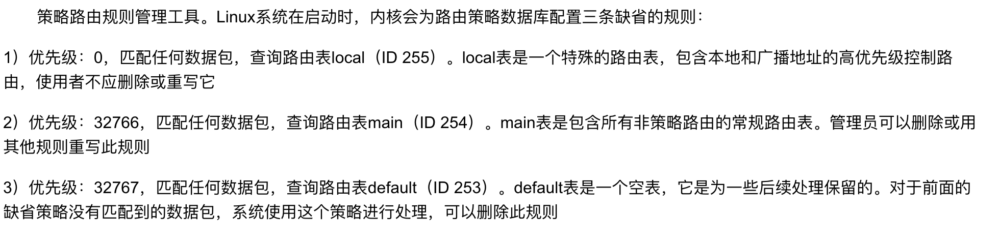
				- 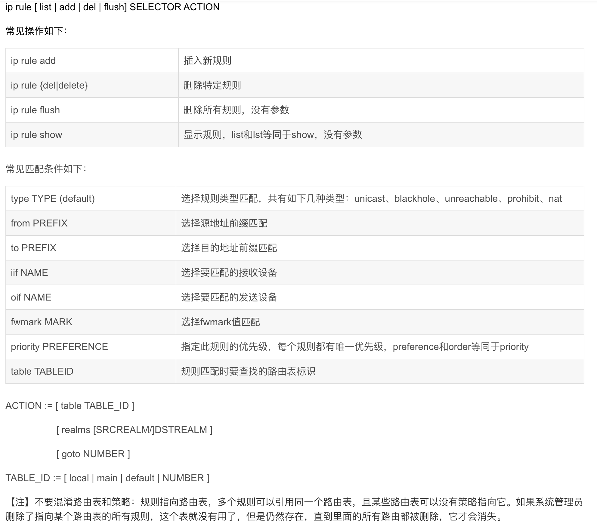
		- 物理router
			- 物理router的示例
				- 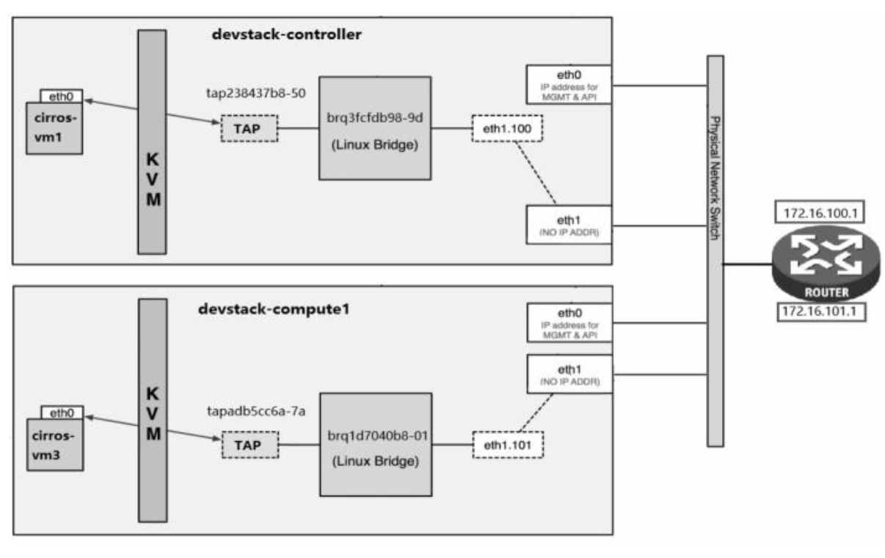
				- 172.16.100.1对应vlan100的网关，172.16.101.1对应vlan101的网关
				- 当cirros-vm1要跟cirros-vm3通信时，数据包的流向是这样的：
					- （1）因为cirros-vm1的默认网关指向172.16.100.1，cirros-vm1发送到cirros-vm3的数据包首先通过vlan100的interface进入物理router。
					- （2）router发现目的地址是172.16.101.1，则从vlan101的interface发出。
					- （3）数据包经过brq1d7040b8-01最终到达cirros-vm3。
		- 虚拟router
			- 虚拟router的路由机制与物理router一样，只是由软件实现，为subnet提供路由服务
			- 虚拟router示例
				- 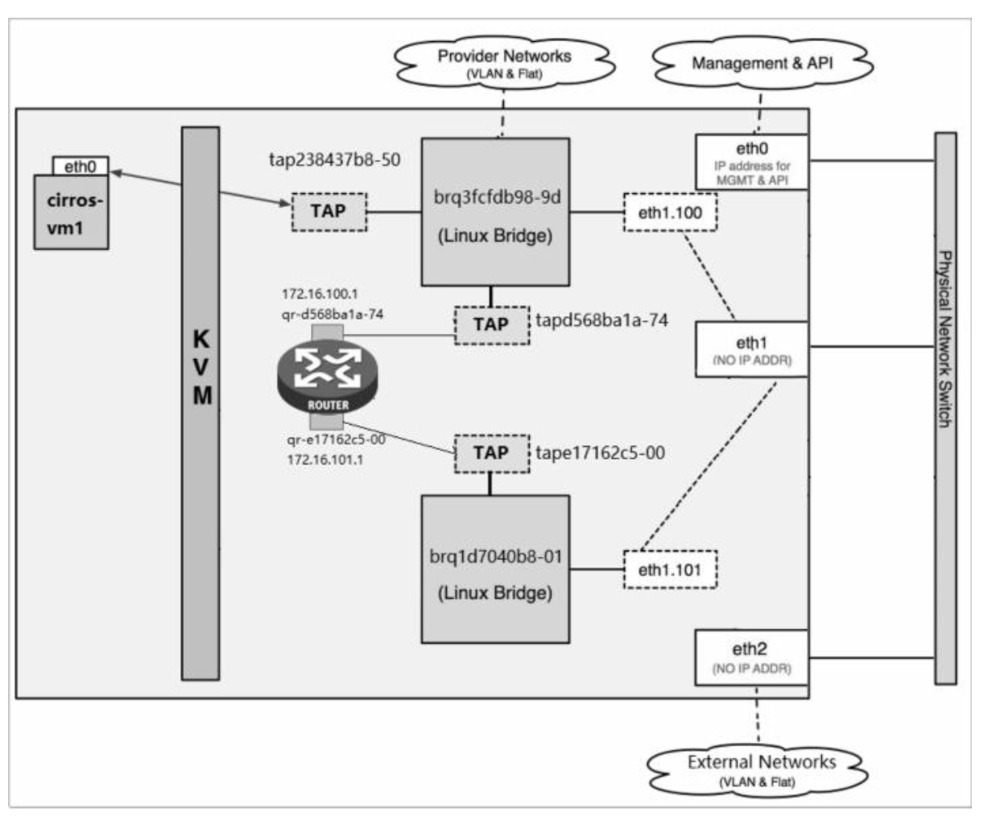
				- ROUTER在单独的namespace，使得每个router有自己的路由表，而且不会与其他router冲突，能很好地支持网络重叠(多租户网络)
			- 虚拟router访问外网示例
				- 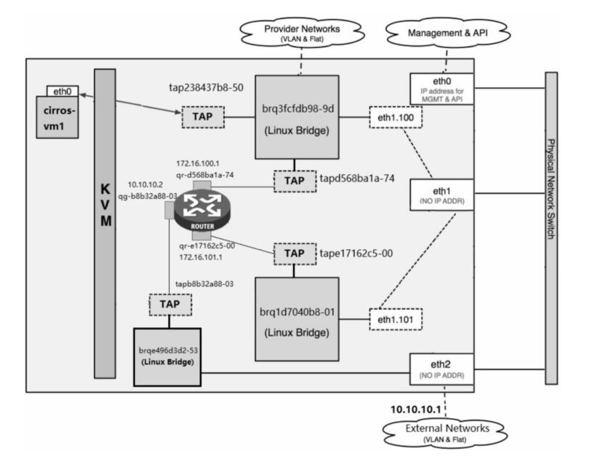
				- cirros-vm3Ping到ext_net网关10.10.10.1, 数据包经过两跳到达10.10.10.1网关。
					- （1）数据包首先发送到router_100_101连接vlan101的interface（172.16.101.1）。
					- （2）然后通过连接ext_net的interface（10.10.10.2）转发出去，最后到达10.10.10.1。
					- Source NAT
						- 当数据包从router连接外网的接口qg-b8b32a88-03发出的时候，会做一次Source NAT，即将包的源地址修改为router的接口地址10.10.10.2，这样就能够保证目的端能够将应答的包发回给router，然后再转发回源端instance。
						- SNAT让instance能够直接访问外网，但外网还不能直接访问instance，因为instance没有外网IP。
				- 
			- 虚拟router时使用floating IP从外网直接访问instance
				- 需要从外网直接访问instance，可以利用floating IP。
					- floating IP提供静态NAT功能，建立外网IP与instance租户网络IP的一对一映射。
					- floating IP是配置在router提供网关的外网interface上的
					- router会根据通信的方向修改数据包的源或者目的地址
	- vxlan network
		- overlay network是指建立在其他网络上的网络。
			- 该网络中的节点可以看作通过虚拟（或逻辑）链路连接起来的。
			- overlay network在底层可能由若干物理链路组成，但对于节点，不需要关心这些底层实现。
			- 例如P2P网络就是overlay network，隧道也是。vxlan和gre都是基于隧道技术实现的，它们也都是overlay network。
			- 目前Linux Bridge只支持vxlan，不支持gre。Open Vswitch两者都支持。
			- vxlan与gre实现非常类似，而且vxlan用得较多。
		- VXLAN全称Virtual eXtensible Local Area Network
			- VXLAN提供与VLAN相同的以太网二层服务，但是拥有更强的扩展性和灵活性
			- VXLAN是将二层建立在三层上的网络
			- VXLAN是一种在现有物理网络设施中支持大规模多租户网络环境的解决方案
			- VXLAN的传输协议是IP + UDP 
			- 与VLAN相比，VXLAN有下面几个优势
				- 支持更多的二层网段
					- VLAN使用12-bit标记VLAN ID，最多支持4094个VLAN，这对于大型云部署会成为瓶颈。
					- VXLAN的ID（VNI或者VNID）则用24-bit标记，支持16777216个二层网段。
				- 能更好地利用已有的网络路径
					- VLAN使用Spanning Tree Protocol避免环路，这会导致有一半的网络路径被block掉。
					- VXLAN的数据包是封装到UDP通过三层传输和转发的，可以使用所有的路径。
				- 避免物理交换机MAC表耗尽
					- 由于采用隧道机制，TOR (Top on Rack)交换机无须在MAC表中记录虚拟机的信息
		- vxlan资料补充
			- 什么是VXLAN
				- 为什么需要VXLAN
					- 虚拟机动态迁移，要求提供一个无障碍接入的网络
						- 什么是服务器虚拟化技术？
						- 什么是虚拟机动态迁移？
						- VXLAN如何满足虚拟机动态迁移时对网络的要求？
					- 数据中心租户数量激增，要求提供一个可隔离海量租户的网络
				- VXLAN与VLAN之间有何不同
				- VXLAN隧道是如何建立的
					- 什么是VXLAN中的VTEP和VNI
						- 什么是VXLAN VTEP
						- 什么是VXLAN VNI
					- 哪些VTEP之间需要建立VXLAN隧道
						- 什么是“同一大二层域”
						- 如何确定报文属于哪个BD
							- 哪些报文要进入VXLAN隧道
							- 将二层子接口加入BD
				- VXLAN网关有哪些种类
					- VXLAN二层网关与三层网关
					- VXLAN集中式网关与分布式网关
						- VXLAN集中式网关
						- VXLAN分布式网关
				- VXLAN网络中报文是如何转发的
					- 集中式VXLAN中同子网互通流程
						- ARP请求报文转发流程
						- ARP应答报文转发流程
					- 集中式VXLAN中不同子网互通流程
						- 网关的MAC地址学习的过程
							- ARP请求报文转发流程
							- ARP应答报文转发流程
						- 数据报文的转发流程
		- VXLAN封装和包格式
			- VXLAN定义了一个MAC-in-UDP的封装格式
				- 在原始的Layer 2网络包前加上VXLAN header，然后放到UDP和IP包中。
				- 通过MAC-in-UDP封装，VXLAN能够在Layer 3网络上建立起了一条Layer 2的隧道。
			- VXLAN包的格式
				- 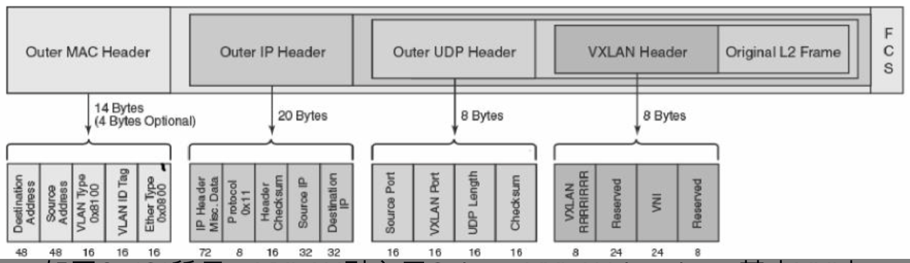
				- VXLAN引入了8-byte VXLAN header，其中VNI占24-bit。
				- VXLAN和原始的L2 frame被封装到UDP包中。
				- 这24-bit的VNI用于标示不同的二层网段，能够支持16777216个LAN
		- VXLAN Tunnel Endpoint (VTEP)
			- VXLAN使用VXLAN tunnel endpoint (VTEP)设备处理VXLAN的封装和解封
			- 每个VTEP有一个IP interface，配置了一个IP地址。
				- VTEP使用该IP封装Layer 2 frame，
				- 并通过该IP interface传输和接收封装后的VXLAN数据包。
			- VTEP示意图
				- 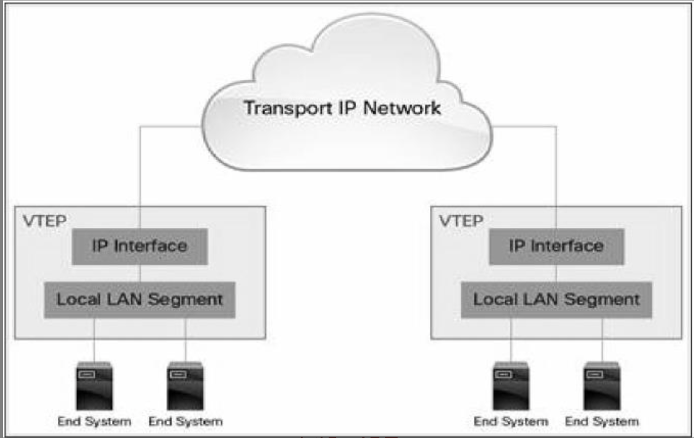
			- VXLAN独立于底层的网络拓扑，反过来，两个VTEP之间的底层IP网络也独立于VXLAN。
			- VXLAN数据包是根据外层的IP header路由的，该header将两端的VTEP IP作为源和目标IP
		- VXLAN包转发流
			- VXLAN在VTEP间建立隧道，通过Layer 3网络传输封装后的Layer 2数据
			- VXLAN包转发流示意图
				- 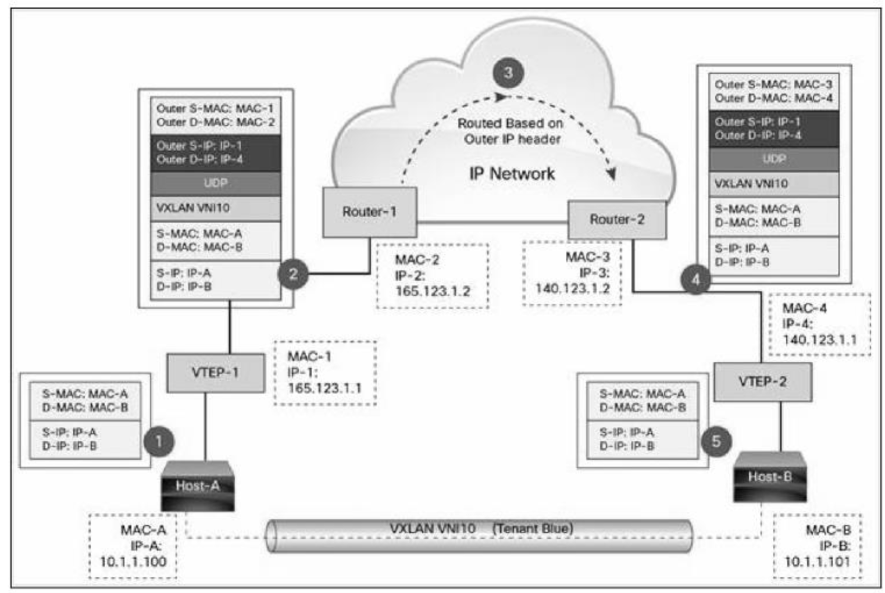
				- Host-A和Host-B位于VNI 10的VXLAN，通过VTEP-1和VTEP-2之间建立的VXLAN隧道通信。数据传输过程如下：
					- 1）Host-A: Host-A向Host-B发送数据时
						- Host-B的MAC和IP作为数据包的目标MAC和IP，
						- Host-A的MAC作为数据包的源MAC和IP，
						- 然后通过VTEP-1将数据发送出去。
					- 2) VTEP-1转发数据
						- VTEP-1从自己维护的映射表中找到MAC-B对应的VTEP-2，
						- 然后执行VXLAN封装，加上VXLAN头，UDP头，以及外层IP和MAC头。
						- 此时的外层IP头，目标地址为VTEP-2的IP，源地址为VTEP-1的IP。
						- 同时由于下一跳是Router-1，所以外层MAC头中目标地址为Router-1的MAC。
					- 3) 外部网络的路由器
						- 数据包从VTEP-1发送出去后，外部网络的路由器会依据外层IP头进行包路由，
						- 最后到达与VTEP-2连接的路由器Router-2。
					- 4) VTEP-2接受数据包
						- Router-2将数据包发送给VTEP-2。
						- VTEP-2负责解封数据包，依次去掉外层MAC头，外层IP头，UPD头和VXLAN头。
						- VTEP-2依据目标MAC地址将数据包发送给Host-B。
			- VTEP是VXLAN的最核心组件，负责数据的封装和解封。隧道也是建立在VTEP之间的，VTEP负责数据的传送。
			- Linux对VXLAN的支持
				- VTEP可以由专有硬件来实现，也可以使用纯软件实现
				- 目前比较成熟的VTEP软件实现包括：
					- 带VXLAN内核模块的Linux
					- Open vSwitch
				- Linux支持VXLAN的示意图
					- 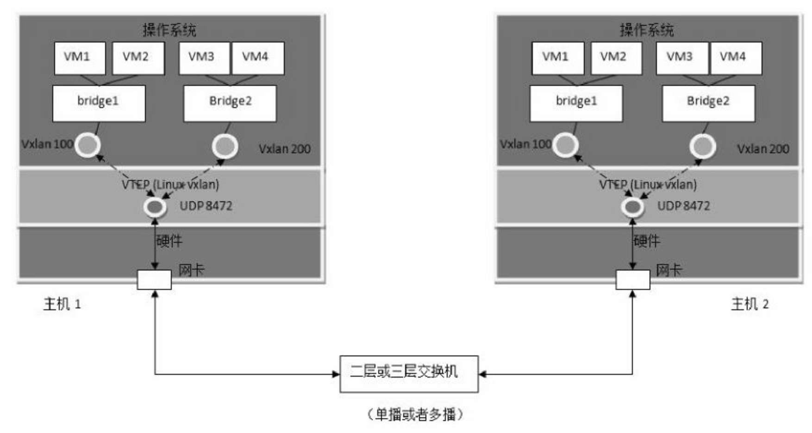
				- Linux支持VXLAN的实现方式：
					- Linux vxlan创建一个UDP Socket，默认在8472端口监听。
					- Linux vxlan在UDP socket上接收到vxlan包后，解包，
						- 然后根据其中的vxlan ID将它转给某个vxlan interface，
						- 然后再通过它所连接的linux bridge转给虚机。
					- Linux vxlan在收到虚机发来的数据包后，将其封装为多播UDP包，从网卡发出。

# 网络虚拟化的逻辑图

- 网络虚拟化
	- 逻辑图
		- 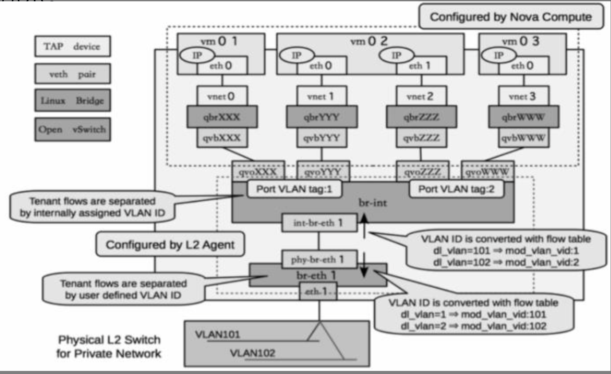
	- 设备和工具
		- veth pair
		- TUN/TAP device
		- Linux Bridge
		- Linux Network Namespace
		- Open vSwitch
		- IpTables
		- Linux route
		- VLAN
		- VXLAN

# 资料

- 参考资料
	- [veth-pair](https://www.cnblogs.com/bakari/p/10613710.html)
		- [Linux Switching – Interconnecting Namespaces](http://www.opencloudblog.com/?p=66)
		- [Linux虚拟网络设备之veth](https://segmentfault.com/a/1190000009251098)
	- [tap/tun](https://mp.weixin.qq.com/s?__biz=MzI1OTY2MzMxOQ==&mid=2247484961&idx=1&sn=f26d7994f57abbf5de2007a2f451d9f5&chksm=ea743299dd03bb8f6ac063c1cb00d5a592094c7778ab0a5baf37b7469fa3eb018101ef34551f&scene=21#wechat_redirect)
		- [TUN/TAP 使用样例](https://cloud.tencent.com/developer/article/2063424)
		- [OpenVPN TAP vs TUN: What’s The Difference](https://internet-access-guide.com/openvpn-tap-vs-tun/)
		- [OpenVPN用TAP还是TUN好呢?](https://hostloc.com/thread-6508-1-1.html)
		- [What are the fundamental differences between bridging and routing in terms of configuration?](https://openvpn.net/faq/what-are-the-fundamental-differences-between-bridging-and-routing-in-terms-of-configuration/)
		- 开源项目
			- [openvpn](https://openvpn.net/)
			- [vtun](https://vtun.sourceforge.net/)
	- VLAN
		- [从 VLAN 到 IPVLAN](https://mp.weixin.qq.com/s/eGLvJHW5AbQx7KqynSIpLw)
		- [Linux实现的IEEE 802.1Q VLAN](http://blog.csdn.net/dog250/article/details/7354590)
		- [Linux实现的IEEE 802.1Q VLAN](https://www.cnblogs.com/justart/p/7944256.html)
	- VXLAN
		- [什么是VXLAN](https://support.huawei.com/enterprise/zh/doc/EDOC1100087027)
	- [Linux route、ip route、ip rule简介](https://blog.csdn.net/zhongmushu/article/details/108220232)
	- [Docker Networks Overview](https://docs.docker.com/network/)
		- [Docker Bridge network driver](https://docs.docker.com/network/drivers/bridge/)
		- [Docker Overlay network drivder](https://docs.docker.com/network/drivers/overlay/)
		- [Docker Host network driver](https://docs.docker.com/network/drivers/host/)
		- [Docker IPvlan network drivder](https://docs.docker.com/network/drivers/ipvlan/)
		- [Docker Macvlan network driver](https://docs.docker.com/network/drivers/macvlan/)
		- [Docker 网络初探](https://www.zsythink.net/archives/category/docker)
	- [网络虚拟化](https://weread.qq.com/web/reader/40b325805de31c40bd36047k8f132430178f14e45fce0f7)
		- [openstack](https://www.openstack.org/)
		- [虚拟机的四种网络模型](https://mp.weixin.qq.com/s?__biz=MzI1OTY2MzMxOQ==&mid=2247485152&idx=1&sn=7e54ffcb0bc29169eeec216a59f584b8&chksm=ea743258dd03bb4e41d5c18fda0010fd1d2140c527ee3f6e70bc5dfb70a301cbb1a7ca72eb0b&scene=21#wechat_redirect)
		- [macvlan](https://mp.weixin.qq.com/s?__biz=MzI1OTY2MzMxOQ==&mid=2247485246&idx=1&sn=c42a3618c357ebf5f6b7b7ce78ae568f&chksm=ea743386dd03ba90ad65940321385f68f9315fec16d82a08efa12c18501d8cadf95cf9e614a2&scene=21#wechat_redirect)
		- [kvn nat网络和桥接网络](https://www.zsythink.net/archives/tag/kvm)
	- 绘图参考
		- [OpenVPN用TAP还是TUN好呢？](https://hostloc.com/thread-6508-1-1.html)
		- [Linux虚拟网络设备之veth](https://segmentfault.com/a/1190000009251098)
