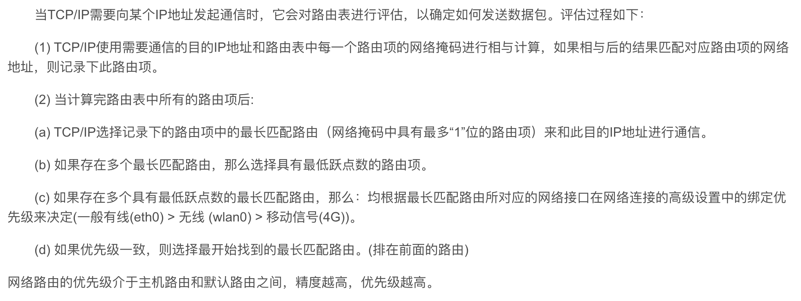
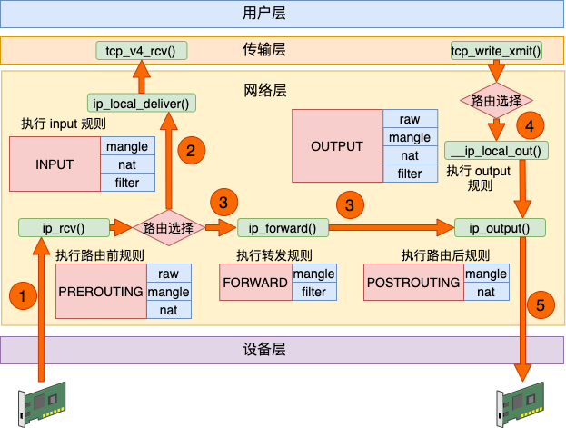
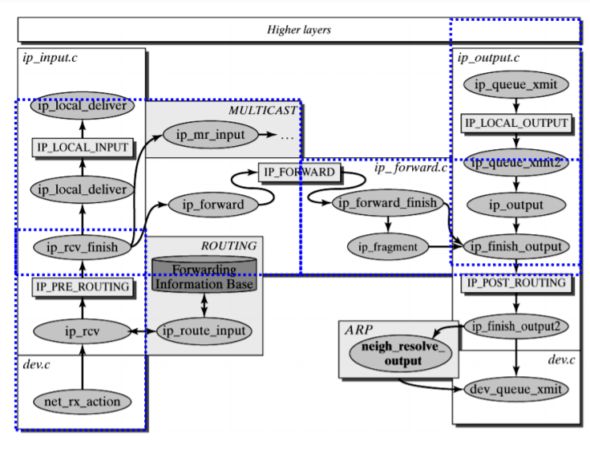
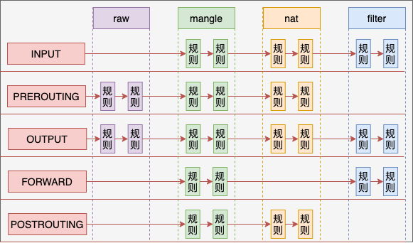
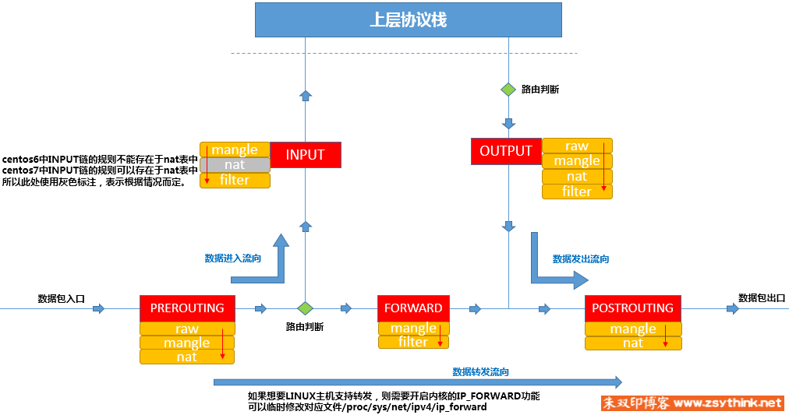
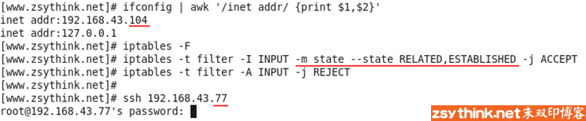
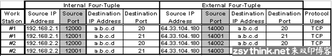

# Linux Veth
- `veth pair`
	- `veth`: Virtual Ethernet Device
	- `man veth`: 更详细的解释
	- `veth pair`是一种成对出现的特殊网络设备，它们像一根虚拟的网线，可用于连接两个`namespace`。
	- 向`veth pair`一端输入数据，在另一端就能读到此数据
	- `veth pair`和`patch port`都可以连接网桥，使用的时候如何选择呢？
		- `patch port`是`ovs bridge`自己特有的port类型，只能在ovs中使用。
		- 1）连接两个`ovs bridge`，优先使用`patch port`。技术上`veth pair`也能实现，但性能不如`patch port`。
		- 2）连接`ovs bridge`和`Linux Bridge`，只能使用`veth pair`。
		- 3）连接两个`Linux Bridge`，只能使用`veth pair`


# Linux Bridge
- Linux Bridge
	- Linux Bridge是Linux上用来做TCP/IP二层协议交换的设备
	- 其功能可以简单地理解为是一个二层交换机或者Hub。
	- 多个网络设备可以连接到同一个Linux Bridge，当某个设备收到数据包时，Linux Bridge会将数据转发给其他设备。
	- man 


# VLAN
- VLAN
	- LAN表示Local Area Network，本地局域网
		- 通常使用Hub(集线器)和Switch(交换机)来连接LAN中的计算机
		- 一般来说，两台计算机连入同一个Hub或者Switch时，它们就在同一个LAN中
		- 一个LAN表示一个广播域，其含义是：LAN中的所有成员都会收到任意一个成员发出的广播包
	- VLAN表示Virtual LAN
		- 一个带有VLAN功能的switch能够将自己的端口划分出多个LAN。
		- 计算机发出的广播包可以被同一个LAN中其他计算机收到，但位于其他LAN的计算机则无法收到。
		- VLAN的隔离是二层上的隔离
			- 指的是二层广播包（比如arp）无法跨越VLAN的边界。
			- 但在三层上（比如IP）是可以通过路由器让A和B互通的。
	- 通常交换机的端口有两种配置模式：Access和Trunk
		- 交换机的Access和Trunk
			- 
		- Access口
			- 这些端口被打上了VLAN的标签，表明该端口属于哪个VLAN
			- 不同VLAN用VLAN ID来区分，VLAN ID的范围是1～4096
			- Access口都是直接与计算机网卡相连的，这样从该网卡出来的数据包流入Access口后，就会被打上了所在VLAN的标签
			- Access口只能属于一个VLAN
		- Trunk口
			- 不同VLAN ID的数据包在通过Trunk口到达对方交换机的过程中始终带着自己的VLAN标签
		- VLAN设备总是以母子关系出现，母子设备之间是一对多的关系
			- 一个母设备（eth0）可以有多个子设备（eth0.10，eth0.20 ......），
			- 而一个子设备只有一个母设备
		- 常见的VLAN部署结构样例
			- 


# Linux Network Namespace
- Linux Network Namespace
	- 在二层网络上，VLAN可以将一个物理交换机分割成几个独立的虚拟交换机。
	- 在三层网络上，Linux network namespace可以将一个物理三层网络分割成几个独立的虚拟三层网络。
		- 每个namespace都有自己独立的网络栈，包括route table，firewall rule，network interface device等
		- 通过namespace为每个network提供独立的DHCP和路由服务，从而允许租户创建重叠的网络
	- root namespace
		- 宿主机本身也有一个namespace，叫root namespace，拥有所有物理和虚拟interface device
		- 物理interface只能位于root namespace
	- 新创建的namespace默认只有一个loopback device
		- 可以将虚拟interface，例如bridge、tap等设备添加到某个namespace
		- veth pair是一种成对出现的特殊网络设备，它们像一根虚拟的网线，可用于连接两个namespace。向veth pair一端输入数据，在另一端就能读到此数据。

# Linux Bridge + VLAN = 虚拟交换机
- Linux Bridge + VLAN = 虚拟交换机
	- KVM的网络虚拟化
	- 物理交换机存在多个VLAN，每个VLAN拥有多个端口
		- 同一VLAN端口之间可以交换转发，
		- 不同VLAN端口之间隔离。
		- 所以交换机包含两层功能：交换与隔离
	- Linux的VLAN设备实现的是隔离功能，但没有交换功能
		- 一个VLAN母设备（比如eth0）不能拥有两个相同ID的VLAN子设备，因此也就不可能出现数据交换情况
	- Linux Bridge专门实现交换功能
		- 将同一VLAN的子设备都挂载到一个Bridge上，设备之间就可以交换数据了。
	- 总结起来，Linux Bridge加VLAN在功能层面完整模拟现实世界里的二层交换机。
		- eth0相当于虚拟交换机上的trunk口，允许vlan10和vlan20的数据通过。
		- eth0.10，vnet0和brvlan10都可以看着vlan10的access口。
		- eth0.20，vnet1和brvlan20都可以看着vlan20的access口。

# Linux TUN/TAP Device
- Linux TUN/TAP device
	- TAP等同于一个**以太网设备**，它操作第二层数据包如以太网数据帧。
	- TUN模拟了**网络层设备**，操作第三层数据包比如IP数据封包。
	- 在计算机网络中，TUN与TAP是操作系统内核中的虚拟网络设备。
		- 这些虚拟的网络设备全部用软件实现
			- 并向运行于操作系统上的软件提供与硬件的网络设备完全相同的功能
		- 操作系统通过TUN/TAP设备向绑定该设备的用户空间的程序发送数据，反之，用户空间的程序也可以像操作硬件网络设备那样，通过TUN/TAP设备发送数据。
			- 在后种情况下，TUN/TAP设备向操作系统的网络栈投递（或“注入”）数据包，从而模拟从外部接受数据的过程。
	- Tap/Tun的工作原理
		- Tun虚拟设备和物理网卡的区别是Tun虚拟设备是IP层设备，从/dev/net/tun字符设备上读取的是IP数据包，写入的也只能是IP数据包，因此不能进行二层操作，如发送ARP请求和以太网广播。
		- 与之相对的是，Tap虚拟设备是以太网设备，处理的是二层以太网数据帧，从/dev/net/tun字符设备上读取的是以太网数据帧，写入的也只能是以太网数据帧。从这点来看，Tap虚拟设备和真实的物理网卡的能力更接近。
	- 应用程序如何操作Tun/Tap
		- Linux Tun/Tap驱动程序为应用程序提供了两种交互方式：
			- 虚拟网络接口和字符设备/dev/net/tun
				- 写入字符设备/dev/net/tun的数据会发送到虚拟网络接口中；
				- 发送到虚拟网络接口中的数据也会出现在该字符设备上
			- 应用程序可以通过标准的Socket API向Tun/Tap接口发送IP数据包，就好像对一个真实的网卡进行操作一样
				- 除了应用程序以外，操作系统也会根据TCP/IP协议栈的处理向Tun/Tap接口发送IP数据包或者以太网数据包，例如ARP或者ICMP数据包。
				- Tun/Tap驱动程序会将Tun/Tap接口收到的数据包原样写入到/dev/net/tun字符设备上，处理Tun/Tap数据的应用程序可以从该设备上读取到数据包，以进行相应处理
		- 应用程序也可以通过/dev/net/tun字符设备写入数据包，这种情况下该字符设备上写入的数据包会被发送到Tun/Tap虚拟接口上，进入操作系统的TCP/IP协议栈进行相应处理，就像从物理网卡进入操作系统的数据一样
	- TUN/TAP 使用样例解读
		- 使用Tun/Tap创建点对点隧道
			- 
			- 上图中的隧道也可以采用Tap虚拟设备实现。使用Tap的话，隧道的负载将是以太数据帧而不是IP数据包，而且还会传递ARP等广播数据包。
				- 
		- 使用Tun/Tap隧道绕过防火墙
			- 
		- 使用Tap隧道桥接两个远程站点
			- 
			- 假设192.168.0.5发出了一个对192.168.0.3的ARP请求，该ARP请求在网络中经过的路径如下
				- 1. 192.168.0.5发出ARP请求，询问192.168.0.3的MAC地址。
				- 2. 该ARP请求将被发送到以太网交换机上。
				- 3. 以太网交换机对该请求进行泛洪，发送到其包括Eth1在内的所有端口上。
				- 4. 由于Eth1被加入了VPN主机上的Linux Bridge，因此Linux Bridge收到该ARP请求。
				- 5. Linux Bridge对该ARP请求进行泛洪，发送到连到其上面的Tap虚拟网卡上。
				- 6. VPN程序通过/dev/net/tun字符设备读取到该ARP请求，然后封装到TCP/UDP包中，发送到对端站点的V主机
				- 7. 对端站点的VPN程序通过监听TCP/UDP端口接收到封装的ARP请求，将ARP请求通过/dev/net/tun字符设备写入到Tap设备中
				- 8. Linux Bridge泛洪，将ARP请求发送往Eth1，由于Eth1连接到了以太网交换机上，以太网交换机接收到了该ARP请求
				- 9. 以太网交换机进行泛洪，将ARP请求发送给了包括192.168.0.3的所有主机
				- 10. 192.168.0.3收到了APR请求，判断iP地址和自己相同，对此请求进行响应
				- 11. 同理，ARP响应包也可以按照该路径返回到图左边包括192.168.0.5在内的站点中
		- OpenVPN TAP vs TUN: What’s The Difference
			- In the case of VPNs, TAP is used to carry Ethernet frames and for bridging and TUN is used to carry IP packets (routing). 
			- It is worth noting that TUN/TAP devices are only used by certain VPN protocols (such as OpenVPN and WireGuard) and not others (such as IKEv2)


# Linux Bridge环境中的各种网络设备
- Linux Bridge环境中的各种网络设备
	- 在Linux Bridge环境中，一个数据包从instance发送到物理网卡会经过下面几个类型的设备：
		- Tap interface
		- Linux Bridge
		- vlan interface: 会在vlan网络中使用
		- vxlan interface: 会在vxlan网络中使用
		- 物理interface
	- linux-bridge支持local、flat、vlan和vxlan四种network type，目前不支持gre
		- Linux Bridge如何实现每种network type
		- local network
	- local network
		- local network的示例
			- 
			- 创建了两个local network，分别对应两个网桥brqXXXX和brqYYYY。
			- VM0和VM1通过tap0和tap1连接到brqXXXX。
			- VM2通过tap0和tap2连接到brqYYYY。
			- VM0与VM1在同一个local network中，它们之间可以通信。
			- VM2位于另一个local network，由于brqXXXX和brqYYYY没有联通，所以VM2无法与VM0和VM1通信。
		- Local Network的特点
			- 不会与宿主机的任何物理网卡相连，instance无法与宿主机之外的网络通信
			- 不关联任何的VLAN ID
			- 对于每个local netwrok, 位于同一个local network的instance会连接到相同的bridge，这样instance之间就可以通信
			- 每个local network有自己的bridge，bridge之间是没有连通的，所以两个local network之间也不能通信，即使它们位于同一宿主机上
	- flat network
		- flat_network网络结构示例
			- 
			- 
			- 隔离的dnsmasq服务为flat network提供的DHCP服务
				- Linux Network Namespace 隔离了 `qdhcp-f153b42f-c3a1-4b6c-8865-c09b5b2aa274`，上面运行了`dnsmasq服务`
				- flat_net的DHCP设备`tap19a0ed3d-fe`，放到`qdhcp-f153b42f-c3a1-4b6c-8865-c09b5b2aa274`中。
					- `tap19a0ed3d-fe`与`ns-19a0ed3d-fe`就是一对veth pair，它们将`qdhcp-f153b42f-c3a1-4b6c-8865-c09b5b2aa274`连接到`brqf153b42f-c3`
			- instance如何从dnsmasq获取IP
				- 在创建instance时，分配的MAC和IP地址信息会先同步更新到dnsmasq的host文件
				- cirros-vm1开机启动，发出DHCPDISCOVER广播，该广播消息在整个flat_net中都可以被收到。
				- 广播到达veth `tap19a0ed3d-fe`，然后传送给veth pair的另一端`ns-19a0ed3d-fe`
				- 广播到达veth `tap19a0ed3d-fe`，然后传送给veth pair的另一端`ns-19a0ed3d-fe`
				- dnsmasq在`ns-19a0ed3d-fe`上面监听，dnsmasq检查其host文件，发现有对应项，于是dnsmasq以DHCPOFFER消息将IP（172.16.1.103）、子网掩码（255.255.255.0）、地址租用期限等信息发送给cirros-vm1
				- cirros-vm1发送DHCPREQUEST消息确认接受此DHCPOFFER
				- dnsmasq发送确认消息DHCPACK，整个过程结束
			- cirros-vm1（172.16.1.3）与cirros-vm2（172.16.1.4）位于不同节点，通过flat_net相连，在cirros-vm1控制台中执行ping 172.16.1.104
		- flat network是不带tag的网络，要求宿主机的物理网卡直接与Linux Bridge连接
			- 每个flat network都会独占一个物理网卡
			- 因为flat网络与物理网卡一一对应，一般情况下租户网络不会采用flat
		- DHCP服务
			- dnsmasq是一个提供DHCP和DNS服务的开源软件
			- dnsmasq与network是一对一关系，一个dnsmasq进程可以为同一netowrk中所有enable了DHCP的subnet提供服务
			- 用Linux Network Namespace隔离dnsmasq服务
				- 在三层网络上，Linux network namespace可以将一个物理三层网络分割成几个独立的虚拟三层网络。每个namespace都有自己独立的网络栈，包括route table，firewall rule，network interface device等
				- 通过namespace为每个network提供独立的DHCP和路由服务，从而允许租户创建重叠的网络。如果没有namespace，网络就不能重叠，这样就失去了很多灵活性			
	- vlan network
		- vlan_network网络结构示例
			- 
			- cirros-vm1属于vlan100。
			- cirros-vm2属于vlan100。
			- cirros-vm3属于vlan101。
			- cirros-vm1与cirros-vm2都在vlan100，它们之间能通信。
			- cirros-vm3在vlan101，不能与cirros-vm1和cirros-vm2通信。
			- 那怎么样才能让vlan100与vlan101中的instance通信呢？二层vlan是不行的，只能在三层通过路由器转发
		- vlan network是带tag的网络
	- Routing
		- 路由服务提供跨subnet互联互通功能
			- 路由选择的评估过程
				- 当TCP/IP需要向某个IP地址发起通信时，会对路由表进行评估，以确定如何发送数据包
				- 评估过程:
					- 
			- Routing Table
				- 255 local: 保存`本地路由`和`广播路由`，有**系统维护**
				- 254 main: 所有没有指明路由表的路由保存在该表
				- 253 default: 是一个空表,为一些后续处理保留
				- 0 unspec : 系统保留表
				- `cat /etc/iproute2/rt_tables`
					- 路由表序号和表名对应关系
			- 路由表项
				- `route -n`: 输出项说明
					- 帮助命令: `man route`
					- **Destination**: The destination network or destination host
						- 目标网络或目标主机
					- **Gateway**: he gateway address or \'\*\' if none set
						- 网关地址或"\*"(如果未设置)
					- **Genmask**: The netmask for the destination net
						- 目标网络的网络掩码
							- '255.255.255.255' for a host destination 
								- '255.255.255.255' 为主机
							- '0.0.0.0' for the **default** route.
								- '0.0.0.0' 为默认路由
					- **Flags**
						- U (route is up)
						- H (target is a host): 主机路由
						- G (use gateway): 网关路由
						- R (reinstate route for dynamic routing)
							- 恢复动态路由产生的表项
						- D (dynamically installed by daemon or redirect)
							- 由路由的后台程序动态创建
						- M (modified from routing daemon or redirect)
							- 由路由的后台程序修改
						- A (installed by addrconf)
						- C (cache entry)
						- !  (reject route)
							- 阻塞路由
					- **Metric**: The 'distance' to the target (usually counted in hops)
						- 路由距离，到达指定网络所需要的跳跃数
					- **Ref**: Number of references to this route. (Not used in the Linux kernel.)
						- 使用此路由的活动进程个数(linux kernel未使用)
					- **Use**: Count of lookups for the route.
					- **Iface**:  Interface to which packets for this route will be sent
						- 该路由项对应的输出接口
					- **MSS**: Default maximum segment size for TCP connections over this route
					- **Window**: Default window size for TCP connections over this route.
					- **irtt**: Initial RTT (Round Trip Time). 
						- The kernel uses this to guess about the best TCP protocol parameters without waiting on (possibly slow) answers.
			- 静态路由的操作
				- `route [add|del [-net|-host] target [netmask Nm] [gw Gw] [metric N] [mss M] [window W] [irtt I] [reject] [mod] [dyn] [reinstate]    [[dev] If]`
				- add: 添加路由
				- del: 删除路由
				- -net: 目标是一个网络
				- -host: 目标是一个主机
				- target: 目标网络或主机，可以是IP地址或网络主机名
				- netmask Nm: 添加网络路由时用到的网络掩码
					- netmask匹配的位数越高，该条路由匹配时的优先级也越高
				- gw GW: 指定通过网关路由，后面接网关地址
				- metric M: 设置路由的metric字段(路由跳数)
					- 用在路由表里存在多个路由选择与转发包中的目标地址最为匹配的路由
					- 所选的路由具有最少得跳跃数，故Metric值越小，优先级越高
				- dev if: 指定网络接口发送数据
			- iproute2
				- 帮助命令: `man ip-route`
				- 
				- 
				- 
			- ip rule
				- 策略路由规则，帮助命令: `man ip-rule`
				- Linux系统在启动时，内核会为路由策略数据库配置三条缺省的规则
				- 
				- 
		- 物理router
			- 物理router的示例
				- 
				- 172.16.100.1对应vlan100的网关，172.16.101.1对应vlan101的网关
				- 当cirros-vm1要跟cirros-vm3通信时，数据包的流向是这样的：
					- （1）因为cirros-vm1的默认网关指向172.16.100.1，cirros-vm1发送到cirros-vm3的数据包首先通过vlan100的interface进入物理router。
					- （2）router发现目的地址是172.16.101.1，则从vlan101的interface发出。
					- （3）数据包经过brq1d7040b8-01最终到达cirros-vm3。
		- 虚拟router
			- 虚拟router的路由机制与物理router一样，只是由软件实现，为subnet提供路由服务
			- 虚拟router示例
				- 
				- ROUTER在单独的namespace，使得每个router有自己的路由表，而且不会与其他router冲突，能很好地支持网络重叠(多租户网络)
			- 虚拟router访问外网示例
				- 
				- cirros-vm3Ping到ext_net网关10.10.10.1, 数据包经过两跳到达10.10.10.1网关。
					- （1）数据包首先发送到router_100_101连接vlan101的interface（172.16.101.1）。
					- （2）然后通过连接ext_net的interface（10.10.10.2）转发出去，最后到达10.10.10.1。
					- Source NAT
						- 当数据包从router连接外网的接口qg-b8b32a88-03发出的时候，会做一次Source NAT，即将包的源地址修改为router的接口地址10.10.10.2，这样就能够保证目的端能够将应答的包发回给router，然后再转发回源端instance。
						- SNAT让instance能够直接访问外网，但外网还不能直接访问instance，因为instance没有外网IP。
				- 
			- 虚拟router时使用floating IP从外网直接访问instance
				- 需要从外网直接访问instance，可以利用floating IP。
					- floating IP提供静态NAT功能，建立外网IP与instance租户网络IP的一对一映射。
					- floating IP是配置在router提供网关的外网interface上的
					- router会根据通信的方向修改数据包的源或者目的地址
	- vxlan network
		- overlay network是指建立在其他网络上的网络。
			- 该网络中的节点可以看作通过虚拟（或逻辑）链路连接起来的。
			- overlay network在底层可能由若干物理链路组成，但对于节点，不需要关心这些底层实现。
			- 例如P2P网络就是overlay network，隧道也是。vxlan和gre都是基于隧道技术实现的，它们也都是overlay network。
			- 目前Linux Bridge只支持vxlan，不支持gre。Open Vswitch两者都支持。
			- vxlan与gre实现非常类似，而且vxlan用得较多。
		- VXLAN全称Virtual eXtensible Local Area Network
			- VXLAN提供与VLAN相同的以太网二层服务，但是拥有更强的扩展性和灵活性
			- VXLAN是将二层建立在三层上的网络
			- VXLAN是一种在现有物理网络设施中支持大规模多租户网络环境的解决方案
			- VXLAN的传输协议是IP + UDP 
			- 与VLAN相比，VXLAN有下面几个优势
				- 支持更多的二层网段
					- VLAN使用12-bit标记VLAN ID，最多支持4094个VLAN，这对于大型云部署会成为瓶颈。
					- VXLAN的ID（VNI或者VNID）则用24-bit标记，支持16777216个二层网段。
				- 能更好地利用已有的网络路径
					- VLAN使用Spanning Tree Protocol避免环路，这会导致有一半的网络路径被block掉。
					- VXLAN的数据包是封装到UDP通过三层传输和转发的，可以使用所有的路径。
				- 避免物理交换机MAC表耗尽
					- 由于采用隧道机制，TOR (Top on Rack)交换机无须在MAC表中记录虚拟机的信息
		- vxlan资料补充
			- 什么是VXLAN
				- 为什么需要VXLAN
					- 虚拟机动态迁移，要求提供一个无障碍接入的网络
						- 什么是服务器虚拟化技术？
						- 什么是虚拟机动态迁移？
						- VXLAN如何满足虚拟机动态迁移时对网络的要求？
					- 数据中心租户数量激增，要求提供一个可隔离海量租户的网络
				- VXLAN与VLAN之间有何不同
				- VXLAN隧道是如何建立的
					- 什么是VXLAN中的VTEP和VNI
						- 什么是VXLAN VTEP
						- 什么是VXLAN VNI
					- 哪些VTEP之间需要建立VXLAN隧道
						- 什么是“同一大二层域”
						- 如何确定报文属于哪个BD
							- 哪些报文要进入VXLAN隧道
							- 将二层子接口加入BD
				- VXLAN网关有哪些种类
					- VXLAN二层网关与三层网关
					- VXLAN集中式网关与分布式网关
						- VXLAN集中式网关
						- VXLAN分布式网关
				- VXLAN网络中报文是如何转发的
					- 集中式VXLAN中同子网互通流程
						- ARP请求报文转发流程
						- ARP应答报文转发流程
					- 集中式VXLAN中不同子网互通流程
						- 网关的MAC地址学习的过程
							- ARP请求报文转发流程
							- ARP应答报文转发流程
						- 数据报文的转发流程
		- VXLAN封装和包格式
			- VXLAN定义了一个MAC-in-UDP的封装格式
				- 在原始的Layer 2网络包前加上VXLAN header，然后放到UDP和IP包中。
				- 通过MAC-in-UDP封装，VXLAN能够在Layer 3网络上建立起了一条Layer 2的隧道。
			- VXLAN包的格式
				- 
				- VXLAN引入了8-byte VXLAN header，其中VNI占24-bit。
				- VXLAN和原始的L2 frame被封装到UDP包中。
				- 这24-bit的VNI用于标示不同的二层网段，能够支持16777216个LAN
		- VXLAN Tunnel Endpoint (VTEP)
			- VXLAN使用VXLAN tunnel endpoint (VTEP)设备处理VXLAN的封装和解封
			- 每个VTEP有一个IP interface，配置了一个IP地址。
				- VTEP使用该IP封装Layer 2 frame，
				- 并通过该IP interface传输和接收封装后的VXLAN数据包。
			- VTEP示意图
				- 
			- VXLAN独立于底层的网络拓扑，反过来，两个VTEP之间的底层IP网络也独立于VXLAN。
			- VXLAN数据包是根据外层的IP header路由的，该header将两端的VTEP IP作为源和目标IP
		- VXLAN包转发流
			- VXLAN在VTEP间建立隧道，通过Layer 3网络传输封装后的Layer 2数据
			- VXLAN包转发流示意图
				- 
				- Host-A和Host-B位于VNI 10的VXLAN，通过VTEP-1和VTEP-2之间建立的VXLAN隧道通信。数据传输过程如下：
					- 1）Host-A: Host-A向Host-B发送数据时
						- Host-B的MAC和IP作为数据包的目标MAC和IP，
						- Host-A的MAC作为数据包的源MAC和IP，
						- 然后通过VTEP-1将数据发送出去。
					- 2) VTEP-1转发数据
						- VTEP-1从自己维护的映射表中找到MAC-B对应的VTEP-2，
						- 然后执行VXLAN封装，加上VXLAN头，UDP头，以及外层IP和MAC头。
						- 此时的外层IP头，目标地址为VTEP-2的IP，源地址为VTEP-1的IP。
						- 同时由于下一跳是Router-1，所以外层MAC头中目标地址为Router-1的MAC。
					- 3) 外部网络的路由器
						- 数据包从VTEP-1发送出去后，外部网络的路由器会依据外层IP头进行包路由，
						- 最后到达与VTEP-2连接的路由器Router-2。
					- 4) VTEP-2接受数据包
						- Router-2将数据包发送给VTEP-2。
						- VTEP-2负责解封数据包，依次去掉外层MAC头，外层IP头，UPD头和VXLAN头。
						- VTEP-2依据目标MAC地址将数据包发送给Host-B。
			- VTEP是VXLAN的最核心组件，负责数据的封装和解封。隧道也是建立在VTEP之间的，VTEP负责数据的传送。
			- Linux对VXLAN的支持
				- VTEP可以由专有硬件来实现，也可以使用纯软件实现
				- 目前比较成熟的VTEP软件实现包括：
					- 带VXLAN内核模块的Linux
					- Open vSwitch
				- Linux支持VXLAN的示意图
					- 
				- Linux支持VXLAN的实现方式：
					- Linux vxlan创建一个UDP Socket，默认在8472端口监听。
					- Linux vxlan在UDP socket上接收到vxlan包后，解包，
						- 然后根据其中的vxlan ID将它转给某个vxlan interface，
						- 然后再通过它所连接的linux bridge转给虚机。
					- Linux vxlan在收到虚机发来的数据包后，将其封装为多播UDP包，从网卡发出。


# Netfilter之iptables


- iptables
	- netfilter是位于内核空间的数据包处理模块(安全框架)
	- iptables是位于用户空间的命令行工具
	- netfilter/iptables 组成了Linux平台下的包过滤防火墙
	- administration tool for IPv4/IPv6 packet filtering and NAT
		- **iptables** and **ip6tables** are used to set up, maintain, and inspect the tables of IPv4 and IPv6 packet filter rules in the Linux kernel. 
		- Several different tables may be defined.  
		- Each table contains a number of built-in chains and may also contain user-defined chains.
		- Each chain is a list of rules which can match a set of packets.  
		- Each rule specifies what to do with a packet that matches.  This is  called  a  `target`, which may be a jump to a user-defined chain in the same table.
- iptables 原理 
	- Iptables 是基于 netfilter 来实现的
	- 概览
		- Linux 上的防火墙、nat 等基础功能都是基于它实现的。流行的的 Docker、Kubernets、Istio 项目中也经常能见着对它的身影
		- 从内核接收、发送、转发三个不同的过程理解了五链的位置
			- 
			- 
			- 数据**接收过程**走的是 1 和 2，**发送过程**走的是 4 、5，**转发过程**是 1、3、5
				- 接收数据的处理流程是：**PREROUTING链 -> 路由判断（是本机）-> INPUT链** -> ...
				- 发送数据包流程是：**路由选择** -> **OUTPUT链** -> **POSTROUTING链** -> ...
				- 转发数据过程：**PREROUTING链** -> 路由判断（不是本设备，找到下一跳） -> **FORWARD链** -> **POSTROUTING链** -> ...
		- 从整体上看，四表五链的关系
			- 每个表都是在多个钩子位置处注册自己的规则，当处理包的时候触发规则，并执行
			- 分类: raw、mangle、nat 和 filter （优先级次序: 由高而低）
				- raw 表的作用是将命中规则的包，跳过其它表的处理，它的优先级最高
					- raw 表目的是跳过其它表，只需要在接收和发送两大过程的最开头处把关，所以只需要用到 PREROUTING 和 OUTPUT 两个钩子
					-  This  table is used mainly for configuring exemptions from connection tracking in combination with the NOTRACK target: 
						- **PREROUTING**: for packets arriving via any network interface
						- **OUTPUT** : for packets generated by local processes
				- mangle 表的作用是根据规则修改数据包的一些标志位，比如 TTL
					- mangle 表有可能会在任意位置都有可能会修改网络包，所以它是用到了全部的钩子位置
					- This table is used for specialized packet alteration
						- **PREROUTING**: for  altering  incoming packets  before  routing
						- **FORWARD** : for altering packets being routed through the box
						- **INPUT** : for packets coming into the box itself
						- **OUTPUT**: for altering locally-generated packets before routing
						- **POSTROUTING** :for altering packets as they are about to go out
				- nat 表的作用是实现网络地址转换
					- 分为 SNAT（Source NAT）和 DNAT（Destination NAT）两种
					- 可能会工作在 PREROUTING、INPUT、OUTPUT、POSTROUTING 四个位置
					- This table is consulted when a packet that creates a new connection is encountered
						- **PREROUTING**: for altering packets as soon as they come in
						- **INPUT**: for altering packets destined for local sockets
						- **OUTPUT**: for altering locally-generated pack‐ets before routing
						- **POSTROUTING**: for altering packets as they are about to go out
				- filter 表的作用是过滤某些包，这是防火墙工作的基础
					- Filter 只在 INPUT、OUTPUT 和 FORWARD 这三步中工作
					- This  is the default table (if no -t option is passed)
						- **INPUT**: for packets destined to local sockets
						- **FORWARD**: for packets being routed through the box
						- **OUTPUT**: for locally-generated packets
			- 
			- 每个命名空间都是有自己独立的 iptables 规则的
- iptables 的使用
	- 数据经过防火墙的流程
		- 
	- 在实际的使用过程中，往往是通过”表”作为操作入口，对规则进行定义的
	- 规则的概念
		- 规则：根据指定的匹配条件来尝试匹配每个流经此处的报文，一旦匹配成功，则由规则后面指定的处理动作进行处理；
		- 匹配条件
			- 基本匹配条件
				- 源地址Source IP
				- 目标地址 Destination IP
			- 扩展匹配条件
				- 源端口Source Port
				- 目标端口Destination Port
		- 处理动作
			- **ACCEPT**：允许数据包通过。
				- **ACCEPT**:  means  to let the packet through.  
			- **DROP**：直接丢弃数据包，不给任何回应信息，这时候客户端会感觉自己的请求泥牛入海了，过了超时时间才会有反应。
				- **DROP**: means to drop the packet on the floor.
			- **REJECT**：拒绝数据包通过，必要时会给数据发送端一个响应的信息，客户端刚请求就会收到拒绝的信息。
			- **SNAT**：源地址转换，解决内网用户用同一个公网地址上网的问题。
			- **MASQUERADE**：是SNAT的一种特殊形式，适用于动态的、临时会变的ip上。
			- **DNAT**：目标地址转换。
			- **REDIRECT**：在本机做端口映射。
			- **LOG**：在/var/log/messages文件中记录日志信息，然后将数据包传递给下一条规则，也就是说除了记录以外不对数据包做任何其他操作，仍然让下一条规则去匹配。
			- **RETURN** means stop traversing this chain and resume at the next rule in the previous (calling) chain.  
				- If the end of a built-in chain is reached or a rule in a built-in chain with target **RETURN** is matched, the target specified by the chain policy determines the fate of the packet.
	- 规则的查询
		- `iptables -t 表名 -L`
			- 查看对应表的所有规则，
			- -t选项指定要操作的表，省略”-t 表名”时，默认表示操作filter表
			- -L表示列出规则，即查看规则
			- 样例
				- `iptables -t raw -L`
				- `iptables -t mangle -L`
				- `iptables -t nat -L`
				- `iptables -t filter -L`
		- `iptables -t 表名 -L 链名`
			- 查看指定表的指定链中的规则
			- 样例
				- `iptables -t filter -L INPUT`
		- `iptables -t 表名 -v -L`
			- 查看指定表的所有规则
			- -v表示verbose，显示更详细的信息
				- **pkts**:对应规则匹配到的报文的个数。
				- **bytes**:对应匹配到的报文包的大小总和。
				- **target**:规则对应的target，往往表示规则对应的”动作”，即规则匹配成功后需要采取的措施。
				- **prot**:表示规则对应的协议，是否只针对某些协议应用此规则。
				- **opt**:表示规则对应的选项。
				- **in**:表示数据包由哪个接口(网卡)流入，即从哪个网卡来。
				- **out**:表示数据包将由哪个接口(网卡)流出，即到哪个网卡去。
				- **source**:表示规则对应的源头地址，可以是一个IP，也可以是一个网段。
				- **destination**:表示规则对应的目标地址。可以是一个IP，也可以是一个网段。
			- 显示的policy: policy表示当前链的默认策略
				- **packets**表示当前链默认策略匹配到的包的数量，0 packets表示默认策略匹配到0个包
				- **bytes**表示当前链默认策略匹配到的所有包的大小总和
			- 样例
				- `iptables -t filter -v -L`
		- `iptables -t 表名 -n -L`
			- 表示查看表的所有规则
			- -n选项表示不对规则中的IP或者端口进行名称反解
			- 样例
				- `iptables -t filter -n -L`
		- `iptables --line-numbers -t 表名 -L`
			- 表示查看表的所有规则，–line-numbers选项表示显示规则的序号
			- 样例
				- `iptables --line-numbers -t filter -L`
		- `iptables -t 表名 -v -x -L`
			- 表示查看表中的所有规则
			- -v表示verbose，显示更详细的信息
			- -x选项表示显示计数器的精确值
			- 样例
				- `iptables -t filter -v -x -L INPUT`
	- 规则的修改
		- 添加规则
			- 注意：添加规则时，规则的顺序非常重要
			- `命令语法：iptables -t 表名 -A 链名 匹配条件 -j 动作`
				- `示例：iptables -t filter -A INPUT -s 192.168.1.146 -j DROP`
				- 在指定表的指定链的尾部添加一条规则，
				- -A选项表示在对应链的末尾添加规则，
				- 省略-t选项时，表示默认操作filter表中的规则
			- `命令语法：iptables -t 表名 -I 链名 匹配条件 -j 动作`
				- `示例：iptables -t filter -I INPUT -s 192.168.1.146 -j ACCEPT`
				- 在指定表的指定链的首部添加一条规则，
				- -I选型表示在对应链的开头添加规则
			- `命令语法：iptables -t 表名 -I 链名 规则序号 匹配条件 -j 动作`
				- `示例：iptables -t filter -I INPUT 5 -s 192.168.1.146 -j REJECT`
				- 在指定表的指定链的指定位置添加一条规则
			- `命令语法：iptables -t 表名 -P 链名 动作`
				- `示例：iptables -t filter -P FORWARD ACCEPT`
					- 表示将filter表中FORWARD链的默认策略设置为ACCEPT
				- 设置指定表的指定链的默认策略（默认动作），并非添加规则
		- 删除规则
			- 注意：如果没有保存规则，删除规则时请慎重
			- `命令语法：iptables -t 表名 -D 链名 规则序号`
				- `示例：iptables -t filter -D INPUT 3`  
					- 表示删除filter表中INPUT链中序号为3的规则
				- 按照规则序号删除规则，删除指定表的指定链的指定规则，
				- -D选项表示删除对应链中的规则
			- `命令语法：iptables -t 表名 -D 链名 匹配条件 -j 动作`
				- `示例：iptables -t filter -D INPUT -s 192.168.1.146 -j DROP`
					- 示例表示删除filter表中INPUT链中源地址为192.168.1.146并且动作为DROP的规则
				- 按照具体的匹配条件与动作删除规则，删除指定表的指定链的指定规则
			- `命令语法：iptables -t 表名 -F 链名`
				- `示例：iptables -t filter -F INPUT`
				- 删除指定表的指定链中的所有规则，-F选项表示清空对应链中的规则，执行时需三思
			- `命令语法：iptables -t 表名 -F`
				- `示例：iptables -t filter -F`
				- 删除指定表中的所有规则，执行时需三思
		- 修改规则
			- 注意：如果使用-R选项修改规则中的动作，那么必须指明原规则中的原匹配条件，例如源IP，目标IP等
			- `命令语法：iptables -t 表名 -R 链名 规则序号 规则原本的匹配条件 -j 动作`
				- `示例：iptables -t filter -R INPUT 3 -s 192.168.1.146 -j ACCEPT`
					- 示例表示修改filter表中INPUT链的第3条规则，
					- 将这条规则的动作修改为ACCEPT， 
					- -s 192.168.1.146为这条规则中原本的匹配条件，如果省略此匹配条件，修改后的规则中的源地址可能会变为0.0.0.0/0
				- 修改指定表中指定链的指定规则，-R选项表示修改对应链中的规则，使用-R选项时要同时指定对应的链以及规则对应的序号，并且规则中原本的匹配条件不可省略
			- `命令语法：iptables -t 表名 -P 链名 动作`
				- `示例：iptables -t filter -P FORWARD ACCEPT`
					- 表示将filter表中FORWARD链的默认策略修改为ACCEPT
				- 修改指定表的指定链的默认策略（默认动作），并非修改规则
			- 其他修改规则的方法：
				- 先通过编号删除规则，
				- 再在原编号位置添加一条规则
		- 保存规则
			- 保存规则到文件中: `iptables-save > /etc/sysconfig/iptables`
			- 从文件中恢复规则: `iptables-restore < /etc/sysconfig/iptables`
				- 重载规则时，文件中的规则将会覆盖现有规则
			- centos6保存规则: `service iptables save`
				- 规则默认保存在/etc/sysconfig/iptables文件中
				- 使用`service iptables restart`命令重启iptables以后，规则会再次回到上次保存/etc/sysconfig/iptables文件时的模样
	- 规则的匹配条件
		- 基本匹配条件
			- 用于匹配报文的源地址: `-s`
				- 可以同时指定多个源地址，每个IP之间用逗号隔开，
				- 也可以指定为一个网段
				- 示例
					- `iptables -t filter -I INPUT -s 192.168.1.111,192.168.1.118 -j DROP`
					- `iptables -t filter -I INPUT -s 192.168.1.0/24 -j ACCEPT`
					- `iptables -t filter -I INPUT ! -s 192.168.1.0/24 -j ACCEPT`
						- "! -s 192.168.1.0/24"表示对"-s 192.168.1.0/24"这个匹配条件取反
			- 用于匹配报文的目标地址: `-d`
				- 可以同时指定多个目标地址，每个IP之间用逗号隔开，
				- 也可以指定为一个网段
				- 示例
					- `iptables -t filter -I OUTPUT -d 192.168.1.111,192.168.1.118 -j DROP`
					- `iptables -t filter -I INPUT -d 192.168.1.0/24 -j ACCEPT`
					- `iptables -t filter -I INPUT ! -d 192.168.1.0/24 -j ACCEPT`
			- 用于匹配报文的协议类型: `-p`
				- 可以匹配的协议类型tcp、udp、udplite、icmp、esp、ah、sctp等
				- centos7中还支持icmpv6、mh
				- 示例如下
					- `iptables -t filter -I INPUT -p tcp -s 192.168.1.146 -j ACCEPT`
					- `iptables -t filter -I INPUT ! -p udp -s 192.168.1.146 -j ACCEPT`
			- 用于匹配报文是从哪个网卡接口流入本机的: `-i`
				- 由于匹配条件只是用于匹配报文流入的网卡，所以在OUTPUT链与POSTROUTING链中不能使用此选项
				- 示例如下
					- `iptables -t filter -I INPUT -p icmp -i eth4 -j DROP`
					- `iptables -t filter -I INPUT -p icmp ! -i eth4 -j DROP`
			- 用于匹配报文将要从哪个网卡接口流出本机: `-o`
				- 用于匹配条件只是用于匹配报文流出的网卡，所以在INPUT链与PREROUTING链中不能使用此选项
				- 示例如下
					- `iptables -t filter -I OUTPUT -p icmp -o eth4 -j DROP`
					- `iptables -t filter -I OUTPUT -p icmp ! -o eth4 -j DROP`
		- tcp扩展模块
			- `-p tcp -m tcp –sport` 用于匹配tcp协议报文的源端口，可以使用冒号指定一个连续的端口范围
				- `iptables -t filter -I OUTPUT -d 192.168.1.146 -p tcp -m tcp --sport 22 -j REJECT`
				- `iptables -t filter -I OUTPUT -d 192.168.1.146 -p tcp -m tcp ! --sport 22 -j ACCEPT`
			- `-p tcp -m tcp –dport` 用于匹配tcp协议报文的目标端口，可以使用冒号指定一个连续的端口范围
				- `iptables -t filter -I INPUT -s 192.168.1.146 -p tcp -m tcp --dport 22:25 -j REJECT`
				- `iptables -t filter -I INPUT -s 192.168.1.146 -p tcp -m tcp --dport :22 -j REJECT`
				- `iptables -t filter -I INPUT -s 192.168.1.146 -p tcp -m tcp --dport 80: -j REJECT`
			- –sport: 用于匹配tcp协议报文的源端口，可以使用冒号指定一个连续的端口范围
				- 示例如下
					- `iptables -t filter -I OUTPUT -d 192.168.1.146 -p tcp -m tcp --sport 22 -j REJECT`
					- `iptables -t filter -I OUTPUT -d 192.168.1.146 -p tcp -m tcp --sport 22:25 -j REJECT`
					- `iptables -t filter -I OUTPUT -d 192.168.1.146 -p tcp -m tcp ! --sport 22 -j ACCEPT`
			- -dport: 用于匹配tcp协议报文的目标端口，可以使用冒号指定一个连续的端口范围
				- 示例如下
					- `iptables -t filter -I INPUT -s 192.168.1.146 -p tcp -m tcp --dport 22:25 -j REJECT`
					- `iptables -t filter -I INPUT -s 192.168.1.146 -p tcp -m tcp --dport :22 -j REJECT`
					- `iptables -t filter -I INPUT -s 192.168.1.146 -p tcp -m tcp --dport 80: -j REJECT`
			- --tcp-flags: 用于匹配报文的tcp头的标志位
				- [iptables tcp-flags](https://www.zsythink.net/archives/1578)
				- tcp协议的基础: tcp头的结构、tcp三次握手的过程
				- 示例如下
					- `iptables -t filter -I INPUT -p tcp -m tcp --dport 22 --tcp-flags SYN,ACK,FIN,RST,URG,PSH SYN -j REJECT`
						- 匹配tcp三次握手中第一次握手的tcp头中的标志位
						- 第一部分表示：我们需要匹配报文tcp头中的哪些标志位，那么上例的配置表示，我们需要匹配报文tcp头中的6个标志位，这6个标志位分别为为”SYN、ACK、FIN、RST、URG、PSH”，我们可以把这一部分理解成需要匹配的标志位列表
						- 第二部分表示：第一部分的标志位列表中，哪些标志位必须为1，上例中，第二部分为SYN，则表示，第一部分需要匹配的标志位列表中，SYN标志位的值必须为1，其他标志位必须为0
						- 所以，上例中的”SYN,ACK,FIN,RST,URG,PSH SYN”表示，需要匹配报文tcp头中的”SYN、ACK、FIN、RST、URG、PSH”这些标志位，其中SYN标志位必须为1，其他的5个标志位必须为0
						- 用ALL表示”SYN,ACK,FIN,RST,URG,PSH”
						- `iptables -t filter -I INPUT -p tcp -m tcp --dport 22 --tcp-flags ALL SYN -j REJECT`
					- `iptables -t filter -I OUTPUT -p tcp -m tcp --sport 22 --tcp-flags SYN,ACK,FIN,RST,URG,PSH SYN,ACK -j REJECT`
						- 匹配tcp头中的第二次握手时的标志位
					- `iptables -t filter -I INPUT -p tcp -m tcp --dport 22 --tcp-flags ALL SYN -j REJECT`
					- `iptables -t filter -I OUTPUT -p tcp -m tcp --sport 22 --tcp-flags ALL SYN,ACK -j REJECT`
					- 
			- --syn: 用于匹配tcp新建连接的请求报文
				- 相当于使用`–tcp-flags SYN,RST,ACK,FIN  SYN`
				- 示例如下
					- `iptables -t filter -I INPUT -p tcp -m tcp --dport 22 --syn -j REJECT`
		- multiport扩展模块
			- `-p tcp -m multiport –sports` 用于匹配报文的源端口，可以指定离散的多个端口号,端口之间用”逗号”隔开
			- `-p udp -m multiport –dports` 用于匹配报文的目标端口，可以指定离散的多个端口号，端口之间用”逗号”隔开
			- 示例如下
				- `iptables -t filter -I OUTPUT -d 192.168.1.146 -p udp -m multiport --sports 137,138 -j REJECT`
				- `iptables -t filter -I INPUT -s 192.168.1.146 -p tcp -m multiport --dports 22,80 -j REJECT`
				- `iptables -t filter -I INPUT -s 192.168.1.146 -p tcp -m multiport ! --dports 22,80 -j REJECT`
				- `iptables -t filter -I INPUT -s 192.168.1.146 -p tcp -m multiport --dports 80:88 -j REJECT`
				- `iptables -t filter -I INPUT -s 192.168.1.146 -p tcp -m multiport --dports 22,80:88 -j REJECT`
		- iprange模块
			- –src-range：指定连续的源地址范围
			- –dst-range：指定连续的目标地址范围
			- 示例如下
				- `iptables -t filter -I INPUT -m iprange --src-range 192.168.1.127-192.168.1.146 -j DROP`
				- `iptables -t filter -I OUTPUT -m iprange --dst-range 192.168.1.127-192.168.1.146 -j DROP`
				- `iptables -t filter -I INPUT -m iprange ! --src-range 192.168.1.127-192.168.1.146 -j DROP`
		- string模块
			- –algo：指定对应的匹配算法，可用算法为bm、kmp，此选项为必需选项
			- –string：指定需要匹配的字符串
			- 示例如下
				- `iptables -t filter -I INPUT -p tcp --sport 80 -m string --algo bm --string "OOXX" -j REJECT`
				- `iptables -t filter -I INPUT -p tcp --sport 80 -m string --algo bm --string "OOXX" -j REJECT`
		- time模块
			- –timestart：用于指定时间范围的开始时间，不可取反
			- –timestop：用于指定时间范围的结束时间，不可取反
			- –weekdays：用于指定”星期几”，可取反
			- –monthdays：用于指定”几号”，可取反
			- –datestart：用于指定日期范围的开始日期，不可取反
			- –datestop：用于指定日期范围的结束时间，不可取反
			- 示例如下
				- `iptables -t filter -I OUTPUT -p tcp --dport 80 -m time --timestart 09:00:00 --timestop 19:00:00 -j REJECT`
				- `iptables -t filter -I OUTPUT -p tcp --dport 443 -m time --timestart 09:00:00 --timestop 19:00:00 -j REJECT`
				- `iptables -t filter -I OUTPUT -p tcp --dport 80 -m time --weekdays 6,7 -j REJECT`
				- `iptables -t filter -I OUTPUT -p tcp --dport 80 -m time --monthdays 22,23 -j REJECT`
				- `iptables -t filter -I OUTPUT -p tcp --dport 80 -m time ! --monthdays 22,23 -j REJECT`
				- `iptables -t filter -I OUTPUT -p tcp --dport 80 -m time --timestart 09:00:00 --timestop 18:00:00 --weekdays 6,7 -j REJECT`
				- `iptables -t filter -I OUTPUT -p tcp --dport 80 -m time --weekdays 5 --monthdays 22,23,24,25,26,27,28 -j REJECT`
				- `iptables -t filter -I OUTPUT -p tcp --dport 80 -m time --datestart 2017-12-24 --datestop 2017-12-27 -j REJECT`
		- connlimit 模块
			- –connlimit-above：单独使用此选项时，表示限制每个IP的链接数量
			- –connlimit-mask：此选项不能单独使用，在使用–connlimit-above选项时，配合此选项，则可以针对”某类IP段内的一定数量的IP”进行连接数量的限制
			- [connlimit模块](https://www.zsythink.net/archives/1564)
			- 示例如下
				- `iptables -I INPUT -p tcp --dport 22 -m connlimit --connlimit-above 2 -j REJECT`
				- `iptables -I INPUT -p tcp --dport 22 -m connlimit --connlimit-above 20 --connlimit-mask 24 -j REJECT`
				- `iptables -I INPUT -p tcp --dport 22 -m connlimit --connlimit-above 10 --connlimit-mask 27 -j REJECT`
		- limit模块
			- –limit-burst：类比”令牌桶”算法，此选项用于指定令牌桶中令牌的最大数量
			- –limit：类比”令牌桶”算法，此选项用于指定令牌桶中生成新令牌的频率，可用时间单位有second、minute 、hour、day
			- [limit模块](https://www.zsythink.net/archives/1564)
			- 示例如下(如下两条规则需配合使用)
				- `iptables -t filter -I INPUT -p icmp -m limit --limit-burst 3 --limit 10/minute -j ACCEPT`
				- `iptables -t filter -A INPUT -p icmp -j REJECT`
		- udp扩展模块
			- –sport：匹配udp报文的源地址
			- –dport：匹配udp报文的目标地址
			- 示例如下
				- `iptables -t filter -I INPUT -p udp -m udp --dport 137 -j ACCEPT`
				- `iptables -t filter -I INPUT -p udp -m udp --dport 137:157 -j ACCEPT`
				- 可以结合multiport模块指定多个离散的端口
		- icmp扩展模块
			- -–icmp-type：匹配icmp报文的具体类型
			- [iptables icmp扩展模块](https://www.zsythink.net/archives/1588)
				- 出的ping请求属于类型8的icmp报文，而对方主机的ping回应报文则属于类型0的icmp报文
				- icmp协议约定的type/code
			- 示例如下
				- `iptables -t filter -I INPUT -p icmp -m icmp --icmp-type 8/0 -j REJECT`
				- `iptables -t filter -I INPUT -p icmp --icmp-type 8 -j REJECT`
				- `iptables -t filter -I OUTPUT -p icmp -m icmp --icmp-type 0/0 -j REJECT`
				- `iptables -t filter -I OUTPUT -p icmp --icmp-type 0 -j REJECT`
				- `iptables -t filter -I INPUT -p icmp --icmp-type "echo-request" -j REJECT`
		- state扩展模块
			- [state扩展模块](https://www.zsythink.net/archives/1597)
			- 怎样判断这些报文是为了回应我们之前发出的报文，还是主动向我们发送的报文呢?
			- state模块可以让iptables实现”连接追踪”机制
				- 对于state模块而言的”连接”并不能与tcp的”连接”画等号
				- 对于state模块来说，tcp报文、udp报文、icmp报文都是有连接状态的，
				- 可以这样认为，对于state模块而言，只要两台机器在”你来我往”的通信，就算建立起了连接
				- 对于state模块的连接而言，”连接”其中的报文可以分为5种状态，报文状态可以为NEW、ESTABLISHED、RELATED、INVALID、UNTRACKED
					- **NEW**：连接中的第一个包，状态就是NEW，我们可以理解为新连接的第一个包的状态为NEW
					- **ESTABLISHED**：我们可以把NEW状态包后面的包的状态理解为ESTABLISHED，表示连接已建立
					- **RELATED**：
					- **INVALID**：如果一个包没有办法被识别，或者这个包没有任何状态，那么这个包的状态就是INVALID，我们可以主动屏蔽状态为INVALID的报文
					- **UNTRACKED**：报文的状态为untracked时，表示报文未被追踪，当报文的状态为Untracked时通常表示无法找到相关的连接
					- 
			- 怎样判断报文是否是为了回应之前发出的报文?
				- 使用state扩展模块解决，只要放行状态为ESTABLISHED的报文即可
					- 因为如果报文的状态为ESTABLISHED，那么报文肯定是之前发出的报文的回应
					- 如果还不放心，可以将状态为RELATED或ESTABLISHED的报文都放行
					- 这样，就表示只有回应我们的报文能够通过防火墙，如果是别人主动发送过来的新的报文，则无法通过防火墙
				- 示例如下:
					- `iptables -t filter -I INPUT -m state --state RELATED,ESTABLISHED -j ACCEPT`
					- `iptables -t filter -A INPUT -j REJECT`
					- 
	- 黑白名单机制
		- [黑白名单机制](https://www.zsythink.net/archives/1604)
		- 白名单机制
			- 当链的默认策略为DROP时，链中的规则对应的动作应该为ACCEPT，表示只有匹配到规则的报文才会被放行，没有被规则匹配到的报文都会被默认拒绝
			- 如果使用白名单机制，我们就要把所有人都当做坏人，只放行好人
			- 白名单机制似乎更加安全一些，黑名单机制似乎更加灵活一些
		- 黑名单机制
			- 当链的默认策略为ACCEPT时，链中的规则对应的动作应该为DROP或者REJECT，表示只有匹配到规则的报文才会被拒绝，没有被规则匹配到的报文都会被默认接受
			- 如果使用黑名单机制，我们就要把所有人都当成好人，只拒绝坏人
			- 白名单机制似乎更加安全一些，黑名单机制似乎更加灵活一些
	- 自定义链
		- [自定义链](https://www.zsythink.net/archives/1625)
		- iptables的默认链就已经能够满足需要，为什么还需要自定义链呢？
		- 创建自定义链
			- 示例：在filter表中创建IN_WEB自定义链
				- `iptables -t filter -N IN_WEB`
		- 引用自定义链
			- 示例：在INPUT链中引用刚才创建的自定义链
			- `iptables -t filter -I INPUT -p tcp --dport 80 -j IN_WEB`
		- 重命名自定义链
			- 示例如下: 将IN_WEB自定义链重命名为WEB
				- `iptables -E IN_WEB WEB`
		- 删除自定义链
			- 删除自定义链需要满足两个条件
				- 自定义链没有被引用
				- 自定义链中没有任何规则
			- 示例如下：删除引用计数为0并且不包含任何规则的WEB链
				- `iptables -X WEB`
	- 网络防火墙
		- [网络防火墙](https://www.zsythink.net/archives/1663)
		- 实验样例总结
			- 注意
				- 当测试网络防火墙时，默认前提为网络已经正确配置
				- 当测试网络防火墙时，如果出现问题，请先确定主机防火墙规则的配置没有问题
			- 转发功能
				- 如果想要iptables作为网络防火墙，iptables所在主机开启核心转发功能，以便能够转发报文
				- 使用如下命令查看当前主机是否已经开启了核心转发，0表示未开启，1表示已开启
					- `cat /proc/sys/net/ipv4/ip_forward`
				- 使用如下两种方法均可临时开启核心转发，立即生效，但是重启网络配置后会失效
					- 方法一：`echo 1 > /proc/sys/net/ipv4/ip_forward`
					- 方法二：`sysctl -w net.ipv4.ip_forward=1`
				- 使用如下方法开启核心转发功能，重启网络服务后永久生效
					- 配置`/etc/sysctl.conf`文件（centos7中配置`/usr/lib/sysctl.d/00-system.conf`文件）
					- 在配置文件中将 `net.ipv4.ip_forward` 设置为1
				- 由于iptables此时的角色为"网络防火墙"，所以需要在filter表中的FORWARD链中设置规则
				- 可以使用"白名单机制"，先添加一条默认拒绝的规则，然后再为需要放行的报文设置规则
				- 配置规则时需要考虑"方向问题"，针对请求报文与回应报文，考虑报文的源地址与目标地址，源端口与目标端口等
				- 示例为允许网络内主机访问网络外主机的web服务与sshd服务
					- `iptables -A FORWARD -j REJECT`
					- `iptables -I FORWARD -s 10.1.0.0/16 -p tcp --dport 80 -j ACCEPT`
					- `iptables -I FORWARD -d 10.1.0.0/16 -p tcp --sport 80 -j ACCEPT`
					- `iptables -I FORWARD -s 10.1.0.0/16 -p tcp --dport 22 -j ACCEPT`
					- `iptables -I FORWARD -d 10.1.0.0/16 -p tcp --sport 22 -j ACCEPT`
				- 可以使用state扩展模块，对上述规则进行优化，使用如下配置可以省略许多"回应报文放行规则"
					- `iptables -A FORWARD -j REJECT`
					- `iptables -I FORWARD -s 10.1.0.0/16 -p tcp --dport 80 -j ACCEPT`
					- `iptables -I FORWARD -s 10.1.0.0/16 -p tcp --dport 22 -j ACCEPT`
					- `iptables -I FORWARD -m state --state ESTABLISHED,RELATED -j ACCEPT`
	- 规则的处理动作
		- 基本的处理动作
			- **ACCEPT**：允许数据包通过。
			- **DROP**：直接丢弃数据包，不给任何回应信息，这时候客户端会感觉自己的请求泥牛入海了，过了超时时间才会有反应。
			- **REJECT**：拒绝数据包通过，必要时会给数据发送端一个响应的信息，客户端刚请求就会收到拒绝的信息。
			- **SNAT**：源地址转换，解决内网用户用同一个公网地址上网的问题。
			- **MASQUERADE**：是SNAT的一种特殊形式，适用于动态的、临时会变的ip上。
			- **DNAT**：目标地址转换。
			- **REDIRECT**：在本机做端口映射。
			- **LOG**：在/var/log/messages文件中记录日志信息，然后将数据包传递给下一条规则，也就是说除了记录以外不对数据包做任何其他操作，仍然让下一条规则去匹配。
		- 动作选项
			- 可以在使用动作时，设置对应的选项
			- 使用扩展动作也需要借助扩展模块，但是，扩展动作可以**直接使用**
			- [动作选项1](https://www.zsythink.net/archives/1684)
			- [动作选项2](https://www.zsythink.net/archives/1764)
		- REJECT动作的选项: REJECT动作的常用选项为--reject-with
			- 当不设置任何值时，默认值为icmp-port-unreachable
			- icmp-net-unreachable
			- icmp-host-unreachable
			- icmp-port-unreachable
			- icmp-proto-unreachable
			- icmp-net-prohibited
			- icmp-host-pro-hibited
			- icmp-admin-prohibited
		- LOG动作的选项
			- LOG动作会将报文的相关信息记录在/var/log/message文件中
			- 可以将相关信息记录在指定的文件中
				- 修改/etc/rsyslog.conf文件（或者/etc/syslog.conf），添加如下配置即可
					- `vim /etc/rsyslog.conf`
					- `kern.warning /var/log/iptables.log`
					- 重启rsyslog服务(或者syslogd): `service rsyslog restart`
						- 服务重启后，配置即可生效，匹配到的报文的相关信息将被记录到指定的文件中
			- --log-level选项
				- 可以指定记录日志的日志级别，
				- 可用级别有emerg，alert，crit，error，warning，notice，info，debug
			- --log-prefix选项
				- 可以给记录到的相关信息添加”标签”之类的信息，以便区分各种记录到的报文信息，方便在分析时进行过滤
				- --log-prefix对应的值不能超过29个字符
		- NAT
			- [NAT](https://www.zsythink.net/archives/1764)
				- NAT示意图
					- 
				- SNAT: Source Network Address Translation
					- 内部网络的报文发送出去时，报文的源IP会被修改，也就是源地址转换
				- DNAT: Destinationnetwork address translation
					- 外部网络的报文响应时，响应报文的目标IP会再次被修改，也就是目标地址转换
			- 开启Linux主机的核心转发功能
				- `echo 1 > /proc/sys/net/ipv4/ip_forward`
			- SNAT
				- 配置SNAT，可以隐藏网内主机的IP地址，也可以共享公网IP，访问互联网，如果只是共享IP的话，只配置如下SNAT规则即可
					- `iptables -t nat -A POSTROUTING -s 10.1.0.0/16 -j SNAT --to-source 公网IP`
					- --to-source就是SNAT动作的常用选项，用于指定SNAT需要将报文的源IP修改为哪个IP地址
				- 如果公网IP是动态获取的，不是固定的，则可以使用MASQUERADE进行动态的SNAT操作，如下命令表示将10.1网段的报文的源IP修改为eth0网卡中可用的地址
					- `iptables -t nat -A POSTROUTING -s 10.1.0.0/16 -o eth0 -j MASQUERADE`
			- DNAT
				- 配置DNAT，可以通过公网IP访问局域网内的服务
					- 注：理论上来说，只要配置DNAT规则，不需要对应的SNAT规则即可达到DNAT效果
					- 在测试DNAT时，对应SNAT规则也需要配置，才能正常DNAT，可以先尝试只配置DNAT规则，如果无法正常DNAT，再尝试添加对应的SNAT规则，SNAT规则配置一条即可，DNAT规则需要根据实际情况配置不同的DNAT规则
				- --to-destination是动作DNAT的常用选项，修改符合条件的报文目标地址与目标端口
				- 示例如下
					- `iptables -t nat -I PREROUTING -d 公网IP -p tcp --dport 公网端口 -j DNAT --to-destination 私网IP:端口号`
					- `iptables -t nat -I PREROUTING -d 公网IP -p tcp --dport 8080 -j DNAT --to-destination 10.1.0.1:80`
					- `iptables -t nat -A POSTROUTING -s 10.1.0.0/16 -j SNAT --to-source 公网IP`
			- MASQUERADE
				- 把MASQUERADE理解为动态的、自动化的SNAT，如果没有动态SNAT的需求，没有必要使用MASQUERADE，因为SNAT更加高效
			- REDIRECT
				- 在本机进行目标端口映射时可以使用REDIRECT动作
				- `iptables -t nat -A PREROUTING -p tcp --dport 80 -j REDIRECT --to-ports 8080`
					- 其他机器访问本机的80端口时，会被映射到8080端口
	- 使用套路总结
		- 规则的顺序非常重要
			- 如果报文已经被前面的规则匹配到，IPTABLES则会对报文执行对应的动作，通常是ACCEPT或者REJECT，报文被放行或拒绝以后，即使后面的规则也能匹配到刚才放行或拒绝的报文，也没有机会再对报文执行相应的动作了（前面规则的动作为LOG时除外）
			- 所以，针对相同服务的规则，更严格的规则应该放在前面
		- 当规则中有多个匹配条件时，条件之间默认存在”与”的关系
			- 如果一条规则中包含了多个匹配条件，那么报文必须同时满足这个规则中的所有匹配条件，报文才能被这条规则匹配到
		- 在不考虑（规则的顺序非常重要）的情况下，应该将更容易被匹配到的规则放置在前面
			- 在没有顺序要求的情况下，不同类别的规则，被匹配次数多的、匹配频率高的规则应该放在前面
			- 例如: 一天之内，有20000个请求访问web服务，有200个请求访问sshd服务
				- 如果将sshd的规则放在前面，当报文是访问web服务时，sshd的规则也要白白的验证一遍，由于访问web服务的频率更高，白白耗费的资源就更多
				- 如果web服务的规则放在前面，由于访问web服务的频率更高，所以无用功会比较少
		- 当IPTABLES所在主机作为网络防火墙时，在配置规则时，应着重考虑方向性，双向都要考虑，从外到内，从内到外
		- 在配置IPTABLES白名单时，往往会将链的默认策略设置为ACCEPT，通过在链的最后设置REJECT规则实现白名单机制，而不是将链的默认策略设置为DROP，如果将链的默认策略设置为DROP，当链中的规则被清空时，管理员的请求也将会被DROP掉

 


# Tcpdump抓包常用命令
```bash
# 指定MAC地址抓包
tcpdump -i eth0 -c 100 ether src 52:54:00:5b:af:40 -nne

# 同时抓多个地址，其中一个方向地址为多个：
tcpdump -i eth0 host 192.168.57.101 and host '(192.168.56.101 or 192.168.56.102 or 192.168.56.103)' -nn

# 指定源IP和目IP地址抓包
tcpdump -i eth0 src 192.168.56.101 and dst 192.168.56.102 -nn


# 指定网段抓包
tcpdump src net 192.168.56.0/24 and dst port 80 -c 10 -nn

# 指定不抓某地址或者端口， 按照正常的表达式加一个not就可以了
tcpdump -i eth0 host 192.168.56.101 and not port 22345 -nn -c 1000

# 带vlan的抓包
tcpdump -i eth0 host 192.168.56.101 and vlan -c 10 -nn

# 抓取指定TCP标识位的数据包
# TCP包里有个flags字段表示包的类型，tcpdump可以根据该字段抓取相应类型的包：
# tcp[13] 就是 TCP flags (URG,ACK,PSH,RST,SYN,FIN)，按照这个计算标志位置位后的数值，只有FIN置位就是1，ACK+SYN置位就是18
# 抓取FIN包： 
tcpdump -i any 'tcp[13] &1 !=0' -s0
# 抓取SYN+FIN包：
tcpdump -i any -p tcp and 'tcp[13] &3 !=0' -s0
# 抓取RST包：
tcpdump -i any port 9001 and 'tcp[13] &4 !=0' -s0
```


# 网络虚拟化的逻辑图

- 网络虚拟化
	- 逻辑图
		- 
	- 设备和工具
		- veth pair
		- TUN/TAP device
		- Linux Bridge
		- Linux Network Namespace
		- Open vSwitch
		- IpTables
		- Linux route
		- VLAN
		- VXLAN


# Macvlan

- macvlan
	- Macvlan 允许主机的一个网络接口上配置多个虚拟的网络接口，这些网络 `interface` 有自己独立的 MAC 地址，也可以配置上 IP 地址进行通信
	- Macvlan 下的虚拟机或者容器网络和主机在同一个网段中，共享同一个广播域。
	- Macvlan 自身也支持 `VLAN`
	- 用 Macvlan 技术虚拟出来的虚拟网卡，在逻辑上和物理网卡是对等的。
		- 物理网卡也就相当于一个**交换机**，记录着对应的虚拟网卡和 MAC 地址，当物理网卡收到数据包后，会根据目的 MAC 地址判断这个包属于哪一个虚拟网卡
		- 从 Macvlan 子接口发来的数据包（或者是发往 Macvlan 子接口的数据包），物理网卡只接收数据包，不处理数据包
		- **本机 Macvlan 网卡上面的 IP 无法和物理网卡上面的 IP 通信！**
	- docker macvlan
		- Some applications, especially legacy applications or applications which monitor network traffic, expect to be directly connected to the physical network. 


# 资料

- 参考资料
	- [veth-pair](https://www.cnblogs.com/bakari/p/10613710.html)
		- [Linux Switching – Interconnecting Namespaces](http://www.opencloudblog.com/?p=66)
		- [Linux虚拟网络设备之veth](https://segmentfault.com/a/1190000009251098)
	- [tap/tun](https://mp.weixin.qq.com/s?__biz=MzI1OTY2MzMxOQ==&mid=2247484961&idx=1&sn=f26d7994f57abbf5de2007a2f451d9f5&chksm=ea743299dd03bb8f6ac063c1cb00d5a592094c7778ab0a5baf37b7469fa3eb018101ef34551f&scene=21#wechat_redirect)
		- [TUN/TAP 使用样例](https://cloud.tencent.com/developer/article/2063424)
		- [OpenVPN TAP vs TUN: What’s The Difference](https://internet-access-guide.com/openvpn-tap-vs-tun/)
		- [OpenVPN用TAP还是TUN好呢?](https://hostloc.com/thread-6508-1-1.html)
		- [What are the fundamental differences between bridging and routing in terms of configuration?](https://openvpn.net/faq/what-are-the-fundamental-differences-between-bridging-and-routing-in-terms-of-configuration/)
		- 开源项目
			- [openvpn](https://openvpn.net/)
			- [vtun](https://vtun.sourceforge.net/)
	- VLAN
		- [从 VLAN 到 IPVLAN](https://mp.weixin.qq.com/s/eGLvJHW5AbQx7KqynSIpLw)
		- [Linux实现的IEEE 802.1Q VLAN](http://blog.csdn.net/dog250/article/details/7354590)
		- [Linux实现的IEEE 802.1Q VLAN](https://www.cnblogs.com/justart/p/7944256.html)
	- VXLAN
		- [什么是VXLAN](https://support.huawei.com/enterprise/zh/doc/EDOC1100087027)
	- [Linux route、ip route、ip rule简介](https://blog.csdn.net/zhongmushu/article/details/108220232)
	- [Docker Networks Overview](https://docs.docker.com/network/)
		- [Docker Bridge network driver](https://docs.docker.com/network/drivers/bridge/)
		- [Docker Overlay network drivder](https://docs.docker.com/network/drivers/overlay/)
		- [Docker Host network driver](https://docs.docker.com/network/drivers/host/)
		- [Docker IPvlan network drivder](https://docs.docker.com/network/drivers/ipvlan/)
		- [Docker Macvlan network driver](https://docs.docker.com/network/drivers/macvlan/)
		- [Docker 网络初探](https://www.zsythink.net/archives/category/docker)
	- iptables
		- [iptables nat](https://www.zsythink.net/archives/1764)
		- [iptables详解-运维相关](https://www.zsythink.net/archives/category/%e8%bf%90%e7%bb%b4%e7%9b%b8%e5%85%b3/iptables)
		- [iptables解析](https://blog.csdn.net/qq_38350702/article/details/106817402)
	- macvlan资料
		- [macvlan vs bridge](https://juejin.cn/post/6844903810851143693)
		- [macvlan的通信模式](https://mp.weixin.qq.com/s?__biz=MzI1OTY2MzMxOQ==&mid=2247485246&idx=1&sn=c42a3618c357ebf5f6b7b7ce78ae568f&chksm=ea743386dd03ba90ad65940321385f68f9315fec16d82a08efa12c18501d8cadf95cf9e614a2&scene=21#wechat_redirect)
		- [macvlan工作原理](https://blog.csdn.net/dog250/article/details/45788279)
		- [macvlan 简介](https://mp.weixin.qq.com/s?__biz=MzI1OTY2MzMxOQ==&mid=2247485246&idx=1&sn=c42a3618c357ebf5f6b7b7ce78ae568f&chksm=ea743386dd03ba90ad65940321385f68f9315fec16d82a08efa12c18501d8cadf95cf9e614a2&scene=21#wechat_redirect)
		- [docker by macvlan](https://www.cnblogs.com/bakari/p/10893589.html)
		- [docker macvlan network](https://docs.docker.com/network/macvlan/)
		- [docker macvlan tutorial](https://docs.docker.com/network/network-tutorial-macvlan/)
	- IPVlan
		- [Linux网络虚拟化 IPVlan](https://www.cnblogs.com/lovezbs/p/14609276.html)
		- [虚拟网络技术 ipvlan](https://blog.csdn.net/lsz137105/article/details/100596277)
		- [Macvlan 和 IPvlan](https://www.cnblogs.com/menkeyi/p/11374023.html)
		- [IPvlan源码探秘](https://juejin.cn/post/7030291455235080205)
		- [从 VLAN 到 IPVLAN](https://zhuanlan.zhihu.com/p/544441006)
		- [从 VLAN 到 IPVLAN](https://mp.weixin.qq.com/s/eGLvJHW5AbQx7KqynSIpLw)
		- [docker ipvlan](https://docs.docker.com/network/ipvlan/)
	- [网络虚拟化](https://weread.qq.com/web/reader/40b325805de31c40bd36047k8f132430178f14e45fce0f7)
		- [openstack](https://www.openstack.org/)
		- [虚拟机的四种网络模型](https://mp.weixin.qq.com/s?__biz=MzI1OTY2MzMxOQ==&mid=2247485152&idx=1&sn=7e54ffcb0bc29169eeec216a59f584b8&chksm=ea743258dd03bb4e41d5c18fda0010fd1d2140c527ee3f6e70bc5dfb70a301cbb1a7ca72eb0b&scene=21#wechat_redirect)
		- [macvlan](https://mp.weixin.qq.com/s?__biz=MzI1OTY2MzMxOQ==&mid=2247485246&idx=1&sn=c42a3618c357ebf5f6b7b7ce78ae568f&chksm=ea743386dd03ba90ad65940321385f68f9315fec16d82a08efa12c18501d8cadf95cf9e614a2&scene=21#wechat_redirect)
		- [kvn nat网络和桥接网络](https://www.zsythink.net/archives/tag/kvm)
	- 绘图参考
		- [OpenVPN用TAP还是TUN好呢？](https://hostloc.com/thread-6508-1-1.html)
		- [Linux虚拟网络设备之veth](https://segmentfault.com/a/1190000009251098)

