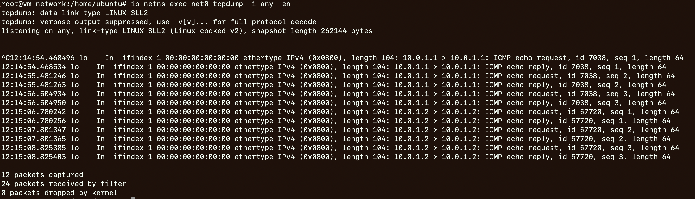

# 实验准备

- 概念基础
	- TUN/TAP
- 基本命令
	 - `man ip`
	- `ip tuntap add mode tap tap0`
	- `ip tuntap add mode tun tun0`
	- `ip tuntap del mode tap tap0`
	- `ip tuntap del mode tun tun0`

# 实验步骤

```bash
ip netns add net0

# 添加tun0设备到net0
ip tuntap add mode tun tun0
ip link set tun0 netns net0
ip netns exec net0 ip link set tun0 up
ip netns exec net0 ip address add 10.0.1.1/24 dev tun0
ip netns exec net0 ip a


# 添加tap0设备到net0
ip tuntap add mode tap tap0
ip link set tap0 netns net0
ip netns exec net0 ip link set tap0 up
ip netns exec net0 ip address add 10.0.1.2/24 dev tap0
ip netns exec net0 ip a

# ping
ip netns exec net0 ping -c3 10.0.1.1
ip netns exec net0 ping -c3 10.0.1.2

# 观察
ip netns exec net0 tcpdump -i any -en
```


# 实验结果

- 
