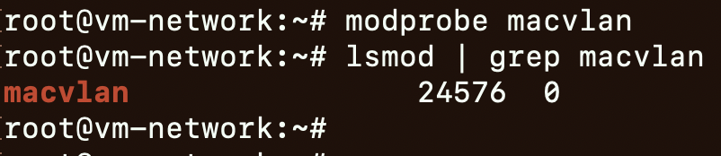
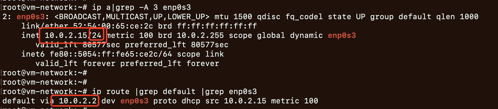
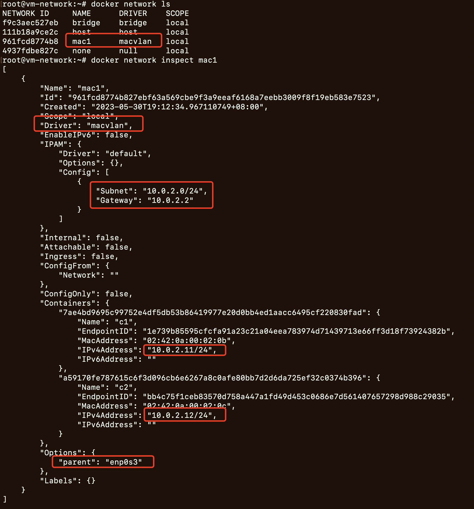
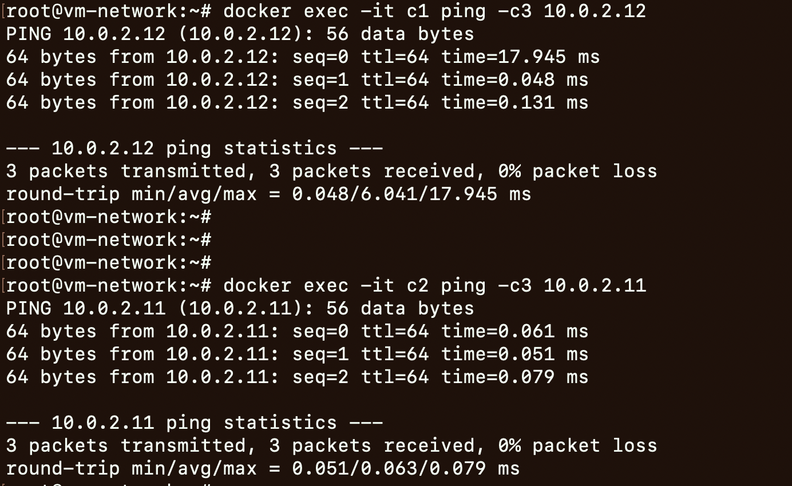
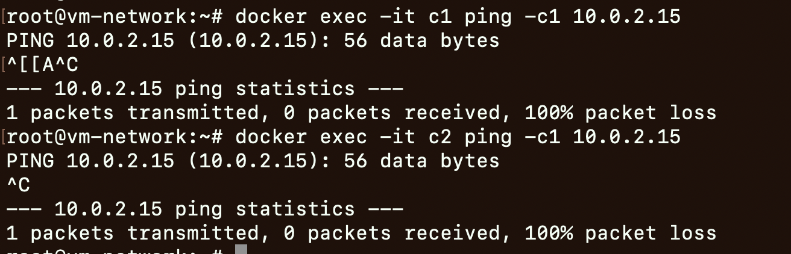

# 准备


- macvlan
    - Macvlan 允许主机的一个网络接口上配置多个虚拟的网络接口，这些网络 `interface` 有自己独立的 MAC 地址，也可以配置上 IP 地址进行通信
    - Macvlan 下的虚拟机或者容器网络和主机在同一个网段中，共享同一个广播域。
    - Macvlan 自身也支持 `VLAN`
    - 用 Macvlan 技术虚拟出来的虚拟网卡，在逻辑上和物理网卡是对等的。
        - 物理网卡也就相当于一个**交换机**，记录着对应的虚拟网卡和 MAC 地址，当物理网卡收到数据包后，会根据目的 MAC 地址判断这个包属于哪一个虚拟网卡
        - 从 Macvlan 子接口发来的数据包（或者是发往 Macvlan 子接口的数据包），物理网卡只接收数据包，不处理数据包
        - **本机 Macvlan 网卡上面的 IP 无法和物理网卡上面的 IP 通信！**
    - docker macvlan
        - Some applications, especially legacy applications or applications which monitor network traffic, expect to be directly connected to the physical network.

# 实验
docker macvlan bridge模式的实验

```bash
# 判断当前系统是否支持
modprobe macvlan
lsmod | grep macvlan

# 当前主机的情况: 获取子网和默认网关
ip a|grep -A 3 enp0s3
ip route |grep default |grep enp0s3

# 创建macvlan: mac1
docker network create -d macvlan --subnet=10.0.2.0/24 --gateway=10.0.2.2 -o parent=enp0s3 mac1
docker network ls

# 创建容器
docker run -itd --name c1 --ip=10.0.2.11 --network mac1 busybox
docker run -itd --name c2 --ip=10.0.2.12 --network mac1 busybox

# 验证容器互通
docker exec -it c1 ping -c3 10.0.2.12
docker exec -it c2 ping -c3 10.0.2.11

# 验证容器和主机不互通
docker exec -it c1 ping -c1 10.0.2.15
docker exec -it c2 ping -c1 10.0.2.15
```


- docker macvlan bridge模式实验结果
	- 开启macvlan
		- 
	- 当前机器情况
		- 
	- macvlan inspect
		- 
	- 容器互通
		- 
	- 容器和主机不互通
		- 


