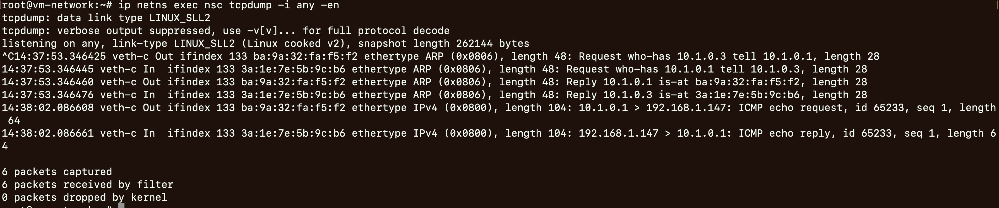
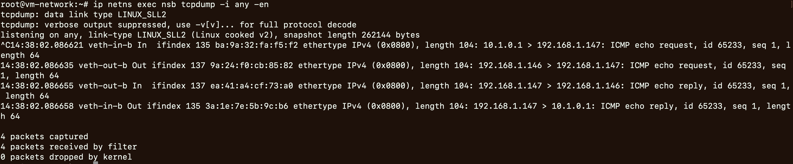
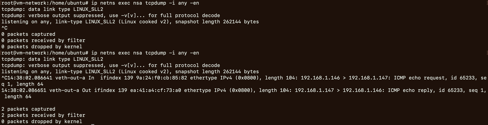
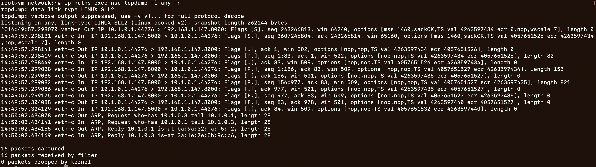
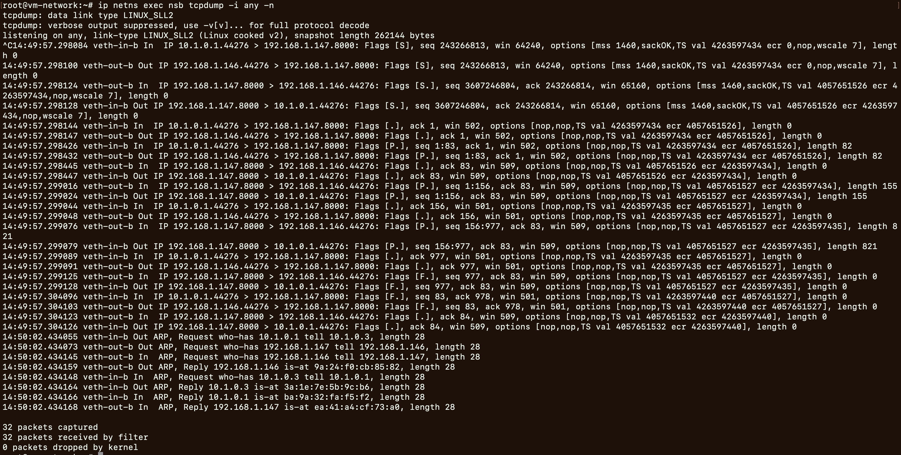
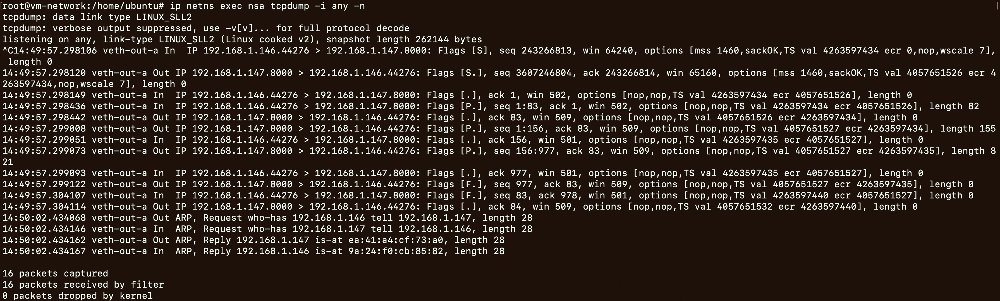
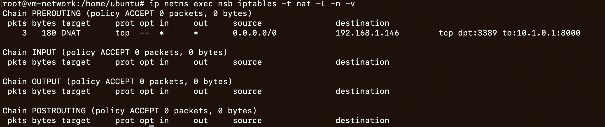
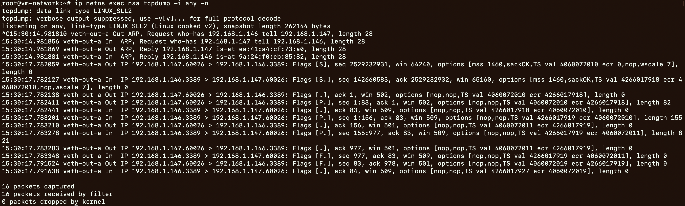
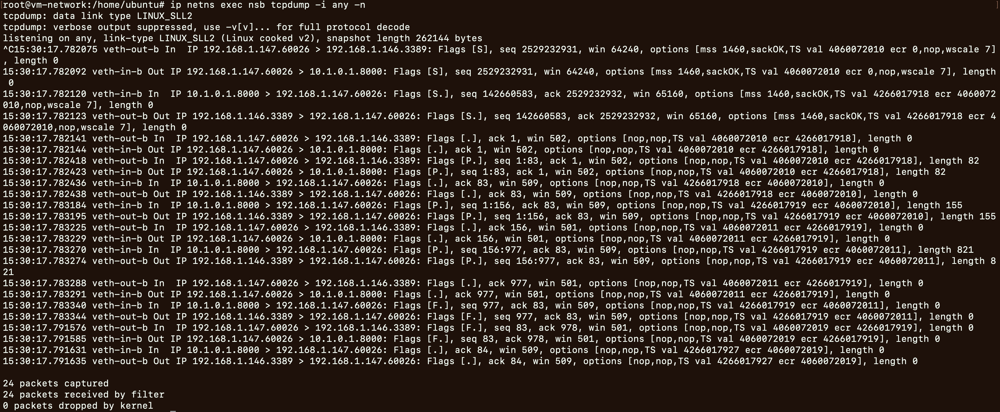
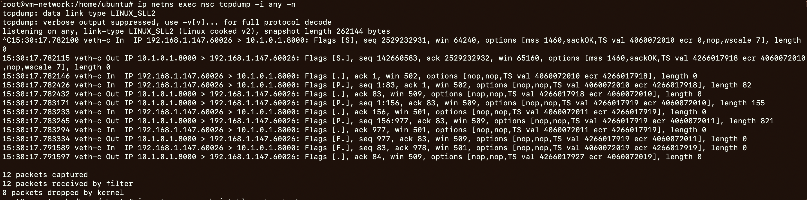

# NAT实验

## SNAT实验


```bash
ip netns add nsa
ip netns add nsb
ip netns add nsc
ip netns add nsd
ip netns add nsbrin
ip netns add nsbrout
ip netns list

ip netns exec nsbrin  brctl addbr brin
ip netns exec nsbrout brctl addbr brout
ip netns exec nsbrin  ip link set brin  up
ip netns exec nsbrout ip link set brout up
ip netns exec nsbrin  brctl show
ip netns exec nsbrout brctl show


# 关联: nsd 和 nsbrin
ip link add name veth-d mtu 1500 type veth peer name veth-in-d mtu 1500
ip link set veth-d netns nsd
ip netns exec nsd ip link set lo up
ip netns exec nsd ip link set veth-d up
ip netns exec nsd ip addr add 10.1.0.6/16 dev veth-d
ip netns exec nsd ip addr 

ip link set veth-in-d netns nsbrin
ip netns exec nsbrin ip link set veth-in-d up
ip netns exec nsbrin brctl addif brin veth-in-d
ip netns exec nsbrin ip addr
ip netns exec nsbrin brctl show


# 关联: nsc 和 nsbrin
ip link add name veth-c mtu 1500 type veth peer name veth-in-c mtu 1500
ip link set veth-c netns nsc
ip netns exec nsc ip link set lo     up
ip netns exec nsc ip link set veth-c up
ip netns exec nsc ip addr add 10.1.0.1/16 dev veth-c
ip netns exec nsc ip addr

ip link set veth-in-c netns nsbrin
ip netns exec nsbrin ip link set veth-in-c up
ip netns exec nsbrin brctl addif brin veth-in-c
ip netns exec nsbrin ip addr
ip netns exec nsbrin brctl show


# 验证ping通: nsc和nsd的通过nsbrin中的brin交换机进行通信,
ip netns exec nsc ping -c1 10.1.0.6
ip netns exec nsc ping -c1 10.1.0.1
ip netns exec nsd ping -c1 10.1.0.6
ip netns exec nsd ping -c1 10.1.0.1


# 关联: nsb 和 nsbrin
ip link add name veth-in-b mtu 1500 type veth peer name veth-brin-b mtu 1500
ip link set veth-in-b netns nsb
ip netns exec nsb ip link set lo  up
ip netns exec nsb ip link set veth-in-b up
ip netns exec nsb ip addr add 10.1.0.3/16 dev veth-in-b
ip netns exec nsb ip addr

ip link set veth-brin-b netns nsbrin
ip netns exec nsbrin ip link set veth-brin-b up
ip netns exec nsbrin brctl addif brin veth-brin-b
ip netns exec nsbrin ip addr
ip netns exec nsbrin brctl show


# 验证: 10.1.0.0/16 内网的ip能互通
ip netns exec nsb ping -c1 10.1.0.6
ip netns exec nsb ping -c1 10.1.0.1
ip netns exec nsb ping -c1 10.1.0.3


ip netns exec nsc ping -c1 10.1.0.6
ip netns exec nsc ping -c1 10.1.0.1
ip netns exec nsc ping -c1 10.1.0.3

ip netns exec nsd ping -c1 10.1.0.6
ip netns exec nsd ping -c1 10.1.0.1
ip netns exec nsd ping -c1 10.1.0.3


# 关联: nsb 和 nsbrout, 公网出口ip的设置
ip link add name veth-out-b mtu 1500 type veth peer name veth-brout-b mtu 1500
ip link set veth-out-b netns nsb
ip netns exec nsb ip link set veth-out-b up
ip netns exec nsb ip addr add 192.168.1.146/24 dev veth-out-b
ip netns exec nsb ip addr

ip link set veth-brout-b netns nsbrout
ip netns exec nsbrout ip link set veth-brout-b up
ip netns exec nsbrout brctl addif brout veth-brout-b
ip netns exec nsbrout ip addr
ip netns exec nsbrout brctl show


# 验证不能ping通公网的出口ip: nsc nsd的10.1.0.0/16子网未设置合适的路由
ip netns exec nsc ping -c1 192.168.1.146
ip netns exec nsd ping -c1 192.168.1.146


# nsc的默认网关: 是nsb上的10.1.0.3
ip netns exec nsc ip route add default via 10.1.0.3 dev veth-c
# 验证: 能ping通
ip netns exec nsc ping -c1 192.168.1.146  


# 关联: nsa 和 nsbrout, 外网的ip的设置
ip link add name veth-out-a mtu 1500 type veth peer name veth-brout-a mtu 1500
ip link set veth-out-a netns nsa
ip netns exec nsa ip link set lo up
ip netns exec nsa ip link set veth-out-a up
ip netns exec nsa ip addr add 192.168.1.147/24 dev veth-out-a
ip netns exec nsa ip addr

ip link set veth-brout-a netns nsbrout
ip netns exec nsbrout ip link set veth-brout-a up
ip netns exec nsbrout brctl addif brout veth-brout-a
ip netns exec nsbrout ip addr
ip netns exec nsbrout brctl show


# 验证: 能ping通, nsa nsb在同样的网络中192.168.1.0/24
ip netns exec nsa ping -c1 192.168.1.147
ip netns exec nsa ping -c1 192.168.1.146
ip netns exec nsb ping -c1 192.168.1.147
ip netns exec nsb ping -c1 192.168.1.146


# 验证: ping不通是正确的
ip netns exec nsc ping -c1 192.168.1.147


# 在nsb中设置snat
ip netns exec nsb cat /proc/sys/net/ipv4/ip_forward
ip netns exec nsb iptables -t nat -L -n -v
ip netns exec nsb iptables -t nat -A POSTROUTING -s 10.1.0.0/16 -j SNAT --to-source 192.168.1.146
# 或者: ip netns exec nsb iptables -t nat -A POSTROUTING -s 10.1.0.0/16 -o veth-out-b -j MASQUERADE
ip netns exec nsb iptables -t nat -L -n -v

# 验证: 能ping通外网
ip netns exec nsc ping -c1 192.168.1.147  
# 监控观测
ip netns exec nsc tcpdump -i any -en
ip netns exec nsb tcpdump -i any -en
ip netns exec nsa tcpdump -i any -en


# 模拟web: 在外网nsa中web的端口是8000, 内网nsc中请求外网的web
ip netns exec nsa python3 -m http.server 8000
ip netns exec nsa ss -nat
ip netns exec nsc curl 192.168.1.147:8000

# 模拟web时进行监控观测
ip netns exec nsc tcpdump -i any -en
ip netns exec nsb tcpdump -i any -en
ip netns exec nsa tcpdump -i any -en


# 清理
ip netns del nsa
ip netns del nsb
ip netns del nsc
ip netns del nsd
ip netns del nsbrin
ip netns del nsbrout
```


- SNAT实验
	- ping通外网的实验结果:`ip netns exec nsc ping -c1 192.168.1.147`
		- 
		- 
		- 
	- 模拟web的实验结果: `ip netns exec nsc curl 192.168.1.147:8000`
		- 
		- 
		- 
	- 观测分析: 截图中，观测nsb中的tcpdump，可以观测到SNAT的具体交互情况

## DNAT实验

DNAT实验, 接着SNAT实验继续
```
# 清除nsb上的NAT规则
ip netns exec nsb iptables -t nat -F
ip netns exec nsb iptables -t nat -L -n -v

# 当前nsc nsa不互通 
ip netns exec nsc ping -c1 192.168.1.147
ip netns exec nsa ping -c1 10.1.0.1

# 在nsc中模拟web
ip netns exec nsc python3 -m http.server 8000
ip netns exec nsc ss -ant

# 在nsb上设置DNAT规则和SNAT规则
ip netns exec nsb iptables -t nat -I PREROUTING -d 192.168.1.146 -p tcp --dport 3389 -j DNAT --to-destination 10.1.0.1:8000
ip netns exec nsb iptables -t nat -L -n -v

# 验证
ip netns exec nsa curl 192.168.1.146:3389

# 模拟web时进行监控观测
ip netns exec nsb tcpdump -i any -en
ip netns exec nsa tcpdump -i any -en
ip netns exec nsc tcpdump -i any -en


# 验证: ping不通是正确的
 ip netns exec nsa ping -c1 10.1.0.1
 ip netns exec nsc ping -c1 192.168.1.147

# 清理
ip netns del nsa
ip netns del nsb
ip netns del nsc
ip netns del nsd
ip netns del nsbrin
ip netns del nsbrout
```


- DNAT实验结果
	- `ip netns exec nsb iptables -t nat -L -n -v`
		- 
	- `ip netns exec nsa tcpdump -i any -n`
		- 
	- `ip netns exec nsb tcpdump -i any -n`
		- 
	- `ip netns exec nsc tcpdump -i any -n`
		- 


