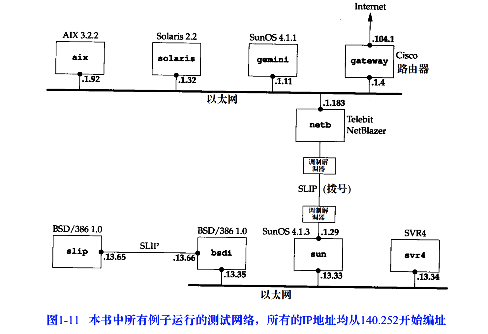
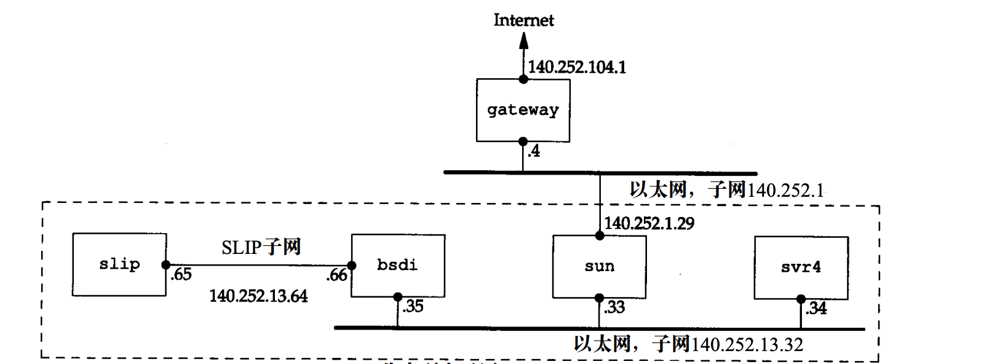

# 搭建VM
```bash
# 版本jammy, ubuntu是22.04
multipass launch --mem 8G --disk 24G --cpus 2 --network en0 --network name=bridge0,mode=manual --name vm-network

# 登录vm
multipass shell vm-network
# 更新
sudo -s
apt update
```


# 准备实验工具
```bash
# 安装openvswitch
apt-get -y install openvswitch-common openvswitch-dbg openvswitch-switch openvswitch-ipsec openvswitch-pki openvswitch-vtep

# 安装常用的工具
apt-get -y install bridge-utils
apt-get -y install arping
apt-get -y install net-tools 


# 设置openvswitch开机自启动
service openvswitch-switch status
cd /usr/share/openvswitch/scripts
./ovs-ctl status

# openvswitch的帮助命令
ovs-vsctl show
ovs-vsctl list-br
ovs-vsctl add-br nethello
ovs-vsctl del-br nethello
```


# 安装docker

```bash

# 安装docker
apt install docker.io -y

# 查看docker状态
systemctl status docker
systemctl enable docker
journalctl -xeu docker 
journalctl -f -u docker
journalctl -xeu containerd 
journalctl -f -u containerd


# 定制docker配置
tee /etc/docker/daemon.json <<EOF
{
      "exec-opts": ["native.cgroupdriver=cgroupfs"],
      "log-driver": "json-file",
      "log-opts": {
          "max-size": "100m"
       },
       "storage-driver": "overlay2",
       "registry-mirrors": [
            "https://b9pmyelo.mirror.aliyuncs.com",
            "https://registry.docker-cn.com",
            "http://hub-mirror.c.163.com",
            "https://docker.mirrors.ustc.edu.cn"
        ]
}
EOF

# 重启docker
systemctl daemon-reload
systemctl restart docker
systemctl status docker

# 查看docker基本信息
docker info
docker inspect bridge
brctl show

# 验证docker安装成功
docker pull ubuntu:22.04
docker run --privileged=true -i -t -d --name hello ubuntu:22.04
docker exec -it hello /bin/bash
apt-get -y update && apt-get install -y iproute2 iputils-arping net-tools tcpdump curl telnet iputils-tracepath traceroute
apt-get -y install vim openssh-server

# 删除实验容器hello
docker rm -f hello
```


安装docker(另外一种安装方式)
```bash
# 教程: https://linux.cn/article-14871-1.html

apt install -y apt-transport-https ca-certificates curl software-properties-common gnupg lsb-release

curl -fsSL https://download.docker.com/linux/ubuntu/gpg | gpg --dearmor -o /usr/share/keyrings/docker-archive-keyring.gpg

echo "deb [arch=$(dpkg --print-architecture) signed-by=/usr/share/keyrings/docker-archive-keyring.gpg] https://download.docker.com/linux/ubuntu $(lsb_release -cs) stable" | tee /etc/apt/sources.list.d/docker.list > /dev/null

apt update
apt install -y docker-ce docker-ce-cli containerd.io docker-compose-plugin

systemctl enable docker
systemctl status docker
journalctl -xeu docker 
journalctl -f -u docker
journalctl -xeu containerd 
journalctl -f -u containerd


# docker基本信息
docker info
docker inspect bridge
brctl show

# 重启docker
systemctl daemon-reload
systemctl restart docker
systemctl status docker

# 验证docker安装成功
docker pull ubuntu:22.04
docker run --privileged=true -i -t -d --name hello ubuntu:22.04
docker exec -it hello /bin/bash
apt-get -y update && apt-get install -y iproute2 iputils-arping net-tools tcpdump curl telnet iputils-tracepath traceroute
apt-get -y install vim openssh-server

# 删除实验容器hello
docker rm -f hello
```


# 构建镜像

```bash
# 目录
mkdir -p /root/images/tcpip && cd /root/images/tcpip

# 创建dockerfile文件
cat <<EOF > Dockerfile
FROM ubuntu:22.04
RUN apt-get -y update && apt-get install -y iproute2 iputils-arping net-tools tcpdump curl telnet iputils-tracepath traceroute

RUN apt-get -y install openbsd-inetd 
RUN echo "\
discard     stream  tcp nowait  root    internal \n\
discard     dgram   udp wait    root    internal \n\
daytime     stream  tcp nowait  root    internal \n\
time        stream  tcp nowait  root    internal \n\
echo        stream  tcp nowait  root    internal \n\
" >> /etc/inetd.conf 

RUN apt-get -y install vim openssh-server iputils-ping
RUN mkdir /run/sshd

RUN echo "\
/etc/init.d/openbsd-inetd start \n\
/usr/sbin/sshd -D \n\
" > /start.sh
RUN chmod u+x /start.sh 

CMD ["/bin/bash", "-c", "/start.sh"]
EOF

# 基于dockerfile构建镜像
docker build -t tcpip/ubuntu:experiment . 

# 启动continaer, 并验证
docker run --privileged=true -i -t -d --name test tcpip/ubuntu:experiment
docker exec -it test ss -nlp
docker exec -it test ps aux

# 删除实验容器test
docker rm -f test
```


# 搭建实验环境


- 实验环境
	- 网络结构
		- 
	- 网络结构-外网出口
		- 

- 查看网络情况的常用命令
```bash
ip a 
ip route
ip link
ip link show type veth
ip --all netns exec ip link show type veth
ls -al /var/run/netns/
ip -all netns exec ip a
ls -al /sys/class/net/*/iflink
ovs-vsctl show 
ovs-vsctl list-br
brctl show
docker inspect bridge
```


- 根据version02版本构建网络实验环境，或者根据version01版本构建网络实验环境
```text
scripts/
├── version01
│   ├── func_join_container_2_bridge.sh
│   ├── step01_init_pre.sh
│   ├── step02_init_create_containers.sh
│   ├── step03_init_data_link_layer.sh
│   └── step04_build_subnet.sh
└── version02
    ├── step01_pre.sh
    ├── step02_create_containers.sh
    ├── step03_build_data_link_layer.sh
    └── step04_build_subnet.sh
```

- 根据version02脚本构建实验环境，并验证
```text
root@vm-network:~/version02# ./step01_pre.sh 
stop ufw and disable ufw
Synchronizing state of ufw.service with SysV service script with /lib/systemd/systemd-sysv-install.
Executing: /lib/systemd/systemd-sysv-install disable ufw
iptables: ipv4 ip_forward allowed


root@vm-network:~/version02# ./step02_create_containers.sh 
create all containers: aix solaris gemini gateway netb sun svr4 bsdi slip
f888f6db6ba2d61f6f7e61d39d22de9cd6bbc06c2adff6be531ae5cba692765f
fcf96c7a45b5ced790afa9ec40830502ed57da892382ff6dc247ba1b6916cf7c
9ce7671eac48d4c10ed632126a656c549025b8a53c8bfd7a6a95a8f294a0032c
51f5ae401facf5181c45b82e6e614ec43a1ffb4828a6baa8898bb7a62feb3b63
6a2c719f381616ca114abc91b133f71a73f3e02ce8450b3d4389efe9d7915c3e
0f0dc452a6a01b201e77b7f5501d6e51433f6321e3ed6ddc0dcab8df49e3e971
ff4b27c34c6f0e9ddf5af99bc66d30a7b7f279ccfd8435f9d52324b44a52b1d3
e85972b1c4264e41cb22815d4369d5b2ba58b0971ca8cdbe7dbdc4ab23342bbe
83e466c5e9e9e9e5b1b0b3e3b548bd51adc9a95e0d2ca4cd02c41acbd6d56539


root@vm-network:~/version02# ./step03_build_data_link_layer.sh 
create bridges by openvswitch: net1 net2
bsdi net2 veth1pl12823 veth1pg12823
svr4 net2 veth1pl12756 veth1pg12756
sun net2 veth1pl12687 veth1pg12687
netb net1 veth1pl12617 veth1pg12617
gemini net1 veth1pl12477 veth1pg12477
gateway net1 veth1pl12547 veth1pg12547
aix net1 veth1pl12331 veth1pg12331
solaris net1 veth1pl12404 veth1pg12404


root@vm-network:~/version02# ./step04_build_subnet.sh enp0s3
route: slip => bsdi sun svr4
  ==>: slip(slipside)地址: 140.252.13.65/27
  ==>: bsdi(bsdiside)地址: 140.252.13.66/27
  ==>: veth: (bsdi:bsdiside) and (slip:slipside)
  ==>: slip(slipside)默认网关: 140.252.13.66, 该网关位于bsdi:bsdiside
  ==>: bsdi sun svr4: 同时位于140.252.13.32/27

route: bsdi => slip
  ==>: slip(slipside)地址: 140.252.13.65/27
  ==>: bsdi(bsdiside)地址: 140.252.13.66/27
  ==>: veth: (bsdi:bsdiside) and (slip:slipside)

route: sun svr4 => slip, 即(140.252.13.32/27)=>(140.252.13.64/27)
  ==>: bsdi(eth1): 140.252.13.35/27
  ==>: bsdi sun svr4: 同时位于140.252.13.32/27
  ==>: bsdi => slip: 140.252.13.64/27
  ==>: so, sun svr4: 通过网关140.252.13.35, 访问140.252.13.64/27

route: sun => netb
  => veth: sun(sunside) and netb(netbside)
  => net(netbside): address none
  => sun(sunside): 地址140.252.1.29/24, 位于网络140.252.1.0/24

route: netb => sun
   ==> 即: netb => sun => 140.252.13.32/27

route: bsdi,svr4 => *
  ==> sun(eth1): 140.252.13.33/27
  ==> sun bsdi svr4: 位于同样的140.252.13.32/27
  ==> route: sun <=> netb
  ==> route: netb <=> gateway
  ==> route: gateway <=> 主机 <=> public network
  ==> so, bsdi svr4i: 默认网关是140.252.13.33

route: sun => *
  ==> sun: 默认网关是140.252.1.4

route: netb => *
  ==> netb: 默认网关是140.252.1.4

route: netb => 140.252.13.32/27
route: netb => 140.252.13.64/27
arp proxy for netb
  ==> netb: 不是一个普通的路由器
  ==> netb: 两边是同一个二层网络，所以需要配置arp proxy，将同一个二层网络隔离称为两个

route: aix solaris gemini gateway => 140.252.13.32/27
  ==> sun(sunside): 140.252.1.29
  ==> sun(eth1): 140.252.13.33/27, 位于140.252.13.32/27
  ==> aix solaris gemini gateway: 通过140.252.1.29网关, 路由到140.252.13.32/27网络

route: aix solaris gemini gateway => 140.252.13.64/27
  ==> sun(sunside): 140.252.1.29
  ==> aix solaris gemini gateway => netb => 140.252.1.29
  ==> sun route: => 140.252.13.64/27
  ==> aix solaris gemini gateway: 通过140.252.1.29网关, 路由到140.252.13.64/27网络

route: gateway => 主机
  ==> gateway容器: 默认网关140.252.104.1 BY gatewayin网卡
  ==> gatewayin : 140.252.104.2/24, 位于gateway容器内
  ==> gatewayout: 140.252.104.1/24, 位于主机内
  ==> veth: gatewayout and gatewayin

iptables: gateway => 主机 <<=(SNAT)=>> public network
  ==> 主机使用MASQUERADE进行动态的SNAT操作
  ==> IP报文的源IP修改为enp0s3网卡中可用的地址
  ==> 容器内的网络地址是主机内部私有的,访问public network需要SNAT
route: 主机 => 140.252.1.0/24, 140.252.13.32/27, 140.252.13.64/27
  ==> 匹配140.252.1.0/24  的数据报, 通过gatewayout网卡, 发给网关140.252.104.2
  ==> 匹配140.252.13.32/27的数据报, 通过gatewayout网卡, 发给网关140.252.104.2
  ==> 匹配140.252.13.64/27的数据报, 通过gatewayout网卡, 发给网关140.252.104.2
  ==> gatewayout: 140.252.104.1/24, 位于主机内
  ==> gatewayin : 140.252.104.2/24, 位于gateway容器内
  ==> veth: gatewayout and gatewayin
  ==> gateway容器: route => 140.252.1.0/24, 140.252.13.32/27, 140.252.13.64/27 

route: gateway <=> aix solaris gemini
  ==> gateway(eth1): 140.252.1.4/24
  ==> aix solaris gemini gateway: 位于140.252.1.0/24网络

route: aix solaris gemini => public network
  ==> gateway(eth1): 140.252.1.4/24
  ==> gateway => public network
  ==> so, aix solaris gemini 默认网关是: 140.252.1.4

root@vm-network:~/version02# docker ps
CONTAINER ID   IMAGE                     COMMAND                  CREATED          STATUS          PORTS     NAMES
6e7f6ed30f5d   tcpip/ubuntu:experiment   "/bin/bash -c /start…"   28 seconds ago   Up 28 seconds             slip
52c936f641d5   tcpip/ubuntu:experiment   "/bin/bash -c /start…"   29 seconds ago   Up 28 seconds             bsdi
a696e4688cec   tcpip/ubuntu:experiment   "/bin/bash -c /start…"   29 seconds ago   Up 28 seconds             svr4
9253f837f6a9   tcpip/ubuntu:experiment   "/bin/bash -c /start…"   29 seconds ago   Up 29 seconds             sun
4f55621ef1dd   tcpip/ubuntu:experiment   "/bin/bash -c /start…"   30 seconds ago   Up 29 seconds             netb
f7762a927864   tcpip/ubuntu:experiment   "/bin/bash -c /start…"   30 seconds ago   Up 30 seconds             gateway
f421d05db0ed   tcpip/ubuntu:experiment   "/bin/bash -c /start…"   31 seconds ago   Up 30 seconds             gemini
acc9c0fa4fc7   tcpip/ubuntu:experiment   "/bin/bash -c /start…"   31 seconds ago   Up 31 seconds             solaris
f1878c82ec5b   tcpip/ubuntu:experiment   "/bin/bash -c /start…"   32 seconds ago   Up 31 seconds             aix

root@vm03:~/version02# docker exec -it slip ping -c3 baidu.com
PING baidu.com (39.156.66.10) 56(84) bytes of data.
64 bytes from 39.156.66.10 (39.156.66.10): icmp_seq=1 ttl=53 time=15.9 ms
64 bytes from 39.156.66.10 (39.156.66.10): icmp_seq=2 ttl=53 time=29.3 ms
64 bytes from 39.156.66.10 (39.156.66.10): icmp_seq=3 ttl=53 time=16.4 ms

--- baidu.com ping statistics ---
3 packets transmitted, 3 received, 0% packet loss, time 2050ms
rtt min/avg/max/mdev = 15.915/20.506/29.255/6.188 ms
```


- 重新搭建实验环境需要做的清理工作
```bash
docker stop aix solaris gemini gateway netb sun svr4 bsdi slip
docker rm aix solaris gemini gateway netb sun svr4 bsdi slip
ovs-vsctl del-br net1 
ovs-vsctl del-br net2
echo $(ip netns list |grep -v id)
for nsid in $(ip netns list |grep -v id); do ip netns delete ${nsid}; done
echo $(ip netns list |grep -v id)
```


