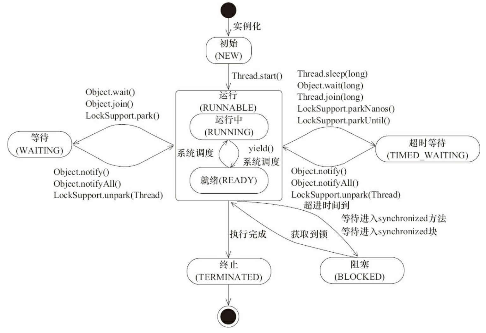
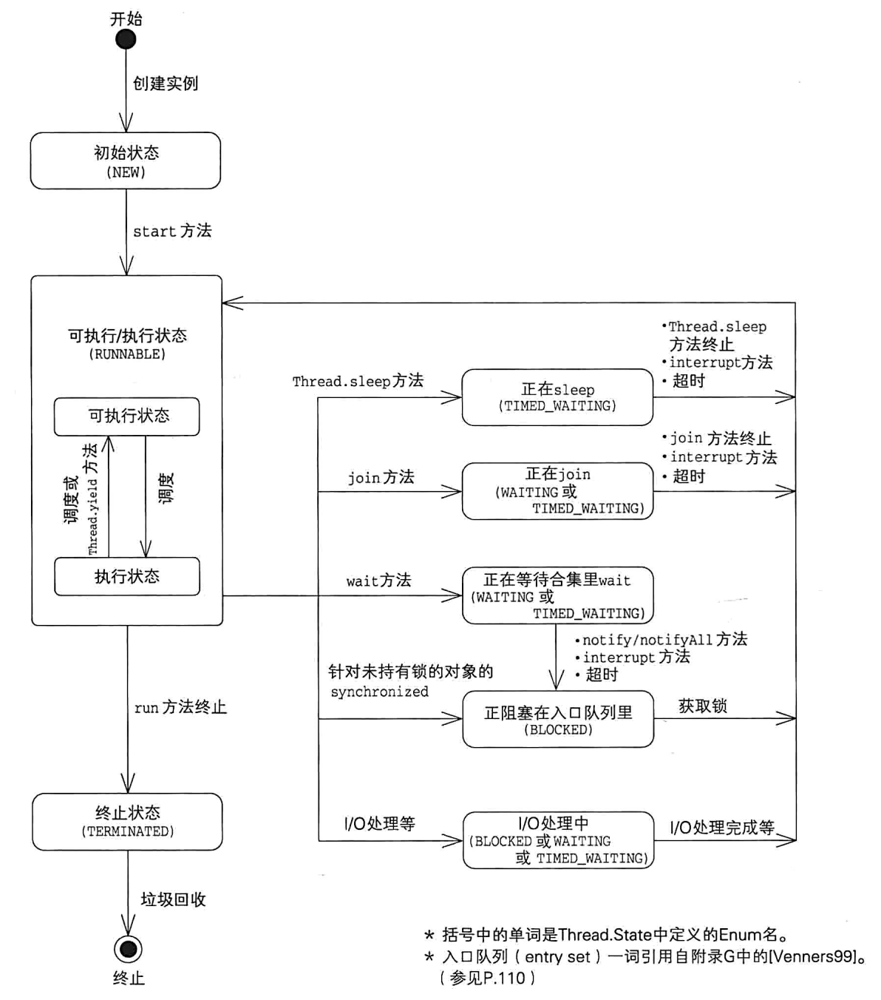
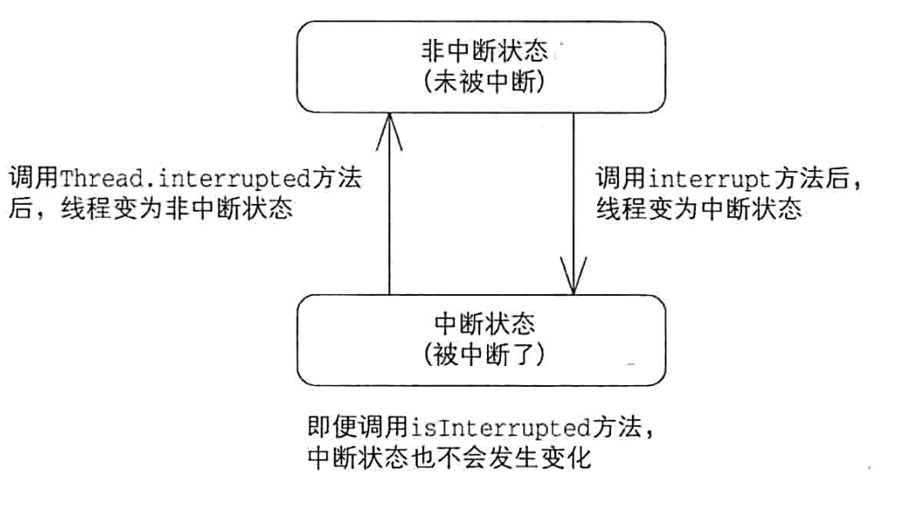
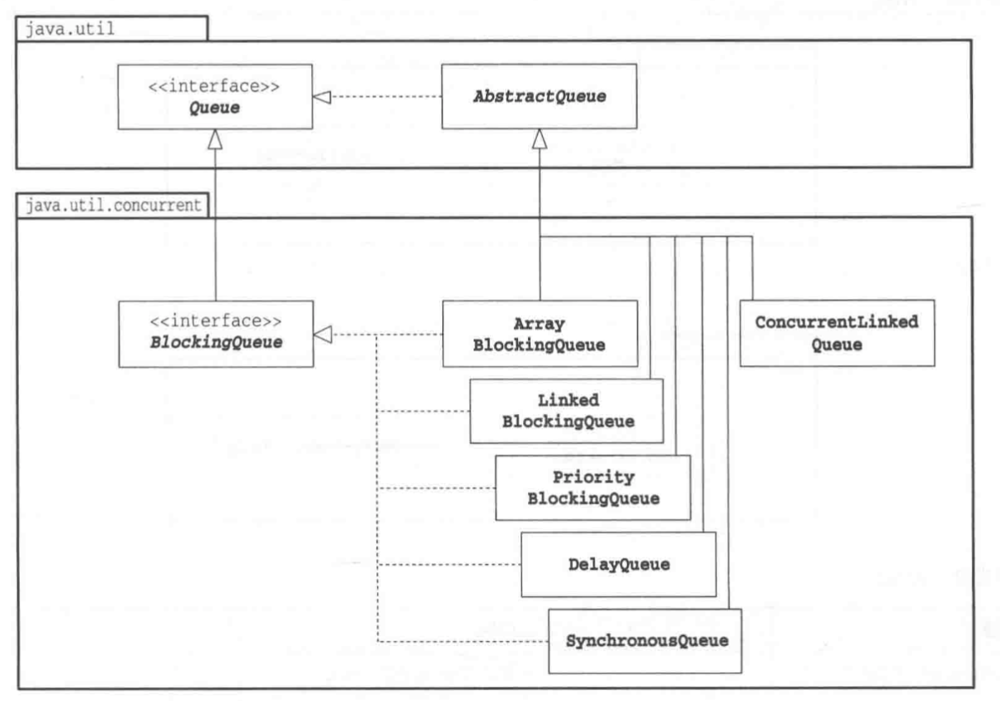
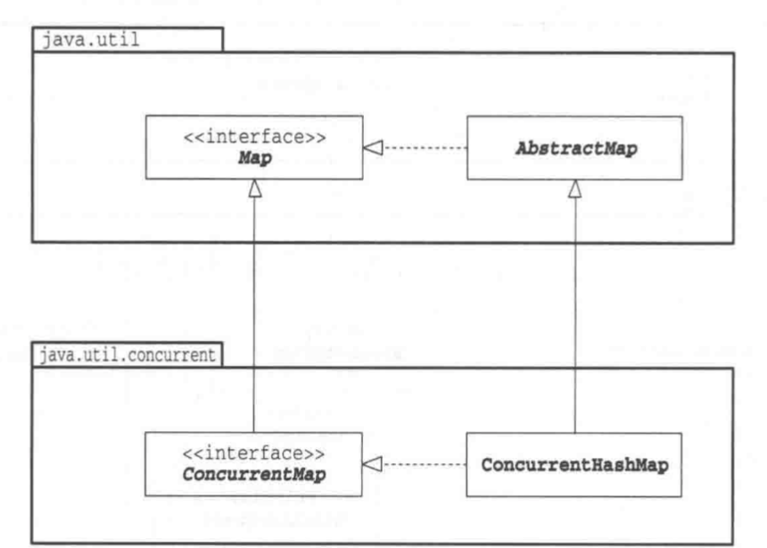
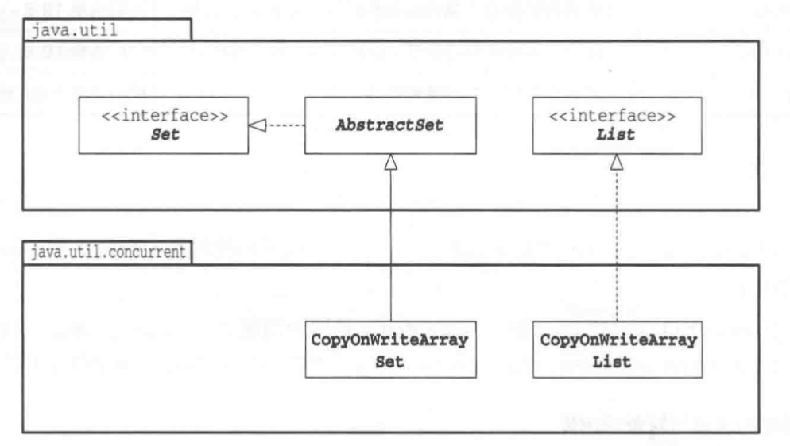
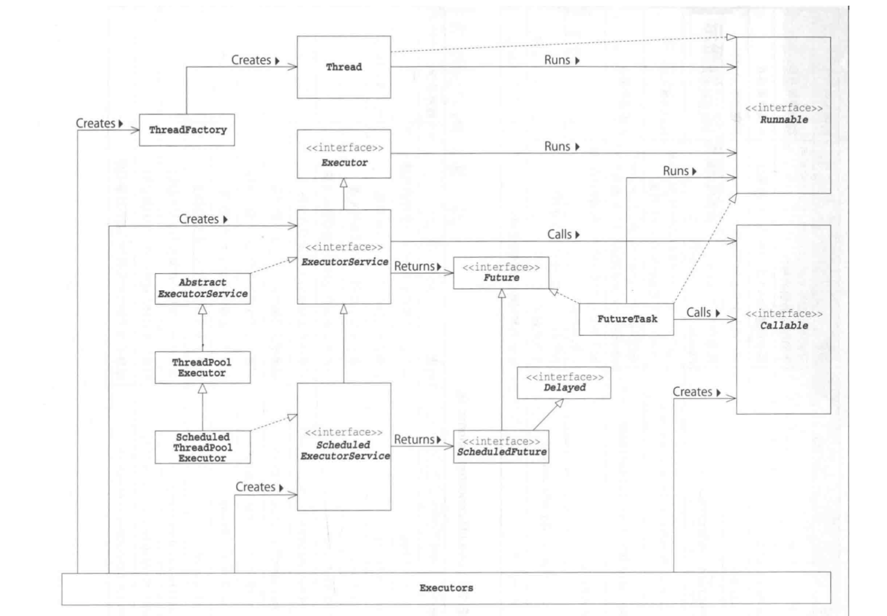
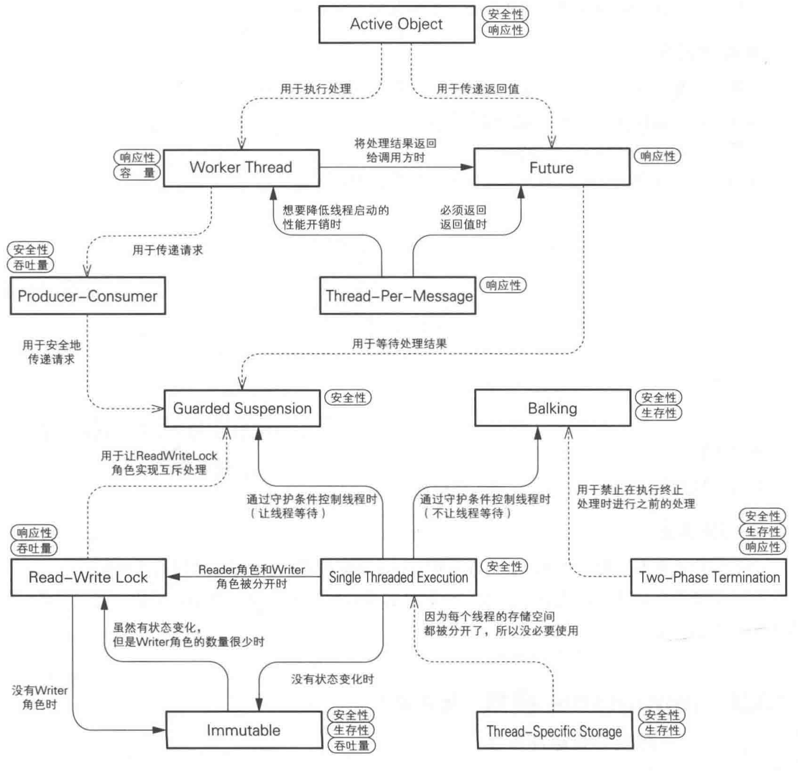

# Challenges

- 并发编程的挑战
	- 上下文切换的开销
	- 线程创建和销毁的开销
	- 死锁
	- 软硬件资源限制
- 如何减少上下文切换
	- **无锁并发编程**：多线程竞争锁时，会引起上下文切换，可以用一些办法来避免使用锁
	- **CAS算法**：java的Atomic包使用CAS算法来更新数据，而不需要加锁。
	- **使用最少线程**: 避免创建不需要的线程，比如任务很少，但是创建了很多线程来处理，这样会造成大量线程都处于等待状态
	- **协程**: 在单线程里实现多任务的调度，并在单线程里维持多个任务间的切换
- 上下文切换的衡量
	- 使用Lmbench3可以测量上下文切换的时长。
	- 使用vmstat可以测量上下文切换的次数。
- 死锁
	- 后果:一旦产生死锁，就会造成系统功能不可用.
	- 定位:一旦出现死锁，业务不能继续提供服务了，通过dump线程查看到底是哪个线程出现了问题。
	- **避免死锁**:   
		- 避免一个线程同时获取多个锁。
		- 避免一个线程在锁内同时占用多个资源，尽量保证每个锁只占用一个资源。
		- 尝试使用定时锁，使用lock.tryLock（timeout）来替代使用内部锁机制。
		- 对于数据库锁，加锁和解锁必须在一个数据库连接里，否则会出现解锁失败的情况。
- 资源限制
	- **什么是资源限制**
		- 资源限制是指在进行并发编程时，程序的执行速度受限于计算机硬件资源或软件资源。
		- 例如:网络带宽 硬盘读写速度 CPU处理速度 数据库连接数  socket连接数等
	- **资源限制引发的并发问题**
		- 在并发编程中，将代码执行速度加快的原则是将代码中串行执行的部分变成并发执行。
		- 但是如果将某段串行的代码并发执行，因为受限于资源，仍然在串行执行，这时候程序不仅不会加快执行，反而会更慢，因为增加了上下文切换和资源调度的时间。
	- **如何解决资源限制的问题**
		- 对于硬件资源限制，可以考虑使用集群并行执行程序
		- 对于软件资源限制，可以考虑使用资源池复用资源
			- 比如使用连接池将数据库和Socket连接复用，或者在调用对方webservice接口获取数据时，只建立一个连接。 
	- **在资源限制情况下进行并发编程**
		- 根据不同的资源限制调整程序的并发度


# 原理部分

## JMM

- JMM: java memory model, java内存模型
- reorder: 重排序
	- 编译机和java虚拟机通过改变程序的处理顺序来优化程序，在多线程程序里，有时会发生明显由重排序引发的问题。
- visibility: 可见性
	- 当一个线程向一个共享变量写入某个值，这个值对另一个线程是否可见
- shared memory: 共享内存
	- Memory that can be shared between threads is called shared memory or heap memory.
	- 共享内存是所有线程共享的存储空间，也就是堆内存。
	- 在JMM中,只有可以被多个线程访问的共享内存才会出问题
	- 所有实例域、静态域和数组元素都存储在堆内存，线程间共享
	- 局部变量,方法参数和异常处理器参数不会在线程之间共享，没有内存可见性问题，不受内存模型影响
- synchronized关键字
	- synchronized 具有“线程的互斥处理”和“同步处理”的两种功能
	- 互斥: 线程在synchronized开始时获取锁(lock)，在synchronized终止时释放锁(unlock)
	- 同步: JMM保证某个线程在进行unlock操作前进行的所有写入操作对进行lock操作的线程都是可见的
- volatile关键字
	- volatile具有“同步处理”和"对long和double原子处理"的两种功能
	- 同步: 某个线程对volatile字段进行的写操作的结果对其他线程立即可见
	- 原子: java规范无法确保对long和double的赋值操作的原子性；如果long和double的字段是volatile字段，可以确保赋值操作的原子性
	- 向volatile字段写入的值如果对线程B可见，那么之前写入的所有值就都是可见的
	- volatile不会进行线程的互斥处理
- happens-before
	- JMM通过happens-before关系向程序员提供跨线程的内存可见性保证
		- 例如，A线程的写操作a与B线程的读操作b之间存在happensbefore关系，尽管a操作和b操作在不同的线程中执行，但JMM向程序员保证a操作将对b操作可见。
	- [Happens-Before Relationship](https://docs.oracle.com/javase/specs/jls/se7/html/jls-17.html#jls-17.4.5)
		- Each action in a thread happens before every subsequent action in that thread.
		- An unlock on a monitor happens before every subsequent lock on that monitor. 
		- A write to a volatile field happens before every subsequent read of that volatile. 
		- A call to start() on a thread happens before any actions in the started thread. 
		- All actions in a thread happen before any other thread successfully returns from a join() on that thread.
		- If an action a happens before an action b, and b happens before an action c, then a happens before c.
- final字段
	- JMM可以确保构造函数处理结束时final字段的值被正确初始化，对其他线程是可见的. 
	- 但是，不要从构造函数中泄露this
- JMM定义的操作，归纳起来主要有:
	- normal read 操作
	- normal write 操作
	- volatile read  操作
	- volatile write 操作
	- lock 操作
	- unlock 操作
	- 线程启动操作
	- 线程终止操作
	- 线程启动后的第一个操作
	- 线程终止前的最后一个操作
- Double-Checked Locking
	- [The "Double-Checked Locking is Broken" Declaration](http://www.cs.umd.edu/~pugh/java/memoryModel/DoubleCheckedLocking.html) 
	- 基于volatile的解决方案
	- 基于final和构造函数的解决方案
	- Initialization On Demand Holder (原因: 类的初始化时线程安全的)
- Reference
	- [Threads and Locks, Thread Model](https://docs.oracle.com/javase/specs/jls/se7/html/jls-17.html#jls-17.4)
	- [JSR133](https://www.jcp.org/en/jsr/detail?id=133  )
	- [Doug Lea Blogs](http://www.cs.umd.edu/~pugh/java/memoryModel/)
	- [jls-se7](https://docs.oracle.com/javase/specs/jls/se7/html/jls-17.html)
	- java并发编程的艺术:第3章
	- [The JSR-133 Cookbook for Compiler Writers](http://gee.cs.oswego.edu/dl/jmm/cookbook.html)


​


## Memory Barriers

> `Memory barrier instructions` directly control only the interaction of a CPU with its cache, with its write-buffer that holds stores waiting to be flushed to memory, and/or its buffer of waiting loads or speculatively executed instructions. 
> These effects may lead to further interaction among caches, main memory and other processors.


**Reorderings**

| **Can Reorder**                  | *2nd operation*               | *2nd operation*                  | *2nd operation*                 |
| -------------------------------- | ----------------------------- | -------------------------------- | ------------------------------- |
| *1st operation*                  | Normal Load <br/>Normal Store | Volatile Load  <br/>MonitorEnter | Volatile Store <br/>MonitorExit |
| Normal Load <br/> Normal Store   |                               |                                  | No                              |
| Volatile Load <br/> MonitorEnter | No                            | No                               | No                              |
| Volatile store <br/> MonitorExit |                               | No                               | No                              |

Where:

- Normal Loads are getfield, getstatic, array load of non-volatile fields.
- Normal Stores are putfield, putstatic, array store of non-volatile fields
- Volatile Loads are getfield, getstatic of volatile fields that are accessible by multiple threads
- Volatile Stores are putfield, putstatic of volatile fields that are accessible by multiple threads
- MonitorEnters (including entry to synchronized methods) are for lock objects accessible by multiple threads.
- MonitorExits (including exit from synchronized methods) are for lock objects accessible by multiple threads.


**Final Fields**

> Loads and Stores of final fields act as "normal" accesses with respect to locks and volatiles, but impose two additional reordering rules:
>
> 1. A store of a final field (inside a constructor) and, if the field is a reference, any store that this final can reference, cannot be reordered with a subsequent store (outside that constructor) of the reference to the object holding that field into a variable accessible to other threads.
> 2. The initial load (i.e., the very first encounter by a thread) of a final field cannot be reordered with the initial load of the reference to the object containing the final field. 
>
> These rules imply that reliable use of final fields by Java programmers requires that the load of a shared reference to an object with a final field itself be synchronized, volatile, or final, or derived from such a load, thus ultimately ordering the initializing stores in constructors with subsequent uses outside constructors.


------

**Barriers Categories**


| Barriers   | Sequence                     | Desc                                                         |      |
| ---------- | ---------------------------- | ------------------------------------------------------------ | ---- |
| LoadLoad   | `Load1; LoadLoad; Load2`     | ensures that Load1's data are loaded before data accessed by Load2 and all subsequent load instructions are loaded. In general, explicit LoadLoad barriers are needed on processors that perform speculative loads and/or out-of-order processing in which waiting load instructions can bypass waiting stores. On processors that guarantee to always preserve load ordering, the barriers amount to no-ops. |      |
| StoreStore | `Store1; StoreStore; Store2` | ensures that Store1's data are visible to other processors (i.e., flushed to memory) before the data associated with Store2 and all subsequent store instructions. In general, StoreStore barriers are needed on processors that do not otherwise guarantee strict ordering of flushes from write buffers and/or caches to other processors or main memory. |      |
| LoadStore  | `Load1; LoadStore; Store2`   | ensures that Load1's data are loaded before all data associated with Store2 and subsequent store instructions are flushed. LoadStore barriers are needed only on those out-of-order procesors in which waiting store instructions can bypass loads. |      |
| StoreLoad  | `Store1; StoreLoad; Load2`   | ensures that Store1's data are made visible to other processors (i.e., flushed to main memory) before data accessed by Load2 and all subsequent load instructions are loaded. StoreLoad barriers protect against a subsequent load incorrectly using Store1's data value rather than that from a more recent store to the same location performed by a different processor. Because of this, on the processors discussed below, a StoreLoad is strictly necessary only for separating stores from subsequent loads of the same location(s) as were stored before the barrier. StoreLoad barriers are needed on nearly all recent multiprocessors, and are usually the most expensive kind. Part of the reason they are expensive is that they must disable mechanisms that ordinarily bypass cache to satisfy loads from write-buffers. This might be implemented by letting the buffer fully flush, among other possible stalls. |      |


The following table shows how these barriers correspond to JSR-133 ordering rules.

| **Required barriers**           | *2nd operation* | *2nd operation* | *2nd operation*                 | *2nd operation*                 |
| ------------------------------- | --------------- | --------------- | ------------------------------- | ------------------------------- |
| *1st operation*                 | Normal Load     | Normal Store    | Volatile Load <br/>MonitorEnter | Volatile Store<br/> MonitorExit |
| Normal Load                     |                 |                 |                                 | LoadStore                       |
| Normal Store                    |                 |                 |                                 | StoreStore                      |
| Volatile Load <br/>MonitorEnter | LoadLoad        | LoadStore       | LoadLoad                        | LoadStore                       |
| Volatile Store <br/>MonitorExit |                 |                 | StoreLoad                       | StoreStore                      |


------

**Interactions with Atomic Instructions**

| **Required Barriers** | *2nd operation* |              |               |                |              |             |
| --------------------- | --------------- | ------------ | ------------- | -------------- | ------------ | ----------- |
| *1st operation*       | Normal Load     | Normal Store | Volatile Load | Volatile Store | MonitorEnter | MonitorExit |
| Normal Load           |                 |              |               | LoadStore      |              | LoadStore   |
| Normal Store          |                 |              |               | StoreStore     |              | StoreExit   |
| Volatile Load         | LoadLoad        | LoadStore    | LoadLoad      | LoadStore      | LoadEnter    | LoadExit    |
| Volatile Store        |                 |              | StoreLoad     | StoreStore     | StoreEnter   | StoreExit   |
| MonitorEnter          | EnterLoad       | EnterStore   | EnterLoad     | EnterStore     | EnterEnter   | EnterExit   |
| MonitorExit           |                 |              | ExitLoad      | ExitStore      | ExitEnter    | ExitExit    |


In this table, "Enter" is the same as "Load" and "Exit" is the same as "Store", unless overridden by the use and nature of atomic instructions. In particular:

- EnterLoad is needed on entry to any synchronized block/method that performs a load. It is the same as LoadLoad unless an atomic instruction is used in MonitorEnter and itself provides a barrier with at least the properties of LoadLoad, in which case it is a no-op.
- StoreExit is needed on exit of any synchronized block/method that performs a store. It is the same as StoreStore unless an atomic instruction is used in MonitorExit and itself provides a barrier with at least the properties of StoreStore, in which case it is a no-op.
- ExitEnter is the same as StoreLoad unless atomic instructions are used in MonitorExit and/or MonitorEnter and at least one of these provide a barrier with at least the properties of StoreLoad, in which case it is a no-op.


------


**Recipes**

> 1. Issue a StoreStore barrier before each volatile store.
>    (On ia64 you must instead fold this and most barriers into corresponding load or store instructions.)
> 2. Issue a StoreStore barrier after all stores but before return from any constructor for any class with a final field.
> 3. Issue a StoreLoad barrier after each volatile store.
>    Note that you could instead issue one before each volatile load, but this would be slower for typical programs using volatiles in which reads greatly outnumber writes. Alternatively, if available, you can implement volatile store as an atomic instruction (for example XCHG on x86) and omit the barrier. This may be more efficient if atomic instructions are cheaper than StoreLoad barriers.
> 4. Issue LoadLoad and LoadStore barriers after each volatile load.
>    On processors that preserve data dependent ordering, you need not issue a barrier if the next access instruction is dependent on the value of the load. In particular, you do not need a barrier after a load of a volatile reference if the subsequent instruction is a null-check or load of a field of that reference.
> 5. Issue an ExitEnter barrier either before each MonitorEnter or after each MonitorExit.
>    (As discussed above, ExitEnter is a no-op if either MonitorExit or MonitorEnter uses an atomic instruction that supplies the equivalent of a StoreLoad barrier. Similarly for others involving Enter and Exit in the remaining steps.)
> 6. Issue EnterLoad and EnterStore barriers after each MonitorEnter.
> 7. Issue StoreExit and LoadExit barriers before each MonitorExit.
> 8. If on a processor that does not intrinsically provide ordering on indirect loads, issue a LoadLoad barrier before each load of a final field.


removing redundant barriers. The above tables indicate that barriers can be eliminated as follows:

| Original   |                     |            | =>   | Transformed |                     |            |
| ---------- | ------------------- | ---------- | ---- | ----------- | ------------------- | ---------- |
| 1st        | ops                 | 2nd        | =>   | 1st         | ops                 | 2nd        |
| LoadLoad   | [no loads]          | LoadLoad   | =>   |             | [no loads]          | LoadLoad   |
| LoadLoad   | [no loads]          | StoreLoad  | =>   |             | [no loads]          | StoreLoad  |
| StoreStore | [no stores]         | StoreStore | =>   |             | [no stores]         | StoreStore |
| StoreStore | [no stores]         | StoreLoad  | =>   |             | [no stores]         | StoreLoad  |
| StoreLoad  | [no loads]          | LoadLoad   | =>   | StoreLoad   | [no loads]          |            |
| StoreLoad  | [no stores]         | StoreStore | =>   | StoreLoad   | [no stores]         |            |
| StoreLoad  | [no volatile loads] | StoreLoad  | =>   |             | [no volatile loads] | StoreLoad  |


------


**Reference**

> [The JSR-133 Cookbook for Compiler Writers](http://gee.cs.oswego.edu/dl/jmm/cookbook.html)  
> [JSR 133 (Java Memory Model) FAQ](http://www.cs.umd.edu/~pugh/java/memoryModel/jsr-133-faq.html)
>
> [内存屏障](https://www.jianshu.com/p/2ab5e3d7e510)
> [what-does-a-loadload-barrier-really-do](https://stackoverflow.com/questions/15360598/what-does-a-loadload-barrier-really-do)[What is difference between getXXXVolatile vs getXXX in java unsafe?](https://stackoverflow.com/questions/48615456/what-is-difference-between-getxxxvolatile-vs-getxxx-in-java-unsafe)
>
> 
>
> Atomic*.lazySet
>     [AtomicInteger lazySet vs set](https://stackoverflow.com/questions/1468007/atomicinteger-lazyset-vs-set/14020946)
>     [Atomic lazySet](http://psy-lob-saw.blogspot.com/2012/12/atomiclazyset-is-performance-win-for.html)
>     [What do Atomic::lazySet/Atomic FieldUpdater::lazySet/Unsafe::putOrdered actually mean?](http://psy-lob-saw.blogspot.com/2016/12/what-is-lazyset-putordered.html)
>     [Add lazySet methods to atomic classes](https://bugs.java.com/bugdatabase/view_bug.do?bug_id=6275329)
>
> 
>
> > UNSAFE.putOrderedLong:
> > 	a Store/Store barrier between this write and any previous store.
> >
> > 
> >
> > UNSAFE.putLongVolatile:
> > 	Store/Store barrier between this write and any previous write ,
> >
> > ​    and a Store/Load barrier between this write and any subsequent volatile read.
> >
>


## Unsafe API

- 参考资料
	- [Unsafe类详解](https://www.cnblogs.com/mickole/articles/3757278.html)
	- [Part 4: sun.misc.Unsafe](http://mishadoff.com/blog/java-magic-part-4-sun-dot-misc-dot-unsafe/)
	- [Src Unsafe.java](http://hg.openjdk.java.net/jdk8/jdk8/jdk/file/687fd7c7986d/src/share/classes/sun/misc/Unsafe.java)


### Method Categories

| Category            | Mehtod                                                       | Desc                                                        |
| ------------------- | ------------------------------------------------------------ | ----------------------------------------------------------- |
| **Info**            | `addressSize` <br/> `pageSize`<br/>                          | Just returns some low-level memory information.             |
| **Objects**         | `allocateInstance`   <br/>  `objectFieldOffset`<br/>         | Provides methods for object and its fields manipulation.    |
| **Classes**         | `staticFieldOffset`<br/> `defineClass`<br/> `defineAnonymousClass`<br/> `ensureClassInitialized`<br/> | Provides methods for classes and static fields manipulation |
| **Arrays**          | `arrayBaseOffset`<br/> `arrayIndexScale`<br/>                | Arrays manipulation                                         |
| **Memory**          | `allocateMemory`<br/>`copyMemory` <br/>`freeMemory` <br/>`reallocateMemory`<br/>`getAddress` <br/>`getInt`<br/>`putInt` <br>`getLong`  <br/>`putLong`  <br/>`getObject` <br/>`putObject` <br/> | Direct memory access methods                                |
| **CAS**             | `compareAndSwapInt` <br/>`compareAndSwapLong` <br/>`compareAndSwapObject` <br/> | Compare And Swap                                            |
| **Synchronization** | `park` <br/>`unpark` <br/>                                   | Low level primitives for synchronization.                   |
| **Synchronization** | `monitorEnter` <br/>`tryMonitorEnter`<br/>`monitorExit` <br/> | Low level primitives for synchronization.                   |
| **Synchronization** | `getIntVolatile` <br/>`putIntVolatile`  <br/>`getLongVolatile`  <br/>`putLongVolatile`  <br/> | Low level primitives for synchronization.                   |
| **Synchronization** | `putOrderedInt`<br/>`putOrderedLong`<br/>`putOrderedObject`<br/> | Low level primitives for synchronization.                   |


### Method Details

```java
package sun.misc;

import java.lang.reflect.Field;

/***
 * This class should provide access to low-level operations and its
 * use should be limited to trusted code.  Fields can be accessed using
 * memory addresses, with undefined behaviour occurring if invalid memory
 * addresses are given.
 *
 * @author Tom Tromey (tromey@redhat.com)
 * @author Andrew John Hughes (gnu_andrew@member.fsf.org)
 */
public class Unsafe
{
  // Singleton class.
  private static Unsafe unsafe = new Unsafe();

  /***
   * Private default constructor to prevent creation of an arbitrary number of instances.
   */
  private Unsafe(){}

  /***
   * Retrieve the singleton instance of <code>Unsafe</code>.  The calling
   * method should guard this instance from untrusted code, as it provides
   * access to low-level operations such as direct memory access.
   *
   * @throws SecurityException if a security manager exists and prevents
   *                           access to the system properties.
   */
  public static Unsafe getUnsafe()
  {
    SecurityManager sm = System.getSecurityManager();
    if (sm != null)
      sm.checkPropertiesAccess();
    return unsafe;
  }
  
  /***
   * Returns the memory address offset of the given static field.
   * The offset is merely used as a means to access a particular field
   * in the other methods of this class.  The value is unique to the given
   * field and the same value should be returned on each subsequent call.
   *
   * @param field the field whose offset should be returned.
   * @return the offset of the given field.
   */
  public native long objectFieldOffset(Field field);

  
  /***
   * Compares the value of the integer field at the specified offset
   * in the supplied object with the given expected value, and updates
   * it if they match.  The operation of this method should be atomic,
   * thus providing an uninterruptible way of updating an integer field.
   *
   * @param obj the object containing the field to modify.
   * @param offset the offset of the integer field within <code>obj</code>.
   * @param expect the expected value of the field.
   * @param update the new value of the field if it equals <code>expect</code>.
   * @return true if the field was changed.
   */
  public native boolean compareAndSwapInt(Object obj, long offset, int expect, int update);

  /***
   * Compares the value of the long field at the specified offset
   * in the supplied object with the given expected value, and updates
   * it if they match.  The operation of this method should be atomic,
   * thus providing an uninterruptible way of updating a long field.
   *
   * @param obj the object containing the field to modify.
   * @param offset the offset of the long field within <code>obj</code>.
   * @param expect the expected value of the field.
   * @param update the new value of the field if it equals <code>expect</code>.
   * @return true if the field was changed.
   */
  public native boolean compareAndSwapLong(Object obj, long offset, long expect, long update);

  /***
   * Compares the value of the object field at the specified offset
   * in the supplied object with the given expected value, and updates
   * it if they match.  The operation of this method should be atomic,
   * thus providing an uninterruptible way of updating an object field.
   *
   * @param obj the object containing the field to modify.
   * @param offset the offset of the object field within <code>obj</code>.
   * @param expect the expected value of the field.
   * @param update the new value of the field if it equals <code>expect</code>.
   * @return true if the field was changed.
   */
  public native boolean compareAndSwapObject(Object obj, long offset, Object expect, Object update);

  
  /***
   * Sets the value of the integer field at the specified offset in the
   * supplied object to the given value.  This is an ordered or lazy
   * version of <code>putIntVolatile(Object,long,int)</code>, which
   * doesn't guarantee the immediate visibility of the change to other
   * threads.  It is only really useful where the integer field is
   * <code>volatile</code>, and is thus expected to change unexpectedly.
   *
   * @param obj the object containing the field to modify.
   * @param offset the offset of the integer field within <code>obj</code>.
   * @param value the new value of the field.
   * @see #putIntVolatile(Object,long,int)
   */
  public native void putOrderedInt(Object obj, long offset, int value);

  /***
   * Sets the value of the long field at the specified offset in the
   * supplied object to the given value.  This is an ordered or lazy
   * version of <code>putLongVolatile(Object,long,long)</code>, which
   * doesn't guarantee the immediate visibility of the change to other
   * threads.  It is only really useful where the long field is
   * <code>volatile</code>, and is thus expected to change unexpectedly.
   *
   * @param obj the object containing the field to modify.
   * @param offset the offset of the long field within <code>obj</code>.
   * @param value the new value of the field.
   * @see #putLongVolatile(Object,long,long)
   */
  public native void putOrderedLong(Object obj, long offset, long value);

  /***
   * Sets the value of the object field at the specified offset in the
   * supplied object to the given value.  This is an ordered or lazy
   * version of <code>putObjectVolatile(Object,long,Object)</code>, which
   * doesn't guarantee the immediate visibility of the change to other
   * threads.  It is only really useful where the object field is
   * <code>volatile</code>, and is thus expected to change unexpectedly.
   *
   * @param obj the object containing the field to modify.
   * @param offset the offset of the object field within <code>obj</code>.
   * @param value the new value of the field.
   */
  public native void putOrderedObject(Object obj, long offset, Object value);

  /***
   * Sets the value of the integer field at the specified offset in the
   * supplied object to the given value, with volatile store semantics.
   *
   * @param obj the object containing the field to modify.
   * @param offset the offset of the integer field within <code>obj</code>.
   * @param value the new value of the field.
   */
  public native void putIntVolatile(Object obj, long offset, int value);

  /***
   * Retrieves the value of the integer field at the specified offset in the
   * supplied object with volatile load semantics.
   *
   * @param obj the object containing the field to read.
   * @param offset the offset of the integer field within <code>obj</code>.
   */
  public native int getIntVolatile(Object obj, long offset);

  /***
   * Sets the value of the long field at the specified offset in the
   * supplied object to the given value, with volatile store semantics.
   *
   * @param obj the object containing the field to modify.
   * @param offset the offset of the long field within <code>obj</code>.
   * @param value the new value of the field.
   * @see #putLong(Object,long,long)
   */
  public native void putLongVolatile(Object obj, long offset, long value);

  /***
   * Sets the value of the long field at the specified offset in the
   * supplied object to the given value.
   *
   * @param obj the object containing the field to modify.
   * @param offset the offset of the long field within <code>obj</code>.
   * @param value the new value of the field.
   * @see #putLongVolatile(Object,long,long)
   */
  public native void putLong(Object obj, long offset, long value);

  /***
   * Retrieves the value of the long field at the specified offset in the
   * supplied object with volatile load semantics.
   *
   * @param obj the object containing the field to read.
   * @param offset the offset of the long field within <code>obj</code>.
   * @see #getLong(Object,long)
   */
  public native long getLongVolatile(Object obj, long offset);

  /***
   * Retrieves the value of the long field at the specified offset in the
   * supplied object.
   *
   * @param obj the object containing the field to read.
   * @param offset the offset of the long field within <code>obj</code>.
   * @see #getLongVolatile(Object,long)
   */
  public native long getLong(Object obj, long offset);

  /***
   * Sets the value of the object field at the specified offset in the
   * supplied object to the given value, with volatile store semantics.
   *
   * @param obj the object containing the field to modify.
   * @param offset the offset of the object field within <code>obj</code>.
   * @param value the new value of the field.
   * @see #putObject(Object,long,Object)
   */
  public native void putObjectVolatile(Object obj, long offset, Object value);

  /***
   * Sets the value of the object field at the specified offset in the
   * supplied object to the given value.
   *
   * @param obj the object containing the field to modify.
   * @param offset the offset of the object field within <code>obj</code>.
   * @param value the new value of the field.
   * @see #putObjectVolatile(Object,long,Object)
   */
  public native void putObject(Object obj, long offset, Object value);

  /***
   * Retrieves the value of the object field at the specified offset in the
   * supplied object with volatile load semantics.
   *
   * @param obj the object containing the field to read.
   * @param offset the offset of the object field within <code>obj</code>.
   */
  public native Object getObjectVolatile(Object obj, long offset);

  /***
   * Returns the offset of the first element for a given array class.
   * To access elements of the array class, this value may be used along
   * with that returned by 
   * <a href="#arrayIndexScale"><code>arrayIndexScale</code></a>,
   * if non-zero.
   *
   * @param arrayClass the class for which the first element's address should
   *                   be obtained.
   * @return the offset of the first element of the array class.
   * @see arrayIndexScale(Class)
   */
  public native int arrayBaseOffset(Class arrayClass);

  /***
   * Returns the scale factor used for addressing elements of the supplied
   * array class.  Where a suitable scale factor can not be returned (e.g.
   * for primitive types), zero should be returned.  The returned value
   * can be used with 
   * <a href="#arrayBaseOffset"><code>arrayBaseOffset</code></a>
   * to access elements of the class.
   *
   * @param arrayClass the class whose scale factor should be returned.
   * @return the scale factor, or zero if not supported for this array class.
   */
  public native int arrayIndexScale(Class arrayClass);
  
  /***
   * Releases the block on a thread created by 
   * <a href="#park"><code>park</code></a>.  This method can also be used
   * to terminate a blockage caused by a prior call to <code>park</code>.
   * This operation is unsafe, as the thread must be guaranteed to be
   * live.  This is true of Java, but not native code.
   *
   * @param thread the thread to unblock.
   */
  public native void unpark(Thread thread);

  /***
   * Blocks the thread until a matching 
   * <a href="#unpark"><code>unpark</code></a> occurs, the thread is
   * interrupted or the optional timeout expires.  If an <code>unpark</code>
   * call has already occurred, this also counts.  A timeout value of zero
   * is defined as no timeout.  When <code>isAbsolute</code> is
   * <code>true</code>, the timeout is in milliseconds relative to the
   * epoch.  Otherwise, the value is the number of nanoseconds which must
   * occur before timeout.  This call may also return spuriously (i.e.
   * for no apparent reason).
   *
   * @param isAbsolute true if the timeout is specified in milliseconds from
   *                   the epoch.
   * @param time either the number of nanoseconds to wait, or a time in
   *             milliseconds from the epoch to wait for.
   */
  public native void park(boolean isAbsolute, long time);

}
```


# 实战部分
## Threads基础


### 线程状态

| 状态         | 描述                                                                                |
| ------------ | ---------------------------------------------------------------------------------- |
| NEW          | 初始状态，线程被构建还没有调用start()方法                                                |
| RUNNABLE     | 运行状态，java线程将OS中的就绪和运行两种状态笼统地称作运行中                                |
| BLOCKED      | 阻塞状态，表示线程阻塞于锁                                                             |
| WAITING      | 等待状态，表示线程进入等待状态，进入该状态表示当前线程需要等待其他线程做出一些特定动作(通知或中断) |
| TIME_WAITING | 超时等待状态，该状态不同于WAITING，是可以在指定的时间自行返回的                              |
| TERMINATED   | 终止状态，表示当前线程已经执行完毕                                                       |


- 线程相关的方法和线程状态迁移
	- 
- 线程状态迁移
	- 


### java.lang.Object

| METHOD                          | Description                                                      |
| ------------------------------- | ---------------------------------------------------------------- |
| `notify()`                      | Wakes up a single thread that is waiting on this object's monitor. |
| `notifyAll()`                   | Wakes up all threads that are waiting on this object's monitor.    |
| `wait()`                        | Causes the current thread to wait until another thread invokes the `notify()`method or the `notifyAll()`method for this object. |
| `wait(long timeout)`            | Causes the current thread to wait until either another thread invokes the `notify()`method or the `notifyAll()` method for this object, or a specified amount of time has elapsed. |
| `wait(long timeout, int nanos)` | Causes the current thread to wait until another thread invokes the `notify()` method or the `notifyAll()` method for this object, or some other thread interrupts the current thread, or a certain amount of real time has elapsed. |


`public final void notify()`

> 从在这个对象上 wait 着的线程中选择一个并唤醒它，如果当前线程没有获取这个对象的锁(没有持有监视器)，在运行时会被抛出异常java.lang.IllegalMonitorStateException
> 
> Wakes up a single thread that is waiting on this object's monitor.
>
> This method should only be called by a thread that is the owner of this object's monitor. A thread becomes the owner of the object's monitor in one of three ways:
>
> - By executing a synchronized instance method of that object.
> - By executing the body of a `synchronized` statement that synchronizes on the object.
> - For objects of type `Class,` by executing a synchronized static method of that class.
>
> Only one thread at a time can own an object's monitor.


`public final void notifyAll()`


> 唤醒在这个对象上 wait 着的全部线程。
> 如果当前线程没有获取这个对象的锁(没有持有监视器)，在运行时异常会被抛出java.lang.
IllegalMonitorStateException。
>
> This method should only be called by a thread that is the owner of this object's monitor. 
> Only one thread at a time can own an object's monitor. 
> A thread becomes the owner of the object's monitor in one of three ways:
> - By executing a `synchronized` instance method of that object.
> - By executing the body of a `synchronized` statement that synchronizes on the object.
> - For objects of type `Class,` by executing a `synchronized` static method of that class.


`public final void wait() throws InterruptedException`
> 让当前线程(调用wait方法的线程) wait，不会发生超时。
> 与sleep方法不同，当前线程获取的锁会被释放。
> 如果当前线程没有获取这个对象的锁(没有持有监视器)，在运行时会被抛出异常java.lang.
IllegalMonitorStateException。
> 如果其他线程`interrupt`了当前线程，会被抛出异常java.lang.InterruptedException，中断状态也会被清除。
> 
> Causes the current thread to wait until another thread invokes the `notify()`method or the `notifyAll()`method for this object.
>
> The current thread must own this object's monitor. 
>
> The thread releases ownership of this monitor and waits until another thread notifies threads waiting on this object's monitor to wake up either through a call to the `notify` method or the `notifyAll` method.


`public final void wait(long millis) throws InterruptedException`
> 让当前线程(调用wait方法的线程)wait；
> millis是发生超时的时间(以毫秒为单位), 如果是 wait(0)，则不会发生超时;如果 millis 为负数，在运行时异常java.lang.IllegalArgumentException会被抛出。
> 与 sleep 方法不同，当前线程获取的锁会被释放。
> 如果当前线程没有获取这个对象的锁(没有持有监视器)，在运行时会被抛出异常 java.lang.IllegalMonitorStateException;
> 当正在wait时，如果其他线程`interrupt`了当前线程，会被抛出异常java.lang.InterruptedException，中断状态也会被清除。
> 
> Causes the current thread to wait until either another thread invokes the `notify()`method or the `notifyAll()` method for this object, or a specified amount of time has elapsed.
>
> The current thread must own this object's monitor.
>
> This method causes the current thread (call it T) to place itself in the wait set for this object and then to relinquish any and all synchronization claims on this object. Thread T becomes disabled for thread scheduling purposes and lies dormant until one of four things happens:
>
> - Some other thread invokes the `notify` method for this object and thread T happens to be arbitrarily chosen as the thread to be awakened.
> - Some other thread invokes the `notifyAll` method for this object.
> - Some other thread [interrupts](https://docs.oracle.com/javase/8/docs/api/java/lang/Thread.html#interrupt--) thread T.
> - The specified amount of real time has elapsed, more or less. If `timeout` is zero, however, then real time is not taken into consideration and the thread simply waits until notified.
>
> The thread T is then removed from the wait set for this object and re-enabled for thread scheduling. 
>
> A thread can also wake up without being notified, interrupted, or timing out, a so-called **spurious wakeup**. While this will rarely occur in practice, applications must guard against it by testing for the condition that should have caused the thread to be awakened, and continuing to wait if the condition is not satisfied. In other words, waits should always occur in loops, like this one:

```java
  synchronized (obj) {
	  while (<condition does not hold>)
		  obj.wait(timeout);
	  ... // Perform action appropriate to condition
  }
```


 `public final void wait(long millis, int nanos) throws InterruptedException`
 
> 让当前线程(调用 wait 方法的线程) wait。
> 1000000 * millis + nanos 是发生超时的时间(以纳秒为单位)。
> 如果是 wait (0，0)，则不会发生超时。
> 与 sleep 方法不同，当前线程获取的锁会被释放。
> 如果millis 为负数或者nanos 的值不在0至999999 之间，在运行时会被抛出异常java.lang.IllegalArgumentException。
> 如果当前线程没有获取这个对象的锁(没有持有监视器)，在运行时会被抛出异常java.lang.
IllegalMonitorStateException。
> 当正在wait时，如果其他线程 `interrupt` 了当前线程，会抛出异常 java.lang.InterruptedException，中断状态也会被清除。
> 
> This method is similar to the `wait` method of one argument, but it allows finer control over the amount of time to wait for a notification before giving up.


### java.lang.Runnable

`public void run ()`

> 在创建 java.lang.Thread 的实例时，如果指定实现了 Runnable 接口的类的实例，那么线程启动后会调用 run 方法.
> 
> When an object implementing interface `Runnable` is used to create a thread, starting the thread causes the object's `run` method to be called in that separately executing thread.


### java.lang.Thread


- 创建 java.lang.Thread 的实例
	- `public Thread(Runnable target)`
	- `public Thread(Runnable target,String name)`
	- `public Thread(string name)`
	- `public Thread(ThreadGroup group, Runnable target)`
	- `public Thread(ThreadGroup group, Runnable target, String name)`
	- `public Thread(ThreadGroup group, String name)`
- `public static Thread currentThread()`
	- 获取与当前线程(调用本方法的线程)对应的 java.lang.Thread 的实例
- `public long getId()`
	- 获取本线程(this)的线程ID
	- 线程ID是一个直到线程终止都不会改变的唯一的正整数。线程终止后，线程 ID 可能会被重复使用。
- 线程名
	- `public final string getName()`: 获取本线程(this)的名字
- 线程状态
	- `public Tread.State getstate()`: 获取本线程(this)当前的状态。该状态是用于监视线程的，并不是用于线程同步的。
- `public static boolean holdsLock(object obj)`
	- 如果当前线程持有 obj 的监视器，则本方法返回 true
- daemon: 后台线程
- `public void run()`
	- 当本线程(this)被启动后，本方法会被调用。
	- 本方法通常会被java.lang.Thread 类的子类重写。
- `public void start()`
	- 启动线程。新启动的线程会调用this的 run 方法。
	- 如果本线程(this)已经启动了，异常 java.lang.IllegalThreadStateException会被抛出。
- `public String toString()`
	- 获取由本线程(this)的名字、优先级、线程组等构成的字符串
- 中断
	- `public void interrupt()`: 改变中断状态
		- 中断本线程(this)，这里是中断与this对应的线程，并不一定会中断与Thread.currentThread()对应的线程。
	- `public static boolean interrupted()`: 用于检查并**清除**当前线程的中断状态
		- Thread类的静态方法
		- 只有这个方法才可以清除中断状态，操作的是当前线程，该方法并不能用于清除其他线程的中断状态
		- 判断当前线程(调用interrupted方法的线程)是否处于中断状态。调用本方法后，当前线程将不再处于中断状态
	- `public boolean isInterrupted()`: 用于检查指定线程的中断状态，并不会改变中断状态
		- 判断本线程(this)是否处于中断状态。即使调用本方法，本线程(this)的中断状态也不会变化
	- 线程的中断状态
		- 
- priority: 优先级
	- Java的线程优先级只能在特定的Java平台运行环境中起作用
	- Java规范中几乎没有规定任何通用于所有 Java 平台运行环境的优先级
		- Java 规范中并没有写明优先级的值是否会对线程的运行产生影响，
		- 以及如果会产生影响，
		- 具体是什么样的影响
	- 优先级只在特定的 Java 平台运行环境 ( Java VM 的实现和版本，以及操作系统)中起作用
		- 如果无论如何都必须使用优先级，需要先确定 Java 平台运行环境，然后调查该运行环境是如何处理优先级的。
		- 但是，这种做法无法确保这段程序在其他运行环境中执行时与在当前运行环境中执行时程序行为是相同的。
- join
	- `public final void join() throws InterruptedException`
	- `public final void join(long millis) throws InterruptedException`
	- `public final void join(long millis, int nanos) throws InterruptedException`
	- 让当前线程(调用join方法的线程)等待本线程(this)终止。
	- 如果在等待过程中其他线程 interrupt 了当前线程(调用join方法的线程)。
		- 异常 java.lang.InterruptedException会被抛出，当前线程的中断状态也会被清除
- sleep
	- `public static void sleep(long millis) throws InterruptedException`
		- 让当前线程(调用sleep方法的线程)在指定时间(毫秒单位)内停止运行
	- `public static void sleep(long millis, int nanos) throws InterruptedException`
		- 让当前线程(调用sleep方法的线程)在指定时间(纳秒单位)内停止运行
	- 与wait方法不同的是，当前线程获取的锁不会被释放
	- 如果在运行停止期间，其他线程 `interrupt` 了当前线程，会抛出异常java.lang.InterruptedException，并清除中断状态。
- `public static void yield()`
	- 暂时停止当前线程(调用本方法的线程)，让其他线程有被执行的可能性
- 不在推荐使用的方法
	- `public final void stop()`
	- `public final void stop(Throwable obj)`
	- `public final void suspend()`
	- `public void resume()`


`public void interrupt()`

> Interrupts this thread.
>
> If this thread is blocked in an invocation of the [`wait()`](https://docs.oracle.com/javase/8/docs/api/java/lang/Object.html#wait--), [`wait(long)`](https://docs.oracle.com/javase/8/docs/api/java/lang/Object.html#wait-long-), or [`wait(long, int)`](https://docs.oracle.com/javase/8/docs/api/java/lang/Object.html#wait-long-int-) methods of the [`Object`](https://docs.oracle.com/javase/8/docs/api/java/lang/Object.html) class, or of the [`join()`](https://docs.oracle.com/javase/8/docs/api/java/lang/Thread.html#join--), [`join(long)`](https://docs.oracle.com/javase/8/docs/api/java/lang/Thread.html#join-long-), [`join(long, int)`](https://docs.oracle.com/javase/8/docs/api/java/lang/Thread.html#join-long-int-), [`sleep(long)`](https://docs.oracle.com/javase/8/docs/api/java/lang/Thread.html#sleep-long-), or [`sleep(long, int)`](https://docs.oracle.com/javase/8/docs/api/java/lang/Thread.html#sleep-long-int-), methods of this class, then its interrupt status will be cleared and it will receive an [`InterruptedException`](https://docs.oracle.com/javase/8/docs/api/java/lang/InterruptedException.html).
>
> If this thread is blocked in an I/O operation upon an [`InterruptibleChannel`](https://docs.oracle.com/javase/8/docs/api/java/nio/channels/InterruptibleChannel.html) then the channel will be closed, the thread's interrupt status will be set, and the thread will receive a [`ClosedByInterruptException`](https://docs.oracle.com/javase/8/docs/api/java/nio/channels/ClosedByInterruptException.html).
>
> If this thread is blocked in a [`Selector`](https://docs.oracle.com/javase/8/docs/api/java/nio/channels/Selector.html) then the thread's interrupt status will be set and it will return immediately from the selection operation, possibly with a non-zero value, just as if the selector's [`wakeup`](https://docs.oracle.com/javase/8/docs/api/java/nio/channels/Selector.html#wakeup--) method were invoked.
>
> If none of the previous conditions hold then this thread's interrupt status will be set.
>
> Interrupting a thread that is not alive need not have any effect.
>
> 如果没有调用sleep 、wait、join等方法，或者没有编写检查线程的中断状态并抛出InterruptedException异常的代码，那么InterruptedException异常就不会被抛出

**InterruptedException**

> Thrown when a thread is waiting, sleeping, or otherwise occupied, and the thread is interrupted, either before or during the activity. Occasionally a method may wish to test whether the current thread has been interrupted, and if so, to immediately throw this exception. The following code can be used to achieve this effect:

 ```java
   if (Thread.interrupted())  // Clears interrupted status!
       throw new InterruptedException();
 ```


### java.lang.ThreadLocal

- `java.lang.ThreadLocal<T\>`: 是带有类型参数的泛型类。
	- `public T get()`
		- 获取与当前线程(调用本方法的线程)对应的值。
		- 当一次都还没有通过 set 方法存储过值的时候，返回值是 null。
	- `public void set(T value)`
		- 设置与当前线程(调用本方法的线程)对应的值
	- `public void remove()`
		- 删除与当前线程(调用本方法的线程)对应的值


### ThreadMXBean

- `java.lang.management.ThreadMXBean`
- `java.lang.management.ThreadInfo`


### Reference

- 参考资料
	- [Chapter 17. Threads and Locks](https://docs.oracle.com/javase/specs/jls/se7/html/jls-17.html#jls-17.2)
	- [Thread Document](https://docs.oracle.com/javase/8/docs/api/java/lang/Thread.html)
	- [Object Document](https://docs.oracle.com/javase/8/docs/api/java/lang/Object.html)
	- [Runnable Document](https://docs.oracle.com/javase/8/docs/api/java/lang/Runnable.html)
	- [ThreadLocal Document](https://docs.oracle.com/javase/8/docs/api/java/lang/ThreadLocal.html)


## JDK并发包

| package                     | reference                           |
| --------------------------- | ------------------------------------ |
| java.util.concurrent        | [package tree](https://docs.oracle.com/javase/8/docs/api/java/util/concurrent/package-tree.html )<br/>[package summary](https://docs.oracle.com/javase/8/docs/api/java/util/concurrent/package-summary.html) |
| java.util.concurrent.locks  | [package tree](https://docs.oracle.com/javase/8/docs/api/java/util/concurrent/locks/package-tree.html)<br/>[package summary](https://docs.oracle.com/javase/8/docs/api/java/util/concurrent/locks/package-summary.html) |
| java.util.concurrent.atomic | [package tree](https://docs.oracle.com/javase/8/docs/api/java/util/concurrent/atomic/package-tree.html) <br/>[package summary](https://docs.oracle.com/javase/8/docs/api/index.html?java/util/concurrent/atomic/package-summary.html) |


### 线程同步工具


| Class            | Desc                                                         |
| ---------------- | ------------------------------------------------------------ |
| [Semaphore](https://docs.oracle.com/javase/8/docs/api/java/util/concurrent/Semaphore.html)      | 计数信号量 <br/> A counting semaphore.                                   |
| [CountDownLatch](https://docs.oracle.com/javase/8/docs/api/java/util/concurrent/CountDownLatch.html) | 让线程等待某个操作执行完指定次数的同步机制 <br/>A synchronization aid that allows one or more threads to wait until a set of operations being performed in other threads completes. |
| [CyclicBarrier](https://docs.oracle.com/javase/8/docs/api/java/util/concurrent/CyclicBarrier.html)  | 让多个线程在特定位置(屏障)等待的同步机制 <br/>A synchronization aid that allows a set of threads to all wait for each other to reach a common barrier point. |
| [Exchanger](https://docs.oracle.com/javase/8/docs/api/java/util/concurrent/Exchanger.html)      | 让两个线程交换对象的同步机制 <br/>A synchronization point at which threads can pair and swap elements within pairs.                              |
| [Phaser](https://docs.oracle.com/javase/8/docs/api/java/util/concurrent/Phaser.html)         | A reusable synchronization barrier, similar in functionality to [`CyclicBarrier`](https://docs.oracle.com/javase/8/docs/api/java/util/concurrent/CyclicBarrier.html) and [`CountDownLatch`](https://docs.oracle.com/javase/8/docs/api/java/util/concurrent/CountDownLatch.html) but supporting more flexible usage. |


### Concurrent Queue


- `java.util.concurrent.BlockingQueue`接口
	- 如果 BlockingQueue 是空的，线程从 BlockingQueue 取出元素的操作将会被阻断而进入等待状态，直到有元素被添加到 BlockingQueue 中才会被唤醒。
	- 同样地，如果 BlockingQueue 是满的，当线程试图往里添加元素操作也会被阻断而进入等待状态，直到 BlockingQueue 里有空间时才会被唤醒继续操作。
- `java.util.concurrent,ConcurrentLinkedQueue` 类
	- 是通过分割内部的数据结构防止线程冲突的 Queue。





| Class                                                        | Desc                                                         |
| ------------------------------------------------------------ | ------------------------------------------------------------ |
| [BlockingQueue<E\>](https://docs.oracle.com/javase/8/docs/api/java/util/concurrent/BlockingQueue.html)                  | 添加和取出元素时发生阻塞的队列 <br/>A [`Queue`](https://docs.oracle.com/javase/8/docs/api/java/util/Queue.html) that additionally supports operations that wait for the queue to become non-empty when retrieving an element, <br/>and wait for space to become available in the queue when storing an element. |
| [ArrayBlockingQueue<E\>](https://docs.oracle.com/javase/8/docs/api/java/util/concurrent/ArrayBlockingQueue.html)            | 以数组为基础的 BlockingQueue<br/> A bounded [blocking queue](https://docs.oracle.com/javase/8/docs/api/java/util/concurrent/BlockingQueue.html) backed by an array. |
| [LinkedBlockingQueue<E\>](https://docs.oracle.com/javase/8/docs/api/java/util/concurrent/LinkedBlockingQueue.html)            | 以链表为基础的 BlockingQueue <br/> An optionally-bounded [blocking queue](https://docs.oracle.com/javase/8/docs/api/java/util/concurrent/BlockingQueue.html) based on linked nodes. |
| [PriorityBlockingQueue<E\>](https://docs.oracle.com/javase/8/docs/api/java/util/concurrent/PriorityBlockingQueue.html)           | 带有优先级的 BlockingQueue <br/> An unbounded [blocking queue](https://docs.oracle.com/javase/8/docs/api/java/util/concurrent/BlockingQueue.html) that uses the same ordering rules as class [`PriorityQueue`](https://docs.oracle.com/javase/8/docs/api/java/util/PriorityQueue.html) and supplies blocking retrieval operations. |
| [DelayQueue](https://docs.oracle.com/javase/8/docs/api/java/util/concurrent/DelayQueue.html)<E extends [Delayed](https://docs.oracle.com/javase/8/docs/api/java/util/concurrent/Delayed.html)>    | 可以在一定时间后取出元素的 BlockingQueue <br/> An unbounded [blocking queue](https://docs.oracle.com/javase/8/docs/api/java/util/concurrent/BlockingQueue.html) of `Delayed` elements, in which an element can only be taken when its delay has expired. |
| [SynchronousQueue<E\>](https://docs.oracle.com/javase/8/docs/api/java/util/concurrent/SynchronousQueue.html)                | 一手交钱一手交货的 BlockingQueue <br/> A [blocking queue](https://docs.oracle.com/javase/8/docs/api/java/util/concurrent/BlockingQueue.html) in which each insert operation must wait for a corresponding remove operation by another thread, and vice versa. |
| [ConcurrentLinkedQueue<E\>](https://docs.oracle.com/javase/8/docs/api/java/util/concurrent/ConcurrentLinkedQueue.html)           |元素数量没有上限的线程安全的 Queue <br/> An unbounded thread-safe [queue](https://docs.oracle.com/javase/8/docs/api/java/util/Queue.html) based on linked nodes. |
| [TransferQueue<E\>](https://docs.oracle.com/javase/8/docs/api/java/util/concurrent/TransferQueue.html)                   | A [`BlockingQueue`](https://docs.oracle.com/javase/8/docs/api/java/util/concurrent/BlockingQueue.html) in which producers may wait for consumers to receive elements. |


### Concurrent Map



| Class                                                        | Desc                                                         |
| ------------------------------------------------------------ | ------------------------------------------------------------ |
| [ConcurrentMap](https://docs.oracle.com/javase/8/docs/api/java/util/concurrent/ConcurrentMap.html)<K,V>           | A [`Map`](https://docs.oracle.com/javase/8/docs/api/java/util/Map.html) providing thread safety and atomicity guarantees. |
| [ConcurrentHashMap](https://docs.oracle.com/javase/8/docs/api/java/util/concurrent/ConcurrentHashMap.html)<K,V>       | A hash table supporting full concurrency of retrievals and high expected concurrency for updates. |
| [ConcurrentSkipListMap](https://docs.oracle.com/javase/8/docs/api/java/util/concurrent/ConcurrentSkipListMap.html)<K,V>   | A scalable concurrent [`ConcurrentNavigableMap`](https://docs.oracle.com/javase/8/docs/api/java/util/concurrent/ConcurrentNavigableMap.html) implementation. |
| [ConcurrentNavigableMap](https://docs.oracle.com/javase/8/docs/api/java/util/concurrent/ConcurrentNavigableMap.html)<K,V>  | A [`ConcurrentMap`](https://docs.oracle.com/javase/8/docs/api/java/util/concurrent/ConcurrentMap.html) supporting [`NavigableMap`](https://docs.oracle.com/javase/8/docs/api/java/util/NavigableMap.html) operations, and recursively so for its navigable sub-maps. |


### Copy On Write

- 所谓写时复制(copy-on-write)
	- 是在对集合进行“写”操作时，在内部将数据结构全部复制一份的机制。
	- 使用这种机制后，即使在多个线程发生读写冲突时ConcurrentModificationException异常也不会被抛出。





| Class                                                        | Desc                                                         |
| ------------------------------------------------------------ | ------------------------------------------------------------ |
| [CopyOnWriteArrayList<E\>](https://docs.oracle.com/javase/8/docs/api/java/util/concurrent/CopyOnWriteArrayList.html)  | A thread-safe variant of [`ArrayList`](https://docs.oracle.com/javase/8/docs/api/java/util/ArrayList.html) in which all mutative operations (`add`, `set`, and so on) are implemented by making a fresh copy of the underlying array. |
| [CopyOnWriteArraySet<E\>](https://docs.oracle.com/javase/8/docs/api/java/util/concurrent/CopyOnWriteArraySet.html)   | A [`Set`](https://docs.oracle.com/javase/8/docs/api/java/util/Set.html) that uses an internal [`CopyOnWriteArrayList`](https://docs.oracle.com/javase/8/docs/api/java/util/concurrent/CopyOnWriteArrayList.html) for all of its operations. |


### Locks


| Class                                                                                                                                          | Desc                                                                                                                                                                                                                                                                                                                                                                                                                                                                                                                                                                                                                      |
| ---------------------------------------------------------------------------------------------------------------------------------------------- | ------------------------------------------------------------------------------------------------------------------------------------------------------------------------------------------------------------------------------------------------------------------------------------------------------------------------------------------------------------------------------------------------------------------------------------------------------------------------------------------------------------------------------------------------------------------------------------------------------------------------- |
| [LockSupport](https://docs.oracle.com/javase/8/docs/api/java/util/concurrent/locks/LockSupport.html)                                           | 制作锁和同步机制的基本原语<br/>Basic thread blocking primitives for creating locks and other synchronization classes.                                                                                                                                                                                                                                                                                                                                                                                                                                                                                                     |
| [Lock](https://docs.oracle.com/javase/8/docs/api/java/util/concurrent/locks/Lock.html)                                                         | 可以创建出与 synchronized 的锁具有不同结构的锁的接口<br/> `Lock` implementations provide more extensive locking operations than can be obtained using `synchronized` methods and statements.                                                                                                                                                                                                                                                                                                                                                                                                                              |
| [Condition](https://docs.oracle.com/javase/8/docs/api/java/util/concurrent/locks/Condition.html)                                               | 用于与 Lock 组合使用，创建线程的等待队列的接口 <br/> `Condition` factors out the `Object` monitor methods ([`wait`](https://docs.oracle.com/javase/8/docs/api/java/lang/Object.html#wait--), [`notify`](https://docs.oracle.com/javase/8/docs/api/java/lang/Object.html#notify--) and [`notifyAll`](https://docs.oracle.com/javase/8/docs/api/java/lang/Object.html#notifyAll--)) into distinct objects to give the effect of having multiple wait-sets per object, by combining them with the use of arbitrary [`Lock`](https://docs.oracle.com/javase/8/docs/api/java/util/concurrent/locks/Lock.html) implementations. |
| [ReadWriteLock](https://docs.oracle.com/javase/8/docs/api/java/util/concurrent/locks/ReadWriteLock.html)                                       | 用于创建 Read-Write Lock 的接口<br/> A `ReadWriteLock` maintains a pair of associated [`locks`](https://docs.oracle.com/javase/8/docs/api/java/util/concurrent/locks/Lock.html), one for read-only operations and one for writing.                                                                                                                                                                                                                                                                                                                                                                                        |
| [ReentrantLock](https://docs.oracle.com/javase/8/docs/api/java/util/concurrent/locks/ReentrantLock.html)                                       | 可以被多次获取的互斥锁<br/>A reentrant mutual exclusion [`Lock`](https://docs.oracle.com/javase/8/docs/api/java/util/concurrent/locks/Lock.html) with the same basic behavior and semantics as the implicit monitor lock accessed using `synchronized` methods and statements, but with extended capabilities.                                                                                                                                                                                                                                                                                                            |
| [ReentrantReadWriteLock](https://docs.oracle.com/javase/8/docs/api/java/util/concurrent/locks/ReentrantReadWriteLock.html)                     | 具有与 ReentrantLock 类似功能的ReadWriteLock 的实现类<br/> An implementation of [`ReadWriteLock`](https://docs.oracle.com/javase/8/docs/api/java/util/concurrent/locks/ReadWriteLock.html) supporting similar semantics to [`ReentrantLock`](https://docs.oracle.com/javase/8/docs/api/java/util/concurrent/locks/ReentrantLock.html).                                                                                                                                                                                                                                                                                    |
| [ReentrantReadWriteLock.ReadLock](https://docs.oracle.com/javase/8/docs/api/java/util/concurrent/locks/ReentrantReadWriteLock.ReadLock.html)   | 获取读Lock <br/>The lock returned by method [`ReentrantReadWriteLock.readLock()`](https://docs.oracle.com/javase/8/docs/api/java/util/concurrent/locks/ReentrantReadWriteLock.html#readLock--).                                                                                                                                                                                                                                                                                                                                                                                                                           |
| [ReentrantReadWriteLock.WriteLock](https://docs.oracle.com/javase/8/docs/api/java/util/concurrent/locks/ReentrantReadWriteLock.WriteLock.html) | 获取写Lock <br/>The lock returned by method [`ReentrantReadWriteLock.writeLock()`](https://docs.oracle.com/javase/8/docs/api/java/util/concurrent/locks/ReentrantReadWriteLock.html#writeLock--).                                                                                                                                                                                                                                                                                                                                                                                                                         |
| [StampedLock](https://docs.oracle.com/javase/8/docs/api/java/util/concurrent/locks/StampedLock.html)                                           | A capability-based lock with three modes for controlling read/write access.                                                                                                                                                                                                                                                                                                                                                                                                                                                                                                                                               |
| [AbstractQueuedSynchronizer](https://docs.oracle.com/javase/8/docs/api/java/util/concurrent/locks/AbstractQueuedSynchronizer.html)             | 用于创建一个以 FIFO 方式让线程等待的队列的框架<br/>Provides a framework for implementing blocking locks and related synchronizers (semaphores, events, etc) that rely on first-in-first-out (FIFO) wait queues.                                                                                                                                                                                                                                                                                                                                                                                                           |
| [AbstractOwnableSynchronizer](https://docs.oracle.com/javase/8/docs/api/java/util/concurrent/locks/AbstractOwnableSynchronizer.html)           | A synchronizer that may be exclusively owned by a thread.                                                                                                                                                                                                                                                                                                                                                                                                                                                                                                                                                                 |
| [AbstractQueuedLongSynchronizer](https://docs.oracle.com/javase/8/docs/api/java/util/concurrent/locks/AbstractQueuedLongSynchronizer.html)     | A version of [`AbstractQueuedSynchronizer`](https://docs.oracle.com/javase/8/docs/api/java/util/concurrent/locks/AbstractQueuedSynchronizer.html) in which synchronization state is maintained as a `long`.                                                                                                                                                                                                                                                                                                                                                                                                               |


- AQS: Abstract Queued Synchronizer的简称，是构建并发包工具的基本框架
	- [Doug Lea的AQS论文](http://gee.cs.oswego.edu/dl/papers/aqs.pdf)
	- [JDK AbstractQueuedSynchronizer Document](https://docs.oracle.com/javase/8/docs/api/java/util/concurrent/locks/AbstractQueuedSynchronizer.html)
	- JDK中的AbstractQueuedSynchronizer源码


### Atomic


| Class                                                        | Desc                                                         |
| ------------------------------------------------------------ | ------------------------------------------------------------ |
| [AtomicBoolean](https://docs.oracle.com/javase/8/docs/api/java/util/concurrent/atomic/AtomicBoolean.html) | 以原子方式操作的 boolean 类型的变量<br/>A `boolean` value that may be updated atomically.            |
| [AtomicInteger](https://docs.oracle.com/javase/8/docs/api/java/util/concurrent/atomic/AtomicInteger.html) | 以原子方式操作的 int 类型的变量<br/>An `int` value that may be updated atomically.               |
| [AtomicIntegerArray](https://docs.oracle.com/javase/8/docs/api/java/util/concurrent/atomic/AtomicIntegerArray.html) | 以原子方式操作的 int 类型的数组<br/> An `int` array in which elements may be updated atomically.  |
| [AtomicIntegerFieldUpdater](https://docs.oracle.com/javase/8/docs/api/java/util/concurrent/atomic/AtomicIntegerFieldUpdater.html)<T\> | 以原子方式操作的 int 类型的字段<br/>A reflection-based utility that enables atomic updates to designated `volatile int` fields of designated classes. |
| [AtomicLong](https://docs.oracle.com/javase/8/docs/api/java/util/concurrent/atomic/AtomicLong.html) | 以原子方式操作的 long 类型的变量<br/>A `long` value that may be updated atomically.               |
| [AtomicLongArray](https://docs.oracle.com/javase/8/docs/api/java/util/concurrent/atomic/AtomicLongArray.html) | 以原子方式操作的 long 类型的数组<br/> A `long` array in which elements may be updated atomically.  |
| [AtomicLongFieldUpdater](https://docs.oracle.com/javase/8/docs/api/java/util/concurrent/atomic/AtomicLongFieldUpdater.html)<T\> | 以原子方式操作的 long 类型的字段<br/> A reflection-based utility that enables atomic updates to designated `volatile long` fields of designated classes. |
| [AtomicMarkableReference](https://docs.oracle.com/javase/8/docs/api/java/util/concurrent/atomic/AtomicMarkableReference.html)<V\> | 以原子方式操作的带有标记的对象引用<br/> An `AtomicMarkableReference` maintains an object reference along with a mark bit, that can be updated atomically. |
| [AtomicReference](https://docs.oracle.com/javase/8/docs/api/java/util/concurrent/atomic/AtomicReference.html)<V\> | 以原子方式操作的对象引用类型的变量<br/>An object reference that may be updated atomically.          |
| [AtomicReferenceArray](https://docs.oracle.com/javase/8/docs/api/java/util/concurrent/atomic/AtomicReferenceArray.html)<E\> | 以原子方式操作的对象引用类型的数组<br/>An array of object references in which elements may be updated atomically. |
| [AtomicReferenceFieldUpdater](https://docs.oracle.com/javase/8/docs/api/java/util/concurrent/atomic/AtomicReferenceFieldUpdater.html)<T,V> | 以原子方式操作的对象引用类型的字段<br/>A reflection-based utility that enables atomic updates to designated `volatile` reference fields of designated classes. |
| [AtomicStampedReference](https://docs.oracle.com/javase/8/docs/api/java/util/concurrent/atomic/AtomicStampedReference.html)<V\> | 以原子方式操作的带有时间戳的对象引用<br/>An `AtomicStampedReference` maintains an object reference along with an integer "stamp", that can be updated atomically. |
| [DoubleAccumulator](https://docs.oracle.com/javase/8/docs/api/java/util/concurrent/atomic/DoubleAccumulator.html) | One or more variables that together maintain a running `double` value updated using a supplied function. |
| [DoubleAdder](https://docs.oracle.com/javase/8/docs/api/java/util/concurrent/atomic/DoubleAdder.html) | One or more variables that together maintain an initially zero `double` sum. |
| [LongAccumulator](https://docs.oracle.com/javase/8/docs/api/java/util/concurrent/atomic/LongAccumulator.html) | One or more variables that together maintain a running `long` value updated using a supplied function. |
| [LongAdder](https://docs.oracle.com/javase/8/docs/api/java/util/concurrent/atomic/LongAdder.html) | One or more variables that together maintain an initially zero `long` sum. |


### Future && Task


| class                                                        | Desc                                                         |
| ------------------------------------------------------------ | ------------------------------------------------------------ |
| [Callable](https://docs.oracle.com/javase/8/docs/api/java/util/concurrent/Callable.html)<V\> | A task that returns a result and may throw an exception.     |
| [Delayed](https://docs.oracle.com/javase/8/docs/api/java/util/concurrent/Delayed.html) | A mix-in style interface for marking objects that should be acted upon after a given delay. |


| Class                                                                                                                                                            | Desc                                                                                                                                                                                                                                                                                                                                                                  |
| ---------------------------------------------------------------------------------------------------------------------------------------------------------------- | --------------------------------------------------------------------------------------------------------------------------------------------------------------------------------------------------------------------------------------------------------------------------------------------------------------------------------------------------------------------- |
| [Future](https://docs.oracle.com/javase/8/docs/api/java/util/concurrent/Future.html)<V\>                                                | 表示异步处理的结果的接口<br/> 该接口是ExecutorService的返回值<br/> A `Future` represents the result of an asynchronous computation.                                                                                                                                                                                                                                   |
| [RunnableFuture](https://docs.oracle.com/javase/8/docs/api/java/util/concurrent/RunnableFuture.html)<V\>                                       | A [`Future`](https://docs.oracle.com/javase/8/docs/api/java/util/concurrent/Future.html) that is [`Runnable`](https://docs.oracle.com/javase/8/docs/api/java/lang/Runnable.html).                                                                                                                                                                                     |
| [RunnableScheduledFuture](https://docs.oracle.com/javase/8/docs/api/java/util/concurrent/RunnableScheduledFuture.html)<V\>                       | A [`ScheduledFuture`](https://docs.oracle.com/javase/8/docs/api/java/util/concurrent/ScheduledFuture.html) that is [`Runnable`](https://docs.oracle.com/javase/8/docs/api/java/lang/Runnable.html).                                                                                                                                                                   |
| [ScheduledFuture](https://docs.oracle.com/javase/8/docs/api/java/util/concurrent/ScheduledFuture.html)<V\>                                   | ScheduledExecutorService 的处理结果<br/>A delayed result-bearing action that can be cancelled.                                                                                                                                                                                                                                                                        |
| [FutureTask](https://docs.oracle.com/javase/8/docs/api/java/util/concurrent/FutureTask.html)<V\>                                            | 该类是Future接口的典型实现类<br/>可以调用 Runnable 对象的 run 方法或是 Callable对象的 call 方法的任务<br/> A cancellable asynchronous computation.                                                                                                                                                                                                                    |
| [CompletableFuture](https://docs.oracle.com/javase/8/docs/api/java/util/concurrent/CompletableFuture.html)<T\>                        | A [`Future`](https://docs.oracle.com/javase/8/docs/api/java/util/concurrent/Future.html) that may be explicitly completed (setting its value and status), and may be used as a [`CompletionStage`](https://docs.oracle.com/javase/8/docs/api/java/util/concurrent/CompletionStage.html), supporting dependent functions and actions that trigger upon its completion. |
| [CompletionStage](https://docs.oracle.com/javase/8/docs/api/java/util/concurrent/CompletionStage.html)<T\>                              | A stage of a possibly asynchronous computation, that performs an action or computes a value when another CompletionStage completes.                                                                                                                                                                                                                                   |
| [CompletionService](https://docs.oracle.com/javase/8/docs/api/java/util/concurrent/CompletionService.html)<V\>                          | 将异步任务的创建和使用任务处理处理结果分离的服务 <br/> A service that decouples the production of new asynchronous tasks from the consumption of the results of completed tasks.                                                                                                                                                                                                                                             |
| [CompletableFuture.AsynchronousCompletionTask](https://docs.oracle.com/javase/8/docs/api/java/util/concurrent/CompletableFuture.AsynchronousCompletionTask.html) | A marker interface identifying asynchronous tasks produced by `async` methods.                                                                                                                                                                                                                                                                                        |
| [ExecutorCompletionService](https://docs.oracle.com/javase/8/docs/api/java/util/concurrent/ExecutorCompletionService.html)<V\>                                   | A [`CompletionService`](https://docs.oracle.com/javase/8/docs/api/java/util/concurrent/CompletionService.html) that uses a supplied [`Executor`](https://docs.oracle.com/javase/8/docs/api/java/util/concurrent/Executor.html) to execute tasks.                                                                                                                      |


### Executor


| Class                                                        | Desc                                                         |
| ------------------------------------------------------------ | ------------------------------------------------------------ |
| [ThreadFactory](https://docs.oracle.com/javase/8/docs/api/java/util/concurrent/ThreadFactory.html) | An object that creates new threads on demand.                |
| [Executors](https://docs.oracle.com/javase/8/docs/api/java/util/concurrent/Executors.html) | Factory and utility methods for [`Executor`](https://docs.oracle.com/javase/8/docs/api/java/util/concurrent/Executor.html), [`ExecutorService`](https://docs.oracle.com/javase/8/docs/api/java/util/concurrent/ExecutorService.html), [`ScheduledExecutorService`](https://docs.oracle.com/javase/8/docs/api/java/util/concurrent/ScheduledExecutorService.html), [`ThreadFactory`](https://docs.oracle.com/javase/8/docs/api/java/util/concurrent/ThreadFactory.html), and [`Callable`](https://docs.oracle.com/javase/8/docs/api/java/util/concurrent/Callable.html) classes defined in this package. |
| [Executor](https://docs.oracle.com/javase/8/docs/api/java/util/concurrent/Executor.html) | An object that executes submitted [`Runnable`](https://docs.oracle.com/javase/8/docs/api/java/lang/Runnable.html) tasks. |
| [ExecutorService](https://docs.oracle.com/javase/8/docs/api/java/util/concurrent/ExecutorService.html) | An [`Executor`](https://docs.oracle.com/javase/8/docs/api/java/util/concurrent/Executor.html) that provides methods to manage termination and methods that can produce a [`Future`](https://docs.oracle.com/javase/8/docs/api/java/util/concurrent/Future.html) for tracking progress of one or more asynchronous tasks. |
| [AbstractExecutorService](https://docs.oracle.com/javase/8/docs/api/java/util/concurrent/AbstractExecutorService.html) | Provides default implementations of [`ExecutorService`](https://docs.oracle.com/javase/8/docs/api/java/util/concurrent/ExecutorService.html) execution methods. |
| [ScheduledExecutorService](https://docs.oracle.com/javase/8/docs/api/java/util/concurrent/ScheduledExecutorService.html) | An [`ExecutorService`](https://docs.oracle.com/javase/8/docs/api/java/util/concurrent/ExecutorService.html) that can schedule commands to run after a given delay, or to execute periodically. |
| [ThreadPoolExecutor](https://docs.oracle.com/javase/8/docs/api/java/util/concurrent/ThreadPoolExecutor.html) | An [`ExecutorService`](https://docs.oracle.com/javase/8/docs/api/java/util/concurrent/ExecutorService.html) that executes each submitted task using one of possibly several pooled threads, normally configured using [`Executors`](https://docs.oracle.com/javase/8/docs/api/java/util/concurrent/Executors.html) factory methods. |
| [ScheduledThreadPoolExecutor](https://docs.oracle.com/javase/8/docs/api/java/util/concurrent/ScheduledThreadPoolExecutor.html) | A [`ThreadPoolExecutor`](https://docs.oracle.com/javase/8/docs/api/java/util/concurrent/ThreadPoolExecutor.html) that can additionally schedule commands to run after a given delay, or to execute periodically. |
| [RejectedExecutionHandler](https://docs.oracle.com/javase/8/docs/api/java/util/concurrent/RejectedExecutionHandler.html) | A handler for tasks that cannot be executed by a [`ThreadPoolExecutor`](https://docs.oracle.com/javase/8/docs/api/java/util/concurrent/ThreadPoolExecutor.html). |
| [ThreadPoolExecutor.AbortPolicy](https://docs.oracle.com/javase/8/docs/api/java/util/concurrent/ThreadPoolExecutor.AbortPolicy.html) | A handler for rejected tasks that throws a `RejectedExecutionException`. |
| [ThreadPoolExecutor.CallerRunsPolicy](https://docs.oracle.com/javase/8/docs/api/java/util/concurrent/ThreadPoolExecutor.CallerRunsPolicy.html) | A handler for rejected tasks that runs the rejected task directly in the calling thread of the `execute` method, unless the executor has been shut down, in which case the task is discarded. |
| [ThreadPoolExecutor.DiscardOldestPolicy](https://docs.oracle.com/javase/8/docs/api/java/util/concurrent/ThreadPoolExecutor.DiscardOldestPolicy.html) | A handler for rejected tasks that discards the oldest unhandled request and then retries `execute`, unless the executor is shut down, in which case the task is discarded. |
| [ThreadPoolExecutor.DiscardPolicy](https://docs.oracle.com/javase/8/docs/api/java/util/concurrent/ThreadPoolExecutor.DiscardPolicy.html) | A handler for rejected tasks that silently discards the rejected task. |


- Executor
	- `java.util.concurrent.ThreadFactory`
		- 用于创建线程(隐藏使用 new 关键字创建Thread)的接口
	- `java.util.concurrent.Executor`
		- 接口中提供了用于执行 Runnable 对象的execute方法
		- 该接口隐藏了线程的存在，只是对外表明负责执行的主体存在于背后而已
	- `java.util.concurrent.ExecutorService`
		- 是Executor 接口，提供了用于关闭自己的 shutdown 方法
		- 该接口的默认实现类是 AbstractExecutorService
		- 使用了线程池的实现类是 ThreadPoolExecutor
	- `java.util.concurrent.ScheduledExecutorService`
		- 在一定时间后或周期性地执行提交上来的命令的 ExecutorService 接口
		- 该接口的一个典型的实现类是多使用工具类 Executors 来创建实际的实例:ScheduledThreadPoolExecutor
	- `java.util.concurrent.Executors`
		- 建议: 多使用工具类 Executors 来创建实际的实例
	- 其他
		- AbstractExecutorService: ExecutorService 的默认实现类
		- ThreadPoolExecutor:  使用了线程池的ExecutorService的实现类
		- ScheduledThreadPoolExecutor: ScheduledExecutorService 典型的实现类
- Executor大致流程
	- Executor、ExecutorService、Future、Callable 
		- 
	- 大致流程
		- Thread 调用 Runnable 的 run 方决
		- Executor 调用 Runnable 的 run 方法
		- FutureTask 实现了 Runnable 和 Future
		- Executor 调用 Callable的 call 方法
		- ExecutorService 调用Callable的call方法，返回Future
		- ExecutorService 调用Runnable的run方法，返回Future
		- Executors创建ThreadFactory、ExecutorService、ScheduledExecutorService、Callable
- JDK源码阅读后的笔记摘要
	- Executors相关笔记
		- 业务：Runnable接口或Callable接口封装的
		- 异步计算的结果：包括接口Future和实现Future接口的FutureTask类；get()和cancel()方法
		- 任务的执行：ExecutorService接口的实现ThreadPoolExecutor和ScheduledThreadPoolExecutor
		- Executors可以创建3种类型的ThreadPoolExecutor
			- SingleThreadExecutors
				- 适用于需要保证顺序地执行各个任务；
				- 并且在任意时间点，不会有多个线程是活动的应用场景
			- FixedThreadPool
				- 适用于为了满足资源管理的需求，而需要限制当前线程数量的应用场景
				- 适用于负载比较重的服务器
			- CachedThreadPool
				- 是大小无界的线程池，适用于执行很多的短期异步任务的小程序
				- 或者是负载较轻的服务器
		- Executors可以创建2种ScheduledThreadPoolExecutor
			- ScheduledThreadPoolExecutor
				- 适用于需要多个后台线程执行周期任务
				- 同时为了满足资源管理的需求而需要限制后台线程的数量的应用场景
			- SingleThreadScheduledExecutor
				- 适用于需要单个后台线程执行周期任务
				- 同时需要保证顺序地执行各个任务的应用场景
	- 其他相关的笔记:
		- 解决的场景: Thread pools address two different problems
		- 常用工具: newCachedThreadPool vs newFixedThreadPool vs newSingleThreadExecutor
		- Core and maximum pool sizes: coreSize maxSize queue与创建线程、运行线程的关系
		- On-demand construction; prestartCoreThread、prestartAllCoreThreads与提交任务时创建运行线程的区别
		- Creating new threads; 默认或自定义的线程工厂类,the thread's name, thread group, priority, daemon status
		- Keep-alive times;  大于coreSize小于maxSize的线程idle时间到限制情形;小于coreSize的线程idle时间到限制情形;
		- Queuing; Direct handoffs(SynchronousQueue);  Unbounded queues(LinkedBlockingQueue); Bounded queues(ArrayBlockingQueue)  关于maxSize与queue类型和queue的限制数量的平衡，及不同平衡下cpu使用率与吞吐量的关系，不同平衡方式的适用场景
		- Rejected tasks: AbortPolicy, CallerRunsPolicy, DiscardPolicy, DiscardOldestPolicy
		- Hook methods;扩展beforeExecute,afterExecute;扩展方法中抛出异常的场景
		- Queue maintenance;
		- Finalization;  不在使用pool,且未shutdown的场景时，如何处理
	- 线程池的使用
		- 合理地配置线程池参数
		- 线程池的状态查看:ThreadMXBean
		- 系统的监控: cpu负载 cpu使用率监控


### ForkJoin

| Class                                                        | Desc                                                         |
| ------------------------------------------------------------ | ------------------------------------------------------------ |
| [ForkJoinPool](https://docs.oracle.com/javase/8/docs/api/java/util/concurrent/ForkJoinPool.html) | An [`ExecutorService`](https://docs.oracle.com/javase/8/docs/api/java/util/concurrent/ExecutorService.html) for running [`ForkJoinTask`](https://docs.oracle.com/javase/8/docs/api/java/util/concurrent/ForkJoinTask.html)s. |
| [ForkJoinTask](https://docs.oracle.com/javase/8/docs/api/java/util/concurrent/ForkJoinTask.html)<V\> | Abstract base class for tasks that run within a [`ForkJoinPool`](https://docs.oracle.com/javase/8/docs/api/java/util/concurrent/ForkJoinPool.html). |
| [ForkJoinWorkerThread](https://docs.oracle.com/javase/8/docs/api/java/util/concurrent/ForkJoinWorkerThread.html) | A thread managed by a [`ForkJoinPool`](https://docs.oracle.com/javase/8/docs/api/java/util/concurrent/ForkJoinPool.html), which executes [`ForkJoinTask`](https://docs.oracle.com/javase/8/docs/api/java/util/concurrent/ForkJoinTask.html)s. |
| [ForkJoinPool.ForkJoinWorkerThreadFactory](https://docs.oracle.com/javase/8/docs/api/java/util/concurrent/ForkJoinPool.ForkJoinWorkerThreadFactory.html) | Factory for creating new [`ForkJoinWorkerThread`](https://docs.oracle.com/javase/8/docs/api/java/util/concurrent/ForkJoinWorkerThread.html)s. |
| [ForkJoinPool.ManagedBlocker](https://docs.oracle.com/javase/8/docs/api/java/util/concurrent/ForkJoinPool.ManagedBlocker.html) | Interface for extending managed parallelism for tasks running in [`ForkJoinPool`](https://docs.oracle.com/javase/8/docs/api/java/util/concurrent/ForkJoinPool.html)s. |
| [CountedCompleter](https://docs.oracle.com/javase/8/docs/api/java/util/concurrent/CountedCompleter.html)<T\> | A [`ForkJoinTask`](https://docs.oracle.com/javase/8/docs/api/java/util/concurrent/ForkJoinTask.html) with a completion action performed when triggered and there are no remaining pending actions. |


### Deque

| Class                                                        | Desc                                                         |
| ------------------------------------------------------------ | ------------------------------------------------------------ |
| [BlockingDeque](https://docs.oracle.com/javase/8/docs/api/java/util/concurrent/BlockingDeque.html)<E\> | A [`Deque`](https://docs.oracle.com/javase/8/docs/api/java/util/Deque.html) that additionally supports blocking operations that wait for the deque to become non-empty when retrieving an element, and wait for space to become available in the deque when storing an element. |
| [LinkedBlockingDeque](https://docs.oracle.com/javase/8/docs/api/java/util/concurrent/LinkedBlockingDeque.html)<E\> | An optionally-bounded [blocking deque](https://docs.oracle.com/javase/8/docs/api/java/util/concurrent/BlockingDeque.html) based on linked nodes. |
| [ConcurrentLinkedDeque](https://docs.oracle.com/javase/8/docs/api/java/util/concurrent/ConcurrentLinkedDeque.html)<E\> | An unbounded concurrent [deque](https://docs.oracle.com/javase/8/docs/api/java/util/Deque.html) based on linked nodes. |


### Other


| Class                                                        | Desc                                                         |
| ------------------------------------------------------------ | ------------------------------------------------------------ |
| [ConcurrentSkipListSet](https://docs.oracle.com/javase/8/docs/api/java/util/concurrent/ConcurrentSkipListSet.html)<E\> | A scalable concurrent [`NavigableSet`](https://docs.oracle.com/javase/8/docs/api/java/util/NavigableSet.html) implementation based on a [`ConcurrentSkipListMap`](https://docs.oracle.com/javase/8/docs/api/java/util/concurrent/ConcurrentSkipListMap.html). |
| [ThreadLocalRandom](https://docs.oracle.com/javase/8/docs/api/java/util/concurrent/ThreadLocalRandom.html) | A random number generator isolated to the current thread.    |
| [TimeUnit](https://docs.oracle.com/javase/8/docs/api/java/util/concurrent/TimeUnit.html) | A `TimeUnit` represents time durations at a given unit of granularity and provides utility methods to convert across units, and to perform timing and delay operations in these units |

- Nonblocking Concurrent Data Structures with Condition Synchronization
	- [duals html](https://www.cs.rochester.edu/research/synchronization/pseudocode/duals.html)
	- [paper](http://www.cs.rochester.edu/u/scott/papers/2004_DISC_dual_DS.pdf)


## 设计Pattern




| Pattern                   | 语境                                          | 问题                                             |   解决方案                                                          |
| ------------------------- | -------------------------------------------- | ------------------------------------------------ | ----------------------------------------------------------------- |
| Single Threaded Execution | 多个线程共享实例时                              | 如果各个线程随时地改变实例状态，实例会失去安全性         | 严格规定临界区，确保临界区只能被一个线程执行                              |
| Immutable                 | 多个线程共享实例，但是实例的状态不会发生变化        | 如果使用Single Threaded Execution，吞吐量会下降      | 为了防止不小心写出改变实例状态的代码，代码中让线程无法改变表示实例状态的字段   |
| Guarded Suspension        | 多个线程共享实例时                              | 如果各个线程都随意地访问实例，实例会失去安全性           | 如果实例的状态不正确，就让线程等待实例恢复至正确的状态。<br/>首先，用“守护条件”表示实例的“正确状态”。<br/>接着，在执行可能会导致实例失去安全性的处理之前，检查是否满足守护条件。<br/>如果不满足守护条件，则让线程等待，直至满足守护条件为止。<br/>特别注意: 如果永远无法满足守护条件，那么线程会永远等待。    |
| Balking                   | 多个线程共享实例时                              | 如果各个线程都随意地访问实例，实例会失去安全性。<br/>但是，如果要等待安全的时机，响应性又会下降。      |  当实例状态不正确时就中断处理。<br/> 首先，用“守护条件”表示实例的“正确状态”。<br/> 接着，在执行可能会导致实例失去安全性的处理之前，检查是否满足守护条件。<br/> 只有满足守护条件时才让程序继续执行。如果不满足守护条件就中断执行，立即返回。   |
| Producer-Consumer         | 想从某个线程(Producer角色)向其他线程(Consumer角色)传递数据时 |  如果Producer和Consumer的处理速度不一致，那么处理速度快的角色会被处理速度慢的角色拖后腿，从而导致吞吐量下降。<br/> 另外，如果在Producer角色写数据的同时，Consumer角色去读取数据，又会失去安全性。 |  在Producer和Consumer之间准备一个中转站Channel。<br/> 接着，让Channel角色持有多个数据。<br/> 这样，就可以缓解Producer与Consumer之间的处理速度差异。<br/> 另外，如果在Channel角色中进行线程互斥，就不会失去数据的安全性。这样就可以既不降低吞吐量，又可以在多个线程之间安全地传递数据。 |
| Read-Write Lock           | 当多个线程共享了实例，且存在读取实例状态的Reader线程和改变实例状态的Writer线程时  |  如果不进行线程的互斥处理将会失去安全性。<br/>但是，如果使用Single Threaded Execution 模式吞吐量又会下降  |   首先将“控制 Reader 角色的锁”与“控制 Writer 角色的锁”分开，引人一个提供这两种锁的ReadWriteLock。<br/>ReadWriteLock会进行Writer之间的互斥处理，以及Reader与Writer 之间的互斥处理。<br/>Reader 角色之间即使发生冲突也不会有影响，因此无需进行互斥处理。<br/>这样，就可以既不失去安全性，又提高吞吐量。  |
| Thread-Per-Message        | 当Client线程要调用实例(Host角色)的方法时        |  在方法的处理结束前，程序的控制权无法从Host角色中返回。<br/>如果方法的处理需要花费很长时间，响应性会下降 | 在Host角色中启动一个新线程。<br/>接着，将方法需要执行的实际处理交给这个新启动的线程负责。<br/>这样，Client的线程就可以继续向前处理。<br/>这样修改后，可以在不改变Client角色的前提下提高响应性。  |
| Worker Pool               | 当Client线程要调用实例(Host角色)的方法时   |   如果方法的处理需要花费很长时间，响应性会下降。<br/>如果为了提高响应性而启动了一个新的线程并让它负责方法的处理，那么吞吐量会随线程的启动时间相应下降。<br/>另外，当要发出许多请求时，许多线程会启动，容量会因此下降。 |   首先，启动执行处理的线程(Worker线程)。<br/>接着，将代表请求的实例传递给Worker线程。<br/>这样就无需每次都启动新线程了。  |
| Future                    | 当一个Client线程向其他线程委托了处理，而Client也想要获取处理结果时 |  如果在委托处理时等待执行结果，响应性会下降     |  首先，编写一个与处理结果具有相同接口的Future接口。<br/>接着，在处理开始时返回Future，<br/>稍后再将处理结果设置到Future中。<br/>这样，Cliet就可以通过Future在自己觉得合适的时机获取(等待)处理结果。   |
| Two-Phase Termination     | 当想要终止正在运行的线程时  |       如果因为外部的原因紧急终止了线程，就会失去安全性。  |  让即将被终止的线程自己去判断开始终止处理的时间点。<br/>准备一个方法，来表示让该线程终止的“终止请求”。<br/>该方法执行的处理仅仅是设置“终止请求已经到来”这个闭锁。<br/>线程会在可以安全地开始终止处理之前检查该闭锁。<br/>如果检查结果是终止请求已经到来线程就会开始执行终止处理。   |
| Thread-Specific Storage   | 当想让原本为单线程环境设计的对象(TSObiect)运行于多线程环境时   |  复用TSObiect是非常困难的。<br/>即使是修改TSObiect的代码，让其可以运行于多线程环境，稍不注意还是会失去安全性和生存性。<br/>而且，可能根本就无法修改TSObiect的代码。<br/>另外，由于我们不想修改使用 TSObiect的对象(Client角色)的代码，所以我们也不想改变TSObiect的接口。     |   创建每个线程所特有的存储空间，让存储空间与线程一一对应并进行管理。  |
| Active Object             |  假设现在有处理请求的线程(Client角色)和含了处理内容的对象(Servant角色)，而且Servant角色只能运行于单线程环境  |  虽然多个Client角色都想要调用Servant，但Servant并不是线程安全的。<br/>希望，即使Servant的处理需要很长时间，它对Client角色的响应性也不会下降，处理的请求顺序和执行顺序并不一定相同。处理的结果需要返回给Client。  |   需要构建一个可以接收异步消息，而且与Client运行于不同线程的主动对象。<br/>首先，我们引人一个Scheduler角色的线程。调用Servant角色的只能是这个Scheduler角色，这是一种只有一个Worker线程的 Worker Thread 模式。这样修改后，就可以既不用修改Servant角色去对应多线程，又可以让其可以被多个Client 处理。<br/>接下来需要将来自Client角色的请求实现为对Proxy角色的方法调用。Proxy角色将一个请求转换为一个对象，使用Producer-Consumer模式将其传递给Scheduler角色。这样修改后，即使Servant角色的处理需要花费很长时间，Client角色的响应性也不会下降。<br/> 选出下一个要执行的请求并执行一一这是Scheduler角色的工作。这样修改后，Scheduler 角色就可以决定请求的执行顺序了。<br/>最后，使用 Future 模式将执行结果返回给 Client。
  |


| Pattern                   | 实现                                                        |  相关模式                               |
| ------------------------- | ---------------------------------------------------------- | -------------------------------------- |
| Single Threaded Execution | 可以使用synchronized来实现                                    | 当实例的状态不会发生变化时，可以使用Immutable模式来提高吞吐量<br/>在分离使用实例状态的线程和改变实例状态的线程时，可以使用 Read-Write Lock 模式来提高吞吐量   |
| Immutable                 | 可以使用private隐藏字段，<br/>还可以使用final来确保字段无法改变    | 要在多个线程之间执行互斥处理时，可以使用 Single Threaded Execution 模式<br/>当改变实例状态的线程比读取实例状态的线程少时，可以使用 Read-Write Lock 模式    |
| Guarded Suspension        | 可以使用 while 语句来检查守护条件，调用 wait 方法来让线程等待。<br/>接着调用notify/notifyAll方法来发送守护条件发生变化的通知。<br/>而检查和改变守护条件则可以使用 Single Threaded Execution 模式来实现     |  如果希望在不满足守护条件时，线程不等待，而是直接返回，可以使用 Balking 模式。<br/>Guarded Suspension 模式的检查和改变守护条件的部分可以使用 Single Threaded Executior模式。   |
| Balking                   | 可以使用 if 语句来检查守护条件，这里可以使用return语句从方法中返回 或是通过throw语句抛出异常来进行中断。<br/>而检查和改变守护条件则可以使用 Single Threaded Execution模式来实现。  |  当要让线程等待至满足守护条件时，可以使用 Guarded Suspension模式。<br/> Balking 模式的检查和改变守护条件的部分可以使用 Single Threaded Execution 模式。   |
| Producer-Consumer         | 一个持有数据的中转站Channel  |  Channel 角色安全传递数据的部分可以使用 Guarded Suspension 模式 <br/>在 Future 模式中传递返回值的时候可以使用 Producer-Consumer 模式 <br/>在 Worker Thread 模式中传递请求的时候可以使用 Producer-Consumer 模式  |
| Read-Write Lock           | 一个提供这两种锁的ReadWriteLock，使用 finally 语句块来防止忘记释放锁    | Read-Write Lock 模式中的 ReadWriteLock 角色实现互斥处理的部分可以使用 Guarded Suspension模式。<br/>当Writer角色完全不存在时，可以使用 Immutable 模式。 |
| Thread-Per-Message        | 可以使用匿名内部类来轻松地启动新线程 |  当想要节省线程启动所花费的时间时，可以使用Worker Thread模式<br/>当想要将处理结果返回给 Client时，可以使用Future模式。   |
| Worker Pool               | 线程池      |  在将Worker线程的处理结果返回给调用方时可以使用Future模式<br/>在将代表请求的实例传递给Worker线程时可以使用Producer-Consumer模式   |
| Future                    | 设计Future接口已经接口实现       |   在Client等待处理结果的部分可以使用 Guarded Suspension 模式。<br/>当想在 Thread-Per-Message 模式中获取处理结果时可以使用 Future 模式。<br/>当想在 Worker Thread 模式中获取处理结果时可以使用 Future 模式。  |
| Two-Phase Termination     | 不仅仅要设置终止请求的标志，还要使用interrupt方法来中断 wait 方法、sleep 方法和join方法。<br/>由于线程在 wait 方法、seep 方法和join 方法中抛出 InterruptedException异常时会清除中断状态，所以在使用 isInterrupted 方法检查终止请求是否到来时需要格外注意。<br/>当想要实现即使在运行时发生异常也能进行终止处理时，可以使用 finally 语句块  |   当想在执行终止处理时禁止其他处理，可以使用 Balking 模式。<br/>当要确保一定会执行终止处理时，可以使用 Before/After 模式  |
| Thread-Specific Storage   | 可以使用java.lang.ThreadLocal类来作为 TSObiectCollection 角色    |   当想要对多个线程进行互斥处理时可以使用 Single Threaded Execution 模式  |
| Active Object             | Active Object的设计，多种模式的配合          | 在实现 Scheduler 角色的部分可以使用 Worker Thread 模式<br/>在将请求从 Proxy 角色传递给 Scheduler 角色的部分可以使用 Producer-Consumer 模式<br/>在将执行结果返回给 Client 角色的部分可以使用 Future 模式。|


## 可参考的样例

- 可参考的样例
	- JDK工具的内存填充
	- LinkedTransferQueue用一种追加字节的方式来优化队列出队和入队的性能
	- Disruptor中的内存填充
	- Disruptor的多线程
	- Unsafe:cas
	- Netty中的多线程


