# 安装虚拟机


## 添加网络

- 基于`VisualBox`，添加网络
	- 网络配置如下
		- 网关是: `192.168.57.1`
		- 网络掩码: `255.255.255.0`
		- IP地址集合: `[192.168.57.101,192.168.57.254]`
	- `vboxnet`的配置
		- 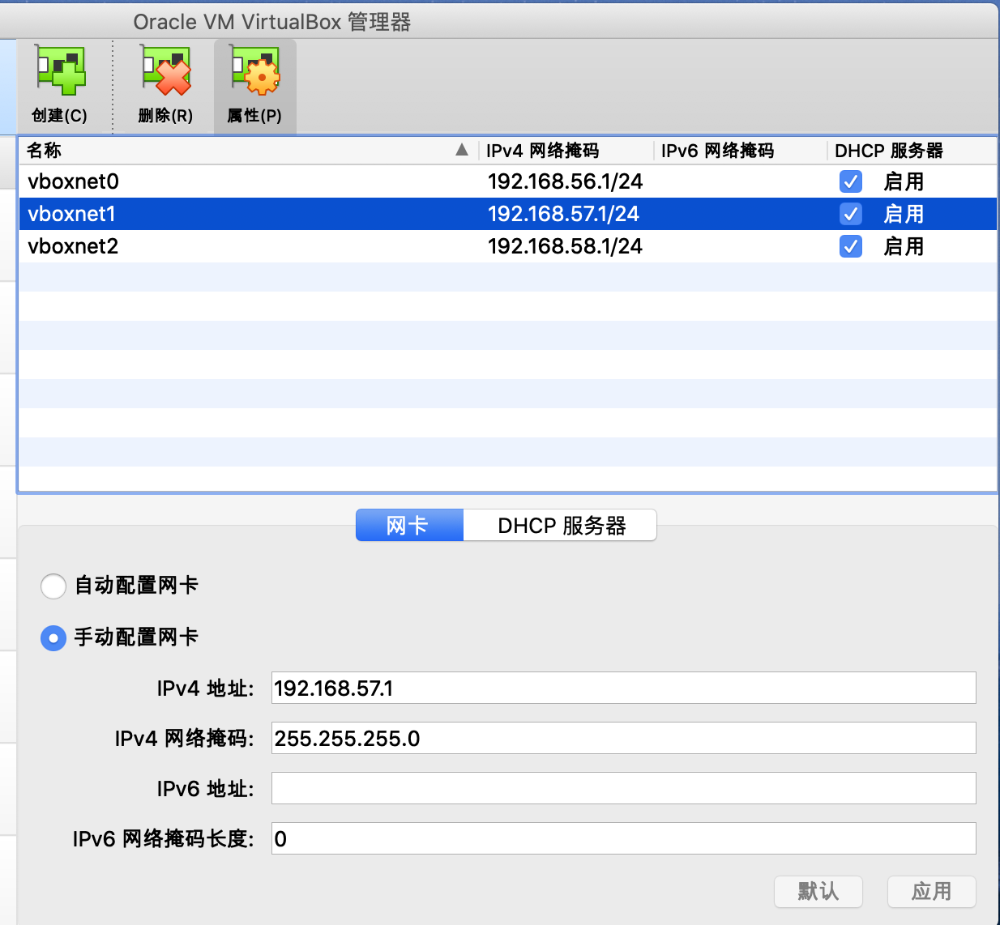
		- 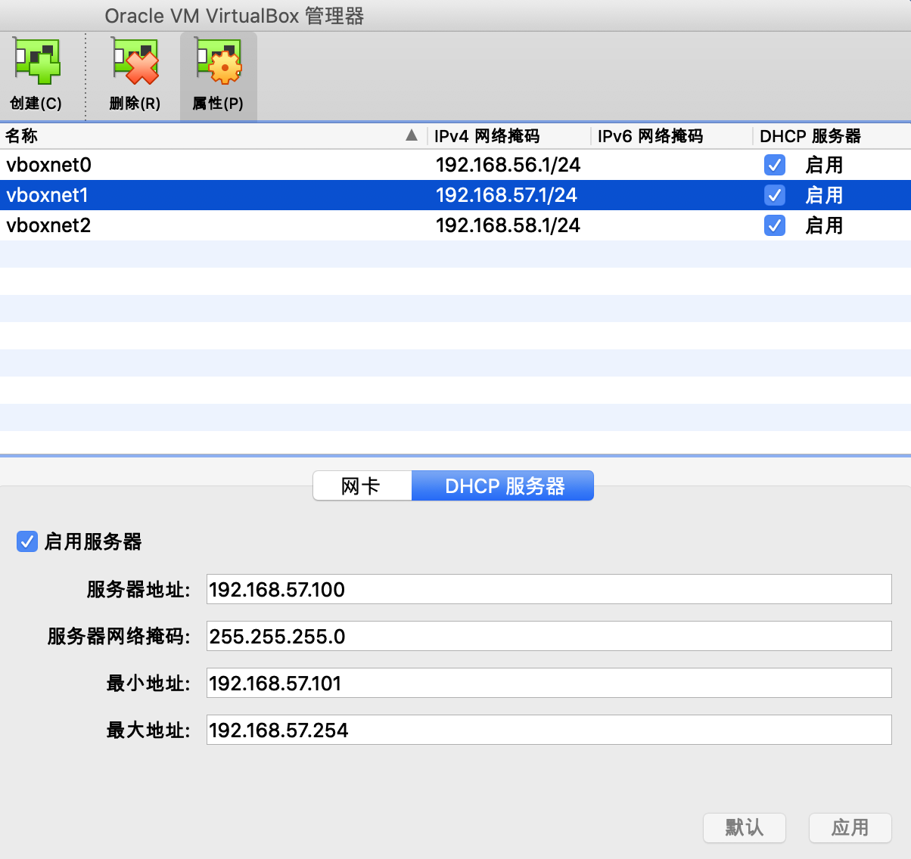


## 安装vm

基于multipass创建虚拟机

```bash
multipass launch --mem 4G --disk 40G --cpus 2 --network en0 --network name=bridge0,mode=manual --network name=bridge0,mode=manual --name k8s-harbor
```


- 基于`VirsualBox`, 调整虚拟机的网卡设置
	- 调整虚拟机的网卡3的设置
		- 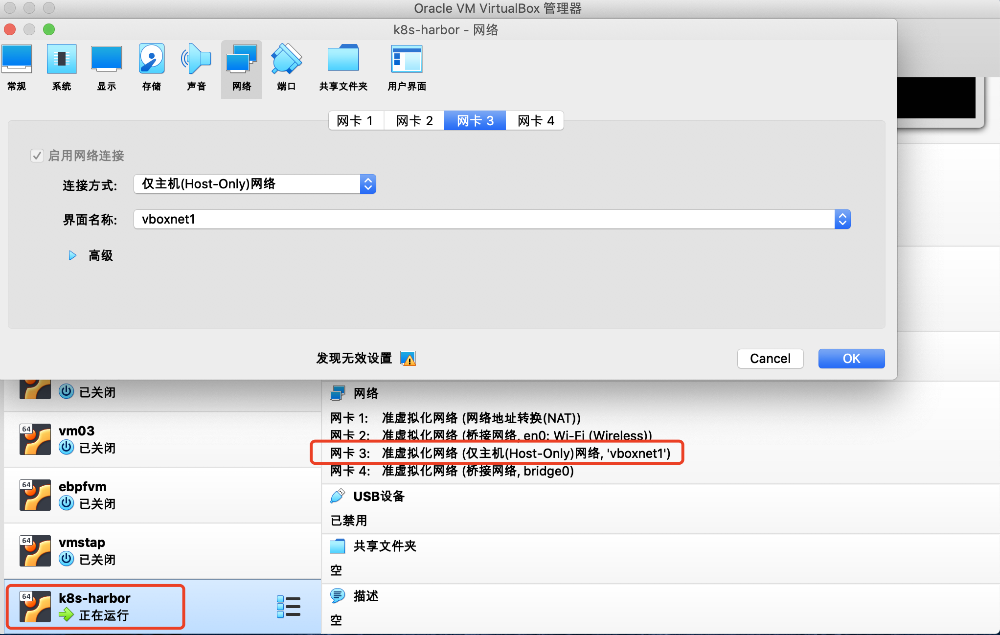
	- 网络配置情况(未使用netplan调整时)
		- 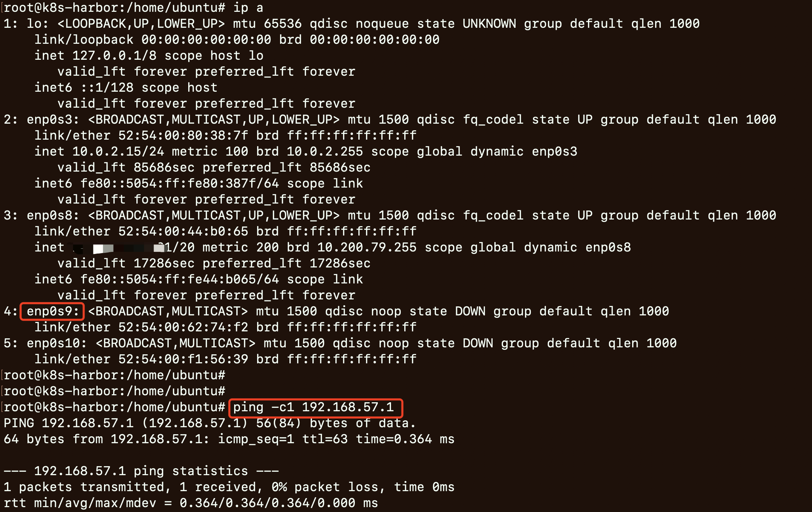


使用`netplan`调整网络配置
```bash
# 登录k8s-harbor
multipass shell k8s-harbor

# update
sudo -s
apt update


# 备份netplan配置
cd /etc/netplan/
cp 50-cloud-init.yaml 50-cloud-init.yaml.bak

# netplan配置文件中添加enp0s9配置
sed -i '/version/i\
        enp0s9:\
            dhcp4: no\
            optional: true\
            addresses: [192.168.57.254/24]\
            nameservers:\
                addresses: [192.168.57.1]\
            routes:\
              - to: default\
                via: 192.168.57.1\
                metric: 200
' 50-cloud-init.yaml

# 查看配置的变化
diff 50-cloud-init.yaml 50-cloud-init.yaml.bak

# 使netplan配置生效
netplan get all
netplan apply

# 查看网络配置是否生效(另外: 有问题可以使用bak文件恢复原配置)
networkctl status
ip a show enp0s9
ip route get 192.168.57.101

# 验证
ping -c1 192.168.57.254
ping -c1 192.168.57.1

# 关闭swap
swapoff -a
sed -i '/ swap / s/^\(.*\)$/#\1/g' /etc/fstab
```


- 网络配置情况(使用netplan调整后)
	- 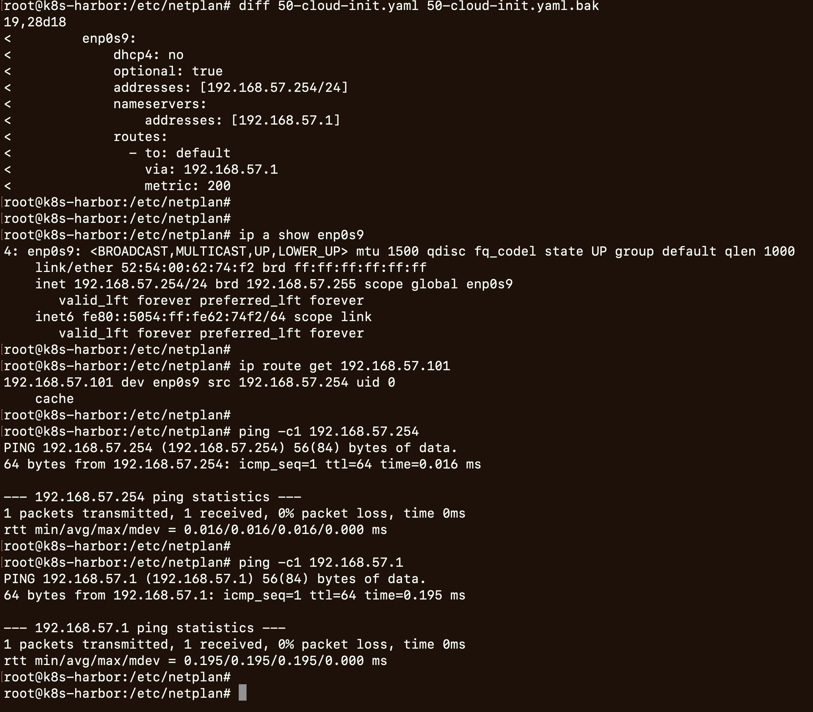


## 安装docker

```bash
# install docker
apt install -y docker.io
systemctl enable docker

# 观察docker状态和日志
systemctl status docker
journalctl -f -u docker
journalctl -xeu docker


# 添加docker配置,其中有常用的docker镜像地址
tee /etc/docker/daemon.json <<EOF
{
      "exec-opts": ["native.cgroupdriver=systemd"],
      "log-driver": "json-file",
      "log-opts": {
          "max-size": "100m"
       },
       "storage-driver": "overlay2",
       "registry-mirrors": [
            "https://b9pmyelo.mirror.aliyuncs.com",
            "https://registry.docker-cn.com",
            "http://hub-mirror.c.163.com",
            "https://docker.mirrors.ustc.edu.cn"
        ]
}
EOF

# 重启docker，并观察docker状态和日志
systemctl daemon-reload
systemctl restart docker
systemctl status docker
journalctl -xeu docker 
journalctl -f -u docker

# k8s容器运行时containerd (安装docker时containerd也被安装了)
systemctl status containerd
journalctl -xeu  containerd 
journalctl -f -u containerd


# 安装docker-compose
wget https://github.com/docker/compose/releases/download/v2.17.3/docker-compose-linux-x86_64
mv docker-compose-linux-x86_64 /usr/local/bin/docker-compose
chmod +x /usr/local/bin/docker-compose


# 验证docker是否安装成功
docker run -itd --name test busybox
docker ps

# 验证后删除test容器
docker rm -f test
```

- docker安装验证
	- ![[attachments/docker_installed_docker_status.png]]
	- ![[attachments/docker_installed_docker_container_test.png]]


# 部署harbor


## 启用HTTPS
```bash
# 参考文档: https://goharbor.io/docs/2.8.0/install-config/configure-https/
# 其中,本实验中 yourdomain.com: k8strials.harbor.com
# 其中,本实验中 hostname: k8s-harbor

mkdir /root/pre-certs
cd /root/pre-certs

# Generate a CA certificate private key.
openssl genrsa -out ca.key 4096
# Generate the CA certificate.
openssl req -x509 -new -nodes -sha512 -days 3650 \
 -subj "/C=CN/ST=Beijing/L=Beijing/O=example/OU=Personal/CN=k8strials.harbor.com" \
 -key ca.key \
 -out ca.crt

# Generate a Server private key.
openssl genrsa -out k8strials.harbor.com.key 4096
# Generate a Server  certificate signing request (CSR).
openssl req -sha512 -new \
    -subj "/C=CN/ST=Beijing/L=Beijing/O=example/OU=Personal/CN=k8strials.harbor.com" \
    -key k8strials.harbor.com.key \
    -out k8strials.harbor.com.csr

# Generate an x509 v3 extension file.
cat > v3.ext <<-EOF
authorityKeyIdentifier=keyid,issuer
basicConstraints=CA:FALSE
keyUsage = digitalSignature, nonRepudiation, keyEncipherment, dataEncipherment
extendedKeyUsage = serverAuth
subjectAltName = @alt_names

[alt_names]
DNS.1=k8strials.harbor.com
DNS.2=k8strials.harbor
DNS.3=k8strials
DNS.4=k8s-harbor
EOF

# Use the v3.ext file to generate a Server certificate for your Harbor host.
openssl x509 -req -sha512 -days 3650 \
    -extfile v3.ext \
    -CA ca.crt -CAkey ca.key -CAcreateserial \
    -in k8strials.harbor.com.csr \
    -out k8strials.harbor.com.crt


# Provide the Certificates to Harbor
mkdir -p /data/cert/
cp k8strials.harbor.com.crt /data/cert/
cp k8strials.harbor.com.key /data/cert


# Provide the Certificates to Docker
mkdir -p /etc/docker/certs.d/k8strials.harbor.com/
openssl x509 -inform PEM -in k8strials.harbor.com.crt -out k8strials.harbor.com.cert
cp k8strials.harbor.com.cert /etc/docker/certs.d/k8strials.harbor.com/
cp k8strials.harbor.com.key /etc/docker/certs.d/k8strials.harbor.com/
cp ca.crt /etc/docker/certs.d/k8strials.harbor.com/
systemctl restart docker
```


- 启用HTTPS涉及到的文件
	- 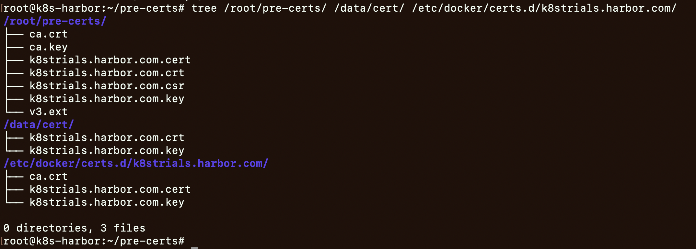


## 安装harbor
```bash
# 下载
wget https://github.com/goharbor/harbor/releases/download/v2.8.2/harbor-offline-installer-v2.8.2.tgz

# 解压
tar -zxvf harbor-offline-installer-v2.8.2.tgz 
cd harbor

# 修改配置文件 
cp harbor.yml.tmpl harbor.yml 
# hostname: k8strials.harbor.com
# https.certificate: /data/cert/k8strials.harbor.com.crt
# https.private_key: /data/cert/k8strials.harbor.com.key
diff harbor.yml harbor.yml.tmpl


# 准备harbor 
./prepare

# 部署harbor 
./install.sh

# 部署结果查看 
docker ps -a

# 本地浏览器无法解析域名: k8strials.harbor.com, 修改本地/etc/hosts
echo "192.168.57.254 k8strials.harbor.com" >> /etc/hosts
# 本地浏览器打开: k8strials.harbor.com, 默认账号和密码: admin, Harbor12345

# 如何重启harbor(当前虚机重启后，需要重启harbor)
docker restart $(docker ps -a |grep goharbor|awk '{print $1}'  |xargs)
```


- 安装harbor
	- 配置的调整
		- 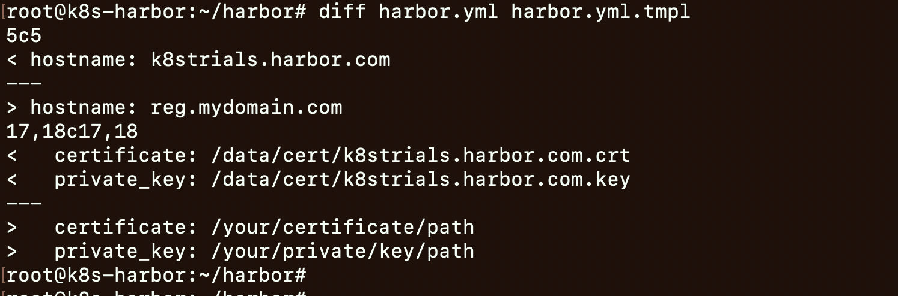
	- install的结果
		- 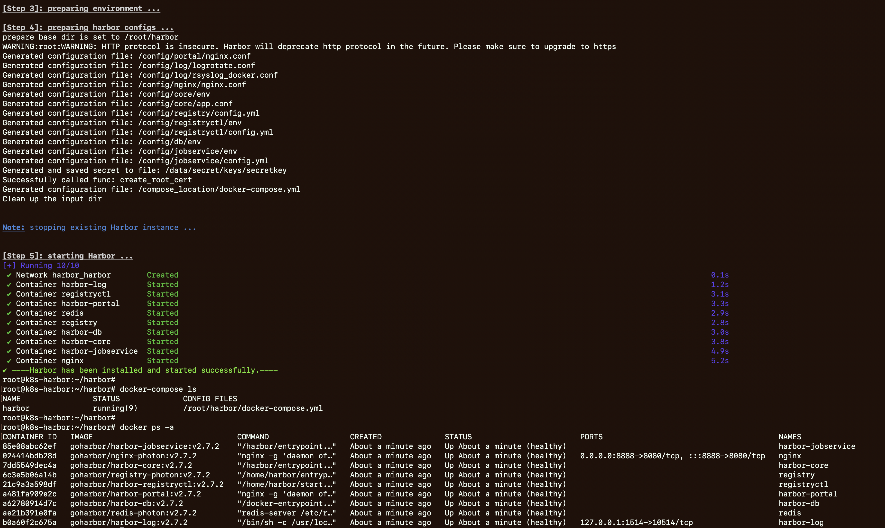
	- 浏览器预览
		- 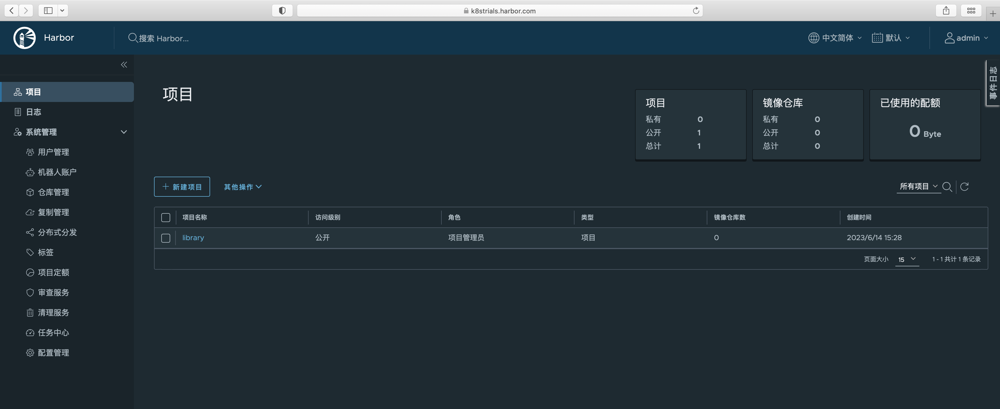


# 使用harbor

基于docker使用harbor

```bash
# 虚拟机上
echo "192.168.57.254 k8strials.harbor.com" >> /etc/hosts

# 准备镜像
docker pull nginx:1.19
docker tag nginx:1.19 k8strials.harbor.com/library/nginx:1.19

# docker login: admin Harbor12345
docker login k8strials.harbor.com


# push镜像到harbor
docker push k8strials.harbor.com/library/nginx:1.19
```


- 基于docker使用harbor
	- 登录和push
		- 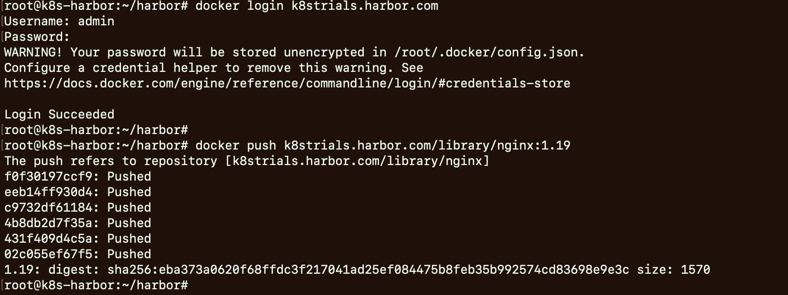
	- 浏览器查看push结果
		- 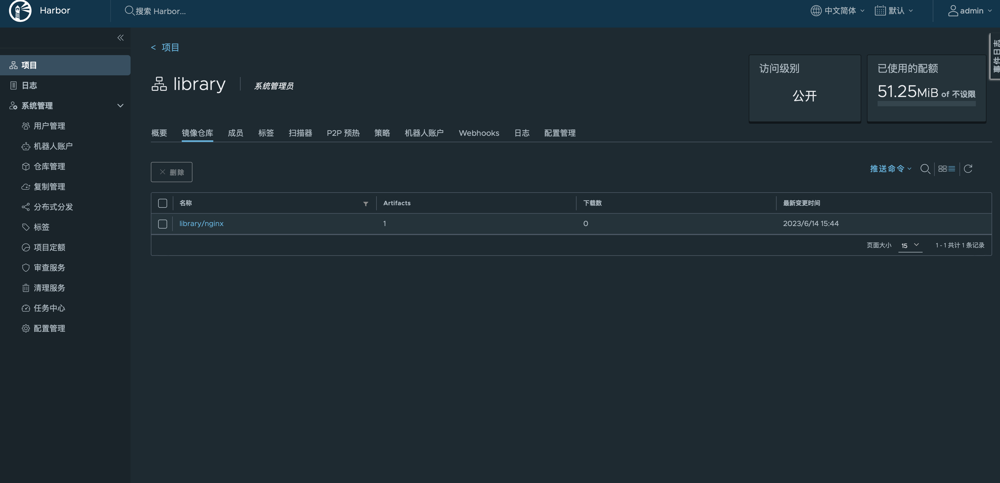


基于containerd使用harbor
```bash
# 拉取镜像(拉取失败: 无权限)
ctr images pull k8strials.harbor.com/library/nginx:1.19

# 导入harbor的证书
cp /root/pre-certs/k8strials.harbor.com.crt /usr/local/share/ca-certificates/
/usr/sbin/update-ca-certificates

# 拉取镜像
ctr images pull k8strials.harbor.com/library/nginx:1.19

# 查看拉取的镜像
ctr images list -q
ctr images list 
```

- 基于containerd使用harbor
	- 使用containerd拉取镜像
		- 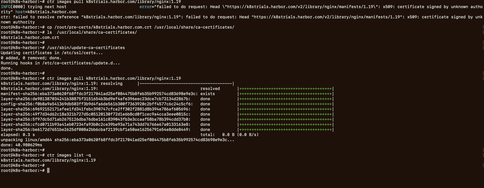
	- containerd使用registry的权限认证
		- 不同版本的containerd的权限认证使用的配置方式不同
		- 网上的配置资料比较混乱，新版本的containerd很可能无法使用
		- 这个是本次实验中最大的坑
		- 建议: 官方文档 + 实验


# 参考资料


- [harbor configure https](https://goharbor.io/docs/2.8.0/install-config/configure-https/)
- [harbor troubleshoot](https://goharbor.io/docs/2.8.0/install-config/troubleshoot-installation/)
- [harbor configure](https://goharbor.io/docs/2.8.0/install-config/configure-system-settings-cli/)
- [containerd docs](https://github.com/containerd/containerd/tree/main/docs)
- [containerd cert](https://stackoverflow.com/questions/73415766/how-to-skip-tls-cert-check-for-crictl-containerd-cr-while-pulling-the-images-f)
- [containerd hosts config](https://github.com/containerd/containerd/blob/main/docs/hosts.md)