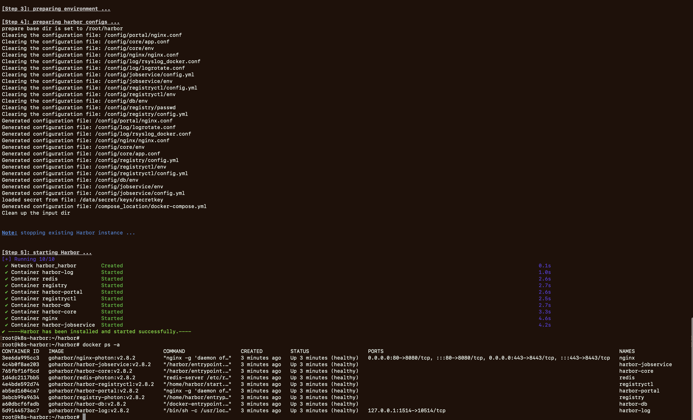

# 安装虚拟机


## 添加网络

- 基于`VisualBox`，添加网络
	- 网络配置如下
		- 网关是: `192.168.57.1`
		- 网络掩码: `255.255.255.0`
		- IP地址集合: `[192.168.57.101,192.168.57.254]`
	- `vboxnet`的配置
		- 
		- 


## 安装vm

基于multipass创建虚拟机

```bash
multipass launch --mem 4G --disk 40G --cpus 2 --network en0 --network name=bridge0,mode=manual --network name=bridge0,mode=manual --name k8s-harbor
```


- 基于`VirsualBox`, 调整虚拟机的网卡设置
	- 调整虚拟机的网卡3的设置
		- 
	- 网络配置情况(未使用netplan调整时)
		- 


使用`netplan`调整网络配置
```bash
# 登录k8s-harbor
multipass shell k8s-harbor

# update
sudo -s
apt update


# 备份netplan配置
cd /etc/netplan/
cp 50-cloud-init.yaml 50-cloud-init.yaml.bak

# netplan配置文件中添加enp0s9配置
sed -i '/version/i\
        enp0s9:\
            dhcp4: no\
            optional: true\
            addresses: [192.168.57.254/24]\
            nameservers:\
                addresses: [192.168.57.1]\
            routes:\
              - to: default\
                via: 192.168.57.1\
                metric: 200
' 50-cloud-init.yaml

# 查看配置的变化
diff 50-cloud-init.yaml 50-cloud-init.yaml.bak

# 使netplan配置生效
netplan get all
netplan apply

# 查看网络配置是否生效(另外: 有问题可以使用bak文件恢复原配置)
networkctl status
ip a show enp0s9
ip route get 192.168.57.101

# 验证
ping -c1 192.168.57.254
ping -c1 192.168.57.1
```


- 网络配置情况(使用netplan调整后)
	- 


# 安装docker

```bash
# 关闭swap
swapoff -a
sed -i '/ swap / s/^\(.*\)$/#\1/g' /etc/fstab

# install docker
apt install -y docker.io
systemctl enable docker

# 观察docker状态和日志
systemctl status docker
journalctl -f -u docker
journalctl -xeu docker


# 添加docker配置,其中有常用的docker镜像地址
tee /etc/docker/daemon.json <<EOF
{
      "exec-opts": ["native.cgroupdriver=systemd"],
      "log-driver": "json-file",
      "log-opts": {
          "max-size": "100m"
       },
       "storage-driver": "overlay2",
       "registry-mirrors": [
            "https://b9pmyelo.mirror.aliyuncs.com",
            "https://registry.docker-cn.com",
            "http://hub-mirror.c.163.com",
            "https://docker.mirrors.ustc.edu.cn"
        ]
}
EOF

# 重启docker，并观察docker状态和日志
systemctl daemon-reload
systemctl restart docker
systemctl status docker
journalctl -xeu docker 
journalctl -f -u docker
systemctl status containerd
journalctl -xeu  containerd 
journalctl -f -u containerd


# 安装docker-compose
wget https://github.com/docker/compose/releases/download/v2.17.3/docker-compose-linux-x86_64
mv docker-compose-linux-x86_64 /usr/local/bin/docker-compose
chmod +x /usr/local/bin/docker-compose


# 验证docker是否安装成功
docker run -itd --name test busybox
docker ps

# 验证后删除test容器
docker rm -f test
```

- docker安装验证
	- ![[attachments/docker_installed_docker_status.png]]
	- ![[attachments/docker_installed_docker_container_test.png]]


# 部署harbor


```bash
# 下载
wget https://github.com/goharbor/harbor/releases/download/v2.7.2/harbor-offline-installer-v2.7.2.tgz

# 解压
tar -zxvf harbor-offline-installer-v2.7.2.tgz 
cd harbor

# 修改配置文件 
cp harbor.yml.tmpl harbor.yml 
# 修改harbor.yml: http.port调整为: 8888
# 修改harbor.yml: hostname调整为:   
# 注释:https related config

# 部署harbor 
./install.sh

# 部署结果查看 
docker ps -a
# 浏览器打开: http://192.168.57.254:8888, 默认账号和密码: admin, Harbor12345


# 重启harbor(当前虚机重启后，需要重启harbor)
docker restart $(docker ps -a |grep goharbor|awk '{print $1}'  |xargs)
```


- `harbor.yml`的配置
	- 
- 部署结果
	- 
- 浏览器预览
	- 


# 使用harbor


```bash
# docker配置中/etc/docker/daemon.json添加: insecure-registries
tee /etc/docker/daemon.json <<EOF
{
    "exec-opts":[
        "native.cgroupdriver=systemd"
    ],
    "log-driver":"json-file",
    "log-opts":{
        "max-size":"100m"
    },
    "storage-driver":"overlay2",
    "registry-mirrors":[
        "https://b9pmyelo.mirror.aliyuncs.com",
        "https://registry.docker-cn.com",
        "http://hub-mirror.c.163.com",
        "https://docker.mirrors.ustc.edu.cn"
    ],
    "insecure-registries":[
        "192.168.57.254:8888"
    ]
}
EOF

# 重启docker
systemctl daemon-reload
systemctl restart docker
systemctl status docker


# 重启harbor
docker restart $(docker ps -a |grep goharbor|awk '{print $1}'  |xargs)
```


```bash
# 拉取nginx镜像 
docker pull nginx:1.19

# tag镜像
docker tag nginx:1.19 192.168.57.254:8888/library/nginx:1.19

# docker登录
docker login 192.168.57.254:8888

# 推送到harbor中
docker push 192.168.57.254:8888/library/nginx:1.19

# 浏览器中查看: http://192.168.57.254:8888

# 本地删除自定义的镜像
docker rmi 192.168.57.254:8888/library/nginx:1.19

# 拉取镜像
docker pull 192.168.57.254:8888/library/nginx:1.19
docker images

# 测试
docker run -d -p 80:80 -p 443:443 --name nginx-test 192.168.57.254:8888/library/nginx:1.19

# 浏览器中查看: http://192.168.57.254:80

# 删除测试容器
docker rm -f nginx-test
```

- push镜像到harbor
	- 
	- 
- 从harbor中pull镜像
	- 
	- 
- 测试harbor镜像
	- 
	- 