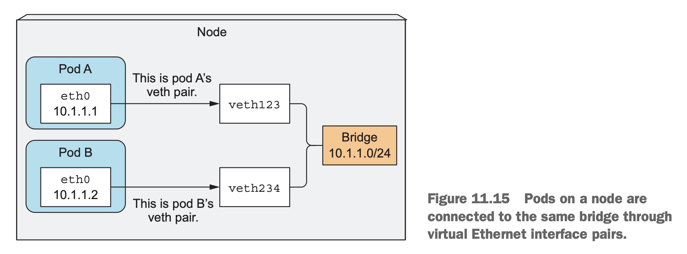

CPU is a compressible resource, which means the amount used by a container can be throttled without affecting the process running in the container in an adverse way. Memory is obviously different—it’s incompressible. Once a process is given a chunk of memory, that memory can’t be taken away from it until it’s released by the process itself. That’s why you need to limit the maximum amount of memory a container can be given.

Without limiting memory, a container (or a pod) running on a worker node may eat up all the available memory and affect all other pods on the node and any new pods scheduled to the node (remember that new pods are scheduled to the node based on the memory requests and not actual memory usage). A single malfunctioning or malicious pod can practically make the whole node unusable.

- The **distributed nature** of Kubernetes components
	- k8s internal components
		- 
	- HOW THESE COMPONENTS COMMUNICATE 
		- Kubernetes system components communicate only with the API server
	- RUNNING MULTIPLE INSTANCES OF INDIVIDUAL COMPONENTS
		- multiple instances of etcd and API server can be active at the same time and do perform their jobs in parallel, 
		- only a single instance of the Scheduler and the Controller Manager may be active at a given time—with the others in standby mode
	- HOW COMPONENTS ARE RUN
		- The Kubelet is the only component that always runs as a regular system component, and it’s the Kubelet that then runs all the other components as pods.
		- The Control Plane components are running as pods
			- `kubectl get po -o custom-columns=POD:metadata.name,NODE:spec.nodeName --sort-by spec.nodeName -n kube-system`
- How Kubernetes uses etcd
	- etcd is a fast, distributed, and consistent key-value store.
	- The only component that talks to etcd directly is the Kubernetes API server. All other components read and write data to etcd indirectly through the API server.
	- HOW RESOURCES ARE STORED IN ETCD
		- either etcd version 2 or version 3
		- etcd v2 stores keys in a hierarchical key space, which makes key-value pairs similar to files in a file system.
			- Each key in etcd is either a directory, which contains other keys, or is a regular key with a corresponding value.
		- etcd v3 doesn’t support directories, but because the key format remains the same (keys can include slashes), you can still think of them as being grouped into directories.
	- ENSURING THE CONSISTENCY AND VALIDITY OF STORED OBJECTS
		- All other Control Plane components go through the API server to etcd.
		- Updates to the cluster state are always consistent, because the optimistic locking mechanism is implemented in a single place
		- The API server also makes sure that the data written to the store is always valid and that changes to the data are only performed by authorized clients.
	- ENSURING CONSISTENCY WHEN ETCD IS CLUSTERED
		- Multiple etcd instances remain consistent.
		- etcd uses the RAFT consensus algorithm to achieve consistent,
			- which ensures that at any given moment, each node’s state is 
			- either what the majority of the nodes agrees is the current state 
			- or is one of the previously agreed upon states.
		- Clients connecting to different nodes of an etcd cluster will either see the actual current state or one of the states from the past 
			- in Kubernetes, the only etcd client is the API server, 
			- but there may be multiple instances
		- split-brain scenario
			- 
	- WHY THE NUMBER OF ETCD INSTANCES SHOULD BE AN ODD NUMBER
		- etcd is usually deployed with an odd number of instances
		- Usually, for large clusters, an etcd cluster of five or seven nodes is sufficient. 
			- It can handle a two- or a three-node failure, respectively, which suffices in almost all situations.

- What the API server does
	- The operation of the API server
		- 
		- The Kubernetes API server is the central component used by all other components and by clients, such as kubectl.
		- RESTful API
			- It provides a CRUD (Create, Read, Update, Delete) interface for querying and modifying the cluster state over a RESTful API. 
		- It stores that state in etcd.
		- Perform validation of those objects
			- so clients can’t store improperly configured objects
		- Handle optimistic locking
			- so changes to an object are never overridden by other clients in the event of concurrent updates.
	- AUTHENTICATING THE CLIENT WITH AUTHENTICATION PLUGINS
		- Call authentication plugins in turn
		- Depending on the authentication method, the user can be extracted from the client’s certificate or an HTTP header, such as Authorization.
		- The plugin extracts the client’s username, user ID, and groups the user belongs to.
	- AUTHORIZING THE CLIENT WITH AUTHORIZATION PLUGINS
		- Call authorization plugins in turn
		- Determine whether the authenticated user can perform the requested action on the requested resource
		- 
	- VALIDATING AND/OR MODIFYING THE RESOURCE IN THE REQUEST WITH ADMISSION CONTROL PLUGINS
		- If the request is trying to create, modify, or delete a resource, the request is sent through Admission Control.
		- Admission Control plugins
			- These plugins can modify the resource for different reasons. 
			- They may initialize fields missing from the resource specification to the configured default values or even override them. 
			- They may even modify other related resources, which aren’t in the request, and can also reject a request for whatever reason.
			- When the request is only trying to read data, the request doesn’t go through the Admission Control.
		- Examples of Admission Control plugins include
			- AlwaysPullImages: Overrides the pod’s imagePullPolicy to Always, forcing the image to be pulled every time the pod is deployed.
			- ServiceAccount: Applies the default service account to pods that don’t specify it explicitly.
			- NamespaceLifecycle: Prevents creation of pods in namespaces that are in the process of being deleted, as well as in non-existing namespaces.
			- ResourceQuota: Ensures pods in a certain namespace only use as much CPU and memory as has been allotted to the namespace.
	- VALIDATING THE RESOURCE AND STORING IT PERSISTENTLY
		- The API server validates the object, stores it in etcd, and returns a response to the client.
- How the API server notifies clients of resource changes
	- 
	- A Control Plane component can request to be notified when a resource is created, modified, or deleted. 
		- This enables the component to perform whatever task it needs in response to a change of the cluster metadata.
	- Clients watch for changes by opening an HTTP connection to the API server.
		- Through this connection, the client will then receive a stream of modifications to the watched objects. 
		- Every time an object is updated, the server sends the new version of the object to all connected clients watching the object.
	- `kubectl get pods --watch`

- The Scheduler
	- 
	- The operation of the Scheduler looks simple. 
		- All it does is wait for newly created pods through the API server’s watch mechanism 
		- and assign a node to each new pod that doesn’t already have the node set.
	- All the Scheduler does is update the pod definition through the API server.
		- The API server then notifies the Kubelet that the pod has been scheduled. 
		- As soon as the Kubelet on the target node sees the pod has been scheduled to its node, it creates and runs the pod’s containers.
	- THE DEFAULT SCHEDULING ALGORITHM
		- Filtering the list of all nodes to obtain a list of acceptable nodes the pod can be scheduled to
		- Prioritizing the acceptable nodes and choosing the best one. If multiple nodes have the highest score, round-robin is used to ensure pods are deployed across all of them evenly.
	- FINDING ACCEPTABLE NODES
		- Can the node fulfill the pod’s requests for hardware resources?
		- Is the node running out of resources (is it reporting a memory or a disk pressure condition)?
		- If the pod requests to be scheduled to a specific node (by name), is this the node?
		- Does the node have a label that matches the node selector in the pod specification (if one is defined)?
		- If the pod requests to be bound to a specific host port, is that port already taken on this node or not?
		- If the pod requests a certain type of volume, can this volume be mounted for this pod on this node, or is another pod on the node already using the same volume?
		- Does the pod tolerate the taints of the node?
		- Does the pod specify node and/or pod affinity or anti-affinity rules? If yes, would scheduling the pod to this node break those rules? 
	- SELECTING THE BEST NODE FOR THE POD
		- Suppose you have a two-node cluster. 
			- Both nodes are eligible, 
			- but one is already running 10 pods, 
			- while the other, for whatever reason, isn’t running any pods right now.
		- It’s obvious the Scheduler should favor the second node in this case.
		- If these two nodes are provided by the cloud infrastructure, it may be better to schedule the pod to the first node and relinquish the second node back to the cloud provider to save money.
	- ADVANCED SCHEDULING OF PODS
		- Pods belonging to the same Service or ReplicaSet are spread across multiple nodes by default. 
			- It’s not guaranteed that this is always the case. 
			- But you can force pods to be spread around the cluster 
			- or kept close together by defining pod affinity and antiaffinity rules
	- USING MULTIPLE SCHEDULERS
		- can implement your own Schedulers and deploy them in the cluster, 
		- can deploy an additional instance of Kubernetes’ Scheduler with different configuration options.
		- for each pod, you specify the Scheduler that should schedule this particular pod by setting the schedulerName property in the pod spec.
		- Pods without this property set are scheduled using the default Scheduler
		- All other pods are ignored by the default Scheduler, so they need to be scheduled either manually or by another Scheduler watching for such pods.

- The controllers running in the Controller Manager
	- UNDERSTANDING WHAT CONTROLLERS DO AND HOW THEY DO IT
		- watch mechanism
			- Controllers do many different things, but they all **watch** the API server for changes to resources (Deployments, Services, and so on) 
			- and perform operations for each change, whether it’s a creation of a new object or an update or deletion of an existing object.
		- perform a re-list operation
			- using watches doesn’t guarantee the controller won’t miss an event, 
			- they also perform a re-list operation periodically to make sure they haven’t missed anything.
		- Controllers never talk to each other directly.
			- Each controller connects to the API server and, 
			- through the watch mechanism asks to be notified 
			- when a change occurs in the list of resources of any type the controller is responsible for.
	- Replication Manager
		- The controller that makes ReplicationController resources come to life is called the Replication Manager
		- Replication Manager Operation
			- 
		- notified by the watch mechanism of each change that may affect the desired replica count or the number of matched pods
		- Any such changes trigger the controller to recheck the desired vs. actual replica count and act accordingly.
		- It creates new Pod manifests, posts them to the API server, and lets the Scheduler and the Kubelet do their job of scheduling and running the pod.
	- The single Controller Manager process currently combines a multitude of controllers performing various reconciliation tasks. 
		- Replication Manager (a controller for ReplicationController resources)
		- ReplicaSet, DaemonSet, and Job controllers
			- The DaemonSet and Job controllers are similar. They create Pod resources from the pod template defined in their respective resources.
			- Like the Replication Manager, these controllers don’t run the pods, but post Pod definitions to the API server, letting the Kubelet create their containers and run them.
		- Deployment controller
			- The Deployment controller takes care of keeping the actual state of a deployment in sync with the desired state specified in the corresponding Deployment API object.
			- The Deployment controller performs a rollout of a new version each time a Deployment object is modified
				- It does this by creating a ReplicaSet and then appropriately scaling both the old and the new ReplicaSet based on the strategy specified in the Deployment, 
				- until all the old pods have been replaced with new ones. It doesn’t create any pods directly.
		- StatefulSet controller
			- the StatefulSet controller instantiates and manages PersistentVolumeClaims for each Pod instance.
		- Node controller
			- The Node controller manages the Node resources, which describe the cluster’s worker nodes.
			- a Node controller keeps the list of Node objects in sync with the actual list of machines running in the cluster. 
			- It also monitors each node’s health and evicts pods from unreachable nodes.
			- The Node controller isn’t the only component making changes to Node objects. 
				- They’re also changed by the Kubelet, 
				- and can obviously also be modified by users through REST API calls.
		- Service controller
			- LoadBalancer service
				- which requests a load balancer from the infrastructure to make the service available externally.
		- Endpoints controller
			- 
			- Services aren’t linked directly to pods, but instead contain a list of endpoints (IPs and ports), which is created and updated either manually or automatically according to the pod selector defined on the Service.
			- The Endpoints controller is the active component that keeps the endpoint list constantly updated with the IPs and ports of pods matching the label selector.
			- When Services are added or updated or Pods are added, updated, or deleted, it selects Pods matching the Service’s pod selector and adds their IPs and ports to the Endpoints resource.
			- the Endpoints object is a standalone object, so the controller creates it if necessary. Likewise, it also deletes the Endpoints object when the Service is deleted.
		- Namespace controller
			- When the Namespace controller is notified of the deletion of a Namespace object, it deletes all the resources belonging to the namespace through the API server
		- PersistentVolume controller
		- Others

- What the Kubelet does
	- 
	- the Kubelet and the Service Proxy both run on the worker nodes, where the actual pods containers run.
	- The Kubelet is the only component that always runs as a regular system component
	- UNDERSTANDING THE KUBELET’S JOB
		- In a nutshell, the Kubelet is the component responsible for everything running on a worker node.
		- register a Node resource
			- Its initial job is to register the node it’s running on by creating a Node resource in the API server.
		- monitor Pods scheduled to the node
			- Then it needs to continuously monitor the API server for Pods that have been scheduled to the node,  and start the pod’s containers. 
			- It does this by telling the configured container runtime (which is Docker, CoreOS’ rkt, or something else) to run a container from a specific container image.
		- monitor and report containers
			- The Kubelet then constantly monitors running containers and reports their status, events, and resource consumption to the API server.
		- liveness probes and restart
			- The Kubelet is also the component that runs the container liveness probes, restarting containers when the probes fail.
		- terminate and report
			- It terminates containers when their Pod is deleted from the API server and notifies the server that the pod has terminated.
	- RUNNING STATIC PODS WITHOUT THE API SERVER
		- Can also run pods based on pod manifest files in a specific local directory

- The role of the Kubernetes Service Proxy
	- The kube-proxy makes sure connections to the service IP and port end up at one of the pods backing that service (or other, non-pod service endpoints). When a service is backed by more than one pod, the proxy performs load balancing across those pods.
	- iptables proxy mode
		- 

- Kubernetes add-ons
	- HOW THE DNS SERVER WORKS
		- All the pods in the cluster are configured to use the cluster’s internal DNS server by default. 
			- This allows pods to easily look up services by name or even the pod’s IP addresses in the case of headless services. 
		- The DNS server pod is exposed through the kube-dns service, allowing the pod to be moved around the cluster, like any other pod. 
			- The service’s IP address is specified as the nameserver in the /etc/resolv.conf file inside every container deployed in the cluster. 
			- The kube-dns pod uses the API server’s watch mechanism to observe changes to Services and Endpoints and updates its DNS records with every change, allowing its clients to always get (fairly) up-to-date DNS information. 
			- I say fairly because during the time between the update of the Service or Endpoints resource and the time the DNS pod receives the watch notification, the DNS records may be invalid.
	- HOW (MOST) INGRESS CONTROLLERS WORK
		- An Ingress controller runs a reverse proxy server (like Nginx, for example), and keeps it configured according to the Ingress, Service, and Endpoints resources defined in the cluster. 
		- The controller thus needs to observe those resources (again, through the watch mechanism) and change the proxy server’s config every time one of them changes.

- What happens when a Pod resource is created. 
	- Create a Deployment resource and see everything that must happen for the pod’s containers to be started.
	- Which components are involved
		- 
	- The chain of events
		- 
		- THE DEPLOYMENT CONTROLLER CREATES THE REPLICASET
		- THE REPLICASET CONTROLLER CREATES THE POD RESOURCES
		- THE SCHEDULER ASSIGNS A NODE TO THE NEWLY CREATED PODS
		- THE KUBELET RUNS THE POD’S CONTAINERS
	- Observing cluster events
		- `kubectl get events --watch`

- What a running pod is
	- 
	- The infrastructure container lifecycle is tied to that of the pod—the container runs from the time the pod is scheduled until the pod is deleted.
	- how all containers of a pod share the same network and other Linux namespaces?
		- The infrastructure container holds all these namespaces.
		- All other user-defined containers of the pod then use the namespaces of the pod infrastructure container.
		- Application containers may die and get restarted. 
			- When such a container starts up again, it needs to become part of the same Linux namespaces as before.

- Inter-pod networking
	- The network is set up by the system administrator or by a Container Network Interface (CNI) plugin, not by Kubernetes itself.
	- Building a proper Kubernetes cluster involves setting up the networking according to these requirements. There are various methods and technologies available to do this, each with its own benefits or drawbacks in a given scenario.
	- What the network must be like
		- 
		- When pod A connects to (sends a network packet to) pod B, the source IP pod B sees must be the same IP that pod A sees as its own.
		- There should be no network address translation (NAT) performed in between—the packet sent by pod A must reach pod B with both the source and destination address unchanged.
	- Diving deeper into how networking works
		- ENABLING COMMUNICATION BETWEEN PODS ON THE SAME NODE
			- 
		- ENABLING COMMUNICATION BETWEEN PODS ON DIFFERENT NODES
			- 
			- the bridges across the nodes must use non-overlapping address ranges to prevent pods on different nodes from getting the same IP.
			- the node’s physical network interface needs to be connected to the bridge as well.
			- Route
				- Routing tables on node A need to be configured so all packets destined for 10.1.2.0/24 are routed to node B, 
				- whereas node B’s routing tables need to be configured so packets sent to 10.1.1.0/24 are routed to node A.
			- This works only when nodes are connected to the same network switch, without any routers in between; otherwise those routers would drop the packets because they refer to pod IPs, which are private.
		- Software Defined Network (SDN)
			- which makes the nodes appear as though they’re connected to the same network switch, 
			- regardless of the actual underlying network topology, no matter how complex it is.
		- Container Network Interface (CNI)
			- Include
				- Calico
				- Flannel
				- Romana
				- Weave Net
				- Others
			- Installing a network plugin isn’t difficult. 
				- You only need to deploy a YAML containing a DaemonSet and a few other supporting resources. 
				- This YAML is provided on each plugin’s project page. 
					- As you can imagine, the DaemonSet is used to deploy a network agent on all cluster nodes. 
					- It then ties into the CNI interface on the node, but be aware that the Kubelet needs to be started with --network-plugin=cni to use CNI.

- How services are implemented
	- Services expose a set of pods at a longlived, stable IP address and port.
		- each Service gets its own stable IP address and port. 
		- Clients (usually pods) use the service by connecting to this IP address and port. 
		- The IP address is virtual
			- it’s not assigned to any network interfaces 
			- and is never listed as either the source or the destination IP address in a network packet when the packet leaves the node.
		- A key detail of Services is that they consist of an IP and port pair (or multiple IP and port pairs in the case of multi-port Services), so the service IP by itself doesn’t represent anything. That’s why you can’t ping them.
	- Everything related to Services is handled by the kube-proxy process running on each node.
	- How kube-proxy uses iptables
		- Watch the API server for changes to Services.
			- When a service is created in the API server, the virtual IP address is assigned to it immediately.
			- the API server notifies all kube-proxy agents running on the worker nodes that a new Service has been created.
			- each kube-proxy makes that service addressable on the node it’s running on.
				- It does this by setting up a few iptables rules, which make sure each packet destined for the service IP/port pair is intercepted and its destination address modified, 
				- so the packet is redirected to one of the pods backing the service.
		- Why the kube-proxy must also watch all Endpoints objects?
			- An Endpoints object holds the IP/port pairs of all the pods that back the service (an IP/port pair can also point to something other than a pod).
			- an Endpoints object changes every time 
				- a new backing pod is created or deleted, 
				- and when the pod’s readiness status changes or the pod’s labels change 
				- and it falls in or out of scope of the service.
		- How kube-proxy enables clients to connect to those pods through the Service? 
			- what happens to the packet when it’s sent by the client pod?
				- 

- Running highly available clusters
	- For running services without interruption it’s not only the apps that need to be up all the time, but also the Kubernetes Control Plane components
	- Making your apps highly available
		- RUNNING MULTIPLE INSTANCES TO REDUCE THE LIKELIHOOD OF DOWNTIME
			- Apps are horizontally scalable
			- Even if not horizontally scalable, you should still use a Deployment with its replica count set to one.
		- USING LEADER-ELECTION FOR NON-HORIZONTALLY SCALABLE APPS
			- run additional inactive replicas along with the active one and use a fast-acting lease or leader-election mechanism to make sure only one is active.
			- use a sidecar container 
				- that performs all the leader-election operations and signals the main container when it should become active. 
	- Making Kubernetes Control Plane components highly available
		- 
		- RUNNING AN ETCD CLUSTER
			- five etcd nodes
			- or seven etcd nodes
		- RUNNING MULTIPLE INSTANCES OF THE API SERVER
			- the API server is stateless
			- one API server is collocated with **every** etcd instance
				- By doing this, the etcd instances don’t need any kind of load balancer in front of them, 
				- because every API server instance only talks to the local etcd instance.
			- a load balancer
				- The API servers, on the other hand, do need to be fronted by a load balancer, 
				- so clients (kubectl, but also the Controller Manager, Scheduler, and all the Kubelets) 
				- always connect only to the healthy API server instances.
		- ENSURING HIGH AVAILABILITY OF THE CONTROLLERS AND THE SCHEDULER
			- 
			- Only one instance may be active at any given time.
			- The Controller Manager and Scheduler can run collocated with the API server and etcd, or they can run on separate machines. 
				- When collocated, they can talk to the local API server directly; 
				- otherwise they connect to the API servers through the load balancer.
		- THE LEADER ELECTION MECHANISM USED IN CONTROL PLANE COMPONENTS

- Containers in a pod
	- namespaces
		- under the same Network and UTS namespaces, share the same hostname and network interfaces
		- under the same IPC namespace and can communicate through IPC
		- the filesystem : is fully isolated from other containers
		- port conflicts
	- The pause container
		- The pause container is an infrastructure container whose sole purpose is to hold all these namespaces. 
		- All other user-defined containers of the pod then use the namespaces of the pod infrastructure container
	- WHEN TO USE MULTIPLE CONTAINERS IN A POD
		- Do they need to be run together or can they run on different hosts?
		- Do they represent a single whole or are they independent components?
		- Must they be scaled together or individually?

