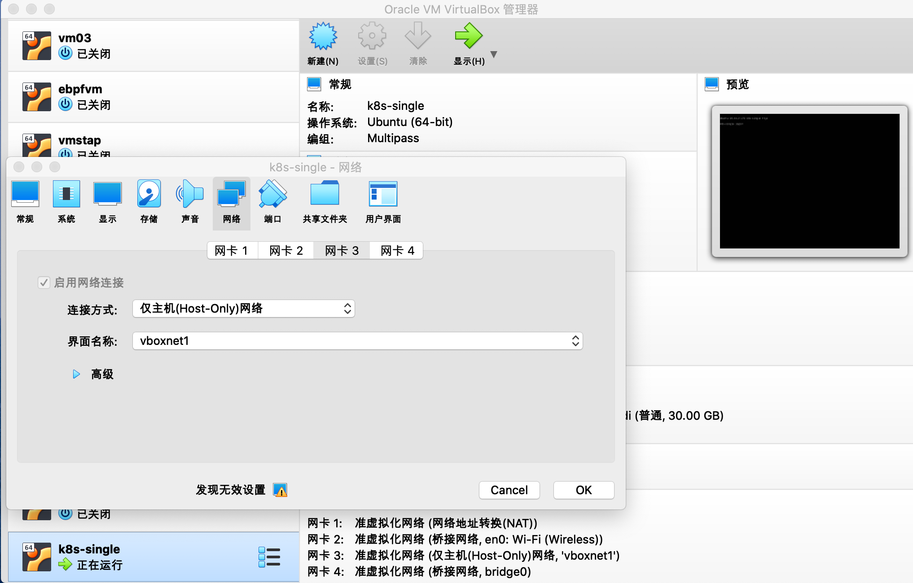
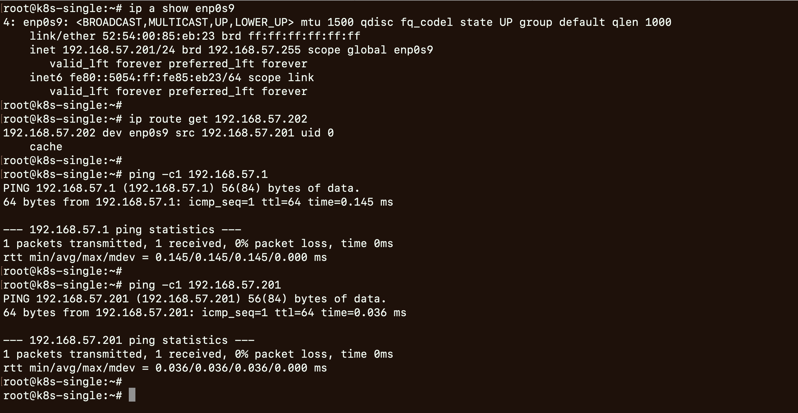
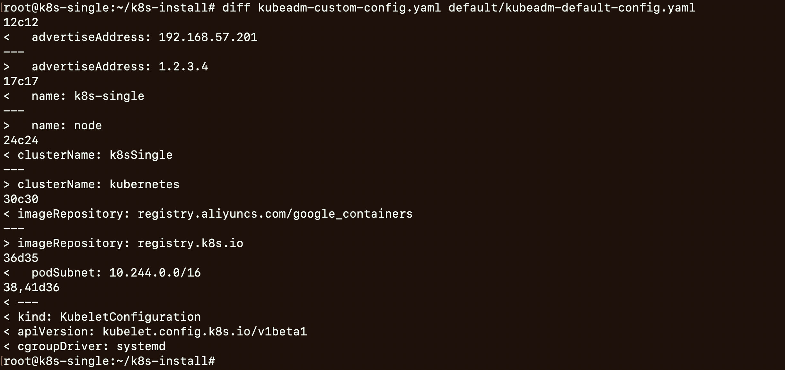
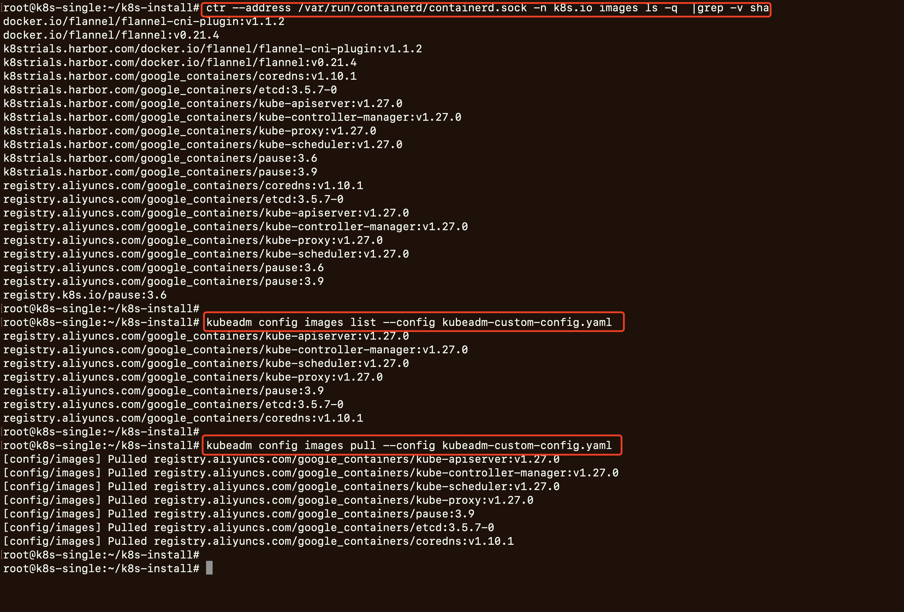
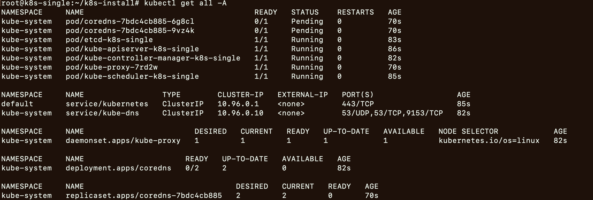
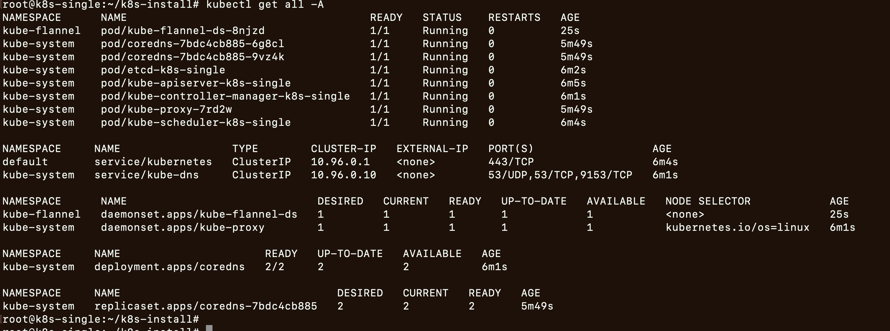
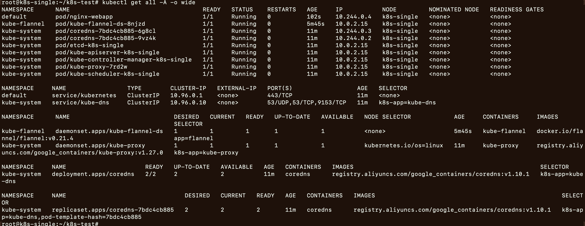
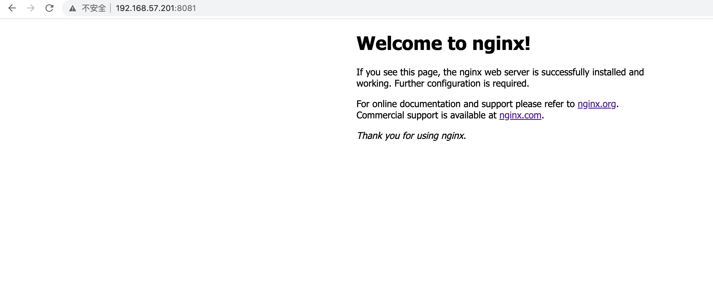

# 安装VM


## VisualBox网络情况

- 基于`VisualBox`网络的配置详情
	- 网络配置如下
		- 网关是: `192.168.57.1`
		- 网络掩码: `255.255.255.0`
		- IP地址集合: `[192.168.57.101,192.168.57.254]`
	- `vboxnet`的配置
		- 
		- 

## 安装VM

```bash
# 创建虚拟机
multipass launch --mem 4G --disk 30G --cpus 2 --network en0 --network name=bridge0,mode=manual --network name=bridge0,mode=manual --name k8s-single

# 登录
multipass shell k8s-single 
sudo -s 
apt update
```

## 调整网络配置
```bash
# 基于VirtualBox，设置虚拟机enp09s网卡(第三块网卡)
# 调整为: hostOnly 和 vboxnet01

# 调整netplan配置
# 网关是: 192.168.57.1/24
# 虚拟机的IP: 192.168.57.201
cd /etc/netplan/
cp 50-cloud-init.yaml 50-cloud-init.yaml.bak
sed -i '/version/i\
        enp0s9:\
            dhcp4: no\
            optional: true\
            addresses: [192.168.57.201/24]\
            nameservers:\
                addresses: [192.168.57.1]\
            routes:\
              - to: default\
                via: 192.168.57.1\
                metric: 200
' 50-cloud-init.yaml

# 查看配置的变化
diff 50-cloud-init.yaml 50-cloud-init.yaml.bak
# 使netplan配置生效
netplan get all
netplan apply
networkctl status

# ip和hostname
echo "192.168.57.201 k8s-single" >>/etc/hosts

ip a show enp0s9
ip route get 192.168.57.202
ping -c1 192.168.57.1
ping -c1 192.168.57.201
```

- vm的第三块网卡配置
	- 
- vm的网络配置
	- 

# 准备环境


## 调整系统配置
```bash
swapoff -a 
sed -i '/ swap / s/^\(.*\)$/#\1/g' /etc/fstab

# 开启内核特性: overlay  br_netfilter
tee /etc/modules-load.d/containerd.conf <<EOF
overlay
br_netfilter
EOF
modprobe overlay
modprobe br_netfilter
lsmod |grep overlay
lsmod |grep br_netfilter

# 设置net bridge
tee  /etc/sysctl.d/kubernetes.conf <<EOF
net.bridge.bridge-nf-call-ip6tables = 1
net.bridge.bridge-nf-call-iptables = 1
net.bridge.bridge-nf-call-arptables = 1
net.ipv4.ip_forward = 1
EOF
sysctl --system
sysctl -a |grep net.bridge
sysctl -a |grep ip_forward

# 修改rp_filter,调整为1
# net.ipv4.conf.default.rp_filter=1
# net.ipv4.conf.all.rp_filter=1
cat /etc/sysctl.d/10-network-security.conf
sysctl --system
sysctl -a |grep rp_filter
```

## 安装容器运行时
```bash
apt update
apt install docker.io -y
systemctl enable docker
systemctl enable containerd
systemctl status containerd
```

## 安装kubeadm等工具
```bash
apt-get update && apt-get install -y apt-transport-https

# 使用aliyun的源(和官方更新不同步，偶尔会安装失败): https://developer.aliyun.com/mirror/kubernetes
curl https://mirrors.aliyun.com/kubernetes/apt/doc/apt-key.gpg | apt-key add - 
cat <<EOF >/etc/apt/sources.list.d/kubernetes.list
deb https://mirrors.aliyun.com/kubernetes/apt/ kubernetes-xenial main
EOF


# 更新
apt-get update
# 安装kubeadm kubelet kubectl
apt install -y kubeadm kubelet kubectl
apt-mark hold kubeadm kubelet kubectl

# 使用的版本: v1.27.2
kubeadm version
```


## 调整kubelet的配置
```bash
tee /etc/default/kubelet <<EOF
KUBELET_EXTRA_ARGS="--cgroup-driver=cgroupfs"
EOF

echo '' >> /etc/systemd/system/kubelet.service.d/10-kubeadm.conf
echo 'Environment="KUBELET_EXTRA_ARGS=--fail-swap-on=false"' >> /etc/systemd/system/kubelet.service.d/10-kubeadm.conf

# 重启kubelet并查看, 进行到本步骤是kubelet起不来的
systemctl daemon-reload
systemctl restart kubelet
systemctl status kubelet
```


# 部署

## 自定义安装模板
```yml
apiVersion: kubeadm.k8s.io/v1beta3
bootstrapTokens:
- groups:
  - system:bootstrappers:kubeadm:default-node-token
  token: abcdef.0123456789abcdef
  ttl: 24h0m0s
  usages:
  - signing
  - authentication
kind: InitConfiguration
localAPIEndpoint:
  advertiseAddress: 192.168.57.201
  bindPort: 6443
nodeRegistration:
  criSocket: unix:///var/run/containerd/containerd.sock
  imagePullPolicy: IfNotPresent
  name: k8s-single
  taints: null
---
apiServer:
  timeoutForControlPlane: 4m0s
apiVersion: kubeadm.k8s.io/v1beta3
certificatesDir: /etc/kubernetes/pki
clusterName: k8sSingle
controllerManager: {}
dns: {}
etcd:
  local:
    dataDir: /var/lib/etcd
imageRepository: registry.aliyuncs.com/google_containers
kind: ClusterConfiguration
kubernetesVersion: 1.27.0
networking:
  dnsDomain: cluster.local
  serviceSubnet: 10.96.0.0/12
  podSubnet: 10.244.0.0/16
scheduler: {}
---
kind: KubeletConfiguration
apiVersion: kubelet.config.k8s.io/v1beta1
cgroupDriver: systemd
```


```bash
mkdir /root/k8s-install
cd /root/k8s-install

# 生成config
mkdir default
kubeadm config print init-defaults > default/kubeadm-default-config.yaml
cp default/kubeadm-default-config.yaml kubeadm-custom-config.yaml

# 基于kubeadm-custom-config.yaml修改配置模板
diff kubeadm-custom-config.yaml default/kubeadm-default-config.yaml 
```

- 对比默认模板
	- 


## 准备镜像

从私有镜像中心拉取镜像
```bash
# 私有镜像中心: harbor
echo "192.168.57.254 k8strials.harbor.com" >> /etc/hosts

# google containers images
ctr --address /var/run/containerd/containerd.sock -n k8s.io images pull k8strials.harbor.com/google_containers/kube-apiserver:v1.27.0 -k
ctr --address /var/run/containerd/containerd.sock -n k8s.io images pull k8strials.harbor.com/google_containers/kube-controller-manager:v1.27.0 -k
ctr --address /var/run/containerd/containerd.sock -n k8s.io images pull k8strials.harbor.com/google_containers/kube-scheduler:v1.27.0 -k
ctr --address /var/run/containerd/containerd.sock -n k8s.io images pull k8strials.harbor.com/google_containers/kube-proxy:v1.27.0 -k
ctr --address /var/run/containerd/containerd.sock -n k8s.io images pull k8strials.harbor.com/google_containers/pause:3.9 -k
ctr --address /var/run/containerd/containerd.sock -n k8s.io images pull k8strials.harbor.com/google_containers/pause:3.6 -k
ctr --address /var/run/containerd/containerd.sock -n k8s.io images pull k8strials.harbor.com/google_containers/etcd:3.5.7-0 -k
ctr --address /var/run/containerd/containerd.sock -n k8s.io images pull k8strials.harbor.com/google_containers/coredns:v1.10.1 -k

# 内部的一些组件会默认使用镜像registry.k8s.io/pause:3.6, 用于启动pod内的container
ctr --address /var/run/containerd/containerd.sock -n k8s.io images tag  k8strials.harbor.com/google_containers/pause:3.6  registry.k8s.io/pause:3.6

# flannel images
ctr --address /var/run/containerd/containerd.sock -n k8s.io images pull k8strials.harbor.com/docker.io/flannel/flannel-cni-plugin:v1.1.2 -k
ctr --address /var/run/containerd/containerd.sock -n k8s.io images pull k8strials.harbor.com/docker.io/flannel/flannel:v0.21.4 -k 
ctr --address /var/run/containerd/containerd.sock -n k8s.io images tag k8strials.harbor.com/docker.io/flannel/flannel-cni-plugin:v1.1.2  docker.io/flannel/flannel-cni-plugin:v1.1.2 
ctr --address /var/run/containerd/containerd.sock -n k8s.io images tag k8strials.harbor.com/docker.io/flannel/flannel:v0.21.4  docker.io/flannel/flannel:v0.21.4 

# 查看镜像
ctr --address /var/run/containerd/containerd.sock -n k8s.io images ls -q 
```


基于自定义模板确认镜像
```bash
# 查看需要下载的镜像
kubeadm config images list --config kubeadm-custom-config.yaml
# 下载镜像
kubeadm config images pull --config kubeadm-custom-config.yaml
# 查看镜像
crictl --runtime-endpoint unix:///var/run/containerd/containerd.sock images
```


- 准备的镜像
	- 


## 使用kubeadm安装
```bash
# 当安装失败时可重置,重置后可以重新安装
# kubeadm reset

# 基于配置模板kubeadm-custom-config.yaml安装, 保留安装日志
mkdir logs
kubeadm init --config kubeadm-custom-config.yaml 2>&1 |tee logs/log.init_by_config.log.$(date '+%Y%m%d-%H%M%S')

# TroubelShoot: 存在错误时处理

# 到这步时，仅剩下coredns是pending状态(未安装网络插件的缘故)
kubectl get all -A
```

- 初始化安装后，可以看到各个组件的情况
	- `kubectl get all -A`
	- 仅剩下coredns是pending状态(未安装网络插件的缘故)
	- 


## 安装网络插件flannel
```bash
touch kube-flannel.yml
# 复制flannel配置 到 kube-flannel.yml

# 安装网络插件kube-flannel
# 安装flannel后会生成的一些配置:/etc/cni/net.d/; 删除flanne或者重新安装k8s时记得删除对应的配置
kubectl apply -f ./kube-flannel.yml
```

- 安装网络插件flannel后，可以看到各个组件的情况
	- `kubectl get all -A`
	- 

使用的flannel配置
```yml 
---
kind: Namespace
apiVersion: v1
metadata:
  name: kube-flannel
  labels:
    k8s-app: flannel
    pod-security.kubernetes.io/enforce: privileged
---
kind: ClusterRole
apiVersion: rbac.authorization.k8s.io/v1
metadata:
  labels:
    k8s-app: flannel
  name: flannel
rules:
- apiGroups:
  - ""
  resources:
  - pods
  verbs:
  - get
- apiGroups:
  - ""
  resources:
  - nodes
  verbs:
  - get
  - list
  - watch
- apiGroups:
  - ""
  resources:
  - nodes/status
  verbs:
  - patch
- apiGroups:
  - networking.k8s.io
  resources:
  - clustercidrs
  verbs:
  - list
  - watch
---
kind: ClusterRoleBinding
apiVersion: rbac.authorization.k8s.io/v1
metadata:
  labels:
    k8s-app: flannel
  name: flannel
roleRef:
  apiGroup: rbac.authorization.k8s.io
  kind: ClusterRole
  name: flannel
subjects:
- kind: ServiceAccount
  name: flannel
  namespace: kube-flannel
---
apiVersion: v1
kind: ServiceAccount
metadata:
  labels:
    k8s-app: flannel
  name: flannel
  namespace: kube-flannel
---
kind: ConfigMap
apiVersion: v1
metadata:
  name: kube-flannel-cfg
  namespace: kube-flannel
  labels:
    tier: node
    k8s-app: flannel
    app: flannel
data:
  cni-conf.json: |
    {
      "name": "cbr0",
      "cniVersion": "0.3.1",
      "plugins": [
        {
          "type": "flannel",
          "delegate": {
            "hairpinMode": true,
            "isDefaultGateway": true
          }
        },
        {
          "type": "portmap",
          "capabilities": {
            "portMappings": true
          }
        }
      ]
    }
  net-conf.json: |
    {
      "Network": "10.244.0.0/16",
      "Backend": {
        "Type": "vxlan"
      }
    }
---
apiVersion: apps/v1
kind: DaemonSet
metadata:
  name: kube-flannel-ds
  namespace: kube-flannel
  labels:
    tier: node
    app: flannel
    k8s-app: flannel
spec:
  selector:
    matchLabels:
      app: flannel
  template:
    metadata:
      labels:
        tier: node
        app: flannel
    spec:
      affinity:
        nodeAffinity:
          requiredDuringSchedulingIgnoredDuringExecution:
            nodeSelectorTerms:
            - matchExpressions:
              - key: kubernetes.io/os
                operator: In
                values:
                - linux
      hostNetwork: true
      priorityClassName: system-node-critical
      tolerations:
      - operator: Exists
        effect: NoSchedule
      serviceAccountName: flannel
      initContainers:
      - name: install-cni-plugin
        image: docker.io/flannel/flannel-cni-plugin:v1.1.2
       #image: docker.io/rancher/mirrored-flannelcni-flannel-cni-plugin:v1.1.2
        command:
        - cp
        args:
        - -f
        - /flannel
        - /opt/cni/bin/flannel
        volumeMounts:
        - name: cni-plugin
          mountPath: /opt/cni/bin
      - name: install-cni
        image: docker.io/flannel/flannel:v0.21.4
       #image: docker.io/rancher/mirrored-flannelcni-flannel:v0.21.4
        command:
        - cp
        args:
        - -f
        - /etc/kube-flannel/cni-conf.json
        - /etc/cni/net.d/10-flannel.conflist
        volumeMounts:
        - name: cni
          mountPath: /etc/cni/net.d
        - name: flannel-cfg
          mountPath: /etc/kube-flannel/
      containers:
      - name: kube-flannel
        image: docker.io/flannel/flannel:v0.21.4
       #image: docker.io/rancher/mirrored-flannelcni-flannel:v0.21.4
        command:
        - /opt/bin/flanneld
        args:
        - --ip-masq
        - --kube-subnet-mgr
        resources:
          requests:
            cpu: "100m"
            memory: "50Mi"
        securityContext:
          privileged: false
          capabilities:
            add: ["NET_ADMIN", "NET_RAW"]
        env:
        - name: POD_NAME
          valueFrom:
            fieldRef:
              fieldPath: metadata.name
        - name: POD_NAMESPACE
          valueFrom:
            fieldRef:
              fieldPath: metadata.namespace
        - name: EVENT_QUEUE_DEPTH
          value: "5000"
        volumeMounts:
        - name: run
          mountPath: /run/flannel
        - name: flannel-cfg
          mountPath: /etc/kube-flannel/
        - name: xtables-lock
          mountPath: /run/xtables.lock
      volumes:
      - name: run
        hostPath:
          path: /run/flannel
      - name: cni-plugin
        hostPath:
          path: /opt/cni/bin
      - name: cni
        hostPath:
          path: /etc/cni/net.d
      - name: flannel-cfg
        configMap:
          name: kube-flannel-cfg
      - name: xtables-lock
        hostPath:
          path: /run/xtables.lock
          type: FileOrCreate
```


## TroubelShoot
```bash
# 修复kube-proxy: Nameserver limits were exceeded
# 修改/var/lib/kubelet/config.yaml中，resolvConf为/etc/resolv.conf


# # CoreDNS loop: loop插件异常问题
# 命令: kubectl edit cm -n kube-system coredns, 删除loop
kubectl get cm -A


# 去除taint允许主节点部署pods
kubectl taint nodes --all node-role.kubernetes.io/master-
kubectl taint nodes --all node.kubernetes.io/not-ready:NoSchedule-
kubectl taint node --all node-role.kubernetes.io/control-plane:NoSchedule-


# 查看kubelet
systemctl status kubelet
journalctl -xeu kubelet
journalctl -f -u kubelet

# 查看containerd
systemctl status containerd
journalctl -xeu containerd
journalctl -f -u containerd


# 查看container pod
crictl --runtime-endpoint unix:///var/run/containerd/containerd.sock help
crictl --runtime-endpoint unix:///var/run/containerd/containerd.sock ps -a 
crictl --runtime-endpoint unix:///var/run/containerd/containerd.sock logs 容器ID
ctr --address /var/run/containerd/containerd.sock -n k8s.io images list

# 查看pod node
kubectl get all -A -o wide
kubectl get pods -A -o wide
kubectl get nodes -A -o wide
kubectl describe -n kube-system pods kube-controller-manager-node
kubectl logs -f 
```


# 实验验证

## 创建nginx
```bash
mkdir /root/k8s-test
cd /root/k8s-test

tee /root/k8s-test/nignx-pod-hostport.yaml <<EOF
apiVersion: v1
kind: Pod
metadata:
  name: nginx-webapp
  labels:
    app: nginx-webapp
spec:
  containers:
  - image: b9pmyelo.mirror.aliyuncs.com/library/nginx 
    name: nginx-webapp 
    ports:
    - containerPort: 80
      protocol: TCP
      hostPort: 8081
EOF

# 创建pod, 记得去除taint,允许主节点部署pods
kubectl apply -f ./nignx-pod-hostport.yaml

# 可以看到机器上的8081端口如何映射到pod的80端口
iptables -t filter -L -n
iptables -t nat -L -n 
iptables -t nat -L -n |grep 8081
```


- 创建pod后，各个组件的情况
	- 
- 在浏览器上能够访问
	- 


