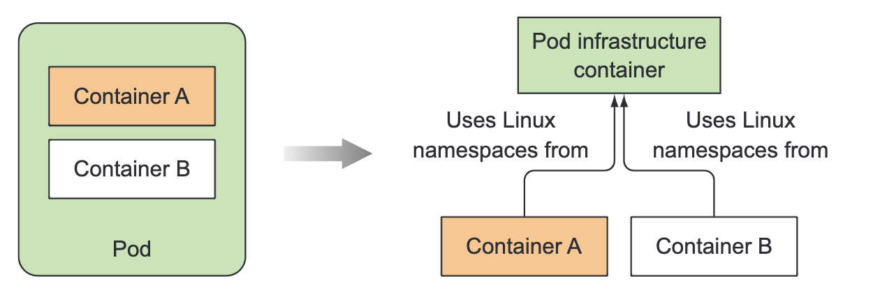

# Outlines

- What a running pod is
	- Containers in a pod
	- Pause Container
- Pod Types
	- Normal Pod
	- Static Pod
- Downward API
	- By Env
	- By Volume
- Pod Lifecycle
	- Init Containers
	- Lifecycle Hooks
- Pod Restart
	- Containers In Pod
		- Single Container
		- Multi Containers
	- Restart Policies
		- Nerver
		- Always
		- OnFailure
- Pod Probe
	- Pod LivenessProbe
	- Pod ReadinessProbe
- Taints And Tolerations
- Pod Resource
	- Resource Requests: scheduler
	- Resource Limits: Node Resource Overcommit
- Pod 的调度
	- Resource Requests
	- NodeSelector
	- NodeAffinity 
	- PodAffinity
	- Taints和Tolerations


# 实验

实验步骤和实验详情: 参考具体的下面这些具体的文件内容

```txt
详情见: k8s-trails目录
├── pod-created-normal.yaml
├── pod-created-static.yaml
├── pod-downward-env.yaml
├── pod-downward-volume.yaml
├── pod-init-container.yaml
├── pod-lifecycle-failed.yaml
├── pod-lifecycle-pending.yaml
├── pod-lifecycle-successed.yaml
├── pod-probe-liveness-check.yaml
├── pod-probe-readiness-check.yaml
├── pod-restart-always.yaml
├── pod-restart-never.yaml
├── pod-restart-onfailure.yaml
└── pod-taints-tolerations.yaml
```


# Pod的基本概念




一个 Pod 是 Kubernetes 中的基本调度单元，它是由一个或多个容器组成的。Pod 提供了一种逻辑上相互关联的容器组合，这些容器在同一个网络命名空间、存储卷和其他资源上共享相同的环境。
- Pod 具有如下特点：
	- 生命周期：Pod 作为整体被创建、调度、运行和删除。
	- 共享网络和存储：Pod 中的容器共享相同的网络命名空间和存储卷。可以通过 localhost 进行通信，并共享文件系统。
	- 紧密耦合：Pod 内的容器通常紧密协作，并在同一个节点上进行调度。
	- 水平扩展：可以根据负载需求复制 Pod 实例以实现水平扩展。
- 在 Kubernetes 中，Pod 是最小的可调度单位，其用途包括：
	- 将具有相互关系的容器组合到一个单元中，共享资源和上下文。
	- 为应用程序提供临时性或短暂性的存储卷。
	- 在容器之间设置共享数据的通信机制。
	- 定义应用程序的部署和伸缩方式。


Pause 容器被设计成一个特殊的非常轻量级的容器，它不运行任何实际的应用程序进程，也没有用户定义的配置，是 Kubernetes 中 Pod 实现的一部分。
- **其主要作用是**：实现了多个容器共享网络和存储的功能，为应用程序提供了高度的灵活性和可扩展性
	- 创建 Pod 的网络命名空间
		- Pause 容器会创建一个独立的网络命名空间，并设置该命名空间为其他容器共享的网络环境。这样，所有 Pod 中的容器都可以通过 localhost 进行通信，并且使用相同的 IP 地址和端口范围。
		- 由于 Pause 容器的存在，Pod 的 IP 地址和网络状态都是与 Pause 容器关联的。
		- 其他容器则通过网络命名空间与 Pause 容器进行通信。
	- 共享存储卷：Pause 容器挂载共享的存储卷，使得其他容器可以访问到 Pod 级别的持久化存储。
- 当所有容器都需要启动或停止时，Kubernetes 会操作 Pause 容器来管理整个 Pod 的生命周期。
	- 在 Kubernetes 内部，Pause 容器被认为是 Pod 的主要容器
	- 其他容器则被视为 Pause 容器的子容器


具体来说，Pod中的容器可以共享的资源有：
- PID命名空间：Pod中的不同应用程序可以看到其他应用程序的进程ID；
	- 在Kubernetes1.8版本之前默认支持Pod PID namespace 共享，
	- 在之后的版本中默认关闭了PID namespace共享
- 网络命名空间：Pod中的多个容器能够访问同一个IP和端口范围；
- IPC命名空间：Pod中的多个容器能够使用SystemV IPC或POSIX消息队列进行通信；
- UTS命名空间：Pod中的多个容器共享一个主机名；
- Volumes（共享存储卷）：Pod中的各个容器可以访问在Pod级别定
义的存储卷


# 静态Pod


静态 Pod 的配置文件被放置到指定目录中，主节点上的 `kubelet` 进程会检测到它们，并启动相应的容器。
- 静态 Pod 是由 `kubelet` 根据 `pod-manifest-path` 自动调度，不受控制平面的干预。
	- `pod-manifest-path` 目录一般是`/etc/kubernetes/manifests/`。
	- Pod 配置文件遵循与动态创建的 Pod 相同的格式，包括容器规范、标签选择器等。
- 静态 Pod 的主要特点包括：
	- 直接部署：静态 Pod 通过在主节点上的特定目录中放置 Pod 配置文件来进行部署，而不依赖于集群的控制平面。
	- 不受调度器影响：静态 Pod 的调度是由主节点上的 kubelet 进程处理的，而不是由默认的 kube-scheduler 进行调度。因此，它们不遵循调度策略、节点选择器等规则。
	- 与主节点耦合：静态 Pod 通常与主节点的生命周期紧密相关，并作为主节点的一部分运行。
- 静态 Pod 通常用于以下情况：
	- 主节点上的核心系统和服务
		- 可以将一些特定于主节点的关键服务（如 kube-proxy、kube-dns）配置为静态 Pod，确保它们始终在主节点上运行。
	- 节点特定任务
		- 某些应用程序或服务可能需要访问主节点上的特定资源或设备，这时可以使用静态 Pod 在主节点上运行这些任务。


# 普通Pod

普通 Pod 是通过 Kubernetes 控制平面（如 kube-scheduler）动态创建和调度的。

普通 Pod 在 Kubernetes 中被广泛用于部署应用程序和微服务。可以跨多个节点分布、扩展和水平伸缩，同时享受 Kubernetes 提供的自动容错、自愈能力和资源管理功能。

- 普通 Pod 的主要特点包括：
	- 动态创建：普通 Pod 通过使用 Kubernetes API（如 kubectl）或其他部署工具进行动态创建。
	- 调度器管理：普通 Pod 的调度由 Kubernetes 的调度器（kube-scheduler）负责。调度器会根据集群中节点的资源、标签选择器等条件来决定将 Pod 部署到哪个节点上。
	- 灵活性：普通 Pod 可以根据需要定义多个容器，并为每个容器指定资源需求、环境变量、存储卷等配置选项。
	- 生命周期管理：普通 Pod 的生命周期由 Kubernetes 控制平面负责，可以使用命令（如 kubectl）对其进行更新、扩展、缩小、删除等操作。


# Downward API


[Downward API](https://kubernetes.io/zh-cn/docs/concepts/workloads/pods/downward-api/) 允许容器在不使用 Kubernetes 客户端或 API 服务器的情况下，可以获取以下信息：
- 容器级别的元数据：如容器名称、容器所属的 Pod 名称和命名空间等。
- Pod 级别的元数据：如 Pod 的 IP 地址、主机名、标签、注解等。


在 Kubernetes 中，有两种方法可以将 Pod 和容器字段暴露给运行中的容器：
- 通过 [环境变量](https://kubernetes.io/zh-cn/docs/tasks/inject-data-application/environment-variable-expose-pod-information/)
- 通过 [`downwardAPI` 卷中的文件](https://kubernetes.io/zh-cn/docs/tasks/inject-data-application/downward-api-volume-expose-pod-information/)


# Init Containers
Kubernetes Init Containers 是在主容器之前运行的一种特殊类型的容器。它们用于在主容器启动之前执行预配置的任务或初始化操作。每个 Pod 可以定义一个或多个 Init Container，它们按顺序依次执行。

Kubernetes 会逐个运行 Init Containers，并等待每个 Init Container 成功完成（即退出状态码为 0）后才会继续运行主容器。
请注意，Init Containers 使用相同的资源限制、环境变量和卷挂载的配置方式，类似于主容器。


# 生命周期


Pod 在 Kubernetes 中有不同的生命周期阶段，从创建到终止。以下是 Pod 的常见生命周期阶段：
- **Pending（等待中）**：Pod 已经被创建，但还未调度到某个节点上运行。此时 Pod 正在等待满足其调度要求的节点资源。
- **Running（运行中）**：Pod 已经成功调度到节点上，并且至少其中一个容器在运行中。在这个阶段，容器内的应用程序正在正常运行。
- **Succeeded（成功）**：Pod 内的所有容器都已成功完成并退出。通常用于一次性任务或作业类型的 Pod。
- **Failed（失败）**：Pod 内的容器中至少有一个异常退出或出错。可能是应用程序崩溃、容器无法启动或执行错误等。
- **Unknown（未知）**：无法获取 Pod 的状态信息。可能是与集群 API 服务器的连接问题导致无法获得准确的状态。

在运行中的 Pod 可能会经历以下状态变化：
- **ContainerCreating（容器创建中）**：容器正在创建过程中，可能是由于镜像下载、初始化等操作。
- **Terminating（终止中）**：Pod 正在被删除，其中的容器正在停止运行。
- **Unknown（未知）**：无法获取到当前 Pod 状态的信息。


# 重启策略


在 Kubernetes 中，可以通过设置 Pod 的重启策略来定义容器在退出后的行为。以下是三种常见的 Pod 重启策略：

- **Always（始终重启）**：当容器退出时，无论是成功还是失败，Kubernetes 都会自动重启容器。这是默认的重启策略。   
- **OnFailure（仅在失败时重启）**：只有当容器以非零状态退出时，即失败时，Kubernetes 才会自动重启容器。如果容器正常退出（状态码为零），则不会触发重启。  
- **Never（从不重启）**：无论容器以何种方式退出，Kubernetes 都不会自动重启容器。需要手动进行干预和重启。


# LivenessProbe


LivenessProbe 探测失败达到预设的阈值（例如连续失败指定次数），Kubernetes 将认为容器处于不健康状态，并会触发相应的行为，如重启容器或替换故障容器。

当 LivenessProbe 未设置时，默认是True。


LivenessProbe 可使用以下参数进行配置：
- **exec**：执行一个命令来检查容器的活跃状态
- **httpGet**：通过发送 HTTP GET 请求到容器内的端点来检查容器的活跃状态
- **tcpSocket**：通过尝试打开容器内的 TCP 套接字来检查容器的活跃状态
- 可选参数:
	- `initialDelaySeconds`：在容器启动后等待多少秒后开始执行第一次探测。
	- `periodSeconds`：两次连续探测之间的间隔时间。
	- `timeoutSeconds`：每次探测的超时时间。
	- `successThreshold`：连续成功探测的阈值，达到该阈值后将认为容器处于活跃状态。
	- `failureThreshold`：连续失败探测的阈值，达到该阈值后将认为容器处于不健康状态。


重启策略可以与 LivenessProbe 一起使用，以实现容器的故障恢复机制：
- 如果重启策略设置为 `Always`，那么无论何时容器停止运行，Kubernetes 都会自动重新启动容器，包括由于 LivenessProbe 探测失败而触发的重启。
- 如果重启策略设置为 `OnFailure`，则只有当容器非正常退出（退出代码非零）时才会自动重新启动容器，LivenessProbe 探测失败不会触发重启。


Deployment 的期待数量和实际数量与 Liveness Probe之间有一定的关系。
- **期待数量（Desired Replicas）**：Deployment 中的 `replicas` 字段指定了所需副本的数量，即期望运行的 Pod 数量。Deployment 控制器会根据该值来创建或销毁 Pod，以使实际数量符合期望数量。   
- **实际数量（Actual Replicas）**：实际数量表示 Deployment 当前正在运行的 Pod 实例数。由 Kubernetes 控制器负责管理和维护这些 Pod，以使其与期望数量保持一致。
- **Liveness Probe 对期望数量和实际数量的影响**：
    - 如果 Liveness Probe 失败，并且重启次数未达到最大限制，则 Kubernetes 将尝试重新启动失败的容器，以使其恢复到健康状态。
    - 如果 Liveness Probe 持续失败并达到最大重启次数，则 Kubernetes 可能认为容器无法恢复，并将其标记为不可用。这可能导致 Kubernetes 创建新的 Pod 实例以替代不健康的容器，以确保 Deployment 的期望数量仍然满足。


# ReadinessProbe

Readiness Probe是 Kubernetes 中用于确定容器是否已准备好接收流量的机制之一。它通过定期发送请求到容器内部，并根据容器的响应结果来判断容器的可用性。

Readiness Probe 未设置时，默认是True。

以下是 Readiness Probe 可以使用的参数：
- `exec`：在容器内执行指定的命令，如果命令成功返回 0，则将容器标记为就绪。
- `httpGet`：向容器的指定端口发送 HTTP GET 请求，如果返回的状态码在成功范围内，则将容器标记为就绪
- `tcpSocket`：通过 TCP 连接到容器的指定端口，如果连接成功，则将容器标记为就绪
- 公共参数:
	- `initialDelaySeconds`：容器启动后首次进行探测的延迟时间。
	- `periodSeconds`：探测之间的时间间隔。
	- `timeoutSeconds`：每次探测的超时时间。
	- `successThreshold`：连续成功探测的阈值，达到该阈值则认为容器就绪。
	- `failureThreshold`：连续失败探测的阈值，达到该阈值则认为容器不可用。


Deployment 的期待数量和实际数量与 Readiness Probe之间有一定的关系。
- **期待数量（Desired Replicas）**：Deployment 中的 `replicas` 字段指定了所需副本的数量，即期望运行的 Pod 数量。Deployment 控制器会根据该值来创建或销毁 Pod，以使实际数量符合期望数量。   
- **实际数量（Actual Replicas）**：实际数量表示 Deployment 当前正在运行的 Pod 实例数。由 Kubernetes 控制器负责管理和维护这些 Pod，以使其与期望数量保持一致。
- Deployment 通过检查 Pod 的 Ready 状态来确定 Pod 是否符合期望状态
- **Readiness Probe 对期望数量和实际数量的影响**：
    - 如果 Readiness Probe 失败，则 Kubernetes 认为容器尚未准备好接收流量，将从服务负载均衡器中暂时移除该容器。
    - 当 Readiness Probe 持续失败时，Kubernetes 可能会创建新的 Pod 实例以替代不可用的容器，以确保 Deployment 的期望数量仍然满足，并且只将就绪的容器纳入负载均衡。


# Taints和Tolerations

Taints 和 Tolerations 是 Kubernetes 中用于调度和容错的机制，用于控制 Pod 是否能够被调度到具有特定 Taint 的节点上。
- Taints（污点）是应用于节点的标记，用于指示节点上的条件或限制。它们可以阻止一般情况下不应该运行在该节点上的 Pod 被调度到该节点上去。
    - 每个 Taint 包含三个属性：键（key）、值（value）和效果（effect）。
    - 键和值一起形成了 Taint 的唯一标识符。
    - 效果定义了 Pod 如何与具有该 Taint 的节点进行互动，有三种可能的值：
	    - NoSchedule: 如果节点上存在该 Taint，Pod 将不会被调度到此节点上。这是最常见的效果，用于阻止特定类型的 Pod 被调度到某些节点上。
		- PreferNoSchedule: 如果节点上存在该 Taint，调度器将尽量避免将 Pod 调度到此节点上，但不像 NoSchedule 那样强制禁止。如果其他条件满足，例如没有其他节点可供调度，则 Pod 仍然可能被调度到该节点上。
		- NoExecute: 如果节点上存在该 Taint，已经运行在该节点上的 Pod 将被驱逐（Eviction），并且新的 Pod 不会被调度到此节点上。这是一种更严格的效果，用于确保节点上不再运行特定类型的 Pod。
- Tolerations（容忍度）是应用于 Pod 的声明，用于指示 Pod 允许被调度到具有特定 Taint 的节点上。
    - 容忍度为 Pod 提供了对特定 Taint 的豁免权限，使其能够被调度到具有该 Taint 的节点上。
    - 容忍度由键和可选的值组成，如果键匹配节点上的 Taint，并且值也匹配或为空，则 Pod 允许被调度到该节点。


通过使用 Taints 和 Tolerations，可以实现以下场景：
- 将某些节点标记为专用节点，只能运行特定类型的 Pod。
- 创建可容忍污点的 Pod，以便将它们调度到具有特定污点的节点上。
- 控制 Pod 在集群中的分布和调度。


