# Outlines

- 通过两个核心问题, 把Scheduler、不同的Controllers、Node、Resources、Pod驱逐策略等等联系在一起
	- pod会被怎么调度(部署应用时；调度时的抢占；使用不同的Controllers时；部分资源被占用时；)
		- 例如，不同的Controller
		- 例如，不同的Resources设置和Pod QoS
		- 例如，不同的Node亲和性
		- 例如，不同的Pod亲和性
	- pod会被怎么驱逐(资源紧张时; 调度时抢占时;)
		- 例如，主动下线一个Node
		- 例如，一个Node资源紧张时，又有新Pod被调度到这个节点
		- 例如，某个Node故障时
	- [k8s 调度、抢占和驱逐](https://kubernetes.io/zh-cn/docs/concepts/scheduling-eviction/)
- k8s Scheduler
- Pod Resource
    - Resource Requests: affect scheduler
    - Resource Limits: Node Resource Overcommit
    - LimitRange:  set requests and limits on every container，apply to individual pods
    - ResourceQuota: limit the total amount of resources available in a namespace
    - Monitor Resource Usage
- Pod QoS(Quality of Service)
	- BestEffort (the lowest priority)
	- Burstable
	- Guaranteed (the highest)
- Pod Eviction
	- [Pod Priority Preemption](https://kubernetes.io/zh-cn/docs/concepts/scheduling-eviction/pod-priority-preemption/)
	- [Node Pressure Eviction](https://kubernetes.io/zh-cn/docs/concepts/scheduling-eviction/node-pressure-eviction/)
	- [Api Eviction](https://kubernetes.io/zh-cn/docs/concepts/scheduling-eviction/api-eviction/)
	- [Safely Drain Node](https://kubernetes.io/zh-cn/docs/tasks/administer-cluster/safely-drain-node/)
- [Pod Disruptions](https://kubernetes.io/zh-cn/docs/concepts/workloads/pods/disruptions/)
- Pod 的调度
    - Resource Requests
    - NodeSelector
    - NodeAffinity And Node Anti-Affinity
    - PodAffinity And PodAntiAffinity
    - Taints And Tolerations
    - [Topoly Spread Contrains](https://kubernetes.io/zh-cn/docs/concepts/scheduling-eviction/topology-spread-constraints/)
    - Commands:
	    - [`kubectl drain`](https://kubernetes.io/zh-cn/docs/tasks/administer-cluster/safely-drain-node/)
	    - `kubectl cordon` And `kubectl uncordon`
- [Controller Manager](https://kubernetes.io/zh-cn/docs/concepts/workloads/controllers/)
	- [DaemonSet Controller](https://kubernetes.io/zh-cn/docs/concepts/workloads/controllers/daemonset/)
	- [ReplicaSet Controller](https://kubernetes.io/zh-cn/docs/concepts/workloads/controllers/replicaset/)
	- [Deployment Controller](https://kubernetes.io/zh-cn/docs/concepts/workloads/controllers/deployment/)
	- [StatefulSet Controller](https://kubernetes.io/zh-cn/docs/concepts/workloads/controllers/statefulset/)
	- [Job Controller](https://kubernetes.io/zh-cn/docs/concepts/workloads/controllers/job/)
	- [CronJob Controller](https://kubernetes.io/zh-cn/docs/concepts/workloads/controllers/cron-jobs/)
	- Others
		- Namespace Controller
		- Node Controller
		- Service Controller
		- Endpoints Controller
		- PersistentVolume Controller
	- [workload resources](https://kubernetes.io/zh-cn/docs/reference/kubernetes-api/workload-resources/)
- 一些默认的情况:
	- 无默认的 Resource Requests
	- 无默认的 Resource Limits
	- 无默认的 NodeSelector
	- 无默认的 NodeAffinity
	- 无默认的 PodAffinity
	- 无默认的 Taints And Tolerations
	- 无默认的 Pod Priority Preemption
	- 有自动的 Pod QoS: 影响资源紧张时的驱逐策略


# 实验


实验步骤和实验详情: 参考具体的下面这些具体的文件内容


```txt
详情见: k8s-trails目录

├── scheduler-controller-cronjob.yaml
├── scheduler-controller-daemonset.yaml
├── scheduler-controller-deployment.yaml
├── scheduler-controller-job.yaml
├── scheduler-controller-replicaset.yaml
├── scheduler-node-affinity.yaml
├── scheduler-node-cordon.yaml
├── scheduler-node-drain.yaml
├── scheduler-node-selector.yaml
├── scheduler-node-taints-tolerations.yaml
├── scheduler-pod-affinity-anti.yaml
├── scheduler-pod-affinity.yaml
├── scheduler-pod-disruption-budget.yaml
├── scheduler-qos-multi-containers.yaml
├── scheduler-qos-single-container.yaml
├── scheduler-resource-limitrange.yaml
├── scheduler-resource-limits.yaml
├── scheduler-resource-requests.yaml
└── scheduler-resource-resourcequota.yaml
```


# Scheduler

Kubernetes [Scheduler](https://kubernetes.io/zh-cn/docs/concepts/scheduling-eviction/kube-scheduler/)（调度器）是Kubernetes集群中的一个核心组件，负责将Pod分配到可用的节点上。

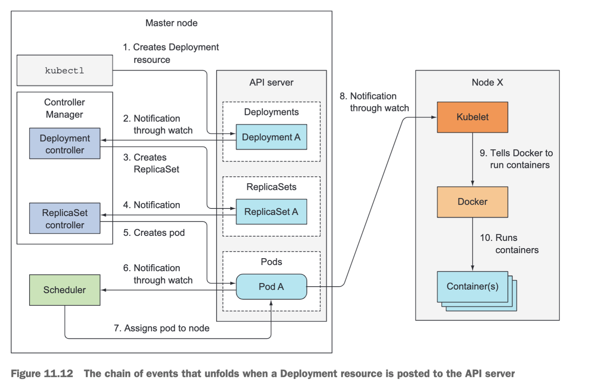

调度器的主要功能是根据一组预定的规则和策略，选择适当的节点来运行Pod。它考虑诸如节点资源、亲和性、反亲和性、节点负载均衡等因素，并尽力实现高效、公平的Pod分布。


以下是调度器的工作流程：
1. 创建Pod：当您创建一个Pod时，它进入未调度状态，等待调度器将其分配给一个节点。    
2. 选择候选节点：调度器会评估集群中的所有节点，并筛选出符合条件的候选节点。它会考虑节点资源（如CPU、内存）、容量限制、亲和性规则等。
3. 执行策略：调度器会根据配置的调度策略（例如默认策略或自定义策略）进行决策。这些策略可以基于优先级、负载均衡、亲和性和反亲和性规则等。
4. 分配节点：调度器选择最佳的节点，并将Pod分配给该节点。它会更新Pod的状态并通知Kubernetes API服务器。
5. 监控和迁移：调度器会监视集群状态，并在需要时执行Pod迁移。它持续监控节点资源、负载均衡和调度策略，以确保Pod在最合适的节点上运行。


# Resource Requests
资源请求用于定义Pod对计算资源（如CPU和内存）的需求，并告知调度器为Pod选择合适的节点。

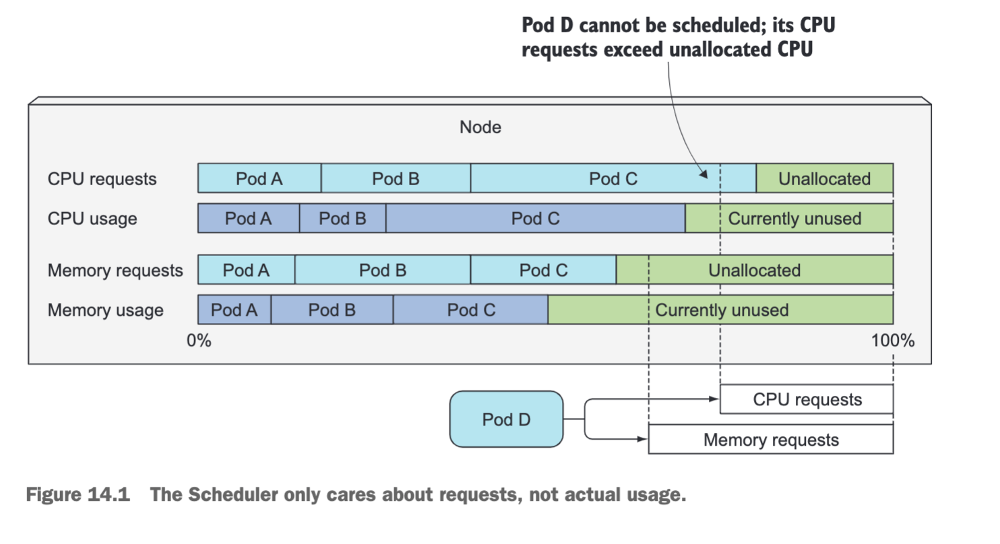


适当设置资源请求有助于实现高效的资源利用和负载均衡，并确保Pod能够正常运行且不会由于资源不足而出现问题。


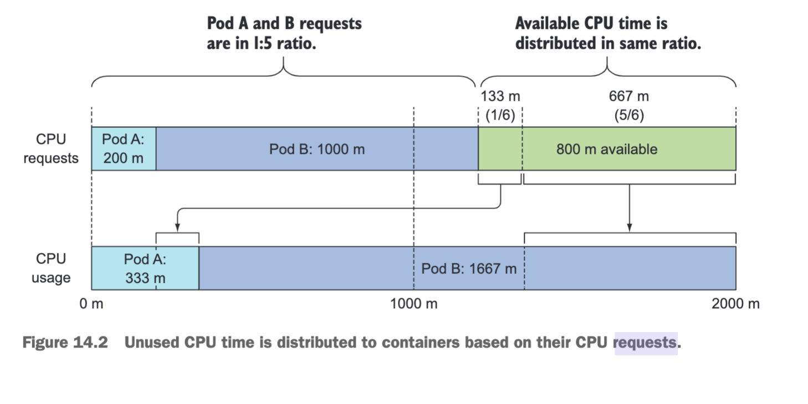
资源请求（Resource Requests）对调度器的影响是非常重要的。
- 节点筛选：调度器在选择节点时会考虑每个节点上已分配的资源量以及剩余可用资源。
	- 节点上的资源使用情况（包括已分配和保留的资源）与Pod的资源请求进行比较。
	- 调度器倾向于将Pod调度到能够满足其资源需求并具有足够可用资源的节点上。    
- 节点负载均衡：资源请求还用于实现节点负载均衡。
	- 调度器尝试在集群中均匀分布Pod，以避免某些节点过载而其他节点资源空闲。
	- 通过合理设置资源请求，可以帮助调度器在节点之间实现更好的负载均衡。
- 可用性和容错性：适当设置资源请求可以提高应用程序的可用性和容错性。
	- 例如，如果Pod没有足够的资源请求，并且节点上的资源紧张，可能会导致Pod无法正常运行或被系统驱逐。
	- 通过准确设置资源请求，可以确保Pod获得所需的资源，并避免由于资源不足而导致的问题。
- 请注意: Kubernetes调度器也会考虑其他因素，如节点亲和性、反亲和性规则和Pod优先级等。
	- 但资源请求是调度器选择节点并确保资源可用性的重要依据。


# Resource Limits


资源限制（Resource Limits）在Kubernetes中的作用是为Pod中的容器分配和控制资源的使用量。

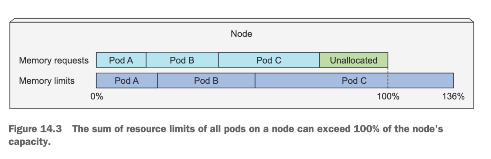

通过设置资源限制，可以确保容器在执行期间不会超出所分配的资源范围，从而维持系统的稳定性和可靠性。
- 预留资源：资源限制允许您指定每个容器可使用的最大资源数量，如CPU和内存。
	- 系统可以为容器预留足够的资源，并避免容器过度占用整个节点的资源，导致其他容器或系统受到影响。   
- 资源隔离：通过设置资源限制，每个容器都可以在一定范围内独立运行，互不干扰。
	- 资源限制确保容器之间在CPU和内存等方面彼此隔离，
	- 防止一个容器的异常行为对整个节点或其他容器造成负面影响。  
- 可靠性和稳定性：适当设置资源限制有助于提高应用程序的可靠性和稳定性。
	- 通过限制每个容器的资源使用量，可以减少因容器过度使用资源而引发的问题，如内存溢出、CPU饱和等。
	- 这有助于确保应用程序在可控的资源范围内运行，并降低系统崩溃或异常的风险。  
- 性能优化：通过设置资源限制，可以在容器级别对资源使用进行优化。
	- 可以根据应用程序的需求和性能特征来分配适当的资源限制，
	- 使每个容器获得足够的资源以达到最佳性能。
- Overcommit
	- CPU资源: 
		- CPU是一种可压缩的资源: 意味着可以对容器使用的CPU量进行限制，而不会对容器中运行的进程产生负面影响
	- 内存资源
		- 内存显然是不可压缩的: 一旦进程获得一块内存，除非该进程自行释放，否则无法从中收回
		- 如果不设置内存限制
			- 运行在工作节点上的容器（或Pod）可能会消耗掉所有可用内存
				- 并影响节点上的所有其他Pod以及调度到该节点的任何新Pod
				- 一个单独的故障或恶意Pod几乎可以使整个节点无法使用
			- 请记住，新Pod是根据内存请求而不是实际内存使用情况进行调度的
		- 设置内存限制
			- 可以防止容器过度占用内存，确保系统各个组件之间的资源隔离、稳定性和可靠性
			- 还有助于避免由于内存溢出导致的应用程序崩溃、节点失效或整体性能下降的问题
- Container
	- 看到的Cpu Cores: 节点上的实际CPU配置
	- 看到的Mem: 节点上的实际内存配置
	- 开发应用程序时需要考虑这方面的影响


# LimitRange


Kubernetes的LimitRange（资源限制范围）是一种资源管理机制，用于定义和强制执行容器资源的最小和最大限制。它可以帮助确保Pod和容器在分配资源时遵循一组预定义的限制。


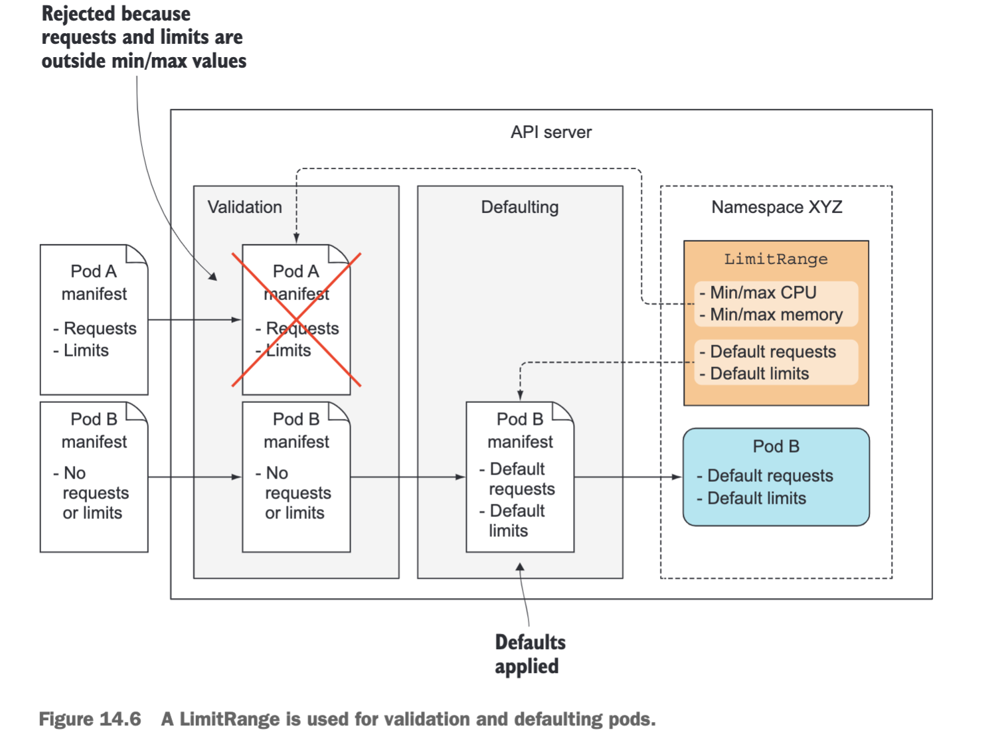
LimitRange可以应用于**命名空间**（Namespace）或**特定的Pod**。它定义了以下资源限制：

- CPU限制：指定Pod或容器可以使用的CPU资源的最小和最大值。
- 内存限制：指定Pod或容器可以使用的内存资源的最小和最大值。
- 存储限制：指定每个容器可以使用的本地磁盘或网络存储的最小和最大值。
- 持久卷声明（Persistent Volume Claim）大小限制：指定每个Pod中每个持久卷声明的最小和最大大小。
- 特权容器限制：指定可以使用特权模式（privileged mode）的容器数量的最小和最大值。
 

通过定义LimitRange，可以确保Pod和容器在资源分配上遵循一致的规则，并防止资源滥用或不恰当的资源使用。当创建Pod或容器时，Kubernetes会根据相关的LimitRange规则来自动应用资源限制，并在超出限制时拒绝创建或更新操作。

LimitRange只能对其所应用的命名空间或Pod起作用，因此在跨命名空间或集群范围内的资源管理方面，还可以使用更高级别的资源配额（Quota）机制。


# ResourceQuota

Kubernetes的ResourceQuota（资源配额）是一种重要的资源管理工具，用于在命名空间级别对资源的使用进行限制和控制，可以帮助管理员控制和限制命名空间内资源的使用，确保资源使用的合理性和公平性。


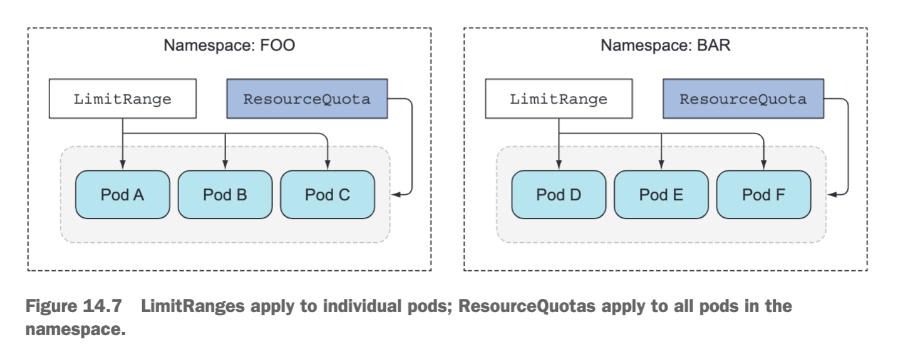

ResourceQuota允许管理员为每个命名空间设置资源配额规则，以确保该命名空间中的Pod、容器和持久卷声明等资源不会超出指定的限制，可以定义以下资源限制：
- CPU限制：指定命名空间中所有Pod或容器可以使用的CPU资源的总量。
- 内存限制：指定命名空间中所有Pod或容器可以使用的内存资源的总量。
- 存储限制：指定命名空间中所有容器可以使用的本地磁盘或网络存储的总量。
- 持久卷声明（Persistent Volume Claim）大小限制：指定命名空间中所有Pod中每个持久卷声明的总大小。   
- 服务数限制：指定命名空间中可以创建的Service资源的最大数量。   
- 副本数限制：指定命名空间中可以创建的副本数量，适用于Deployment、ReplicaSet和StatefulSet等资源。
- ResourceQuota还可以包括其他配置选项，如注释、标签选择器和对象计数限制。


当ResourceQuota应用于命名空间时，Kubernetes将监视该命名空间中的资源使用情况，并根据ResourceQuota定义的限制来执行调度和资源分配。如果超出配额限制，Kubernetes将拒绝创建新的Pod、容器或其他资源，并阻止进一步的资源消耗。


# Monitor Resource Usage


Kubernetes提供了多种资源使用监控的工具和技术，用于实时监测和分析集群中的资源消耗情况。


以下是一些常用的Kubernetes资源使用监控方法：

- Kubernetes Dashboard：Kubernetes官方提供的仪表板界面，可用于监视和管理集群中的各种资源。它提供了对Pod、节点、命名空间、服务等资源的实时性能指标和状态信息的可视化展示。
- Prometheus：一款开源的监控系统，广泛应用于Kubernetes生态系统中。Prometheus可以通过在集群中部署Exporter来收集和存储各种资源的指标数据，并提供强大的查询和警报功能。    
- Grafana：一个流行的开源数据可视化工具，与Prometheus等监控系统集成良好。Grafana可以将从Kubernetes集群中收集到的指标数据进行图表化展示，创建仪表盘和监控报告以便更直观地理解资源使用情况。
- Heapster（已过时）：以前Kubernetes的官方组件之一，用于收集和聚合集群中的资源使用数据。虽然Heapster现在已被Metrics Server取代，但仍有许多旧版Kubernetes集群使用Heapster进行资源监控。
- cAdvisor：一个基于容器的监控工具，可以提供对各个容器的资源使用情况的统计信息。它可以与Prometheus等监控系统集成，收集和报告容器级别的CPU、内存、磁盘和网络指标。


上述工具和技术可以帮助你实时监控Kubernetes集群中的资源使用情况，并提供可视化报表、警报和趋势分析等功能，以便更好地管理和优化资源配置。根据需求和偏好，可以选择适合监控方案并进行部署和配置。


Kubernetes监控体系的搭建和使用，可参考:  [k8s监控体系的搭建和使用.md](../k8s监控体系的搭建和使用/k8s监控体系的搭建和使用.md)
- prometheus
	- volume
	- rbac
	- server
	- service
	- node-exporter
- kube-state-metrics
	- rbac
	- deployment
- grafana
	- volume
	- grafana
	- deployment
	- import dashboard json model


# Pod QoS

Kubernetes 根据为 Pod 中的容器指定的资源约束为每个 Pod 设置 [QoS](https://kubernetes.io/zh-cn/docs/concepts/workloads/pods/pod-qos/)(Quality of Service) 分类。 Kubernetes 依赖这种分类来决定当 Node 上没有足够可用资源时要驱逐哪些 Pod。


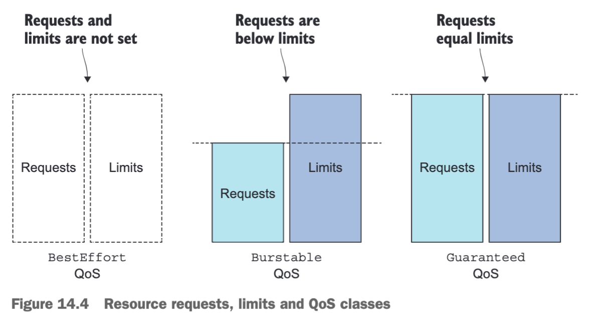

根据Pod内容器的资源请求和限制，以及其对节点资源的使用情况，Pod可以被归类为以下三个QoS类别：
- Guaranteed（保证）类别：这是最高优先级的Pod类别。
	- 它们设置了**相同且确切**的资源请求和限制，并且**所有容器**都满足这些要求。
	- Guaranteed类别的Pod将获得所请求的资源，并受到其他Pod的影响较小。
	- 系统会尽量保证为这些Pod提供其所需的资源。   
- Burstable（可突发）类别：这是中间优先级的Pod类别。
	- 它们设置了资源请求，但也设置了上限（限制）。
	- 容器在正常运行时通常只会使用请求的资源量，但有时可以暂时突破请求的限制进行突发使用。
	- Burstable类别的Pod具有一定的弹性，可以根据可用资源的变化进行适应。
- BestEffort（最佳尝试）类别：这是最低优先级的Pod类别。
	- 它们**没有设置**资源请求和限制。
	- BestEffort类别的Pod通常是不敏感且无关紧要的任务，它们依赖于系统的剩余资源。
	- 如果系统资源有限或耗尽，BestEffort类别的Pod可能会被限制资源或终止。
    


通过将Pod归类为不同的QoS类别，Kubernetes可以根据优先级和资源需求来进行资源管理和分配。这有助于确保关键应用程序获得足够的资源，并根据需要优先考虑高优先级的Pod。在资源紧张的情况下，较低优先级的Pod可能会受到影响，甚至被终止以释放资源给更高优先级的Pod使用。


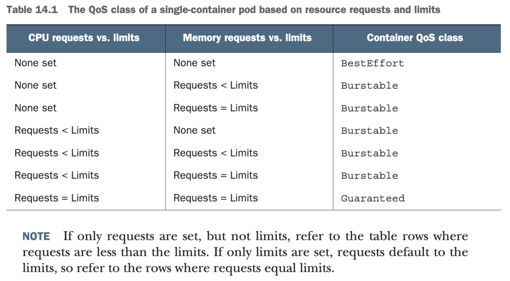


要使一个Pod被归类为Guaranteed类别，需要满足以下三个条件：
- 需要为CPU和内存设置请求和限制。
- 需要为每个容器设置请求和限制。
- 请求和限制需要相等（即每个容器中的每个资源的限制与请求相匹配）

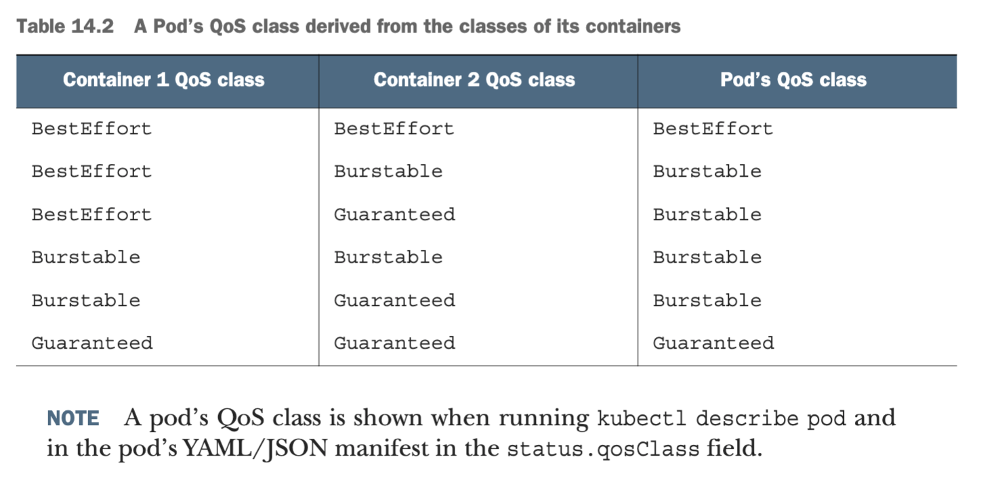


OOM Score指的是Out-of-Memory (OOM) Score，用于衡量进程在内存资源紧张时被杀死的优先级。OOM分数越高，表示进程越容易被终止以释放内存资源。

在Linux系统中，每个运行的进程都有一个OOM Score，范围从-1000到1000，其中负值表示更高的优先级。当系统内存不足时，内核会根据OOM分数选择终止哪个进程来释放内存。


OOM Score通过两个因素计算得出：
- 进程消耗的内存百分比：进程使用的内存占可用内存的百分比越高，其OOM分数就越高。
- 固定的 OOM score adjustment：基于Pod的QoS类别和容器的请求内存大小进行调整。不同QoS类别和不同请求内存大小会影响OOM分数的调整值。

通过OOM分数调整，系统可以根据进程的内存使用情况和Pod的QoS类别来确定终止进程的顺序，以优化内存资源的利用和分配。这有助于确保关键应用程序获得足够的内存资源，并避免内存耗尽导致系统性能下降。

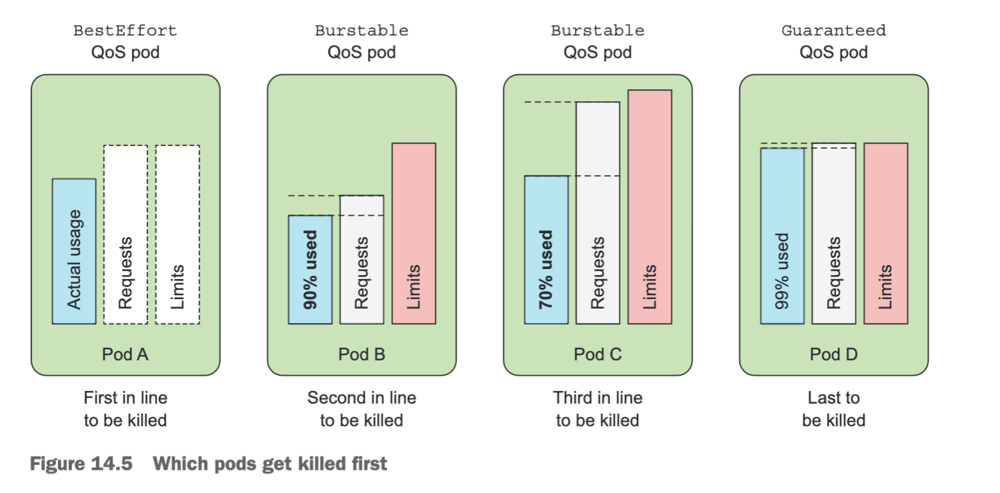

当系统超额分配资源时，QoS类别决定了哪个容器首先被终止，以释放资源供更高优先级的Pod使用。
- 在资源受限的情况下，较低优先级的Pod和其进程可能会被终止以释放资源给更高优先级的Pod使用
	- 背景
		- 当节点的整个内存已经达到最大限制，
		- 并且该节点上的一个进程尝试分配更多内存时，
		- 系统将需要终止其中一个进程（甚至可能是尝试分配额外内存的进程）来满足分配请求
	- 首先，运行在BestEffort Pod中的进程将始终在Burstable Pod中的进程之前被终止
	- 接下来，当存在两个Burstable Pod时，选择过程将优先选择其中一个Pod: 
		- 具体选择哪个Pod可能会根据具体实现而有所不同
			- 例如基于资源使用率、请求和限制之间的差异或其他策略进行选择
		- 当存在两个处于Burstable类别的单容器Pod时，
			- 如果其中一个Pod使用的请求内存百分比超过另一个Pod，系统将终止使用较高百分比请求内存的那个Pod
			- Pod B gets killed before pod C
	- 最后，运行在Burstable Pod中的进程也会在Guaranteed Pod的进程之前被终止


# Pod Disruption Budget


[Pod Disruption Budget](https://kubernetes.io/zh-cn/docs/tasks/run-application/configure-pdb/) (PDB) 是 Kubernetes 中的一种资源对象，用于定义在进行维护、故障处理或其他情况下，可容忍受干扰的 Pod 的最小数量。

PDB 通过设置 `minAvailable` 或 `maxUnavailable` 来指定要保留的 Pod 最小数量或最大不可用数量。它与 Deployment、StatefulSet 和 ReplicaSet 等控制器对象结合使用，以确保系统在进行维护或调整时仍能保持一定程度的稳定性。

- `minAvailable`：指定至少要保持运行的 Pod 的最小数量。可以是绝对数值（如 `2`）或相对数值（如 `50%`）。
- `maxUnavailable`：指定可接受的最大不可用 Pod 数量。同样可以是绝对数值或相对数值。

PDB并不能真正保证指定数量/百分比的 Pod 一直处于运行状态。
例如：当 Pod 集合的规模处于预算指定的最小值时，承载集合中某个 Pod 的节点发生了故障，这样就导致集合中可用 Pod 的数量低于预算指定值。预算只能够针对自发的驱逐提供保护，而不能针对所有 Pod 不可用的诱因。


#  Pod Priority Preemption

[Pod Priority Preemption](https://kubernetes.io/zh-cn/docs/concepts/scheduling-eviction/pod-priority-preemption/)（Pod 优先级抢占）是 Kubernetes 中的一个特性，用于在资源紧张时重新分配资源以满足高优先级 Pod 的需求。

优先级表示一个 Pod 相对于其他 Pod 的重要性。 如果一个 Pod 无法被调度，调度程序会尝试抢占（驱逐）较低优先级的 Pod， 以使悬决 Pod 可以被调度。


当集群中的资源不足以满足所有 Pod 的请求时，Pod Priority Preemption 可以触发以下行为：
- 高优先级 Pod 抢占
	- 系统会检查是否有低优先级的 Pod 可以被回收或驱逐，以腾出资源给高优先级 Pod 使用。
	- 如果存在可被抢占的低优先级 Pod，则系统会终止这些 Pod，并将它们的资源分配给高优先级 Pod。
- 优先级策略：通过设置 Pod 的优先级和 PreemptionPolicy 属性
	- 可以明确指定哪些 Pod 具有较高的优先级，并控制哪些 Pod 可以被抢占或避免被抢占。
	- 优先级值越高的 Pod 越容易被保护，不容易被其他优先级较低的 Pod 抢占。


需要注意的是，使用优先级抢占的调度策略可能会导致某些Pod永远无法被成功调度。
- 优先级调度不但增加了系统的复杂性，还可能带来额外不稳定的因素。
	- Pod Priority Preemption 需要开启和正确配置集群的调度器和优先级策略，
	- 并且要确保 Pod 的优先级设置准确
- 对于被抢占的 Pod，可能会导致被中断的任务数据丢失或不可恢复
- 一旦发生资源紧张的局面
	- 首先要考虑的是集群扩容，
	- 如果无法扩容，则再考虑有监管的优先级调度特性，
		- 比如结合基于Namespace的资源配额限制来约束任意优先级抢占行为。


Pod 优先级和Pod QoS 
- Pod 优先级和Pod QoS 是两个正交特征
- 调度器的抢占逻辑在选择抢占目标时不考虑 QoS
- Node Pressure Eviction 使用了 Pod 优先级 和 Pod QoS来判断驱逐顺序
	- 对紧俏资源的使用是否超过请求值
	- Pod 优先级
	- 相对于请求的资源使用量
- Pod QoS 影响OOM Score
	- OOM Score 基于Pod的QoS类别和容器的请求内存大小进行调整。
	- 不同QoS类别和不同请求内存大小会影响OOM分数的调整值
	- Node Pressure Eviction
		- 节点在 kubelet 能够回收内存之前遇到内存不足（OOM）事件时，会触发oom killer

Pod 优先级抢占 和 Pod Disruption Budget: 支持 PodDisruptionBudget，但不保证
- Kubernetes 在抢占 Pod 时支持 PDB，但对 PDB 的支持是基于尽力而为原则的。 
- 调度器会尝试寻找不会因被抢占而违反 PDB 的牺牲者，但如果没有找到这样的牺牲者， 抢占仍然会发生，并且即使违反了 PDB 约束也会删除优先级较低的 Pod
# Node Pressure Eviction

[节点压力驱逐](https://kubernetes.io/zh-cn/docs/concepts/scheduling-eviction/node-pressure-eviction/)是 kubelet 主动终止 Pod 以回收节点上资源的过程。  

kubelet 监控集群节点的内存、磁盘空间和文件系统的 inode 等资源。 当这些资源中的一个或者多个达到特定的消耗水平， kubelet 可以主动地使节点上一个或者多个 Pod 失效，以回收资源防止饥饿。


kubelet 具体的驱逐操作分类:
- kubelet 并不理会配置的 `PodDisruptionBudget` 或者是 Pod 的 `terminationGracePeriodSeconds`
- 如果节点在 kubelet 能够回收内存之前遇到内存不足（OOM）事件
	- 则节点依赖 [oom_killer](https://lwn.net/Articles/391222/) 来响应: kubelet 根据 Pod 的服务质量（QoS）为每个容器设置一个 `oom_score_adj` 值
	- 低 QoS Pod 中相对于其调度请求消耗内存较多的容器，将首先被杀死
	- 与 Pod 驱逐不同，如果容器被 OOM 杀死， `kubelet` 可以根据其 `RestartPolicy` 重新启动它
- kubelet 在驱逐 Pod 之前会先尝试回收节点级资源
	- 当报告 `DiskPressure` 节点状况时，kubelet 会根据节点上的文件系统回收节点级资源
		- 有 `imagefs`
			- 如果 `nodefs` 文件系统满足驱逐条件，kubelet 垃圾收集死亡 Pod 和容器
			- 如果 `imagefs` 文件系统满足驱逐条件，kubelet 将删除所有未使用的镜像
		- 无 `imagefs`: `nodefs` 文件系统, kubelet 按以下顺序释放磁盘空间
			- 对死亡的 Pod 和容器进行垃圾收集
			- 删除未使用的镜像
- 如果 kubelet 回收节点级资源的尝试没有使驱逐信号低于条件，则 kubelet 开始驱逐最终用户 Pod
	- kubelet 使用以下参数来确定 Pod 驱逐顺序
		- Pod 的资源使用是否超过其请求
		- Pod 的优先级
		- Pod 相对于请求的资源使用情况
	- kubelet 按以下顺序排列和驱逐 Pod
		- 首先考虑资源使用量超过其请求的 `BestEffort` 或 `Burstable` Pod
			- 这些 Pod 会根据它们的优先级以及它们的资源使用级别超过其请求的程度被逐出
		- 资源使用量少于请求量的 `Guaranteed` Pod 和 `Burstable` Pod 
			- 根据其优先级被最后驱逐


kubelet 使用各种参数来做出驱逐决定，可以通过设置参数进行调整:
- 如何设置参数
	- kubelet 命令的选项
	- kubelet 配置文件
	- **不同版本的默认情况没有统一标准**
	- **不同的安装k8s的软件，会设置不同的kubelet启动参数**
- 驱逐信号
	- `memory.available` 的值来自 cgroupfs
	- `nodefs`：节点的主要文件系统，用于本地磁盘卷、emptyDir、日志存储等。 例如，`nodefs` 包含 `/var/lib/kubelet/`
	- `imagefs`：可选文件系统，供容器运行时存储容器镜像和容器可写层
- 驱逐条件
	- 驱逐条件的格式: `[eviction-signal][operator][quantity]`
		- `eviction-signal` 是要使用的驱逐信号。
		- `operator` 是你想要的关系运算符， 比如 `<`（小于）
		- `quantity` 是驱逐条件数量
			- 例如: 可以将驱逐条件定义为 `memory.available<10%` 或 `memory.available< 1G`
	- 软驱逐条件
		- 软驱逐条件将驱逐条件与管理员所必须指定的宽限期配对。 
			- 在超过宽限期之前，kubelet 不会驱逐 Pod。 
			- 如果没有指定的宽限期，kubelet 会在启动时返回错误。
	- 硬驱逐条件
		- 硬驱逐条件没有宽限期。
			- 当达到硬驱逐条件时， kubelet 会立即杀死 pod，而不会正常终止以回收紧缺的资源
		- kubelet 具有以下默认硬驱逐条件
- 监控间隔
	- kubelet 根据其配置的 `housekeeping-interval`（默认为 `10s`）评估驱逐条件
- 最小驱逐回收
	- 在某些情况下，驱逐 Pod 只会回收少量的紧俏资源。 这可能导致 kubelet 反复达到配置的驱逐条件并触发多次驱逐。
	- 可以使用 `evictionMinimumReclaim` 设置最小回收量
		- kubelet 的命令选项
		- 或者kebelet配置文件


| 驱逐信号  | 描述  |
|---|---|
|`memory.available`|`memory.available` := `node.status.capacity[memory]` - `node.stats.memory.workingSet`|
|`nodefs.available`|`nodefs.available` := `node.stats.fs.available`|
|`nodefs.inodesFree`|`nodefs.inodesFree` := `node.stats.fs.inodesFree`|
|`imagefs.available`|`imagefs.available` := `node.stats.runtime.imagefs.available`|
|`imagefs.inodesFree`|`imagefs.inodesFree` := `node.stats.runtime.imagefs.inodesFree`|
|`pid.available`|`pid.available` := `node.stats.rlimit.maxpid` - `node.stats.rlimit.curproc`|


kubelet 报告节点状况以反映节点处于压力之下，因为满足硬或软驱逐条件，与配置的宽限期无关。


|节点条件|驱逐信号|描述|
|---|---|---|
|`MemoryPressure`|`memory.available`|节点上的可用内存已满足驱逐条件|
|`DiskPressure`|`nodefs.available`、`nodefs.inodesFree`、`imagefs.available` 或 `imagefs.inodesFree`|节点的根文件系统或镜像文件系统上的可用磁盘空间和 inode 已满足驱逐条件|
|`PIDPressure`|`pid.available`|(Linux) 节点上的可用进程标识符已低于驱逐条件|


# API Eviction

[API 发起的驱逐](https://kubernetes.io/zh-cn/docs/concepts/scheduling-eviction/api-eviction/) 是一个先调用 `Eviction API` 创建 `Eviction` 对象，再由该对象体面地中止 Pod 的过程。  


- 可以通过直接调用 Eviction API 发起驱逐
- 也可以通过编程的方式使用 `kube-apiserver`的客户端来发起驱逐
	- 比如 `kubectl drain` 命令: 此操作创建一个 `Eviction` 对象，该对象再驱动 API 服务器终止选定的 Pod。
- API 发起的驱逐将遵从 [`PodDisruptionBudgets`](https://kubernetes.io/zh-cn/docs/tasks/run-application/configure-pdb/) 和 [`terminationGracePeriodSeconds`](https://kubernetes.io/zh-cn/docs/concepts/workloads/pods/pod-lifecycle#pod-termination) 配置。

# Pod Disruptions

[Disruptions](https://kubernetes.io/zh-cn/docs/concepts/workloads/pods/disruptions/) 分为自愿干扰和非自愿干扰

- **非自愿干扰（Involuntary Disruptions）**: 不可避免的情况称为应用的非自愿干扰, 例如：
	- 节点下层物理机的硬件故障
	- 集群管理员错误地删除虚拟机（实例）
	- 云提供商或虚拟机管理程序中的故障导致的虚拟机消失
	- 内核错误
	- 节点由于集群网络隔离从集群中消失
	- 由于节点[资源不足](https://kubernetes.io/zh-cn/docs/concepts/scheduling-eviction/node-pressure-eviction/)导致 pod 被驱逐。
- 自愿干扰（Voluntary Disruptions）: 包括由应用所有者发起的操作和由集群管理员发起的操作
	- 典型的应用所有者的操作包括：
		- 删除 Deployment 或其他管理 Pod 的控制器
		- 更新了 Deployment 的 Pod 模板导致 Pod 重启
		- 直接删除 Pod（例如，因为误操作）
	- 集群管理员操作包括
		- [排空（drain）节点](https://kubernetes.io/zh-cn/docs/tasks/administer-cluster/safely-drain-node/)进行修复或升级。
		- 从集群中排空节点以缩小集群（了解[集群自动扩缩](https://github.com/kubernetes/autoscaler/#readme)）。
		- 从节点中移除一个 Pod，以允许其他 Pod 使用该节点。


# Drain And Cordon

在对节点执行维护（例如内核升级、硬件维护等）之前， 可以使用 [kubectl drain](https://kubernetes.io/zh-cn/docs/tasks/administer-cluster/safely-drain-node/) 从节点安全地逐出所有 Pod。 安全的驱逐过程允许 Pod 的容器[体面地终止](https://kubernetes.io/zh-cn/docs/concepts/workloads/pods/pod-lifecycle/#pod-termination)， 并确保满足指定的 `PodDisruptionBudgets`


`kubectl cordon` 用于将节点标记为不可调度状态，当运行 `kubectl cordon <node-name>` 时，指定的节点将被标记为不可调度。通过标记节点为不可调度，Kubernetes 将停止在该节点上新创建 Pod 的调度，但现有的 Pod 不会受到影响，这样可以确保不会在节点上增加进一步的负载。
要解除节点的不可调度状态，可以使用 `kubectl uncordon <node-name>` 命令，这将允许节点重新接收调度请求。

`kubectl drain` 命令的一些参数和选项：
- `--chunk-size=500`：以分块方式返回大型列表，而不是一次性返回所有结果。设置为 0 表示禁用此功能。
- `--delete-emptydir-data=false`：即使有使用 emptyDir 的 Pod（在节点被驱逐时将删除本地数据）也继续执行节点驱逐操作。
- `--disable-eviction=false`：强制使用删除方式进行节点驱逐，即使 eviction 功能受支持。这将绕过对 PodDisruptionBudget 的检查，请谨慎使用。
- `--dry-run='none'`：指定模拟运行的策略。可选择的值为 "none"、"server" 或 "client"。如果选择 "client"，则只打印要发送的对象，而不会实际发送。如果选择 "server"，则提交服务器端请求而不保存资源。
- `--force=false`：即使存在未声明控制器的 Pod，也继续执行节点驱逐操作。
- `--grace-period=-1`：给每个 Pod 提供优雅终止的时间段（以秒为单位）。如果为负值，则使用 Pod 中指定的默认值。
- `--ignore-daemonsets=false`：忽略 DaemonSet 管理的 Pod。
- `--pod-selector=''`：基于标签选择器筛选节点上的 Pod。
- `-l, --selector=''`：基于标签查询选择器进行过滤。匹配的对象必须满足所有指定的标签约束条件。
- `--skip-wait-for-delete-timeout=0`：如果 Pod 的 DeletionTimestamp 早于 N 秒，则跳过等待 Pod 删除的过程。秒数必须大于 0 才会跳过等待。
- `--timeout=0s`：等待超时的时间长度，设置为 0 表示无限等待。


# NodeSelector

NodeSelector 是 Kubernetes 中的一个属性，用于在Pod定义中指定一个标签选择器，以便将Pod调度到具有匹配标签的节点上。

使用 NodeSelector 时需要注意:
- 使用NodeSelector仅适用于静态节点选择，并且仅在节点拥有所需标签时才能成功调度Pod。
- 如果没有满足条件的节点，则Pod将处于Pending状态，直到符合条件的节点变为可用。
- 另外，NodeSelector不提供高可用性和负载均衡功能
	- 因为NodeSelector仅关注节点级别的选择
	- 而不考虑节点之间的资源利用率或负载情况。

# NodeAffinity

NodeAffinity（节点亲和性）是Kubernetes调度器中的一个概念，用于在Pod定义中指定一组节点亲和性规则，以便将Pod调度到满足这些规则的节点上。


Kubernetes中的NodeAffinity没有默认规则。如果在Pod定义中未显式指定NodeAffinity规则，则调度器将考虑所有可用节点作为潜在的调度目标。

使用NodeAffinity可以更精确地控制Pod的调度行为，以便将其分配给具有特定属性或能力的节点。这对于满足硬件要求、区域性要求或负载均衡等场景非常有用。与NodeSelector相比，NodeAffinity提供了更灵活的方式来控制Pod的调度行为。

NodeAffinity 的使用: 
- 如果同时定义了nodeSelector和nodeAffinity，那么必须两个条件都得到满足，Pod才能最终运行在指定的Node上
- `nodeSelectorTerms`：这定义了一组逻辑条件，用于选择满足条件的节点。
	- 如果nodeAffinity指定了多个nodeSelectorTerms
		- 那么其中一个能够匹配成功即可
	- 如果在nodeSelectorTerms中有多个matchExpressions
		- 一个节点必须满足所有matchExpressions才能运行该Pod
- `requiredDuringSchedulingIgnoredDuringExecution`（调度期间必需，执行期间忽略）
	- 此字段定义了在调度Pod时必须满足的节点亲和性规则。
	- 如果无法满足这些条件，则Pod将无法调度。
	- 它使用`nodeSelectorTerms`来指定一组逻辑条件，以筛选满足条件的节点进行调度。
- `preferredDuringSchedulingIgnoredDuringExecution`（调度期间优先，执行期间忽略）
	- 该字段允许定义首选的节点亲和性规则。
	- 调度器将尝试按照优先级顺序匹配这些规则，并将Pod调度到满足最高优先级规则的节点。
	- 如果无法满足任何规则，则使用默认的调度策略。
	- 与`requiredDuringSchedulingIgnoredDuringExecution`不同，如果在执行期间节点不再满足规则，Pod仍然会继续运行。
- 支持以下操作符（Operators）：
	- `In`：节点属性的值必须等于提供的一个或多个值之一。
	- `NotIn`：节点属性的值不能等于提供的任何一个值。
	- `Exists`：节点必须具有指定的标签键（存在即可，不需要具体值）。
	- `DoesNotExist`：节点不能具有指定的标签键。
	- 这些操作符可用于定义NodeAffinity规则中的 MatchExpressions，以指定节点选择的条件。


Node Anti-Affinity（节点反亲和性）用于指定不允许将Pod调度到具有某些特定标签或其他节点属性的节点上。通过使用适当的运算符（如`NotIn`、`DoesNotExist`等），可以根据节点的标签或其他属性设置更复杂的Node Anti-Affinity规则。


# PodAffinity


PodAffinity（Pod 亲和性）是 Kubernetes 中的一个调度属性，用于在Pod定义中指定与其他Pod亲和性规则，以便将它们调度到同一节点或具有相关性的节点上。

在Kubernetes中，PodAffinity没有默认规则。如果在Pod定义中未显式指定PodAffinity规则，则调度器将不会应用任何PodAffinity约束。

Pod Affinity 的条件要求必须在同一个命名空间中存在符合条件的其他 Pod，Pod Affinity 在不同命名空间之间是不起作用的。

通过合理使用 PodAffinity，可以**控制 Pod 之间的位置关系**，优化资源利用、提高容错性和性能，并满足特定的业务需求。


PodAffinity 可以根据标签选择器 (Label Selector ) 进行匹配，并结合拓扑关键字（Topology Key）来决定调度的位置:
- 可以使用 `requiredDuringSchedulingIgnoredDuringExecution` 规则来指定必需的亲和性条件
- 可以使用 `preferredDuringSchedulingIgnoredDuringExecution` 规则来指定首选的亲和性条件
- PodAffinity Label Selector 
	- 用于定义 Pod 亲和性规则中的匹配条件
	- 一些常用的标签选择器操作符：
		- "In"：指定一个标签键的多个可能值
		- "NotIn"：指定一个标签键的多个排除值
		- "Exists"：检查是否存在指定的标签键
		- "DoesNotExist"：检查是否不存在指定的标签键
	- 可以通过使用逻辑运算符（如 AND、OR、NOT）来组合多个标签选择器条件，以创建更复杂的匹配规则
- PodAffinity Topology Key
	- 用于定义 Pod 亲和性规则中的拓扑约束条件，以决定 Pod 之间的调度关系
	- PodAffinity Topology Key 的选择取决于集群的配置和特定的部署需求。
	- 常见的拓扑关键字包括:
		- 节点名称（`kubernetes.io/hostname`）
		- 区域（`topology.kubernetes.io/region`）
		- 机架（`topology.kubernetes.io/zone`）


PodAntiAffinity（Pod 反亲和性）是 Kubernetes 中的一个调度属性，用于指定 Pod 与其他 Pod 的反亲和性关系。与 PodAffinity 相反，PodAntiAffinity 用于阻止将具有相同标签或匹配条件的 Pod 调度到同一节点上。


# Taints And Tolerations

Taints 和 Tolerations 是 Kubernetes 中用于调度和容错的机制，用于控制 Pod 是否能够被调度到具有特定 Taint 的节点上。
- Taints（污点）是应用于节点的标记，用于指示节点上的条件或限制。它们可以阻止一般情况下不应该运行在该节点上的 Pod 被调度到该节点上去。
    - 每个 Taint 包含三个属性：键（key）、值（value）和效果（effect）。
    - 键和值一起形成了 Taint 的唯一标识符。
    - 效果定义了 Pod 如何与具有该 Taint 的节点进行互动，有三种可能的值：
	    - NoSchedule: 如果节点上存在该 Taint，Pod 将不会被调度到此节点上。这是最常见的效果，用于阻止特定类型的 Pod 被调度到某些节点上。
		- PreferNoSchedule: 如果节点上存在该 Taint，调度器将尽量避免将 Pod 调度到此节点上，但不像 NoSchedule 那样强制禁止。如果其他条件满足，例如没有其他节点可供调度，则 Pod 仍然可能被调度到该节点上。
		- NoExecute: 如果节点上存在该 Taint，已经运行在该节点上的 Pod 将被驱逐（Eviction），并且新的 Pod 不会被调度到此节点上。这是一种更严格的效果，用于确保节点上不再运行特定类型的 Pod。
- Tolerations（容忍度）是应用于 Pod 的声明，用于指示 Pod 允许被调度到具有特定 Taint 的节点上。
    - 容忍度为 Pod 提供了对特定 Taint 的豁免权限，使其能够被调度到具有该 Taint 的节点上。
    - 容忍度由键和可选的值组成，如果键匹配节点上的 Taint，并且值也匹配或为空，则 Pod 允许被调度到该节点。


通过使用 Taints 和 Tolerations，可以实现以下场景：
- 将某些节点标记为专用节点，只能运行特定类型的 Pod。
- 创建可容忍污点的 Pod，以便将它们调度到具有特定污点的节点上。
- 控制 Pod 在集群中的分布和调度。

# Controller Manager


Controller Manager（控制器管理器）是 Kubernetes 集群中的一个核心组件之一，它运行在主控节点上，负责管理和运行多个控制器。Controller Manager 由多个控制器组件组成，每个控制器都负责监视和维护集群中不同类型资源的状态。

以下是 Controller Manager 中常见的控制器组件：
- Node Controller：负责监视集群中的节点状态，并处理节点的变化。
	- 当节点离线或不可达时，Node Controller 会采取相应的操作，
	- 例如将 Pod 调度到其他可用节点上。
- Replication Controller 和 ReplicaSet Controller：这两个控制器负责管理 Pod 的副本数量以及与之相关的资源。
	- Replication Controller 在旧版本中使用，而 ReplicaSet Controller 是其增强版本，在新版本中更常用。
	- 它们确保指定的副本数始终在集群中运行，并在需要时进行自动调整。
- Deployment Controller
	- 建立在 ReplicaSet 控制器之上，提供了对应用程序部署的高级别抽象。
	- Deployment 控制器允许您进行滚动更新、回滚和扩展等操作，以实现无缝的应用程序版本管理。
- StatefulSet Controller：用于管理有状态应用程序的部署。
	- StatefulSet 提供了唯一标识和稳定网络标识符来管理每个 Pod 实例，
	- 并确保有状态应用程序的持久性、顺序性和稳定性。
- DaemonSet Controller：负责在集群中的每个节点上运行一个 Pod 副本，适用于运行守护进程或节点级任务的场景。
	- 当节点加入集群或有节点变化时，DaemonSet 控制器会相应地创建或删除对应的 Pod 实例。
  

Controller Manager 是 Kubernetes 的关键组件之一，通过运行和管理多个控制器组件，实现了资源生命周期的自动化管理和维护。这些控制器确保集群中的各种资源处于用户定义的期望状态，并根据需要进行调整和操作，以确保集群的可靠性和高效性。


# Controllers


Kubernetes 控制器（controllers）是 Kubernetes 系统中的一种核心组件，用于管理和维护集群中的各种资源状态。控制器通过监视资源对象的状态，并根据用户定义的期望状态进行调整，以确保集群中的实际状态与期望状态保持一致。


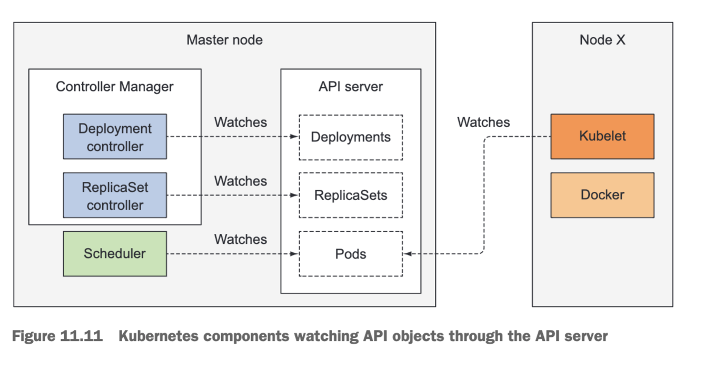

以下是 Kubernetes 中常见的几种控制器：
- [ReplicaSet Controller](https://kubernetes.io/zh-cn/docs/concepts/workloads/controllers/replicaset/)
	- 用于管理 Pod 的副本数量，确保指定的副本数始终运行在集群中
	- 会自动创建、删除和更新 Pod 副本，以适应应用程序的需求
- [Deployment Controller](https://kubernetes.io/zh-cn/docs/concepts/workloads/controllers/deployment/)
	- 建立在 ReplicaSet 控制器之上，提供了对应用程序部署的更高级别的抽象。
	- Deployment 允许在集群上管理应用程序的版本控制、滚动更新和回滚等操作。
	- 以受控速率更改实际状态， 使其变为期望状态。
- [StatefulSet Controller](https://kubernetes.io/zh-cn/docs/concepts/workloads/controllers/statefulset/)
	- 用于管理有状态应用程序的部署。
	- 与 ReplicaSet 不同，StatefulSet 提供了唯一标识和稳定网络标识符（如 DNS 名称）来管理每个 Pod 实例。
	- 这使得有状态应用程序能够保持持久性、顺序性和稳定性。
- [DaemonSet Controller](https://kubernetes.io/zh-cn/docs/concepts/workloads/controllers/daemonset/)
	- 确保每个节点上都运行一个 Pod 副本，适用于运行守护进程或节点级任务的场景。
	- 当节点加入集群或有节点变化时，DaemonSet 控制器会相应地创建或删除对应的 Pod 实例。
	- 当有节点加入集群时， 会为这个节点新增一个 Pod
	- 当有节点从集群移除时，节点上的Pod 也会被回收
	- 删除 DaemonSet 将会删除它创建的所有 Pod
- [Job Controller](https://kubernetes.io/zh-cn/docs/concepts/workloads/controllers/job/)
	- 用于管理短暂任务（one-off tasks）或批处理作业（batch jobs）
	- 负责确保作业的可靠执行，并根据需要自动重试或清理完成的作业
- [CronJob Controller](https://kubernetes.io/zh-cn/docs/concepts/workloads/controllers/cron-jobs/)
	- 允许以固定时间间隔或特定时间表运行作业


这些控制器是 Kubernetes 对不同类型应用和任务的常见管理模式的抽象，并提供了自动化操作和状态维护的能力。通过使用这些控制器，开发人员和管理员可以更轻松地管理和操作 Kubernetes 集群中的资源。此外，Kubernetes 还支持扩展和**自定义控制器**，以满足特定需求和场景下的自动化要求。


