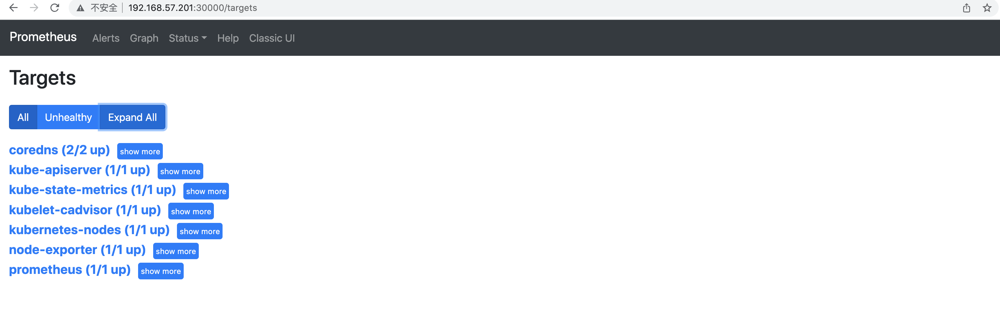
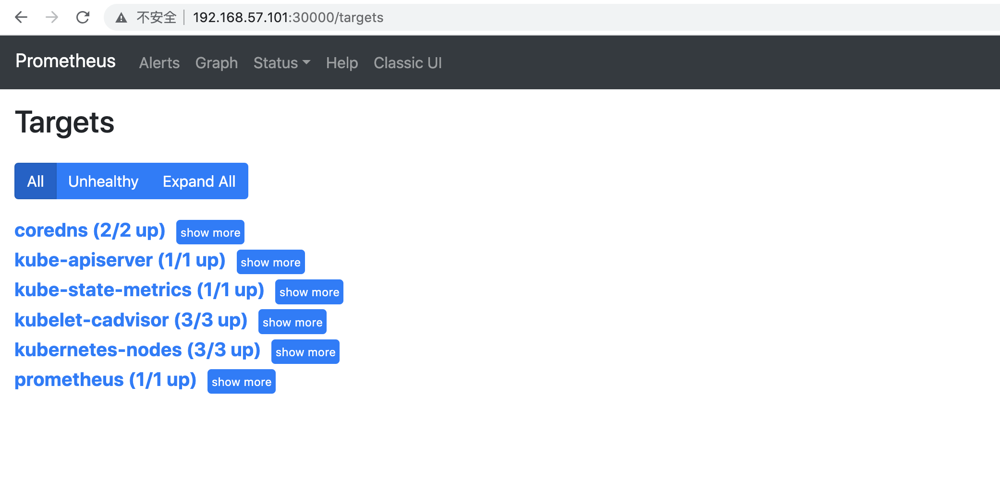

# 配置
- `k8s_monitor_builder01`目录
	- 目录下的yaml文件是k8s的配置，grafana-dashboard-model是grafana使用的json model
	- 配置的具体含义
		- prometheus相关的配置文件中，有具体注释
	- ChatGPT辅助: 安装时，可以借助ChatGPT，看看有什么提示
		- 输入配置，问具体解释
		- 安装错误，问原因
		- 或者问原理
		- 等等
	- 参考资料
		- [kube-state-metrics 配置参考](https://github.com/kubernetes/kube-state-metrics/tree/main/examples/standard)
		- [kubernetes_sd_configs 的参数解释](https://www.cuiliangblog.cn/detail/article/31)
		- [Prometheus kube-state-metrics 监控指标介绍](https://www.fdevops.com/2022/02/14/prometheus-kube-state-metrics)
		- [Prometheus Node Exporter 指标介绍](https://www.cnblogs.com/qianyuliang/p/10542886.html)


```text
k8s_monitor_builder01/
├── grafana-dashboard-model
│   ├── k8s-application-metrics.json
│   ├── k8s-cluster.json
│   ├── k8s-deployments.json
│   ├── k8s-kubelet.json
│   ├── k8s-node-list.json
│   ├── k8s-node.json
│   ├── k8s-tops.json
│   └── kube-apiserver.json
├── grafana-deployment.yaml
├── grafana-volume.yaml
├── grafana.yaml
├── kube-state-metrics-deployment.yaml
├── kube-state-metrics-rbac.yaml
├── prometheus-config.yaml
├── prometheus-node-exporter.yaml
├── prometheus-rbac.yaml
├── prometheus-server.yaml
├── prometheus-service.yaml
└── prometheus-volume.yaml
```


# 安装
- 安装顺序
	- prometheus
		- volume
		- rbac
		- server
		- service
		- node-exporter
	- kube-state-metrics
		- rbac
		- deployment
	- grafana
		- volume
		- grafana
		- deployment
		- import dashboard json model


```bash
kubectl create -f prometheus-rbac.yaml
kubectl get    -f prometheus-rbac.yaml

# promethes使用的存储，这里使用本地存储
mkdir /mnt/prometheus-pv-data
kubectl apply -f prometheus-volume.yaml
kubectl get   -f prometheus-volume.yaml

kubectl apply -f prometheus-config.yaml
kubectl get -f prometheus-config.yaml

kubectl apply -f prometheus-node-exporter.yaml
kubectl get -f prometheus-node-exporter.yaml

kubectl apply -f prometheus-server.yaml
kubectl get -f prometheus-server.yaml

# 基于30000端口, 在浏览器访问prometheus
kubectl apply -f prometheus-service.yaml
kubectl get -f prometheus-service.yaml

kubectl apply -f kube-state-metrics-rbac.yaml 
kubectl apply -f kube-state-metrics-deployment.yaml

# 实验环境，可以考虑使用
# nodeSelector:
#   kubernetes.io/hostname: k8svm01
mkdir /mnt/grafana-pv-data
chmod 777 /mnt/grafana-pv-data
kubectl apply -f grafana-volume.yaml
kubectl apply -f grafana.yaml
kubectl apply -f grafana-deployment.yaml

# 基于30001端口, 浏览器上访问grafana
# 目录grafana-dashboard-model下的配置，在Grafana中Import
```


# 使用


- k8s单节点环境验证结果
	- 
	- 
	- 
	- 


- k8s多节点实验环境验证结果
	- 配置微调(实验环境，因为pv是local类型，考虑部署到一个固定节点上)
		- 
	- 
	- 
	- 
- ChatGPT使用样例
	- 
	- 