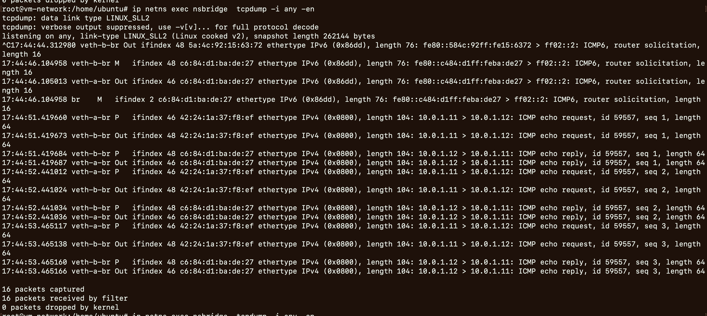

# 实验准备


- 概念基础
	- Linux Bridge 
	- Linux Network Namespace
	- Linux Veth Pair
- 命令
	- `man ip-netns`
	- `man ip-link`
	- `man brctl`
	- `man ping`
	- `man tcpdump`

# 实验目标

- 理解
	- Linux Bridge 
	- Linux Network Namespace
	- Linux Veth Pair


# 实验过程


```bash
# 创建net ns: nsa nsb nsbridge
ip netns add nsa
ip netns add nsb
ip netns add nsbridge
ip netns list
```


```bash
# 在nsa和nsbridge添加veth设备: veth-a 和 veth-a-br
ip link add name veth-a mtu 1500 type veth peer name veth-a-br mtu 1500
ip link set dev veth-a netns nsa
ip netns exec nsa ip a
ip link set dev veth-a-br netns nsbridge
ip netns exec nsbridge ip a
```


```bash
# 在nsb和nsbridge添加veth设备: veth-b 和 veth-b-br
ip link add name veth-b mtu 1500 type veth peer name veth-b-br mtu 1500
ip link set dev veth-b netns nsb
ip netns exec nsb ip a
ip link set dev veth-b-br netns nsbridge
ip netns exec nsbridge ip a
```


```bash
# 在nsbridge中创建br，并且在br添加:veth-a-br 和 veth-b-br
ip netns exec nsbridge brctl addbr br
ip netns exec nsbridge ip link set dev br up
ip netns exec nsbridge ip link set dev veth-a-br up
ip netns exec nsbridge ip link set dev veth-b-br up
ip netns exec nsbridge brctl addif br veth-a-br
ip netns exec nsbridge brctl addif br veth-b-br
ip netns exec nsbridge ip a
ip netns exec nsbridge ip link show type veth
ip netns exec nsbridge ip link show type bridge
ip netns exec nsbridge brctl show
```


```bash
# 在nsa中配置网卡
ip netns exec nsa ip link set dev veth-a up
ip netns exec nsa ip address add 10.0.1.11/24 dev veth-a
```


```bash
# 在nsb中配置网卡
ip netns exec nsb ip link set dev veth-b up
ip netns exec nsb ip address add 10.0.1.12/24 dev veth-b
```


```bash
# 测试联通性
ip netns exec nsa ping -c3 10.0.1.12
ip netns exec nsb ping -c3 10.0.1.11

# 观测测试结果
ip netns exec nsbridge  tcpdump -i any -en
```


#  实验结果
- Linux Bridge + Linux Network Namespace + veth pair 实验
	- 观察结果
		- ping命令: `ip netns exec nsa ping -c3 10.0.1.12`
		- 观测命令: `ip netns exec nsbridge  tcpdump -i any -en`
		- 
		- 可以观察到消息在不同设备间的转发
	- 验证结果:
		- veth
			- 向veth pair一端输入数据，在另一端就能读到此数据
		- Linux Network Namespace
			- 每个namespace都有自己独立的网络栈，包括route table，firewall rule，network interface device等
			- 新创建的namespace默认只有一个loopback device
			- 在三层网络上，Linux network namespace可以将一个物理三层网络分割成几个独立的虚拟三层网络
		- Linux Bridge
			- Linux Bridge是Linux上用来做TCP/IP二层协议交换的设备
			- 其功能可以简单地理解为是一个二层交换机或者Hub。
			- 多个网络设备可以连接到同一个Linux Bridge，当某个设备收到数据包时，Linux Bridge会将数据转发给其他设备。


