# 实验准备

- docker network 
	- docker network bridge
		- docker默认使用bridge: docker0
	- 网络原理
		- `veth`
		- `bridge`
		- `iptables`
		- `ip-route`

# 实验过程和实验结果
- docker network bridge
	- `docker network ls`
		- 
	- `ip addr show type bridge`
		- 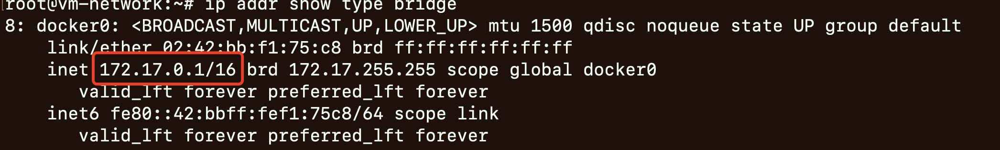
	- `iptables -t nat -L -n -v`
		- 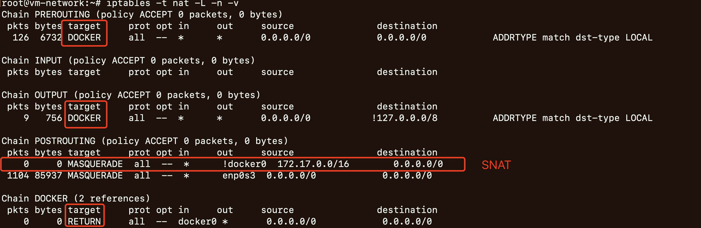
	- `iptables -t filter -L -n -v`
		- 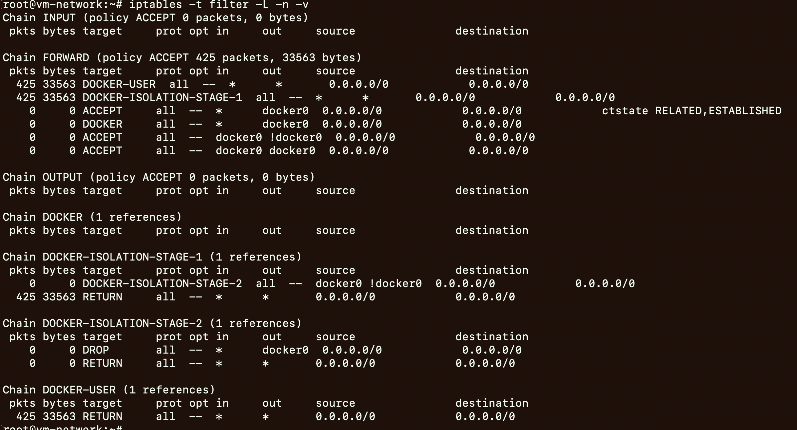
		- 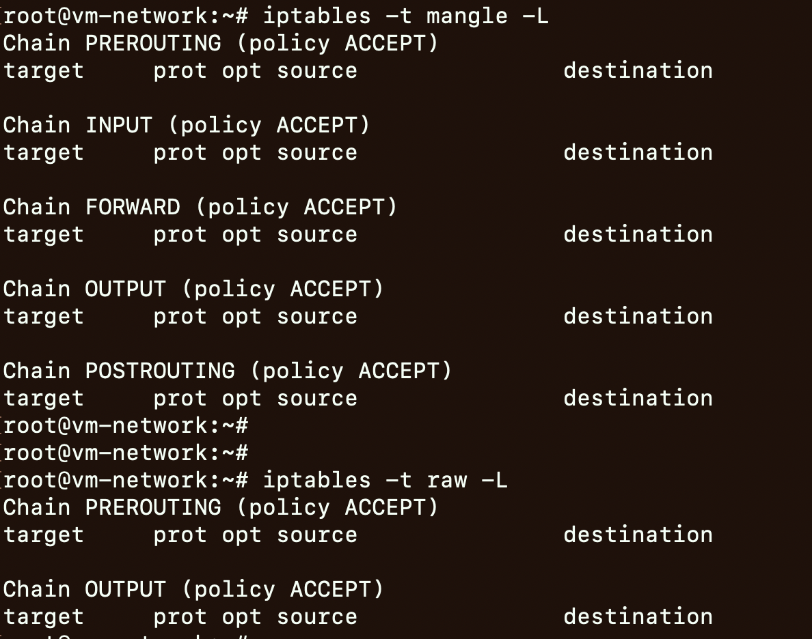
	- `brctl show docker0`
		- 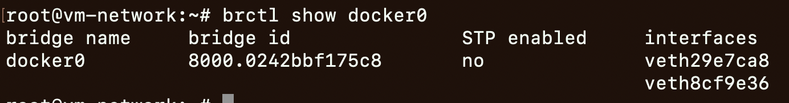
	- `docker network inspect bridge`
		- 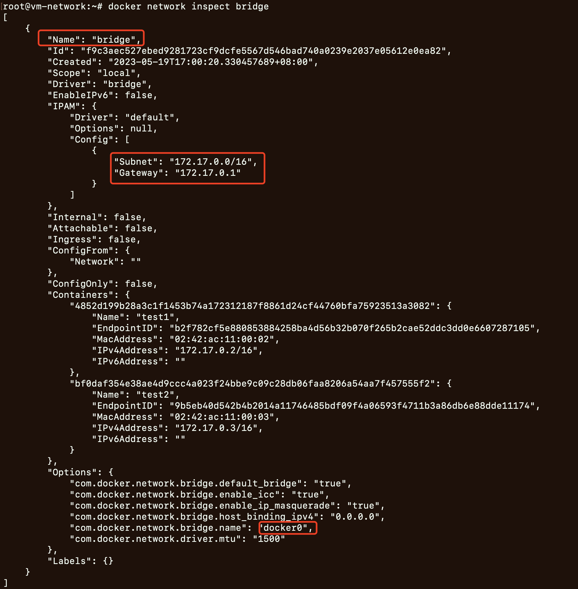
	- `route -n`
		- 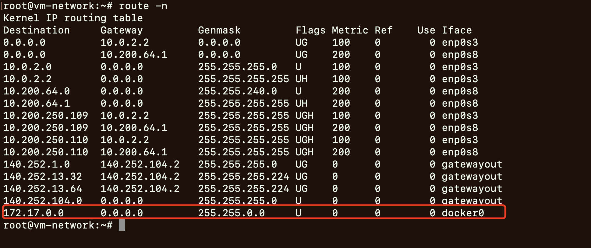
	- `docker run -itd --name test1 alpine`
		- `docker inspect test1 | jq '.[].NetworkSettings'`
			- 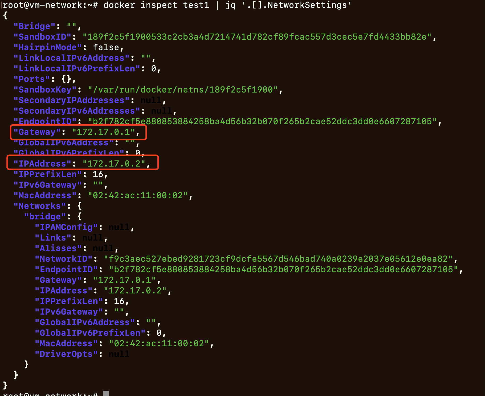
		- container: ip-route and veth
			- 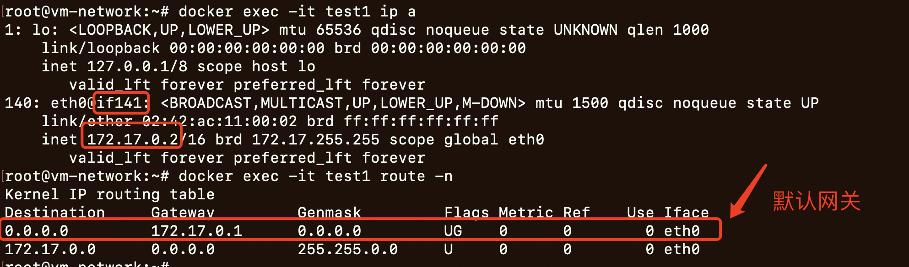
			- 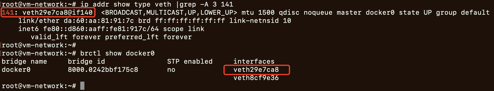
	- `docker run -itd --name test2 alpine`
		- `docker inspect test2 | jq '.[].NetworkSettings'`
			- 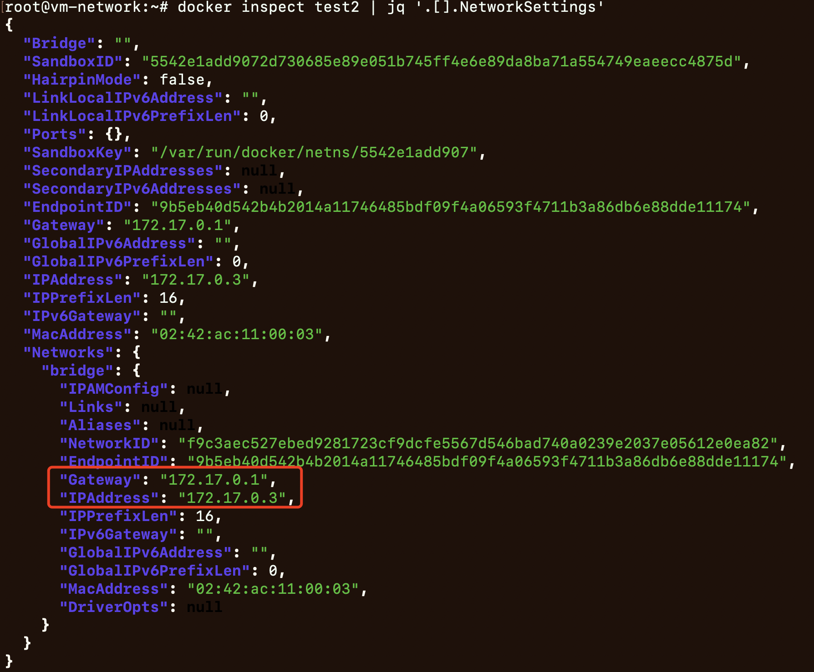
			- 
	- `docker run --name nginx-demo -itd  -p 8080:80 nginx:latest`
		- `docker inspect nginx-demo | jq '.[].NetworkSettings'`
			- 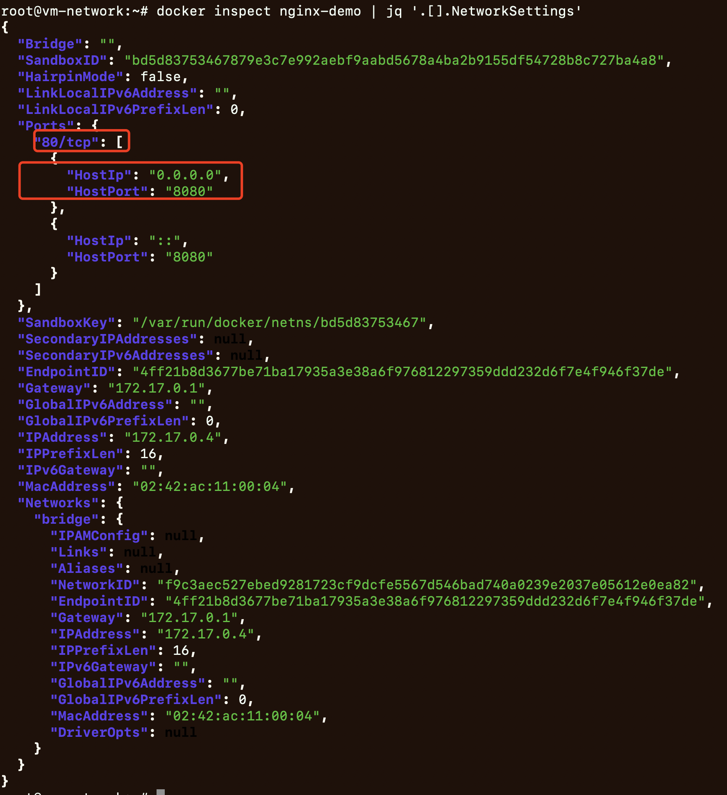
	- `iptables -t nat -L -n -v`
			- 
			- `iptables-save > bak.iptables`
			- `cat bak.iptables`
				- 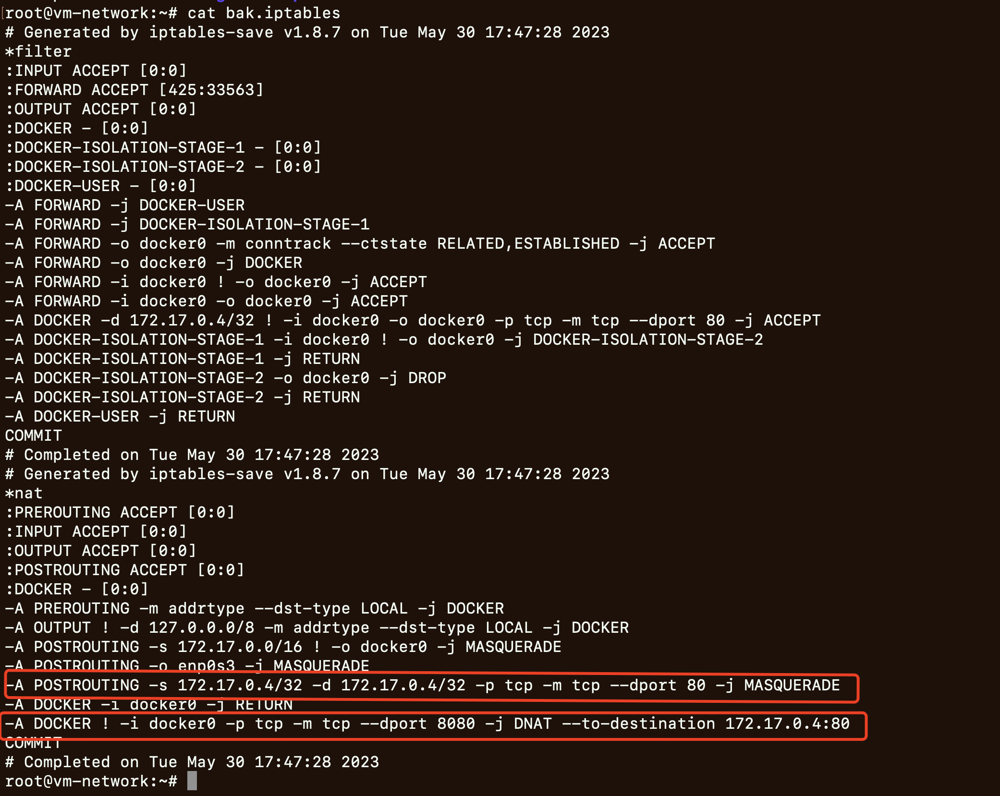

