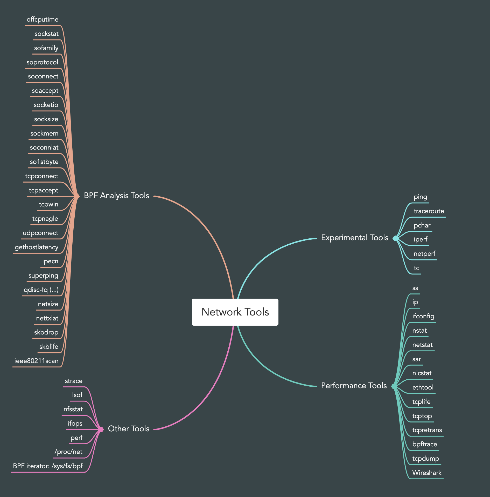

# Network  Observability Tools

## Experimental Tools

Network performance is commonly tested using tools that perform an experiment rather than just observing the state of the system. Such experimental tools include ping(8), traceroute(8), and network micro-benchmarks such as iperf(8). These can be used to determine network health between hosts, which can be used to help determine whether end-to-end network throughput is a problem when debugging application performance issues.

| Tool       | Desc                                                                                         |
| ---------- | -------------------------------------------------------------------------------------------- |
| ping       | tests network connectivity by sending ICMP echo request packets                              |
| traceroute | sends a series of test packets to experimentally determine the current route to a host       |
| pchar      | perform network measurements along an Internet path                                          | 
| pathchar   | similar to traceroute(8) but includes the bandwidth between hops                             |
| iperf      | an open-source tool for testing maximum TCP and UDP throughput                               |
| netperf    | an advanced micro-benchmark tool that can test request/response performance                  |
| tc         | allows various queueing disciplines (qdiscs) to be selected to improve or manage performance |

### ping
The ping(8) command tests network connectivity by sending ICMP echo request packets.

For example : `ping -c 3 www.baidu.com`
The output includes the round-trip time (time) for each packet and has a summary showing various statistics.

The ICMP packets used may be treated by routers at a lower priority than application protocols, and latency may show higher variance than usual.

### traceroute

The traceroute(8) command sends a series of test packets to experimentally determine the current route to a host.

This is performed by increasing the IP protocol time to live (TTL) by one for each packet, causing the sequence of gateways to the host to reveal themselves by sending ICMP time exceeded response messages (provided a firewall doesn’t block them).

For example, `traceroute www.brendangregg.com`

Each hop shows a series of three RTTs, which can be used as a coarse source of network latency statistics. As with ping(8), the packets used are low-priority and may show higher latency than for other application protocols. 

Some tests show “\*”: an ICMP time exceeded message was not returned. All three tests showing “\*” can be due to a hop not returning ICMP at all, or ICMP being blocked by a firewall. 

A workaround can be to switch to TCP instead of ICMP, using the -T option (also provided as the command tcptraceroute(1); a more advanced version is astraceroute(8), which can customize flags).

### pchar
Pchar  measures the characteristics of the network path between two Internet hosts, on either IPv4 or IPv6 networks.

It is an independently-written reimplementation of the pathchar utility, using similar  algorithms.   Both  programs measure network throughput and round-trip time by sending varying-sized UDP packets into the network and waiting for ICMP messages in response.  Like traceroute, they modulate the IPv4 time-to-live (TTL) field or the IPv6  hop  limit field to get measurements at different distances along a path.

### pathchar
pathchar is similar to traceroute(8) but includes the bandwidth between hops.

This is determined by sending a series of network packets in various sizes many times and performing statistical analysis.

Unfortunately, pathchar somehow missed becoming popular (perhaps because the source code was not released).

pchar(8) is more readily available. pathchar was also very time-consuming to run, taking tens of minutes depending on the number of hops, although methods have been proposed to reduce this time.

### iperf
iperf(1) is an open-source tool for testing maximum TCP and UDP throughput.

It supports a variety of options, including parallel mode where multiple client threads are used, which can be necessary to drive a network to its limit. iperf(1) must be executed on both the server and the client.

For example, executing iperf(1) on the server: `iperf -s -l 128k `
This increased the socket buffer size to 128 Kbytes (-l 128k), from the default of 8 Kbytes.

Executing iperf(1) on the client: `iperf -c 10.2.203.2 -l 128k -P 2 -i 1 -t 60`
This used the following options: 
-  -c host: Connect to the host name or IP address 
-  -l 128k: Use a 128 Kbyte socket buffer 
-  -P 2: Run in parallel mode with two client threads 
-  -i 1: Print interval summaries every second 
-  -t 60: Total duration of the test: 60 seconds

### netperf
netperf(1) is an advanced micro-benchmark tool that can test request/response performance.

Use netperf(1) to measure TCP round-trip latency, a example: `netperf -v 100 -H 100.66.63.99 -t TCP_RR -p 7001`

### tc
The traffic control utility, tc(8), allows various queueing disciplines (qdiscs) to be selected to improve or manage performance.

List the current qdisc configuration for the interface eth0: `tc qdisc show dev eth0`

The -s option to tc(8) shows statistics: `tc -s qdisc show dev eth0`

**Tc** is used to configure Traffic Control in the Linux kernel. Traffic Control consists of the following:
- SHAPING: When  traffic  is  shaped,  its  rate of transmission is under control. Shaping may be more than lowering the available bandwidth - it is also used to smooth out bursts in traffic for better network  behaviour.  Shaping occurs on egress.
- SCHEDULING: By  scheduling  the transmission of packets it is possible to improve interactivity for traffic that needs it while still guaranteeing bandwidth to bulk transfers. Reordering is also  called  prioritizing,  and  happens only on egress.
- POLICING: Whereas  shaping deals with transmission of traffic, policing pertains to traffic arriving. Policing thus occurs on ingress.
- DROPPING: Traffic exceeding a set bandwidth may also be dropped forthwith, both on ingress and on egress.

Processing of traffic is controlled by three kinds of objects: qdiscs, classes and filters.

相关资料：
- `man tc`
- [Linux Advanced Routing & Traffic Control](http://lartc.org/)
- [Linux Advanced Routing & Traffic Control HOWTO](https://lartc.org/lartc.html)
- [Linux 的高级路由和流量控制 HOWTO](https://lartc.org/LARTC-zh_CN.GB2312.pdf)

## Performance Tools

Observability Tools: traditional tools and statistics, then tracing tools, and finally packet capture tools.

Some of the traditional tools are likely available on other Unix-like operating systems where they originated, including: ifconfig(8), netstat(8), and sar(1). 

The statistical tools covered are ss(8), ip(8), and nstat(8), as these are from the iproute2 package that is maintained by the network kernel engineers. Tools from this package are most likely to support the latest Linux kernel features.

Similar tools from the net-tools package, namely ifconfig(8) and netstat(8), are also covered as they are in widespread use, although Linux kernel network engineers consider these deprecated.

The tracing tools are BPF-based, and use BCC and bpftrace frontends; they are: socketio(8), tcplife(8), tcptop(8), and tcpretrans(8).

| Tool       | Desc                                                       |
| ---------- | ---------------------------------------------------------- |
| ss         | Socket statistics                                          |
| ip         | Network interface and route statistics                     |
| ifconfig   | Network interface statistics                               |
| nstat      | Network stack statistics                                   |
| netstat    | Various network stack and interface statistics             |
| sar        | Historical statistics                                      |
| nicstat    | Network interface throughput and utilization               |
| ethtool    | Network interface driver statistics                        |
| tcplife    | Trace TCP session lifespans with connection details        |
| tcptop     | Show TCP throughput by host and process                    |
| tcpretrans | Trace TCP retransmits with address and TCP state           |
| bpftrace   | TCP/IP stack tracing: connections, packets, drops, latency |
| tcpdump    | Network packet sniffer                                     |
| Wireshark  | Graphical network packet inspection                                                           |

## BPF Analysis Tools

Network analysis tools included in other chapters of this book, and in BPF Performance Tools, are listed in Table.

| Tool           | Desc                                                  |
| -------------- | ----------------------------------------------------- |
| offcputime     | Off-CPU profiling can show network I/O                |
| sockstat       | High-level socket statistics                          |
| sofamily       | Count address families for new sockets, by process    |
| soprotocol     | Count transport protocols for new sockets, by process |
| soconnect      | Trace socket IP-protocol connections with details     |
| soaccept       | Trace socket IP-protocol accepts with details         |
| socketio       | Summarize socket details with I/O counts              |
| socksize       | Show socket I/O sizes as per-process histograms       |
| sormem         | Show socket receive buffer usage and overflows        |
| soconnlat      | Summarize IP socket connection latency with stacks    |
| so1stbyte      | Summarize IP socket first byte latency                |
| tcpconnect     | Trace TCP active connections (connect())              |
| tcpaccept      | Trace TCP passive connections (accept())              |
| tcpwin         | Trace TCP send congestion window parameters           |
| tcpnagle       | Trace TCP Nagle usage and transmit delays             |
| udpconnect     | Trace new UDP connections from localhost              |
| gethostlatency | Trace DNS lookup latency via library calls            |
| ipecn          | Trace IP inbound explicit congestion notification     |
| superping      | Measure ICMP echo times from the network stack        |
| qdisc-fq (...) | Show FQ qdisc queue latency                           |
| netsize        | Show net device I/O sizes                             |
| nettxlat       | Show net device transmission latency                  |
| skbdrop        | Trace sk_buff drops with kernel stack traces          |
| skblife        | Lifespan of sk_buff as inter-stack latency            |
| ieee80211scan  | Trace IEEE 802.11 WiFi scanning                       | 

## Other Tools
Other Linux network observability tools and sources include:
- strace(1): Trace socket-related syscalls and examine the options used (note that strace(1) has high overhead) 
- lsof(8): List open files by process ID, including socket details 
- nfsstat(8): NFS server and client statistics 
- ifpps(8): Top-like network and system statistics
- iftop(8): Summarize network interface throughput by host (sniffer) 
- perf(1): Count and record network tracepoints and kernel functions.
- /proc/net: Contains many network statistics files 
- BPF iterator: Allows BPF programs to export custom statistics in /sys/fs/bpf

