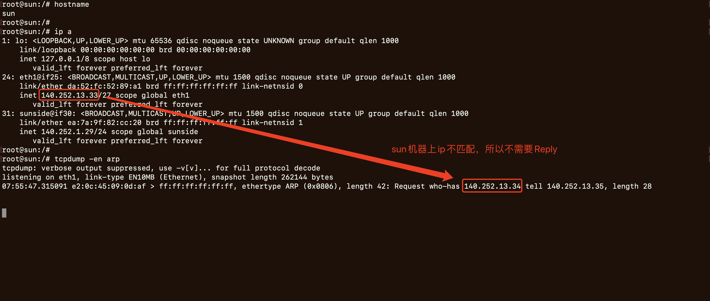
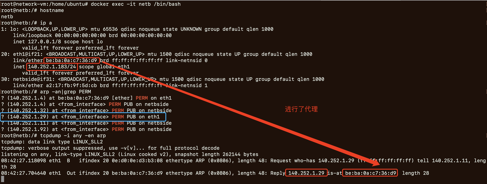

# 准备


## 前置知识点

参考资料: 《TCP/IP详解卷1：协议》

前置知识点
- 数据链路层
	- 以太网协议
		- 以太网地址
		- IEEE 802封装
	- 以太网类型
		- 0800
		- 0806
		- 0835
	- 还回接口(Lookback Interface)
	- MTU
	- 路径MTU
- ARP协议
	- ARP分组格式
	- 以太网同一广播域下ARP请求的应答机制
	- ARP缓存
	- ARP缓存超时
	- ARP代理
	- 免费ARP和IP地址冲突检测
		- 主机发送ARP请求查找自己的IP地址
	- ARP攻击


## 实验环境

搭建Network网络实验环境


## 观测命令

arp 命令
```bash
# arp 帮助
arp --help
man arp 

# arp 查看
arp -an

# arp 删除, 例如 arp -d -i eth1 140.252.13.34
arp -d -i 网卡 网卡地址
```


tcpdump 命令
```bash
# tcpdump 帮助
tcpdump --help
man tcpdump

# tcpdump 观察arp协议的包，默认观察eth1网卡
tcpdump -en arp

# tcpdump 观察arp协议的包
tcpdump -i any -en arp
```

arping 命令
```bash
# arping 帮助
arping --help
man arping

# 发起1个arp请求
arping -c 1 ip地址

```


# ARP实验

## 实验步骤


观测svr4机器上的arp包交互

```bash
# 新开Terminal, 进入svr4容器内
docker exec -it svr4 /bin/bash

# 查看hostname
hostname
# 查看ip地址
ip a

# 观察arp协议的包
tcpdump -en arp
```


观测sun机器上的arp包交互

```bash
# 新开Terminal, 进入svr4容器内
docker exec -it sun /bin/bash

# 查看hostname
hostname
# 查看ip地址
ip a

# 观察arp协议的包
tcpdump -en arp

```


删除bsdi机器上的arp缓存, 并观察arp包的交互
```bash
# 新开Terminal, 进入bsdi容器内
docker exec -it bsdi /bin/bash

# 查看arp缓存项
arp -an
# 删除arp缓存
arp -d -i eth1 140.252.13.34

# 查看hostname
hostname
# 查看ip地址
ip a

# 观察arp协议的包
tcpdump -en arp
```


在bsdi机器上触发arp协议的交互
```bash
# 新开Terminal, 进入bsdi容器内
docker exec -it bsdi /bin/bash

# 底层会涉及的ARP
telnet 140.252.13.34 discard


```


## 实验结果分析

### sun机器上的观测结果




```txt
root@sun:/# hostname
sun
root@sun:/# 
root@sun:/# ip a
1: lo: <LOOPBACK,UP,LOWER_UP> mtu 65536 qdisc noqueue state UNKNOWN group default qlen 1000
    link/loopback 00:00:00:00:00:00 brd 00:00:00:00:00:00
    inet 127.0.0.1/8 scope host lo
       valid_lft forever preferred_lft forever
24: eth1@if25: <BROADCAST,MULTICAST,UP,LOWER_UP> mtu 1500 qdisc noqueue state UP group default qlen 1000
    link/ether da:52:fc:52:89:a1 brd ff:ff:ff:ff:ff:ff link-netnsid 0
    inet 140.252.13.33/27 scope global eth1
       valid_lft forever preferred_lft forever
31: sunside@if30: <BROADCAST,MULTICAST,UP,LOWER_UP> mtu 1500 qdisc noqueue state UP group default qlen 1000
    link/ether ea:7a:9f:82:cc:20 brd ff:ff:ff:ff:ff:ff link-netnsid 1
    inet 140.252.1.29/24 scope global sunside
       valid_lft forever preferred_lft forever
root@sun:/# 
root@sun:/# tcpdump -en arp 
tcpdump: verbose output suppressed, use -v[v]... for full protocol decode
listening on eth1, link-type EN10MB (Ethernet), snapshot length 262144 bytes
07:55:47.315091 e2:0c:45:09:0d:af > ff:ff:ff:ff:ff:ff, ethertype ARP (0x0806), length 42: Request who-has 140.252.13.34 tell 140.252.13.35, length 28


```


### svr4机器上的观测结果


```txt
root@svr4:/# hostname
svr4
root@svr4:/# 
root@svr4:/# ip a
1: lo: <LOOPBACK,UP,LOWER_UP> mtu 65536 qdisc noqueue state UNKNOWN group default qlen 1000
    link/loopback 00:00:00:00:00:00 brd 00:00:00:00:00:00
    inet 127.0.0.1/8 scope host lo
       valid_lft forever preferred_lft forever
26: eth1@if27: <BROADCAST,MULTICAST,UP,LOWER_UP> mtu 1500 qdisc noqueue state UP group default qlen 1000
    link/ether 2e:5b:b8:38:e9:a8 brd ff:ff:ff:ff:ff:ff link-netnsid 0
    inet 140.252.13.34/27 scope global eth1
       valid_lft forever preferred_lft forever
root@svr4:/# 
root@svr4:/# tcpdump -en arp
tcpdump: verbose output suppressed, use -v[v]... for full protocol decode
listening on eth1, link-type EN10MB (Ethernet), snapshot length 262144 bytes

07:55:47.315092 e2:0c:45:09:0d:af > ff:ff:ff:ff:ff:ff, ethertype ARP (0x0806), length 42: Request who-has 140.252.13.34 tell 140.252.13.35, length 28
07:55:47.315101 2e:5b:b8:38:e9:a8 > e2:0c:45:09:0d:af, ethertype ARP (0x0806), length 42: Reply 140.252.13.34 is-at 2e:5b:b8:38:e9:a8, length 28
07:55:52.408598 2e:5b:b8:38:e9:a8 > e2:0c:45:09:0d:af, ethertype ARP (0x0806), length 42: Request who-has 140.252.13.35 tell 140.252.13.34, length 28
07:55:52.408803 e2:0c:45:09:0d:af > 2e:5b:b8:38:e9:a8, ethertype ARP (0x0806), length 42: Reply 140.252.13.35 is-at e2:0c:45:09:0d:af, length 28

```


### bsdi机器上的观测结果


```txt
root@bsdi:/# hostname
bsdi
root@bsdi:/# 
root@bsdi:/# arp -an
root@bsdi:/# 
root@bsdi:/# ip a
1: lo: <LOOPBACK,UP,LOWER_UP> mtu 65536 qdisc noqueue state UNKNOWN group default qlen 1000
    link/loopback 00:00:00:00:00:00 brd 00:00:00:00:00:00
    inet 127.0.0.1/8 scope host lo
       valid_lft forever preferred_lft forever
22: eth1@if23: <BROADCAST,MULTICAST,UP,LOWER_UP> mtu 1500 qdisc noqueue state UP group default qlen 1000
    link/ether e2:0c:45:09:0d:af brd ff:ff:ff:ff:ff:ff link-netnsid 0
    inet 140.252.13.35/27 scope global eth1
       valid_lft forever preferred_lft forever
28: bsdiside@if29: <BROADCAST,MULTICAST,UP,LOWER_UP> mtu 1500 qdisc noqueue state UP group default qlen 1000
    link/ether 9a:12:75:d5:10:dc brd ff:ff:ff:ff:ff:ff link-netnsid 1
    inet 140.252.13.66/27 scope global bsdiside
       valid_lft forever preferred_lft forever
root@bsdi:/# 
root@bsdi:/# 
root@bsdi:/# tcpdump -en arp 
tcpdump: verbose output suppressed, use -v[v]... for full protocol decode
listening on eth1, link-type EN10MB (Ethernet), snapshot length 262144 bytes
07:55:47.314991 e2:0c:45:09:0d:af > ff:ff:ff:ff:ff:ff, ethertype ARP (0x0806), length 42: Request who-has 140.252.13.34 tell 140.252.13.35, length 28
07:55:47.315146 2e:5b:b8:38:e9:a8 > e2:0c:45:09:0d:af, ethertype ARP (0x0806), length 42: Reply 140.252.13.34 is-at 2e:5b:b8:38:e9:a8, length 28


07:55:52.408670 2e:5b:b8:38:e9:a8 > e2:0c:45:09:0d:af, ethertype ARP (0x0806), length 42: Request who-has 140.252.13.35 tell 140.252.13.34, length 28
07:55:52.408679 e2:0c:45:09:0d:af > 2e:5b:b8:38:e9:a8, ethertype ARP (0x0806), length 42: Reply 140.252.13.35 is-at e2:0c:45:09:0d:af, length 28

```


# ARP Proxy实验


## 实验步骤


观测sun机器上的arp包交互
```bash
# 新开Terminal, 进入sun容器内
docker exec -it sun /bin/bash

# 查看hostname
hostname

# 查看ip地址
ip a


# 观察arp协议的包
tcpdump -i any -en arp
```

观测netb机器上的arp包交互
```bash
# 新开Terminal, 进入netb容器内
docker exec -it netb /bin/bash

# 查看hostname
hostname
# 查看ip地址
ip a

# 查看arp代理
arp -an |grep PERM

# 观察arp协议的包
tcpdump -i any -en arp
```


观测gemini机器上的arp包交互
```bash
# 新开Terminal, 进入gemini容器内
docker exec -it gemini /bin/bash

# 查看hostname
hostname

# 查看ip地址
ip a

# 观察arp协议的包
tcpdump -i any -en arp
```


在gemini机器上发送arp请求
```bash
# 新开Terminal, 进入gemini容器内
docker exec -it gemini /bin/bash

arping -c1 140.252.1.29
```


## 实验结果


### sun机器上的观测结果


```txt
root@sun:/# exit
exit
root@network-vm:/home/ubuntu# docker exec -it sun /bin/bash
root@sun:/# 
root@sun:/# hostname
sun
root@sun:/# 
root@sun:/# ip a
1: lo: <LOOPBACK,UP,LOWER_UP> mtu 65536 qdisc noqueue state UNKNOWN group default qlen 1000
    link/loopback 00:00:00:00:00:00 brd 00:00:00:00:00:00
    inet 127.0.0.1/8 scope host lo
       valid_lft forever preferred_lft forever
24: eth1@if25: <BROADCAST,MULTICAST,UP,LOWER_UP> mtu 1500 qdisc noqueue state UP group default qlen 1000
    link/ether da:52:fc:52:89:a1 brd ff:ff:ff:ff:ff:ff link-netnsid 0
    inet 140.252.13.33/27 scope global eth1
       valid_lft forever preferred_lft forever
31: sunside@if30: <BROADCAST,MULTICAST,UP,LOWER_UP> mtu 1500 qdisc noqueue state UP group default qlen 1000
    link/ether ea:7a:9f:82:cc:20 brd ff:ff:ff:ff:ff:ff link-netnsid 1
    inet 140.252.1.29/24 scope global sunside
       valid_lft forever preferred_lft forever
root@sun:/# 
root@sun:/# tcpdump -i any -en arp
tcpdump: data link type LINUX_SLL2
tcpdump: verbose output suppressed, use -v[v]... for full protocol decode
listening on any, link-type LINUX_SLL2 (Linux cooked v2), snapshot length 262144 bytes


```


### netb机器上的观测结果




```txt
root@network-vm:/home/ubuntu# docker exec -it netb /bin/bash
root@netb:/# hostname
netb
root@netb:/# ip a
1: lo: <LOOPBACK,UP,LOWER_UP> mtu 65536 qdisc noqueue state UNKNOWN group default qlen 1000
    link/loopback 00:00:00:00:00:00 brd 00:00:00:00:00:00
    inet 127.0.0.1/8 scope host lo
       valid_lft forever preferred_lft forever
20: eth1@if21: <BROADCAST,MULTICAST,UP,LOWER_UP> mtu 1500 qdisc noqueue state UP group default qlen 1000
    link/ether be:ba:0a:c7:36:d9 brd ff:ff:ff:ff:ff:ff link-netnsid 0
    inet 140.252.1.183/24 scope global eth1
       valid_lft forever preferred_lft forever
30: netbside@if31: <BROADCAST,MULTICAST,UP,LOWER_UP> mtu 1500 qdisc noqueue state UP group default qlen 1000
    link/ether a2:17:fb:9f:5d:cb brd ff:ff:ff:ff:ff:ff link-netnsid 1
root@netb:/# arp -an|grep PERM
? (140.252.1.4) at be:ba:0a:c7:36:d9 [ether] PERM on eth1
? (140.252.1.4) at <from_interface> PERM PUB on netbside
? (140.252.1.32) at <from_interface> PERM PUB on netbside
? (140.252.1.29) at <from_interface> PERM PUB on eth1
? (140.252.1.11) at <from_interface> PERM PUB on netbside
? (140.252.1.92) at <from_interface> PERM PUB on netbside
root@netb:/# tcpdump -i any -en arp 
tcpdump: data link type LINUX_SLL2
tcpdump: verbose output suppressed, use -v[v]... for full protocol decode
listening on any, link-type LINUX_SLL2 (Linux cooked v2), snapshot length 262144 bytes
08:42:27.118098 eth1  B   ifindex 20 0e:d0:0e:d3:b3:08 ethertype ARP (0x0806), length 48: Request who-has 140.252.1.29 (ff:ff:ff:ff:ff:ff) tell 140.252.1.11, length 28
08:42:27.704640 eth1  Out ifindex 20 be:ba:0a:c7:36:d9 ethertype ARP (0x0806), length 48: Reply 140.252.1.29 is-at be:ba:0a:c7:36:d9, length 28

```


### gemini机器上的观测结果


```txt
root@gemini:/# hostname
gemini
root@gemini:/# 
root@gemini:/# ip a
1: lo: <LOOPBACK,UP,LOWER_UP> mtu 65536 qdisc noqueue state UNKNOWN group default qlen 1000
    link/loopback 00:00:00:00:00:00 brd 00:00:00:00:00:00
    inet 127.0.0.1/8 scope host lo
       valid_lft forever preferred_lft forever
16: eth1@if17: <BROADCAST,MULTICAST,UP,LOWER_UP> mtu 1500 qdisc noqueue state UP group default qlen 1000
    link/ether 0e:d0:0e:d3:b3:08 brd ff:ff:ff:ff:ff:ff link-netnsid 0
    inet 140.252.1.11/24 scope global eth1
       valid_lft forever preferred_lft forever
root@gemini:/# 
root@gemini:/# tcpdump -i any -en arp 
tcpdump: data link type LINUX_SLL2
tcpdump: verbose output suppressed, use -v[v]... for full protocol decode
listening on any, link-type LINUX_SLL2 (Linux cooked v2), snapshot length 262144 bytes
08:42:27.117932 eth1  Out ifindex 16 0e:d0:0e:d3:b3:08 ethertype ARP (0x0806), length 48: Request who-has 140.252.1.29 (ff:ff:ff:ff:ff:ff) tell 140.252.1.11, length 28
08:42:27.704761 eth1  In  ifindex 16 be:ba:0a:c7:36:d9 ethertype ARP (0x0806), length 48: Reply 140.252.1.29 is-at be:ba:0a:c7:36:d9, length 28
```