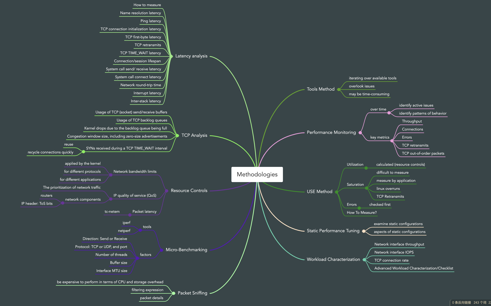
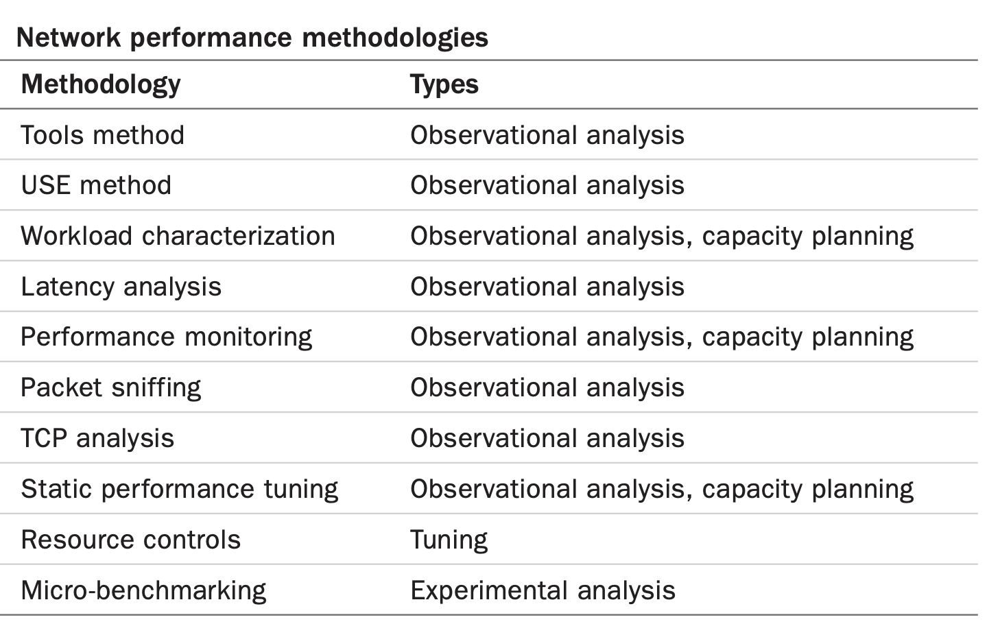
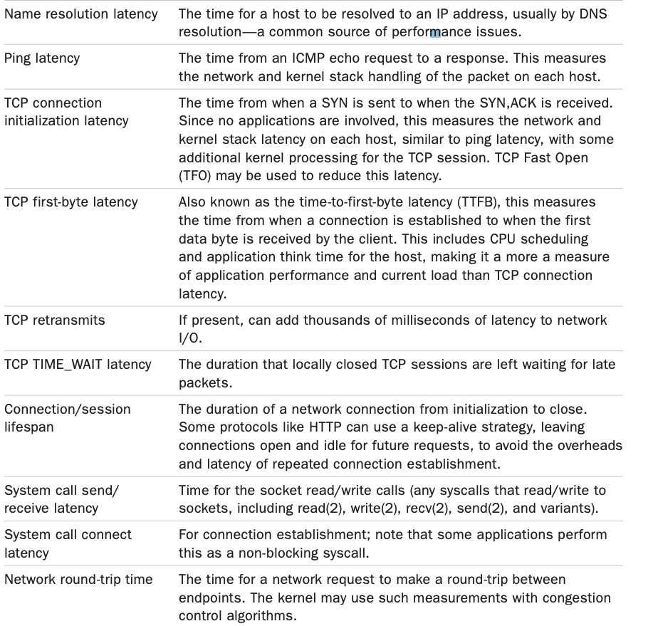
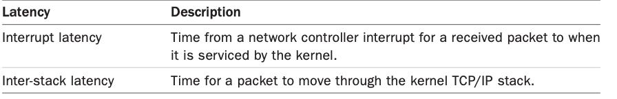

# Methodologies Summarizes

The summarizes methodologies and exercises for network analysis and tuning.

Suggestion: use the following strategies to start with, in this order: performance monitoring, the USE method, static performance tuning, and workload characterization.

# Tools Method

The tools method is a process of iterating over available tools, examining key metrics they provide. It may overlook issues for which the tools provide poor or no visibility, and it can be time-consuming to perform.

For networking, the tools method can involve checking:
- **nstat/netstat -s**: Look for a high rate of retransmits and out-of-order packets. What constitutes a “high” retransmit rate depends on the clients: an Internet-facing system with unreliable remote clients should have a higher retransmit rate than an internal system with clients in the same data center. 
- **ip -s link/netstat -i**: Check interface error counters, including “errors,” “dropped,” “overruns.” 
- **ss -tiepm**: Check for the limiter flag for important sockets to see what their bottleneck is, as well as other statistics showing socket health. 
- **nicstat/ip -s link**: Check the rate of bytes transmitted and received. High throughput may be limited by a negotiated data link speed, or an external network throttle. It could also cause contention and delays between network users on the system. 
- **tcplife**: Log TCP sessions with process details, duration (lifespan), and throughput statistics.
- **tcptop**: Watch top TCP sessions live. 
- **tcpdump**: While this can be expensive to use in terms of the CPU and storage costs, using tcpdump(8) for short periods may help you identify unusual network traffic or protocol headers. 
- **perf(1)/BCC/bpftrace**: Inspect selected packets between the application and the wire, including examining kernel state.

If an issue is found, examine all fields from the available tools to learn more context.

# Performance Monitoring

Performance monitoring can identify active issues and patterns of behavior over time, including daily patterns of end users, and scheduled activities including network backups.

**Key metrics for network monitoring are**:
- Throughput: Network interface bytes per second for both receive and transmit, ideally for each interface 
- Connections: TCP connections per second, as another indication of network load 
- Errors: Including dropped packet counters 
- TCP retransmits: Also useful to record for correlation with network issues 
- TCP out-of-order packets: Can also cause performance problems

For environments that implement network bandwidth limits (resource controls), as in some cloud computing environments, statistics related to the imposed limits may also be collected.

# USE Method

The USE method is for quickly identifying bottlenecks and errors across all components. 

For each network interface, and in each direction—transmit (TX) and receive (RX)—check for:
- Utilization: The time the interface was busy sending or receiving frames 
- Saturation: The degree of extra queueing, buffering, or blocking due to a fully utilized interface 
- Errors: For receive: bad checksum, frame too short (less than the data link header) or too long, collisions (unlikely with switched networks); for transmit: late collisions (bad wiring)

Errors may be checked first, since they are typically quick to check and the easiest to interpret.

# Static Performance Tuning

Static performance tuning focuses on issues of the configured environment. 

For network performance, examine the following aspects of the static configuration:

- How many network interfaces are available for use? Are currently in use? 
- What is the maximum speed of the network interfaces?
- What is the currently negotiated speed of the network interfaces? 
- Are network interfaces negotiated as half or full duplex? 
- What MTU is configured for the network interfaces? ■ Are network interfaces trunked? 
- What tunable parameters exist for the device driver? IP layer? TCP layer? 
- Have any tunable parameters been changed from the defaults?
- How is routing configured? What is the default gateway? 
- What is the maximum throughput of network components in the data path (all components, including switch and router backplanes)? 
- What is the maximum MTU for the datapath and does fragmentation occur? 
- Are any wireless connections in the data path? Are they suffering interference? 
- Is forwarding enabled? Is the system acting as a router? 
- How is DNS configured? How far away is the server? 
- Are there known performance issues (bugs) with the version of the network interface firmware, or any other network hardware? 
- Are there known performance issues (bugs) with the network device driver? Kernel TCP/IP stack? 
- What firewalls are present? 
- Are there software-imposed network throughput limits present (resource controls)? What are they?
- For cloud computing environments, where are the imposed limits on network throughput?

The answers to these questions may reveal configuration choices that have been overlooked.

# Workload Characterization

Characterizing the load applied is an important exercise when capacity planning, benchmarking, and simulating workloads. It can also lead to some of the largest performance gains by identifying unnecessary work that can be eliminated.

The following are the most basic characteristics to measure:
- Network interface throughput: RX and TX, bytes per second 
- Network interface IOPS: RX and TX, frames per second 
- TCP connection rate: Active and passive, connections per second

**Advanced Workload Characterization/Checklist** 

Additional details may be included to characterize the workload. These have been listed here as questions for consideration, which may also serve as a checklist when studying CPU issues thoroughly:
- What is the average packet size? RX, TX? 
- What is the protocol breakdown for each layer? For transport protocols: TCP, UDP (which can include QUIC). 
- What TCP/UDP ports are active? Bytes per second, connections per second? 
- What are the broadcast and multicast packet rates? 
- Which processes are actively using the network?

# Latency analysis

Various times (latencies) can be studied to help understand and express network performance.
Measure as many of these as you can to narrow down the real source of latency.

Latency may be presented as: 
- Per-interval averages: Best performed per client/server pair, to isolate differences in the intermediate network 
- Full distributions: As histograms or heat maps 
- Per-operation latency: Listing details for each event, including source and destination IP addresses

Latencies may be measured using tracing tools and, for some latencies, socket options. 
On Linux, the socket options include SO_TIMESTAMP for incoming packet time (and SO_TIMESTAMPNS for nanosecond resolution) and SO_TIMESTAMPING for per-event timestamps.
SO_TIMESTAMPING can identify transmission delays, network round-trip time, and inter-stack latencies; this can be especially helpful when analyzing complex packet latency involving tunneling.

Note that some sources of extra latency are transient and only occur during system load. For more realistic measurements of network latency, it is important to measure not only an idle system, but also a system under load.

# TCP Analysis

Apart from what was covered in Latency Analysis, other specific TCP behavior can be investigated, including:

- Usage of TCP (socket) send/receive buffers 
- Usage of TCP backlog queues 
- Kernel drops due to the backlog queue being full 
- Congestion window size, including zero-size advertisements 
- SYNs received during a TCP TIME_WAIT interval

The last behavior can become a scalability problem when a server is connecting frequently to another on the same destination port, using the same source and destination IP addresses. The only distinguishing factor for each connection is the client source port—the ephemeral port— which for TCP is a 16-bit value and may be further constrained by operating system parameters (minimum and maximum). Combined with the TCP TIME_WAIT interval, which may be 60 seconds, a high rate of connections (more than 65,536 during 60 seconds) can encounter a clash for new connections. In this scenario, a SYN is sent while that ephemeral port is still associated with a previous TCP session that is in TIME_WAIT, and the new SYN may be rejected if it is misidentified as part of the old connection (a collision). To avoid this issue, the Linux kernel attempts to reuse or recycle connections quickly (which usually works well). The use of multiple IP addresses by the server is another possible solution, as is the SO_LINGER socket option with a low linger time.

# Resource Controls

The operating system may provide controls to limit network resources for types of connections, processes, or groups of processes. These can include the following types of controls:

- Network bandwidth limits: A permitted bandwidth (maximum throughput) for different protocols or applications, applied by the kernel. 
- IP quality of service (QoS): The prioritization of network traffic, performed by network components (e.g., routers). This can be implemented in different ways: the IP header includes type-of-service (ToS) bits, including a priority; those bits have since been redefined for newer QoS schemes, including Differentiated Services. There may be other priorities implemented by other protocol layers, for the same purpose. 
- Packet latency: Additional packet latency (e.g., using Linux tc-netem(8)), which can be used to simulate other networks when testing performance.

Your network may have a mix of traffic that can be classified as low or high priority. Low priority may include the transfer of backups and performance-monitoring traffic. High priority may be the traffic between the production server and clients. Either resource control scheme can be used to throttle the low-priority traffic, producing more favorable performance for the highpriority traffic.

# Micro-Benchmarking

There are many benchmark tools for networking. They are especially useful when investigating throughput issues for a distributed application environment, to confirm that the network can at least achieve the expected network throughput.

If it cannot, network performance can be investigated via a network micro-benchmark tool, which is typically much less complex and faster to debug than the application. After the network has been tuned to the desired speed, attention can return to the application.

Typical factors that can be tested include:
- Direction: Send or receive 
- Protocol: TCP or UDP, and port 
- Number of threads 
- Buffer size 
- Interface MTU size

iperf(1) is an open-source tool for testing maximum TCP and UDP throughput. It supports a variety of options, including parallel mode where multiple client threads are used, which can be necessary to drive a network to its limit. iperf(1) must be executed on both the server and the client.

netperf(1) is an advanced micro-benchmark tool that can test request/response performance.

# Packet Sniffing

Packet sniffing (aka packet capture) involves capturing the packets from the network so that their protocol headers and data can be inspected on a packet-by-packet basis. 

For observational analysis this may be the last resort, as it can be expensive to perform in terms of CPU and storage overhead. Network kernel code paths are typically cycle-optimized, since they need to handle up to millions of packets per second and are sensitive to any extra overhead. To reduce this overhead, ring buffers may be used by the kernel to pass packet data to the user-level trace tool via a shared memory map—for example,10 using BPF with perf(1)’s output ring buffer, and also using AF_XDP. A different way to solve overhead is to use an out-of-band packet sniffer: a separate server connected to a “tap” or “mirror” port of a switch. Public cloud providers such as Amazon and Google provide this as a service.

Packet sniffing typically involves capturing packets to a file, and then analyzing that file in different ways. One way is to produce a log, which can contain the following for each packet: 
- ■ Timestamp 
- ■ Entire packet, including  
	- All protocol headers (e.g., Ethernet, IP, TCP) 
	- Partial or full payload data 
- ■ Metadata: number of packets, number of drops 
- ■ Interface name

Because packet capture can be a CPU-expensive activity, most implementations include the ability to drop events instead of capturing them when overloaded. The count of dropped packets may be included in the log.

Apart from the use of ring buffers to reduce overhead, packet capture implementations commonly allow a filtering expression to be supplied by the user and perform this filtering in the kernel. This reduces overhead by not transferring unwanted packets to user level. The filter expression is typically optimized using Berkeley Packet Filter (BPF), which compiles the expression to BPF bytecode that can be JIT-compiled to machine code by the kernel. In recent years, BPF has been extended in Linux to become a general-purpose execution environment, which powers many observability tools.

 