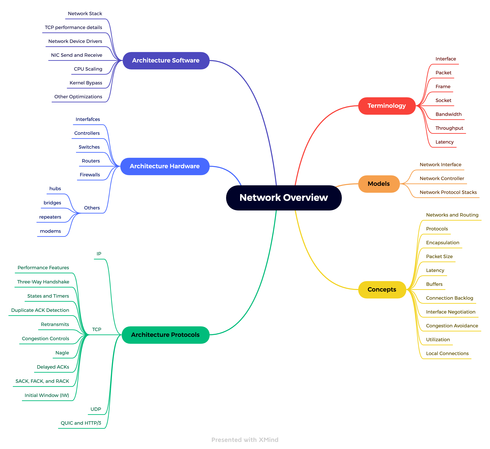
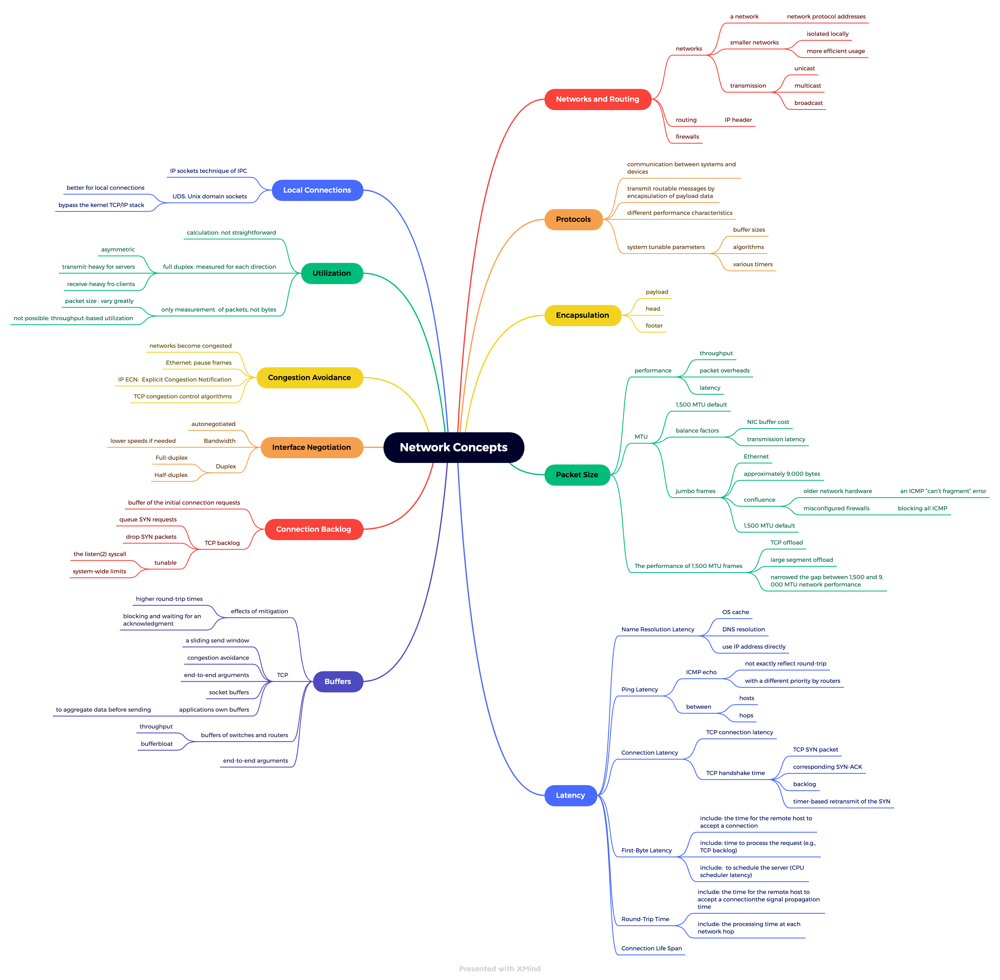
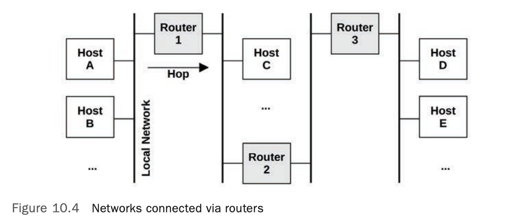
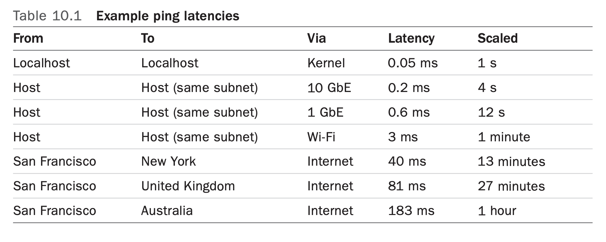

# Network MindMap

## Network Overview

## Network Concepts

## Network Architecture

## Network ALL

# Network Architecture

## Terminology

- **Interface**: The term _interface port_ refers to the physical network connector. The term interface or link refers to the logical instance of a network interface port, as seen and configured by the OS. (Not all OS interfaces are backed by hardware: some are virtual.)
- **Packet**: The term _packet_ refers to a message in a packet-switched network, such as IP packets.
- **Frame**: A physical network-level message, for example an Ethernet frame.
- **Socket**: An API originating from BSD for network endpoints.
- **Bandwidth**: The maximum rate of data transfer for the network type, usually measured in bits per second. “100 GbE” is Ethernet with a bandwidth of 100 Gbits/s. There may be bandwidth limits for each direction, so a 100 GbE may be capable of 100 Gbits/s transmit and 100 Gbit/s receive in parallel (200 Gbit/sec total throughput).
- **Throughput**: The current data transfer rate between the network endpoints, measured in bits per second or bytes per second.
- **Latency**: Network _latency_ can refer to the time it takes for a message to make a round-trip between endpoints, or the time required to establish a connection (e.g., TCP handshake), excluding the data transfer time that follows.
- Other terms: segment, datagram, packet, client, Ethernet, host, IP, RFC, server, SYN, ACK.

## Models

The following simple models illustrate some basic principles of networking and network performance. Architecture, digs much deeper, including implementation-specific details.

### Network Interface

A network interface is an operating system endpoint for network connections; it is an abstraction configured and managed by the system administrators.

Network interfaces are _mapped_ to physical network ports as part of their configuration. Ports connect to the network and typically have separate transmit and receive channels.

### Network Controller

A _network interface card_ (NIC) provides one or more network ports for the system and houses a _network controller_: a microprocessor for transferring packets between the ports and the system I/O transport.

The controller is typically provided as a separate expansion card or is built into the system board.

### Network Protocol  Stack
Networking is accomplished by a stack of protocols, each layer of which serves a particular purpose.

Lower layers are drawn wider to indicate protocol encapsulation. Sent messages move down the stack from the application to the physical network. Received messages move up.

Note that the Ethernet standard also describes the physical layer, and how copper or fiber is used.

Messages at different layers also use different terminology. Using the OSI model: at the transport layer a message is a segment or datagram; at the network layer a message is a packet; and at the data link layer a message is a frame.

## Concepts

The following are a selection of important concepts in networking and network performance.

### Networks and Routing

A network is a group of connected hosts, related by network protocol addresses. By creating smaller subnetworks, such _broadcast_ messages can be _isolated locally_ so they do not create a flooding problem at scale. This is also the basis for isolating the transmission of regular messages to only the networks between source and destination, making more efficient usage of network infrastructure.

Routing manages the delivery of messages, called _packets_, across these networks.

Connections between pairs of hosts involve _unicast_ transmission. _Multicast_ transmission allows a sender to transmit to multiple destinations simultaneously, which may span multiple networks. This must be supported by the router configuration to allow delivery. In public cloud environments it may be blocked.

Apart from routers, a typical network will also use _firewalls_ to improve security, blocking unwanted connections between hosts.

The address information needed to route packets is contained in an _IP header_.

### Protocols
Network protocol standards, such as those for IP, TCP, and UDP, are a necessary requirement for communication between systems and devices. Communication is performed by transferring routable messages called packets, typically by encapsulation of payload data.

Network protocols have different performance characteristics, arising from the original protocol design, extensions, or special handling by software or hardware.

Often, there are also system tunable parameters that can affect protocol performance, by changing settings such as buffer sizes, algorithms, and various timers.

Protocols typically transmit data by use of encapsulation.

### Encapsulation

Encapsulation adds metadata to a payload at the start (a header), at the end (a footer), or both. This doesn’t change the payload data, though it does increase the total size of the message slightly, which costs some overhead for transmission.

E.H. is the Ethernet header, and E.F. is the optional Ethernet footer.

### Packet Size
The size of the packets and their payload affect performance, with larger sizes improving throughput and reducing packet overheads. For TCP/IP and Ethernet, packets can be between 54 and 9,054 bytes, including the 54 bytes (or more, depending on options or version) of protocol headers.

Packet size is usually limited by the network interface maximum transmission unit (MTU) size, which for many Ethernet networks is configured to be 1,500 bytes. The origin of the 1500 MTU size was from the early versions of Ethernet, and the need to balance factors such as NIC buffer memory cost and transmission latency. Hosts competed to use a shared medium (coax or an Ethernet hub), and larger sizes increased the latency for hosts to wait their turn.

Ethernet now supports larger packets (frames) of up to approximately 9,000 bytes, termed jumbo frames. These can improve network throughput performance, as well as the latency of data transfers, by requiring fewer packets.

The confluence of two components has interfered with the adoption of jumbo frames: older network hardware and misconfigured firewalls. To avoid problems, many systems stick to the 1,500 MTU default.

The performance of 1,500 MTU frames has been improved by network interface card features, including TCP offload and large segment offload. These send larger buffers to the network card, which can then split them into smaller frames using dedicated and optimized hardware. This has, to some degree, narrowed the gap between 1,500 and 9,000 MTU network performance.

### Latency

Latency is an important metric for network performance and can be measured in different ways, including name resolution latency, ping latency, connection latency, first-byte latency, roundtrip time, and connection life span. These are described as measured by a client connecting to a server.

**Name Resolution Latency**

When establishing connections to remote hosts, a host name is usually resolved to an IP address, for example, by DNS resolution. The time this takes can be measured separately as name resolution latency. Worst case for this latency involves name resolution time-outs, which can take tens of seconds.

Operating systems often provide a name resolution service that provides caching, so that subsequent DNS lookups can resolve quickly from a cache. Sometimes applications only use IP addresses and not names, and so DNS latency is avoided entirely.

**Ping Latency**

This is the time for an ICMP echo request to echo response, as measured by the ping(1) command. This time is used to measure network latency between hosts, including hops in between, and is measured as the time needed for a network request to make a round-trip.

It may not exactly reflect the round-trip time of application requests, as ICMP may be handled with a different priority by routers.

**Connection Latency**

Connection latency is the time to establish a network connection, before any data is transferred. For TCP connection latency, this is the TCP handshake time. Measured from the client, it is the time from sending the SYN to receiving the corresponding SYN-ACK. Connection latency might be better termed _connection establishment latency_ to clearly differentiate it from connection life span.

Connection latency is similar to ping latency, although it exercises more kernel code to establish a connection and includes time to retransmit any dropped packets. The TCP SYN packet, in particular, can be dropped by the server if its _backlog_ is full, causing the client to send a timer-based retransmit of the SYN. This occurs during the TCP handshake, so connection latency can include retransmission latency, adding one or more seconds.

Connection latency is followed by first-byte latency.

**First-Byte Latency**

Also known as _time to first byte_ (TTFB), first-byte latency is the time from when the connection has been established to when the first byte of data is received. This includes the time for the remote host to accept a connection, schedule the thread that services it, and for that thread to execute and send the first byte.

This may include latency if the server is overloaded and needs time to process the request (e.g., TCP backlog) and to schedule the server (CPU scheduler latency).

**Round-Trip Time**

Round-trip time (RTT) describes the time needed for a network request to make a round trip between the endpoints. This includes the signal propagation time and the processing time at each network hop. The intended use is to determine the latency of the network, so ideally RTT is dominated by the time that the request and reply packets spend on the network (and not the time the remote host spends servicing the request). RTT for ICMP echo requests is often studied, as the remote host processing time is minimal.

**Connection Life Span**

Connection life span is the time from when a network connection is established to when it is closed. Some protocols use a keep-alive strategy, extending the duration of connections so that future operations can use existing connections and avoid the overheads and latency of connection establishment (and TLS establishment).

### Buffers

Despite various network latencies that may be encountered, network throughput can be sustained at high rates by use of buffering on the sender and receiver. Larger buffers can mitigate the effects of higher round-trip times by continuing to send data before blocking and waiting for an acknowledgment.

TCP employs buffering, along with a sliding send window, to improve throughput. Network sockets also have buffers, and applications may also employ their own, to aggregate data before sending.

Buffering can also be performed by external network components, such as switches and routers, in an effort to improve their own throughput. Unfortunately, the use of large buffers on these components can lead to bufferbloat, where packets are queued for long intervals. This causes TCP congestion avoidance on the hosts, which throttles performance.

The function of buffering (or large buffering) may be best served by the endpoints—the hosts—and not the intermediate network nodes, following a principle called end-to-end arguments.

### Connection Backlog

Another type of buffering is for the initial connection requests. TCP implements a backlog, where SYN requests can queue in the kernel before being accepted by the user-land process. When there are too many TCP connection requests for the process to accept in time, the backlog reaches a limit and SYN packets are dropped, to be later retransmitted by the client. The retransmission of these packets causes latency for the client connect time. The limit is tunable: it is a parameter of the listen(2) syscall, and the kernel may also provide system-wide limits.

Backlog drops and SYN retransmits are indicators of host overload.

### Interface Negotiation

Network interfaces may operate with different modes, autonegotiated between the connected transceivers. Some examples which are from Ethernet: 
- Bandwidth: For example, 10, 100, 1,000, 10,000, 40,000, 100,000 Mbits/s 
- Duplex: Half or full duplex

Network interfaces are usually described in terms of their highest bandwidth and protocol, for example, 1 Gbit/s Ethernet (1 GbE). This interface may, however, autonegotiate to lower speeds if needed. This can occur if the other endpoint cannot operate faster, or to accommodate physical problems with the connection medium (bad wiring).

Full-duplex mode allows bidirectional simultaneous transmission, with separate paths for transmit and receive that can each operate at full bandwidth. Half-duplex mode allows only one direction at a time.

### Congestion Avoidance

Networks are shared resources that can become congested when traffic loads are high. This can cause performance problems.

There are many mechanisms to avoid these problems. Examples for different protocols include:
- Ethernet: An overwhelmed host may send pause frames to a transmitter, requesting that they pause transmission (IEEE 802.3x). There are also priority classes and priority pause frames for each class.
- IP: Includes an Explicit Congestion Notification (ECN) field. 
- TCP: Includes a congestion window, and various congestion control algorithms may be used

### Utilization

Network interface utilization can be calculated as the current throughput over the maximum bandwidth. Given variable bandwidth and duplex due to autonegotiation, calculating this isn’t as straightforward as it sounds.

For full duplex, utilization applies to each direction and is measured as the current throughput for that direction over the current negotiated bandwidth. Usually it is just one direction that matters most, as hosts are commonly asymmetric: servers are transmit-heavy, and clients are receive-heavy.

Once a network interface direction reaches 100% utilization, it becomes a bottleneck, limiting performance.

Some performance tools report activity only in terms of packets, not bytes. Since packet size can vary greatly, it is not possible to relate packet counts to byte counts for calculating either throughput or (throughput-based) utilization.

### Local Connections

Network connections can occur between two applications on the same system. These are _localhost_ connections and use a virtual network interface: _loopback_.

Distributed application environments are often split into logical parts that communicate over the network. These can include web servers, database servers, caching servers, proxy servers, and application servers. If they are running on the same host, their connections are to localhost.

Connecting via IP to localhost is the IP sockets technique of inter-process communication (IPC). Another technique is Unix domain sockets (UDS), which create a file on the file system for communication. Performance may be better with UDS, as the kernel TCP/IP stack can be bypassed, skipping kernel code and the overheads of protocol packet encapsulation.

For TCP/IP sockets, the kernel may detect the localhost connection after the handshake, and then shortcut the TCP/IP stack for data transfers, improving performance. This was developed as a Linux kernel feature, called TCP friends, but was not merged. BPF can now be used on Linux for this purpose, as is done by the Cilium software for container networking performance and security.

## Architecture

This section introduces network architecture: protocols, hardware, and software. These have been summarized as background for performance analysis and tuning, with a focus on performance characteristics.

### Protocols

#### IP Protocol

The Internet Protocol (IP) versions 4 and 6 include a field to set the desired performance of a connection: the Type of Service field in IPv4, and the Traffic Class field in IPv6. These fields have since been redefined to contain a Differentiated Services Code Point (DSCP) (RFC 2474) and an Explicit Congestion Notification (ECN) field (RFC 3168).

The DSCP is intended to support different service classes, each of which have different characteristics including packet drop probability. Example service classes include: telephony, broadcast video, low-latency data, high-throughput data, and low-priority data.

ECN is a mechanism that allows servers, routers, or switches on the path to explicitly signal the presence of congestion by setting a bit in the IP header, instead of dropping a packet. The receiver will echo this signal back to the sender, which can then throttle transmission. This provides the benefits of congestion avoidance without incurring the penalty of packet drops (provided that the ECN bit is used correctly across the network).

#### TCP Protocol
The Transmission Control Protocol (TCP) is a commonly used Internet standard for creating reliable network connections. TCP is specified by RFC 793 and later additions.

In terms of performance, TCP can provide a high rate of throughput even on high-latency networks, by use of buffering and a _sliding window_. TCP also employs congestion control and a _congestion window_ set by the sender, so that it can maintain a high but also reliable rate of transmission across different and varying networks. Congestion control avoids sending too many packets, which would cause congestion and a performance breakdown.

The following is a summary of TCP performance features, including additions since the original specification: 
- **Sliding window**: This allows multiple packets up to the size of the window to be sent on the network before acknowledgments are received, providing high throughput even on high-latency networks. The size of the window is advertised by the receiver to indicate how many packets it is willing to receive at that time.
- **Congestion avoidance**: To prevent sending too much data and causing saturation, which can cause packet drops and worse performance.
- **Slow-start**: Part of TCP congestion control, this begins with a small congestion window and then increases it as acknowledgments (ACKs) are received within a certain time. When they are not, the congestion window is reduced.
- **Selective acknowledgments** (SACKs): Allow TCP to acknowledge discontinuous packets, reducing the number of retransmits required.
- Fast retransmit: Instead of waiting on a timer, TCP can retransmit dropped packets based on the arrival of duplicate ACKs. These are a function of round-trip time and not the typically much slower timer.
- **Fast recovery**: This recovers TCP performance after detecting duplicate ACKs, by resetting the connection to perform slow-start.
- TCP fast open: Allows a client to include data in a SYN packet, so that server request processing can begin earlier and not wait for the SYN handshake (RFC7413). This can use a cryptographic cookie to authenticate the client.
- TCP timestamps: Includes a timestamp for sent packets that is returned in the ACK, so that round-trip time can be measured (RFC 1323).
- TCP SYN cookies: Provides cryptographic cookies to clients during possible SYN flood attacks (full backlogs) so that legitimate clients can continue to connect, and without the server needing to store extra data for these connection attempts.

In some cases these features are implemented by use of extended TCP options added to the protocol header. 

Important topics for TCP performance include the three-way handshake, duplicate ACK detection, congestion control algorithms, Nagle, delayed ACKs, SACK, and FACK.

**Three-Way Handshake**

Connections are established using a three-way handshake between the hosts. One host passively listens for connections; the other actively initiates the connection. To clarify terminology: passive and active are from RFC 793; however, they are commonly called listen and connect, respectively, after the socket API. For the client/server model, the server performs listen and the client performs connect.

Connection latency from the client is indicated, which completes when the final ACK is sent. After that, data transfer may begin.

Once the three-way handshake is complete, the TCP session is placed in the ESTABLISHED state.

**States and Timers**

TCP sessions switch between TCP states based on packets and socket events. The states are LISTEN, SYN-SENT, SYN-RECEIVED, ESTABLISHED, FIN-WAIT-1, FIN-WAIT-2, CLOSE-WAIT, CLOSING, LAST-ACK, TIME-WAIT, and CLOSED.

Performance analysis typically focuses on those in the ESTABLISHED state, which are the active connections. Such connections may be transferring data, or idle awaiting the next event: a data transfer or close event.

A session that has fully closed enters the TIME_WAIT state so that late packets are not misassociated with a new connection on the same ports. This can lead to a performance issue of port exhaustion.

Some states have timers associated with them. TIME_WAIT is typically two minutes (some kernels, allow it to be tuned). There may also be a “keep alive” timer on ESTABLISHED, set to a long duration (e.g., two hours), to trigger probe packets to check that the remote host is still alive.

**Duplicate ACK Detection**

Duplicate ACK detection is used by the fast retransmit and fast recovery algorithms to quickly detect when a sent packet (or its ACK) has been lost. It works as follows: 
1. The sender sends a packet with sequence number 10. 
2. The receiver replies with an ACK for sequence number 11. 
3. The sender sends 11, 12, and 13. 
4. Packet 11 is dropped. 
5. The receiver replies to both 12 and 13 by sending an ACK for 11, which it is still expecting. 
6. The sender receives the duplicate ACKs for 11. 

Duplicate ACK detection is also used by various congestion avoidance algorithms.

**Retransmits**

Two commonly used mechanisms for TCP to detect and retransmits lost packets are: 
- **Timer-based retransmits**: These occur when a time has passed and a packet acknowledgment has not yet been received. This time is the TCP retransmit timeout, calculated dynamically based on the connection round-trip time (RTT). On Linux, this will be at least 200 ms (TCP_RTO_MIN) for the first retransmit, and subsequent retransmits will be much slower, following an exponential backoff algorithm that doubles the timeout.
- **Fast retransmits**: When duplicate ACKs arrive, TCP can assume that a packet was dropped and retransmit it immediately.

One problem occurs is when the last transmitted packet is lost, and there are no subsequent packets to trigger duplicate ACK detection. This is solved by Tail Loss Probe (TLP), which sends an additional packet (probe) after a short timeout on the last transmission to help detect packet loss.

Congestion control algorithms may also throttle throughput in the presence of retransmits.

**Congestion Controls**

Congestion control algorithms have been developed to maintain performance on congested networks. Some operating systems (including Linux-based) allow the algorithm to be selected as part of system tuning. These algorithms include:
- **Reno**: Triple duplicate ACKs trigger: halving of the congestion window, halving of the slow-start threshold, fast retransmit, and fast recovery.
- **Tahoe**: Triple duplicate ACKs trigger: fast retransmit, halving the slow-start threshold, congestion window set to one maximum segment size (MSS), and slow-start state. (Along with Reno, Tahoe was first developed for 4.3BSD.)
- **CUBIC**: Uses a cubic function (hence the name) to scale the window, and a “hybrid start” function to exit slow start. CUBIC tends to be more aggressive than Reno, and is the default in Linux.
- **BBR**: Instead of window-based, BBR builds an explicit model of the network path characteristics (RTT and bandwidth) using probing phases. BBR can provide dramatically better performance on some network paths, while hurting performance on others. BBRv2 is currently in development and promises to fix some of the deficiencies of v1.
- **DCTCP**: DataCenter TCP relies on switches configured to emit Explicit Congestion Notification (ECN) marks at a very shallow queue occupancy to rapidly ramp up to the available bandwidth (RFC 8257). This makes DCTCP unsuitable for deployment across the Internet, but in a suitably configured controlled environment it can improve performance significantly.

Other algorithms not listed previously include Vegas, New Reno, and Hybla.

The congestion control algorithm can make a large difference to network performance. Understanding how these algorithms react under different network conditions is an important activity when analyzing TCP performance.

Linux 5.6, released in 2020, added support for developing new congestion control algorithms in BPF. This allows them to be defined by the end user and loaded on demand.

**Nagle**

This algorithm (RFC 896) reduces the number of small packets on the network by delaying their transmission to allow more data to arrive and be coalesced. This delays packets only if there is data in the pipeline and delays are already being encountered.

The system may provide a tunable parameter or socket option to disable Nagle, which may be necessary if its operation conflicts with delayed ACKs.

**Delayed ACKs**

This algorithm (RFC 1122) delays the sending of ACKs up to 500 ms, so that multiple ACKs may be combined. Other TCP control messages can also be combined, reducing the number of packets on the network. 

As with Nagle, the system may provide a **tunable** parameter to disable this behavior.

**SACK, FACK, and RACK**

The TCP selective acknowledgment (SACK) algorithm allows the receiver to inform the sender that it received a noncontiguous block of data. Without this, a packet drop would eventually cause the entire send window to be retransmitted, to preserve a sequential acknowledgment scheme. This harms TCP performance and is avoided by most modern operating systems that support SACK.

SACK has been extended by forward acknowledgments (FACK), which are supported in Linux by default. FACKs track additional state and better regulate the amount of outstanding data in the network, improving overall performance.

Both SACK and FACK are used to improve packet loss recovery. A newer algorithm, Recent ACKnowledgment (RACK; now called RACK-TLP with the incorporation of TLP) uses time information from ACKs for even better loss detection and recovery, rather than ACK sequences alone. For FreeBSD, Netflix has developed a new refactored TCP stack called RACK based on RACK, TLP, and other features.

**Initial Window**

The initial window (IW) is the number of packets a TCP sender will transmit at the beginning of a connection before waiting for acknowledgment from the sender. For short flows, such as typical HTTP connections, an IW large enough to span the transmitted data can greatly reduce completion time, improving performance. Larger IWs, however, can risk congestion and packet drops. This is especially compounded when multiple flows start up at the same time.

The Linux default (10 packets, aka IW10) can be too high on slow links or when many connections start up; other operating systems default to 2 or 4 packets (IW2 or IW4).

#### UDP Protocol

The User Datagram Protocol (UDP) is a commonly used Internet standard for sending messages, called datagrams, across a network (RFC 768).

In terms of performance, UDP provides: 
- Simplicity: Simple and small protocol headers reduce overheads of computation and size.
- Statelessness: Lower overheads for connections and transmission. 
- No retransmits: These add significant latencies for TCP connections.

While simple and often high-performing, UDP is not intended to be reliable, and data can be missing or received out of order. This makes it unsuitable for many types of connections. UDP also has **no congestion avoidance** and can therefore contribute to congestion on the network.

Some services, including versions of **NFS**, can be configured to operate over TCP or UDP as desired. Others that perform broadcast or multicast data may be able to use only UDP.

A major use for UDP has been DNS. Due to the simplicity of UDP, a lack of congestion control, and Internet support (it is not typically firewalled) there are now new protocols built upon UDP that implement their own congestion control and other features. An example is QUIC.

#### QUIC and HTTP/3

QUIC is a network protocol designed by Jim Roskind at Google as a higher-performing, lowerlatency alternative to TCP, optimized for HTTP and TLS.

QUIC is built upon UDP, and provides several features on top of it, including:  
- The ability to multiplex several application-defined streams on top of the same “connection.” 
- A TCP-like reliable in-order stream transport that can be optionally turned off for individual substreams. 
- Connection resumption when a client changes its network address, based on cryptographic authentication of connection IDs. 
- Full encryption of the payload data, including QUIC headers. 
- 0-RTT connection handshakes including cryptography (for peers that have previously communicated).

QUIC is in heavy use by the Chrome web browser.

While QUIC was initially developed by Google, the Internet Engineering Task Force (IETF) is in the process of standardizing both the QUIC transport itself, and the specific configuration of using HTTP over QUIC (the latter combination is named HTTP/3).

  
### Hardware  
Networking hardware includes interfaces, controllers, switches, routers, and firewalls. 

**Interfaces**

Physical network interfaces send and receive messages, called frames, on the attached network. They manage the electrical, optical, or wireless signaling involved, including the handling of transmission errors.

Interface types are based on layer 2 standards, each providing a maximum bandwidth. Higherbandwidth interfaces provide lower data-transfer latency, at a higher cost. When designing new servers, a key decision is often how to balance the price of the server with the desired network performance.

Interface utilization can be examined as the current throughput divided by the current negotiated bandwidth. Most interfaces have separate channels for transmit and receive, and when operating in full-duplex mode, each channel’s utilization must be studied separately.

**Controllers**

Physical network interfaces are provided to the system via controllers, either built into the system board or provided via expander cards. 

Controllers are driven by microprocessors and are attached to the system via an I/O transport (e.g., PCI). Either of these can become the limiter for network throughput or IOPS.

For example, a dual 10 GbE network interface card is connected to a four-channel PCI express (PCIe) Gen 2 slot. The card has a maximum send or receive bandwidth of 2 × 10 GbE = 20 Gbits/s, and bidirectional, 40 Gbit/s. The slot has a maximum bandwidth of 4 × 4 Gbits/s = 16 Gbits/s. Therefore, network throughput on both ports will be limited by PCIe Gen 2 bandwidth, and it will not be possible to drive them both at line rate at the same time.

**Switches and Routers**

Switches provide a dedicated communication path between any two connected hosts, allowing multiple transmissions between pairs of hosts without interference. This technology replaced hubs (and before that, shared physical buses: the commonly used thick-Ethernet coaxial cable), which shared all packets with all hosts. This sharing led to contention when hosts transmitted simultaneously, identified by the interface as a collision using a “carrier sense multiple access with collision detection” (CSMA/CD) algorithm. This algorithm would exponentially back off and retransmit until successful, creating performance issues under load. With the use of switches this is behind us, but some observability tools still have collision counters—even though these usually occur only due to errors (negotiation or bad wiring).

Routers deliver packets between networks and use network protocols and routing tables to determine efficient delivery paths.

Both routers and switches include buffers and microprocessors, which themselves can become performance bottlenecks under load.

Note that switches and routers are also often where **rate transitions** occur (switching from one bandwidth to another, e.g., a 10 Gbps link transitions to a 1 Gbps link). When this happens, some buffering is necessary to avoid excessive drops, but many switches and routers over-buffer, leading to high latencies. Better queue management algorithms can help eliminate this problem, but not all network device vendors support them. Pacing at the source can also be a way to alleviate issues with rate transitions by making the traffic less bursty.

**Firewalls**

Firewalls are often in use to permit only authorized communications based on a configured rule set, improving the security of the network. They may be present as both physical network devices and kernel software.

Firewalls can become a performance bottleneck, especially when configured to be stateful. Stateful rules store metadata for each seen connection, and the firewall may experience excessive memory load when processing many connections.

As firewalls are custom hardware or software, the tools available to analyze them depends on each firewall product. See their respective documentation.

The use of extended BPF to implement firewalls on commodity hardware is growing, due to its performance, programmability, ease of use, and final cost. Companies adopting BPF firewalls and DDoS solutions include Facebook. , Cloudflare, and Cilium

Firewalls can also be a nuisance during performance testing: performing a bandwidth experiment when debugging an issue may involve modifying firewall rules to allow the connection.

**Others**
Your environment may include other physical network devices, such as hubs, bridges, repeaters, and modems. Any of these can be a source of performance bottlenecks and dropped packets.

 ### Software
Networking software includes the network stack, TCP, and device drivers.

**Network Stack**

On modern kernels the stack is multithreaded, and inbound packets can be processed by multiple CPUs.

On Linux systems, the network stack is a core kernel component, and device drivers are additional modules. Packets are passed through these kernel components as the struct sk_buff (socket buffer) data type. Note that there may also be queueing in the IP layer (not pictured) for packet reassembly

Linux implementation details related to performance: TCP connection queues, TCP buffering, queueing disciplines, network device drivers, CPU scaling, and kernel bypass.

**TCP Connection Queues**

Bursts of inbound connections are handled by using backlog queues. There are two such queues, one for incomplete connections while the TCP handshake completes (also known as the SYN backlog), and one for established sessions waiting to be accepted by the application (also known as the listen backlog).

With two queues, the first can act as a staging area for potentially bogus connections, which are promoted to the second queue only once the connection is established. The first queue can be made long to absorb SYN floods and optimized to store only the minimum amount of metadata necessary.

The use of SYN cookies bypasses the first queue, as they show the client is already authorized.

The length of these queues can be tuned independently. The second can also be set by the application as the backlog argument to listen(2).

**TCP Buffering**

Data throughput is improved by using send and receive buffers associated with the socket.

The size of both the send and receive buffers is tunable. Larger sizes improve throughput performance, at the cost of more main memory spent per connection.

One buffer may be set to be larger than the other if the server is expected to perform more sending or receiving. The Linux kernel will also dynamically increase the size of these buffers based on connection activity, and allows tuning of their minimum, default, and maximum sizes.

**Segmentation Offload: GSO and TSO**

Network devices and networks accept packet sizes up to a maximum segment size (MSS) that may be as small as 1500 bytes. To avoid the network stack overheads of sending many small packets, Linux uses generic segmentation offload (GSO) to send packets up to 64 Kbytes in size (“super packets”), which are split into MSS-sized segments just before delivery to the network device. If the NIC and driver support TCP segmentation offload (TSO), GSO leaves splitting to the device, improving network stack throughput.5 There is also a generic receive offload (GRO) complement to GSO [Linux 20i].6 GRO and GSO are implemented in kernel software, and TSO is implemented by NIC hardware.

关于 GSO and TSO 的概念: [图解网络Offload](https://zhuanlan.zhihu.com/p/487385344)

**Queueing Discipline**

This is an optional layer for managing traffic classification (tc), scheduling, manipulation, filtering, and shaping of network packets. Linux provides numerous queueing discipline algorithms (qdiscs), which can be configured using the tc(8) command.

As each has a man page, the man(1) command can be used to list them: `man -k tc-`

The Linux kernel sets pfifo_fast as the default qdisc, whereas systemd is less conservative and sets it to fq_codel to reduce potential bufferbloat, at the cost of slightly higher complexity in the qdisc layer.

BPF can enhance the capabilities of this layer with the programs of type BPF_PROG_TYPE_SCHED_CLS and BPF_PROG_TYPE_SCHED_ACT. These BPF programs can be attached to kernel ingress and egress points for packet filtering, mangling, and forwarding, as used by load balancers and firewalls.

关于 Queueing Discipline 的概念: 
- [linux 流量控制全攻略(TC)](https://www.cnblogs.com/276815076/p/5502200.html)
- [TC及Netem简介](https://zhuanlan.zhihu.com/p/67304874)
- [流量控制](https://www.cnblogs.com/charlieroro/p/13962281.html)

**Network Device Drivers**

The network device driver usually has an additional buffer — a ring buffer— for sending and receiving packets between kernel memory and the NIC.

A performance feature that has become more common with high-speed networking is the use of **interrupt coalescing mode**. Instead of interrupting the kernel for every arrived packet, an interrupt is sent only when either a timer (polling) or a certain number of packets is reached. This reduces the rate at which the kernel communicates with the NIC, allowing larger transfers to be buffered, resulting in greater throughput, though at some cost in latency.

The Linux kernel uses a new API (NAPI) framework that uses an interrupt mitigation technique: for low packet rates, interrupts are used (processing is scheduled via a softirq); for high packet rates, interrupts are disabled, and polling is used to allow coalescing. This provides low latency or high throughput, depending on the workload.

Other features of NAPI include:
- Packet throttling, which allows early packet drop in the network adapter to prevent the system from being overwhelmed by packet storms.
- Interface scheduling, where a quota is used to limit the buffers processed in a polling cycle, to ensure fairness between busy network interfaces.
- Support for the SO_BUSY_POLL socket option, where user-level applications can reduce network receive latency by requesting to busy wait (spin on CPU until an event occurs) on a socket.

Coalescing can be especially important for improving virtual machine networking, and is used by the ena network driver used by AWS EC2.

**NIC Send and Receive**

For sent packets, the NIC is notified and typically reads the packet (frame) from kernel memory using direct memory access (DMA) for efficiency. NICs provide transmit descriptors for managing DMA packets; if the NIC does not have free descriptors, the network stack will pause transmission to allow the NIC to catch up.

For received packets, NICs can use DMA to place the packet into kernel ring-buffer memory and then notify the kernel using an interrupt (which may be ignored to allow coalescing). The interrupt triggers a softirq to deliver the packet to the network stack for further processing.

**CPU Scaling**

High packet rates can be achieved by engaging multiple CPUs to process packets and the TCP/ IP stack. Linux supports various methods for multi-CPU packet processing (see Documentation/ networking/scaling.txt):
- RSS: Receive Side Scaling: For modern NICs that support multiple queues and can hash packets to different queues, which are in turn processed by different CPUs, interrupting them directly. This hash may be based on the IP address and TCP port numbers, so that packets from the same connection end up being processed by the same CPU.
- RPS: Receive Packet Steering: A software implementation of RSS, for NICs that do not support multiple queues. This involves a short interrupt service routine to map the inbound packet to a CPU for processing. A similar hash can be used to map packets to CPUs, based on fields from the packet headers.
- RFS: Receive Flow Steering: This is similar to RPS, but with affinity for where the socket was last processed on-CPU, to improve CPU cache hit rates and memory locality.
- Accelerated Receive Flow Steering: This achieves RFS in hardware, for NICs that support this functionality. It involves updating the NIC with flow information so that it can determine which CPU to interrupt.
- XPS: Transmit Packet Steering: For NICs with multiple transmit queues, this supports transmission by multiple CPUs to the queues.

Without a CPU load-balancing strategy for network packets, a NIC may interrupt only one CPU, which can reach 100% utilization and become a bottleneck. This may show up as high softirq CPU time on a single CPU. This may especially happen for load balancers or proxy servers (e.g., nginx), as their intended workload is a high rate of inbound packets.

Mapping interrupts to CPUs based on factors such as cache coherency, as is done by RFS, can noticeably improve network performance. This can also be accomplished by the irqbalance process, which assigns interrupt request (IRQ) lines to CPUs.

**Kernel Bypass**

Applications can bypass the kernel network stack using technologies such as the Data Plane Development Kit (DPDK) in order to achieve higher packet rates and performance. This involves an application implementing its own network protocols in user-space, and making writes to the network driver via a DPDK library and a kernel user space I/O (UIO) or virtual function I/O (VFIO) driver. The expense of copying packet data can be avoided by directly accessing memory on the NIC.

The eXpress Data Path (XDP) technology provides another path for network packets: a programmable fast path that uses extended BPF and that integrates into the existing kernel stack rather than bypassing it. 

With kernel network stack bypass, instrumentation using traditional tools and metrics is not available because the counters and tracing events they use are also bypassed. This makes performance analysis more difficult.

Apart from full stack bypass, there are capabilities for avoiding the expense of copying data: the MSG_ZEROCOPY send(2) flag, and zero-copy receive via mmap(2).

**Other Optimizations**

There are other algorithms in use throughout the Linux network stack to improve performance.

Some of these components and algorithms were described earlier (socket send buffers, TSO, congestion controls, Nagle, and qdiscs); others include:
- Pacing: This controls when to send packets, spreading out transmissions (pacing) to avoid bursts that may hurt performance (this may help avoid TCP micro-bursts that can lead to queueing delay, or even cause network switches to drop packets. It may also help with the incast problem, when many end points transmit to one at the same time.
- TCP Small Queues (TSQ): This controls (reduces) how much is queued by the network stack to avoid problems including bufferbloat.
- Byte Queue Limits (BQL): These automatically size the driver queues large enough to avoid starvation, but also small enough to reduce the maximum latency of queued packets, and to avoid exhausting NIC TX descriptors. It works by pausing the addition of packets to the driver queue when necessary, and was added in Linux 3.3.
- Earliest Departure Time (EDT): This uses a timing wheel instead of a queue to order packets sent to the NIC. Timestamps are set on every packet based on policy and rate configuration. This was added in Linux 4.20, and has BQL- and TSQ-like capabilities.

These algorithms often work in combination to improve performance. **A TCP sent packet can be processed by any of the congestion controls, TSO, TSQ, pacing, and queueing disciplines, before it ever arrives at the NIC**.

