# 网络服务


 

- 网络服务
	- 网络服务经典设计
		- 其中: 每个handler都是在自己的单独线程中执行
		- 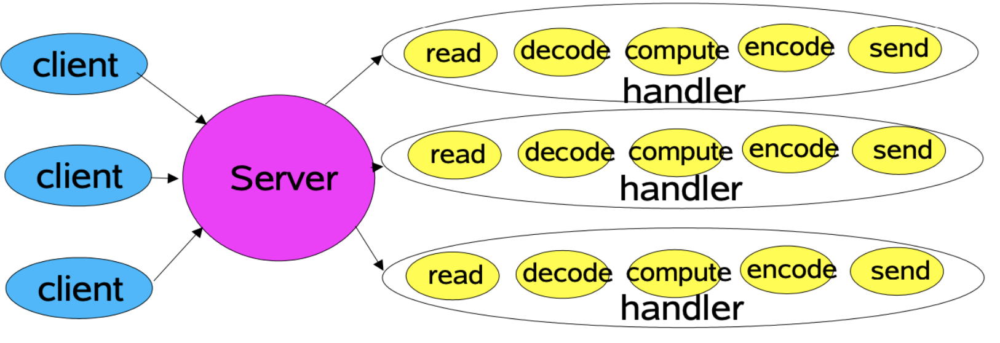
		- 任务可以划分为
			- Read request 
			- Decode request 
			- Process service 
			- Encode reply 
			- Send reply
		- 而在不同类型的网络服务中，任务的性质和成本是有区别，例如：解析XML、传送文件、生成web页面、纯计算任务等等
- 在网络服务中，我们会关注如下扩展目标(Performance、Scalability、Availability):
	- 负载持续增加时可以优雅的降级
	- 能够通过增加系统硬件资源(CPU, memory, disk, bandwidth)，持续提升系统的处理能力
	- 低延迟
	- 能够满足峰值需要
	- 可调优的服务质量
- 而在实现可扩展的目标时，最优的策略一般是**分而治之(Divide and Conquer)**:
	- 任务划分: 把任务划分为更小的任务进行处理，每个任务的执行都是**非阻塞**的
	- 事件触发: 一个IO事件看作是任务执行的触发器
	- 基本机制: `java nio`的支持
		- **非阻塞**的读和写 
		- **监听**事件, 把事件**分发**给事件**关联**的任务
	- 基于事件驱动的模式(Event-driven Designs)
		- Reactor模式
- C10K && C10M
	- [C10K && C10M的经典问题](http://www.kegel.com/c10k.html)
	- [benchmarking](http://www.kegel.com/c10k.html#benchmarking)
	- Poll-based vs  epoll-based  
	- Zero Copy


# I/O 模型


- 系统调用
	- 为了方便描述, 把recvfrom函数抽象为某种执行I/O操作的系统调⽤API
	- 即应用程序和内核的交互 
	- 系统调用会从在应⽤进程空间中运⾏切换到在内核空间中运⾏，⼀段时间之后再切换回来
- UNIX领域5种常见的I/O模型的总结，这5种I/O模型是:
	- 阻塞式I/O模型 
		- 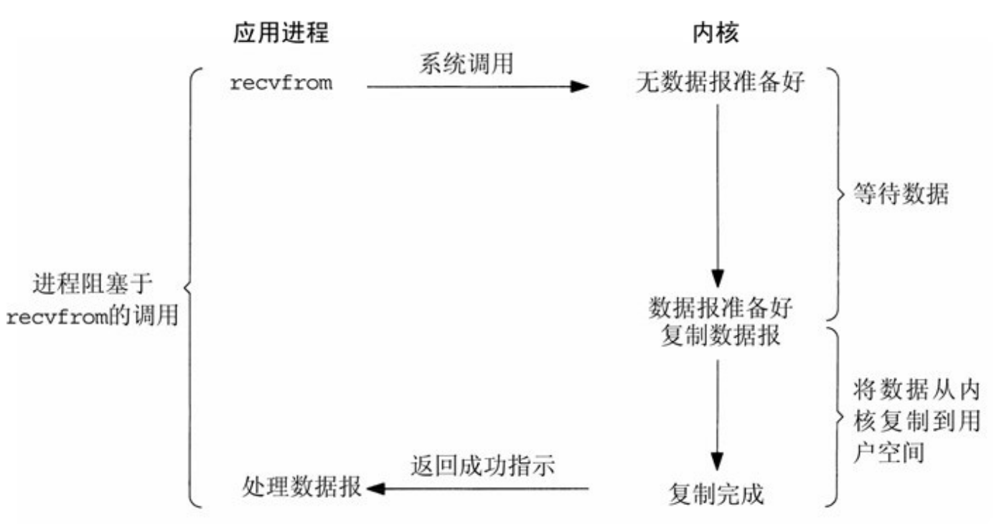
		- 进程调⽤recvfrom，数据报到达且被复制到应⽤进程的缓冲区中或者发⽣错误时,系统调⽤才返回
	- ⾮阻塞式I/O模型 
		- 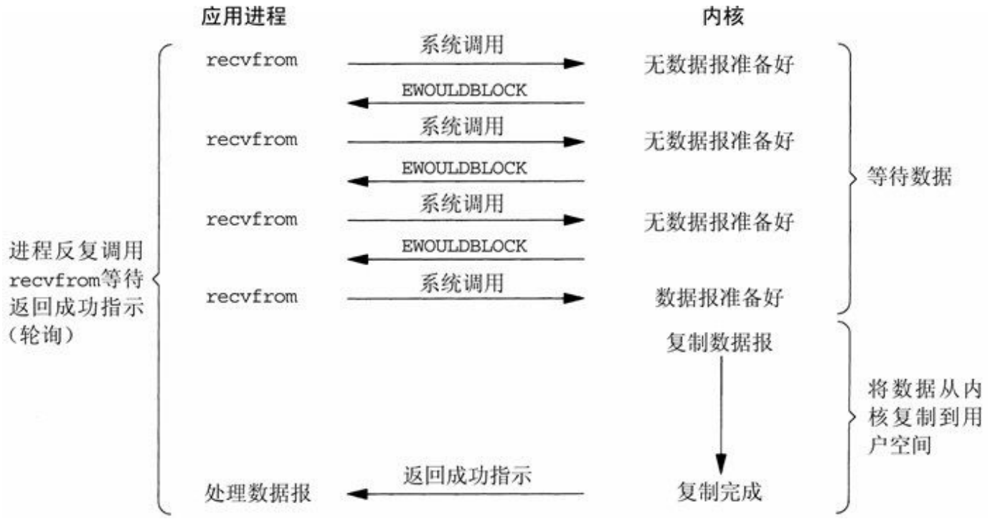
		- 进程会把⼀个套接字设置成⾮阻塞, 是在通知内核：当所请求的I/O操作没有完成时，不要把本进程投⼊睡眠，⽽是返回⼀个错误。
		- 前三次recvfrom调⽤是应⽤进程轮询(polling)调用, 因为没有数据可返回，因此内核转⽽⽴即返回⼀个错误。
		- 第四次调⽤recvfrom时已有⼀个数据报准备好，它被复制到应⽤进程缓冲区，于是recvfrom成功返回, 进程可以接着处理数据
	- I/O复⽤模型   
		- 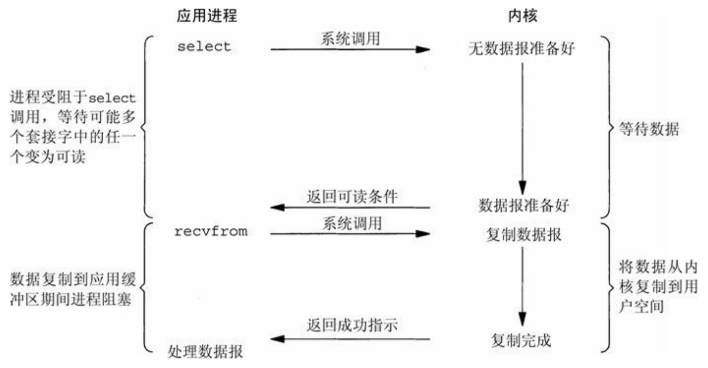
		- 进程阻塞于select调⽤，等待数据报套接字变为可读。
		- 当select返回套接字可读这⼀条件时，进程调⽤recvfrom把所读数据报复制到应⽤进程缓冲区。
		- 和阻塞式I/O模型对比，I/O复用模型:
			- 劣势是使⽤select需要两个⽽不是单个系统调⽤
			- 优势在于我们可以等待多个描述符就绪
		- 类似于select的系统调用还有poll、epoll
	- 信号驱动式I/O模型 
		- 使⽤信号让内核在描述符就绪时发送信号通知进程，这种模型被称为信号驱动式I/O模型
		- 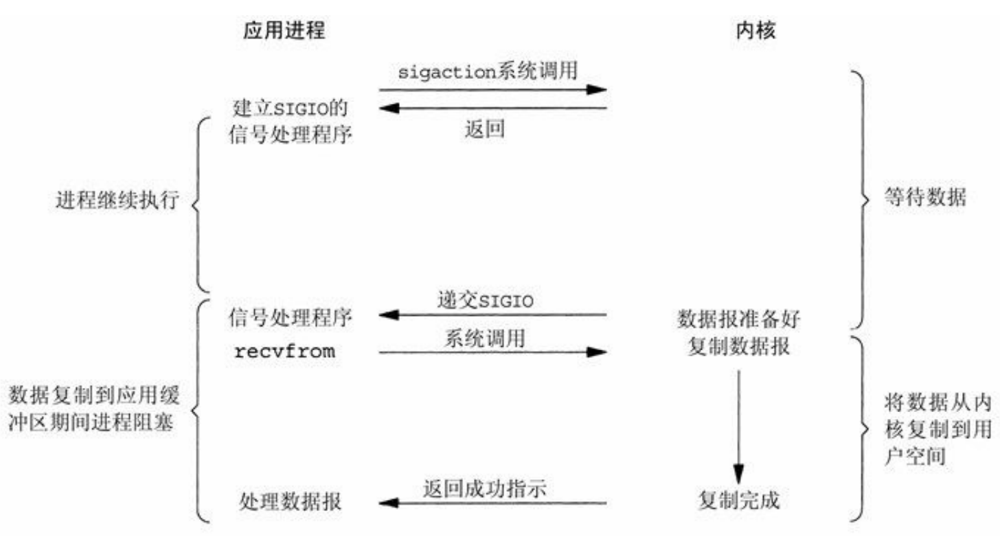
		- 程序⾸先开启套接字的信号驱动式I/O功能，并通过系统调⽤安装⼀个信号处理函数，该系统调⽤将⽴即返回，进程无阻塞地继续⼯作
		- 内核会在数据报准备好被读取时，为进程产⽣⼀个SIGIO信号，进程随后可以进行处理数据报的读取操作
			- 这个操作既可以在信号处理函数中调⽤recvfrom读取数据报，并通知主循环数据已准备好待处理，
			- 也可以⽴即通知主循环，让它读取数据报
		- 这种模型的优势在于等待数据报到达期间进程不被阻塞
	- 异步I/O模型
		- 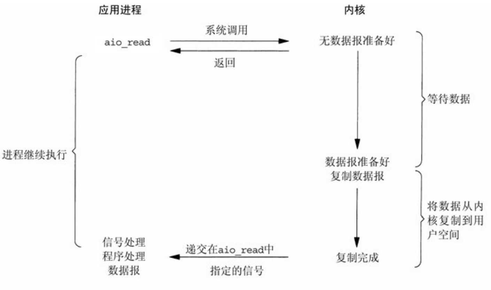
		- 异步IO函数的⼯作机制是：告知内核启动某个操作，并让内核在整个操作（包括将数据从内核复制到我们⾃⼰的缓冲区）完成后通知进程
		- 和信号驱动模型的主要区别在于: 信号驱动式I/O是由内核通知我们何时可以启动⼀个I/O操作，⽽异步I/O模型是由内核通知我们 I/O操作何时完成
	- 5种I/O模型的⽐较
		- 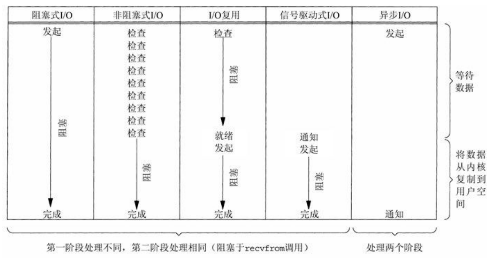
		
		- 同步和阻塞的区别
			- 一般而言,可以把IO操作看作两步, 第一步是发起IO的请求, 第二步是实际的IO操作
			- **阻塞IO和非阻塞IO的区别**在于第一步操作是否阻塞 :
				- 如果发起的IO请求阻塞到一直到请求完成, 是传统的阻塞IO。
				- 如果发起的IO请求不阻塞，是非阻塞IO。
			- **同步IO和异步IO的区别**在于第二步操作是否阻塞：
				- 如果实际的IO操作阻塞了进程，就是同步IO
					- **阻塞式I/O模型**、**⾮阻塞式I/O模型**、**I/O复⽤模型**和**信号驱动式I/O模型** 都是同步IO
				 - 如果实际的IO操作不阻塞进程, 而是操作系统帮用户做完实际的IO操作后再将结果返回给用户, 那么就是异步IO
					 - **异步I/O模型**属于异步I/O
		 - POSIX把这两个术语定义如下:
			- **同步I/O操作**:导致请求进程阻塞，直到I/O 操作完成
			- **异步I/O操作**:不导致请求进程阻塞
			- 那么, 根据POSIX的定义:
				- 在**阻塞式I/O模型**、**⾮阻塞式I/O模型**、**I/O复⽤模型**和**信号驱动式I/O模型**中, 真正的I/O操作（ recvfrom）阻塞了进程, 所以这4种模型是同步I/O。  
				- 在**异步I/O模型**中, 真正的I/O操作（recvfrom）没有阻塞进程, 所以是异步I/O.


# Reactor 模式
- 基于事件驱动的模式
	- Usually more efficient than alternatives
		- Fewer resources: Don't usually need a thread per client
		- Less overhead: Less context switching, often less locking
		- But dispatching can be slower: Must manually bind actions to events 
	- Usually harder to program
		- Must break up into simple non-blocking actions
			- Similar to GUI event-driven actions
			- Cannot eliminate all blocking: GC, page faults, etc
		- Must keep track of logical state of service
- Reactor论文 
	- [An Object Behavioral Pattern for Demultiplexing and Dispatching Handles for Synchronous Events](http://www.dre.vanderbilt.edu/~schmidt/PDF/reactor-siemens.pdf)
	- [高性能IO之Reactor模式](https://www.cnblogs.com/doit8791/p/7461479.html)  
	- [Reactor模式详解](http://www.blogjava.net/DLevin/archive/2015/09/02/427045.html)
- Reactor模式
	- Reactor是基于事件驱动的模式，常用于网络编程
	- 在Reactor Pattern中的作用划分
		- Reactor: responds to IO events by dispatching the appropriate handler
		- Handlers: perform non-blocking actions
		- Manage: by binding handlers to events
	- Reactor论文Solution
		- Integrate the synchronous demultiplexing of events and the dispatching of their corresponding event handlers that process the events. 
		- In addition, decouple the applicationspecific dispatching and implementation of services from the general-purpose event demultiplexing and dispatching mechanisms. 
		- For each service the application offers, introduce a separate Event Handler that processes certain types of events. 
		- All Event Handlers implement the same interface. Event Handlers register with an Initiation Dispatcher, which uses a Synchronous Event Demultiplexer to wait for events to occur. 
		- When events occur, the Synchronous Event Demultiplexer notifies the Initiation Dispatcher, which synchronously calls back to the Event Handler associated with the event. The Event Handler then dispatches the event to the method that implements the requested service.
	- Reactor论文总结的基本结构
		- 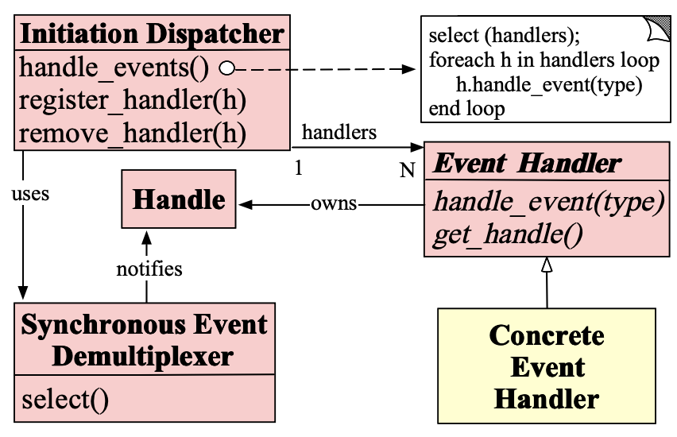
	- Reactor论文总结的协作
		- 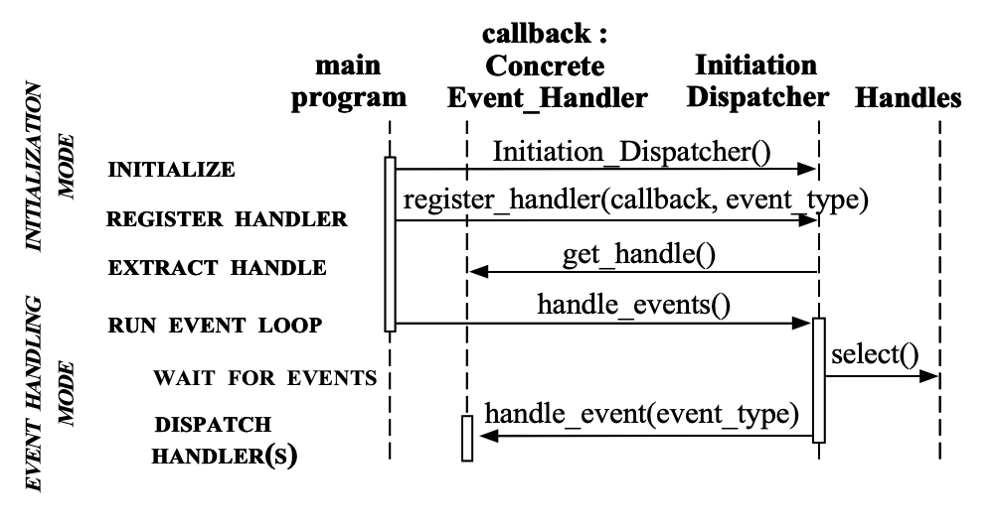
	- Reactor论文的举例 : Client Connects to a Reactive Logging Server
		- 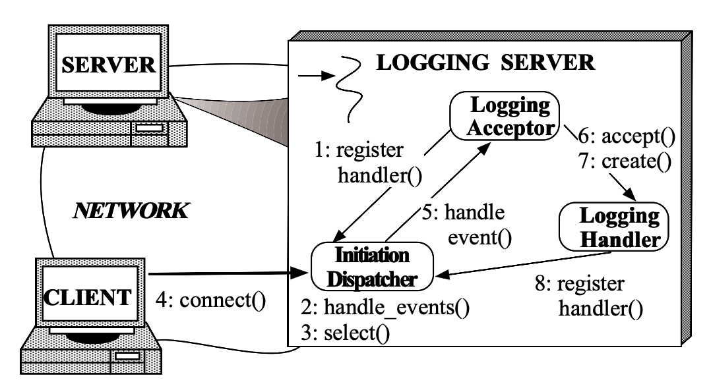
		- This sequence of steps can be summarized as follows:
			- 1. The logging server (1) registers the Logging Acceptor with the Initiation Dispatcher to handle connection requests; 
			- 2. The logging server invokes the handle events method (2) of the Initiation Dispatcher; 
			- 3. The Initiation Dispatcher invokes the synchronous event demultiplexing select (3) operation to wait for connection requests or logging data to arrive; 
			- 4. A client connects (4) to the logging server; 
			- 5. The Logging Acceptor is notified by the Initiation Dispatcher (5) of the new connection request; 
			- 6. The Logging Acceptor accepts (6) the new connection;
			- 7. The Logging Acceptor creates (7) a Logging Handler to service the new client; 
			- 8. Logging Handler registers (8) its socket handle with the Initiation Dispatcher and instructs the dispatcher to notify it when the socket becomes “ready for reading.”
	- Reactor模式的举例：Client Sends Logging Record to a Reactive Logging Server
		- 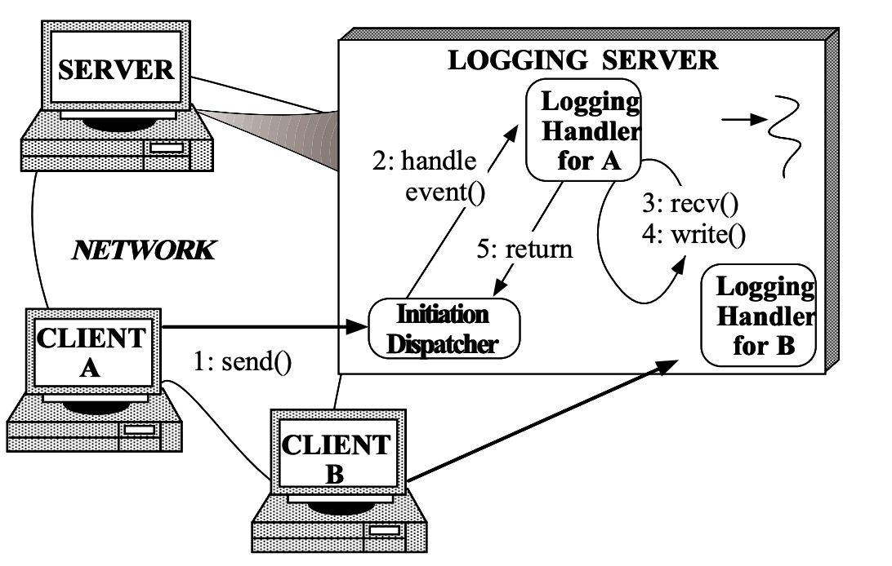
		- The sequence of steps that the reactive logging server takes to service a logging record.
			- 1. The client sends (1) a logging record; 
			- 2. The Initiation Dispatcher notifies (2) the associated Logging Handler when a client logging record is queued on its socket handle by OS; 
			- 3. The record is received (3) in a non-blocking manner (steps 2 and 3 repeat until the logging record has been received completely); 
			- 4. The Logging Handler processes the logging record and writes (4) it to the standard output.
			-  5. The Logging Handler returns (5) control to the Initiation Dispatcher’s event loop.
	- Reactor Design
		- Single Thread Reactor
			- 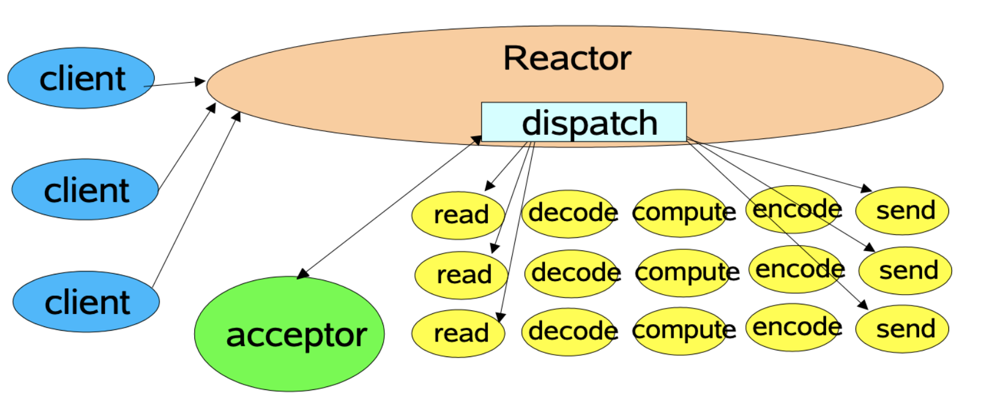
		- MultiThreaded: Worker Thread Pools
			- 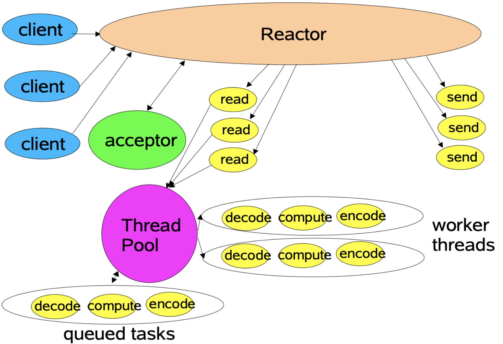
		- Using multiple reactors
			- 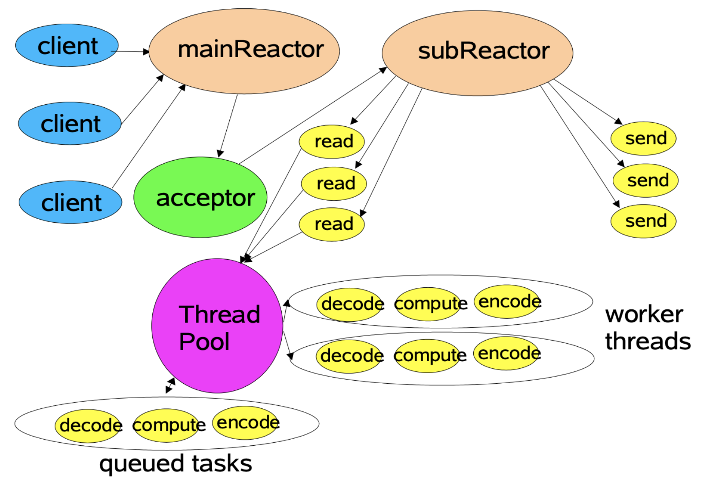
	- Reactor 实际样例
		- [Netty框架中Reactor变种的不同实现](https://blog.csdn.net/u011857851/article/details/103962025)
		- Kafka中的网络机制
		- Redis中的网络机制


# C10K
- C10K && C10M
	- [C10K && C10M的经典问题](http://www.kegel.com/c10k.html)
	- [benchmarking](http://www.kegel.com/c10k.html#benchmarking)
	- Poll-based vs epoll-based  
	- Zero Copy


# Java NIO

- Java NIO
	- NIO vs BIO
		- NIO 代表非阻塞 I/O（Non-blocking I/O）
			- 有时也称为新I/O (New Input/Output)
		- 阻塞I/O（BIO: blocking I/O）
			- 也是旧的输入/输出（OIO: old input/output）
			- 有时也称为普通I/O (Plain I/O)
	- java-nio原理是基于非阻塞同步IO模型， 解决的是IO执行的性能问题
		- [Scalable IO in Java by Doug Lea](http://gee.cs.oswego.edu/dl/cpjslides/nio.pdf)
		- [Trail: Custom Networking](https://docs.oracle.com/javase/tutorial/networking/index.html)
		- [Enhancements in Java I/O](https://docs.oracle.com/javase/8/docs/technotes/guides/io/enhancements.html)
		- [Java NIO: IO多路复用](https://zhuanlan.zhihu.com/p/27419141)
		- [Java NIO: Selector](https://zhuanlan.zhihu.com/p/27434028)
		- [Epoll版的Selector](https://zhuanlan.zhihu.com/p/27441342?group_id=859562548406677504)
	- java nio的特性主要分为四大类:
		- **Channel**: Connections to files, sockets etc that support non-blocking reads
		- **Buffer**: Array-like objects that can be directly read or written by Channels 
		- **Selector**: Tell which of a set of Channels have IO events 
			- `java.nio.channels.Selector`: 是Java 的非阻塞 I/O 实现的关键
			- 它使用了事件通知API以确定在一组非阻塞套接字中有哪些已经就绪能够进行I/O相关的操作
			- 使用较少的线程便可以处理许多连接，因此也减少了内存管理和上下文切换所带来开销
			- 当没有 I/O 操作需要处理的时候，线程也可以被用于其他任务
		- **SelectionKey**: Maintain IO event status and bindings


  

# Java NIO API


## Buffer

Buffer   ByteBuffer: CharBuffer, LongBuffer, etc not shown

buffer的内部结构
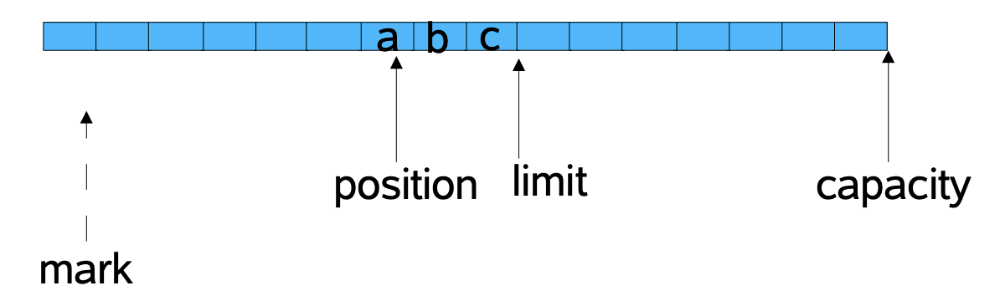


```java
abstract class Buffer {
 int capacity();
 int position();
 Buffer position(int newPosition);
 int limit();
 Buffer limit(int newLimit);
 Buffer mark();
 Buffer reset();
 Buffer clear();
 Buffer flip();
 Buffer rewind();
 int remaining();
 boolean hasRemaining();
 boolean isReadOnly();
}
```


```java
abstract class ByteBuffer extends Buffer {
 static ByteBuffer allocateDirect(int capacity);
 static ByteBuffer allocate(int capacity);
 static ByteBuffer wrap(byte[] src, int offset, int len);
 static ByteBuffer wrap(byte[] src);
 boolean isDirect();
 ByteOrder order();
 ByteBuffer order(ByteOrder bo);
 ByteBuffer slice();
 ByteBuffer duplicate();
 ByteBuffer compact();
 ByteBuffer asReadOnlyBuffer();
 byte get();
 byte get(int index);
 ByteBuffer get(byte[] dst, int offset, int length);
 ByteBuffer get(byte[] dst);
 ByteBuffer put(byte b);
 ByteBuffer put(int index, byte b);
 ByteBuffer put(byte[] src, int offset, int length);
 ByteBuffer put(ByteBuffer src);
 ByteBuffer put(byte[] src);
 char getChar();
 char getChar(int index);
 ByteBuffer putChar(char value);
 ByteBuffer putChar(int index, char value);
 CharBuffer asCharBuffer();
 short getShort();
 short getShort(int index);
 ByteBuffer putShort(short value);
 ByteBuffer putShort(int index, short value);
 ShortBuffer asShortBuffer();
 int getInt();
 int getInt(int index);
 ByteBuffer putInt(int value);
 ByteBuffer putInt(int index, int value);
 IntBuffer asIntBuffer();
 long getLong();
 long getLong(int index);
 ByteBuffer putLong(long value);
 ByteBuffer putLong(int index, long value);
 LongBuffer asLongBuffer();
 float getFloat();
 float getFloat(int index);
 ByteBuffer putFloat(float value);
 ByteBuffer putFloat(int index, float value);
 FloatBuffer asFloatBuffer();
 double getDouble();
 double getDouble(int index);
 ByteBuffer putDouble(double value);
 ByteBuffer putDouble(int index, double value);
 DoubleBuffer asDoubleBuffer();
}
```


## Channel

```java
interface Channel {
 boolean isOpen();
 void close() throws IOException;
}

interface ReadableByteChannel extends Channel {
 int read(ByteBuffer dst) throws IOException;
}

interface WritableByteChannel extends Channel {
 int write(ByteBuffer src) throws IOException;
}

interface ScatteringByteChannel extends ReadableByteChannel {
 int read(ByteBuffer[] dsts, int offset, int length)
 throws IOException;
 int read(ByteBuffer[] dsts) throws IOException;
}

interface GatheringByteChannel extends WritableByteChannel {
 int write(ByteBuffer[] srcs, int offset, int length)
 throws IOException;
 int write(ByteBuffer[] srcs) throws IOException;
}
```


### SelectableChannel

```java
abstract class SelectableChannel implements Channel {
 int validOps();
 boolean isRegistered();
 SelectionKey keyFor(Selector sel);
 SelectionKey register(Selector sel, int ops)
 throws ClosedChannelException;
 void configureBlocking(boolean block)
 throws IOException;
 boolean isBlocking();
 Object blockingLock();
}
```


### SocketChannel

```java
 abstract class SocketChannel implements ByteChannel ... {
 static SocketChannel open() throws IOException;
 Socket socket();
 int validOps();
 boolean isConnected();
 boolean isConnectionPending();
 boolean isInputOpen();
 boolean isOutputOpen();
 boolean connect(SocketAddress remote) throws IOException;
 boolean finishConnect() throws IOException;
 void shutdownInput() throws IOException;
 void shutdownOutput() throws IOException;
 int read(ByteBuffer dst) throws IOException;
 int read(ByteBuffer[] dsts, int offset, int length)
 throws IOException;
 int read(ByteBuffer[] dsts) throws IOException;
 int write(ByteBuffer src) throws IOException;
 int write(ByteBuffer[] srcs, int offset, int length)
 throws IOException;
 int write(ByteBuffer[] srcs) throws IOException;
}
```


### ServerSocketChannel

```java
abstract class ServerSocketChannel extends ... {
 static ServerSocketChannel open() throws IOException;
 int validOps();
 ServerSocket socket();
 SocketChannel accept() throws IOException;
}
```


### FileChannel

```java
abstract class FileChannel implements ... {
 int read(ByteBuffer dst);
 int read(ByteBuffer dst, long position);
 int read(ByteBuffer[] dsts, int offset, int length);
 int read(ByteBuffer[] dsts);
 int write(ByteBuffer src);
 int write(ByteBuffer src, long position);
 int write(ByteBuffer[] srcs, int offset, int length);
 int write(ByteBuffer[] srcs);
 long position();
 void position(long newPosition);
 long size();
 void truncate(long size);
 void force(boolean flushMetaDataToo);
 int transferTo(long position, int count,
 WritableByteChannel dst);
 int transferFrom(ReadableByteChannel src,
 long position, int count);
 FileLock lock(long position, long size, boolean shared);
 FileLock lock();
 FileLock tryLock(long pos, long size, boolean shared);
 FileLock tryLock();
 static final int MAP_RO, MAP_RW, MAP_COW;
 MappedByteBuffer map(int mode, long position, int size);
}
NOTE: ALL methods throw IOException
```


## Selector

```java
 abstract class Selector {
 static Selector open() throws IOException;
 Set keys();
 Set selectedKeys();
 int selectNow() throws IOException;
 int select(long timeout) throws IOException;
 int select() throws IOException;
 void wakeup();
 void close() throws IOException;
}
```


## SelectionKey 

```java
abstract class SelectionKey {
 static final int OP_READ, OP_WRITE,
 OP_CONNECT, OP_ACCEPT;
 SelectableChannel channel();
 Selector selector();
 boolean isValid();
 void cancel();
 int interestOps();
 void interestOps(int ops);
 int readyOps();
 boolean isReadable();
 boolean isWritable();
 boolean isConnectable();
 boolean isAcceptable();
 Object attach(Object ob);
 Object attachment();
}
```


## 代码样例

- PING-PONG EXAMPLES based by NIO  
	- Client发送Ping, Server响应Pong
		- Classic Service Designs
		- Basic Reactor Design
		- Multithreaded Designs
		- Multiple Reactor Threads
- ACCUMULATOR EXAMPLES based by NIO


# Netty

- Netty
	- 网络编程框架
		- NIO
		- AIO
		- Codec: 编解码
		- Protocol: 协议支持
		- UseCase: 业务解耦
		- 配套机制: 序列化方案  压缩方案(另外压缩-解压的机制-例如:端到端压缩)  
	- Netty中的Reactor
		- [Netty框架中Reactor变种的不同实现](https://blog.csdn.net/u011857851/article/details/103962025)
	- Netty应用场景:框架中间件通信协调 IM聊天 即时通讯等
  


